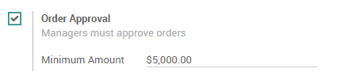
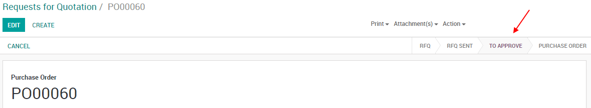
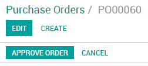

==============================================
Request managers approval for expensive orders
==============================================

In case of expensive purchases you may want a manager approval to
validate the orders, Odoo let's you easily set that up.

Configuration
=============

For this feature to work, go to :menuselection:`Purchases -->
Configuration --> Settings` and activate the *Order Approval* feature.
From there you can also set the minimum amount required to activate this
feature.

Create a new Request for Quotation
==================================

While working on a new RfQ, if the order is made by a user and not a
manager and the amount of the order is above the minimum amount you
specified, a new *To Approve* status will be introduced in the
process.

Approve the order
-----------------

If you are a purchase manager, you can now go to the purchase order and
approve the order if everything is alright with it. Giving you full
control of what your users can or can't do.

Once approved, the purchase order follows the normal process.

