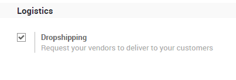
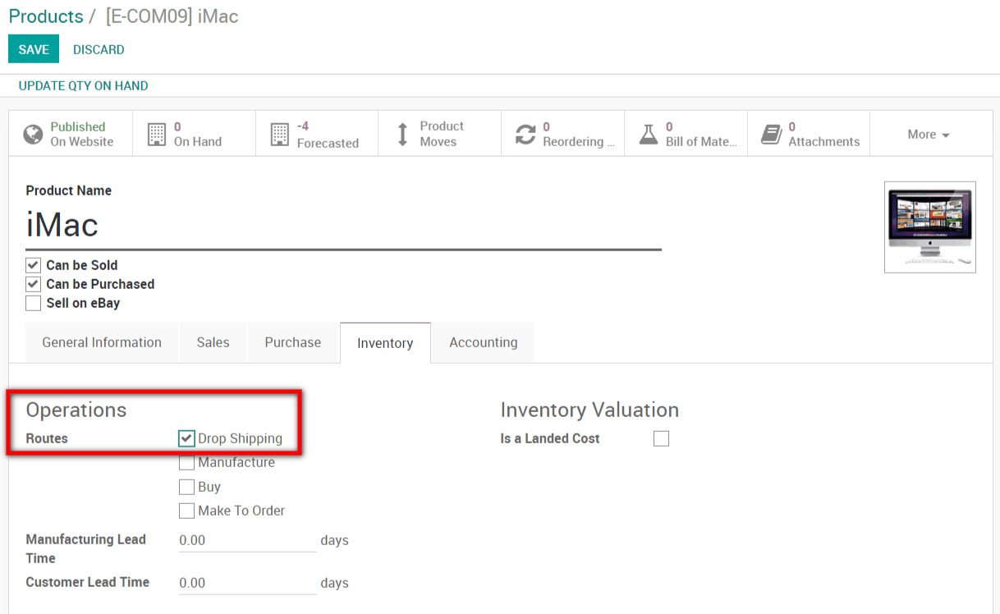
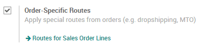
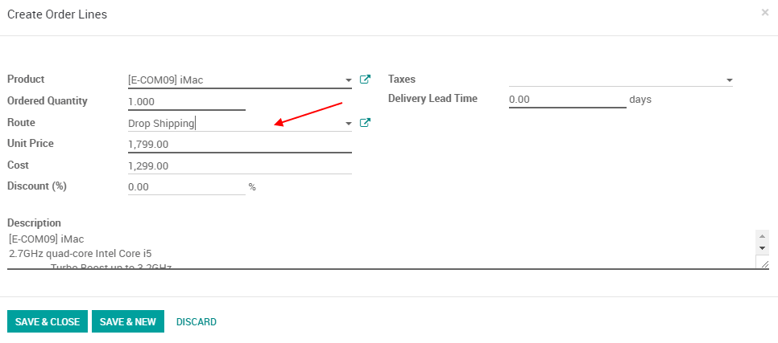
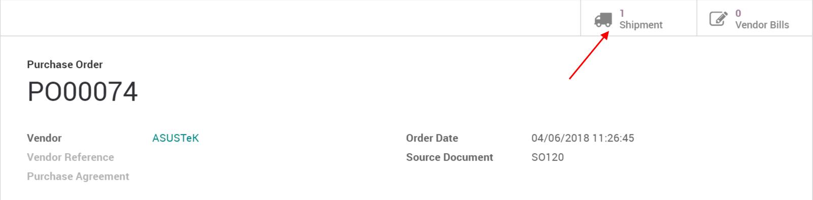

=================
Dropship products
=================

Dropshipping is a method in which the vendor does not keep products in
stock but instead transfers the products directly from the supplier to
the customer.

.. note::
   You need the *Sales*, *Inventory* and *Purchases* modules
   for this feature to work.

Activate the dropshipping feature
=================================

Go to :menuselection:`Purchases --> Configuration --> Settings` and
select *Dropshipping*.

A new route *Dropshipping* has been created. You can go on a product
and tick the dropshipping route. You also need to define to which vendor
you will buy the product. Now, each time this product will be sold, it
will be drop shipped.

If you don't always dropship that product, you can go to
:menuselection:`Sales --> Configuration --> Settings` and tick the box
in front of *Order-Specific Routes*.

When you create a quotation or sales order, you can now decide, order
line per order line, which products should be drop shipped by selecting
the dropship route on the SO line.

Drop ship a product
===================

Once a sale order with products to dropship is confirmed, a request for
quotation is generated by Odoo to buy the product to the vendor. If you
confirm that request for quotation into a purchase order, it will create
a transfer from your vendor directly to your customer. The products
doesn't go through your own stock.

