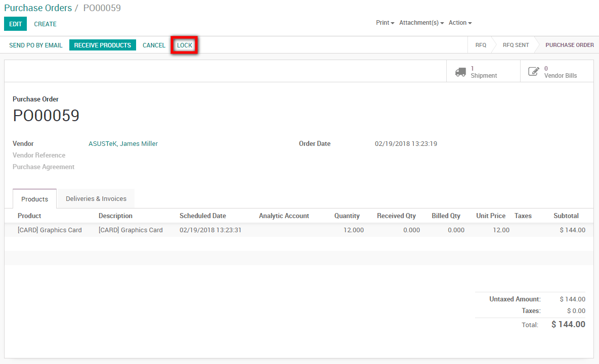

=====================
Lock a purchase order
=====================

Once an order is confirmed, you can lock it preventing any further
editing.

Configuration
=============

For this feature to work, go to :menuselection:`Purchases -->
Configuration --> Settings` and activate the *Lock Confirmed Orders*
feature

Lock an order
=============

While working on a purchase order, when you confirm it, you can then
lock the order preventing any further modification on the document.

.. note::
    You can unlock the document if you need to make additional changes
