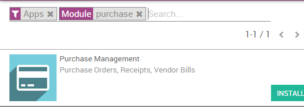
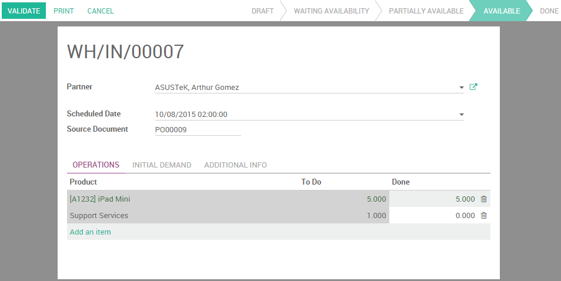

===============================================
Control product received (entirely & partially)
===============================================

The **Purchase** app allows you to manage your purchase orders, to control
products to receive and to control supplier bills.

If you want to get product forecasts and receptions under control, the
first thing to do is to deploy the Odoo purchase process. Knowing what
have been purchased is the basis of forecasting and controlling
receptions.

Configuration
=============

Install the Purchase and Inventory applications
-----------------------------------------------

Start by installing the Purchase application from the **Apps** module.
This will automatically trigger the installation of the **Inventory** app
(among others), which is required with **Purchase**.

Create products
---------------

Then, you need to create the products you want to purchase. Go to the
**Purchase** app, then :menuselection:`Purchase --> Products`, 
and click on **Create**.

.. image:: media/reception05.png
    :align: center

When creating the product, the **Product Type** field is important:

-   **Stockable & Consumable**: products need to be received in the
    inventory.

-   **Services & Digital Products** (only when the **eCommerce** app is
    installed): there is no control about what you receive or not.

.. tip:: 
    It's always good to create a **Miscellaneous** product for all 
    the products you purchased rarely and for which you don't want 
    to manage the stocks or have purchase/sale statistics. 
    If you create such a product, we recommend to set his product 
    type field as **Service**.

Control products receptions
===========================

Purchase products
-----------------

From the purchase application, create a purchase order with a few
products. If the vendor sent you a sale order or a quotation, put its
reference in the **Vendor Reference** field. This will allow you to easily
do the matching with the delivery order later on (as the delivery order
will probably include the **Vendor Reference** of his sale order).

.. image:: media/reception03.png
    :align: center

Receive Products
----------------

If you purchased physical goods (stockable or consumable products), you
can receive the products from the **Inventory** application. From the
**Inventory** dashboard, you should see a button **X To Receive**, on the
receipt box of the related warehouse.

.. image:: media/reception01.png
    :align: center

Click on this button and you access a list of all awaiting orders for
this warehouse.

.. image:: media/reception07.png
    :align: center

If you have a lot of awaiting orders, you can use the filter bar to
search on the **Vendor** (also called **Partner** in Odoo), the product or the
source document, which is the reference of your purchase order. You can
open the document that matches with the received delivery order and
process all the lines within it.

You may validate the whole document at once by clicking on the
**Validate** button or you can control all products, one by one, by
manually change the **Done** quantity (what has actually been received).
When a line is green, it means the quantity received matches to what
have been expected.

.. note::
    If you work with lots or serial numbers, you can not set 
    the processed quantity, but you have to provide all the 
    lots or serial numbers to record the quantity received.

When you validate the reception, if you have received less products than
the initial demand, Odoo will ask youthe permission to create a
backorder.

.. image:: media/reception06.png
    :align: center

If you plan to receive the remaining product in the future, select
**Create Backorder**. Odoo will create a new documents for the awaiting
products. If you choose **No Backorder**, the order is considered as
fulfilled.

.. seealso::
    * :doc:`bills`
    * :doc:`cancel`
