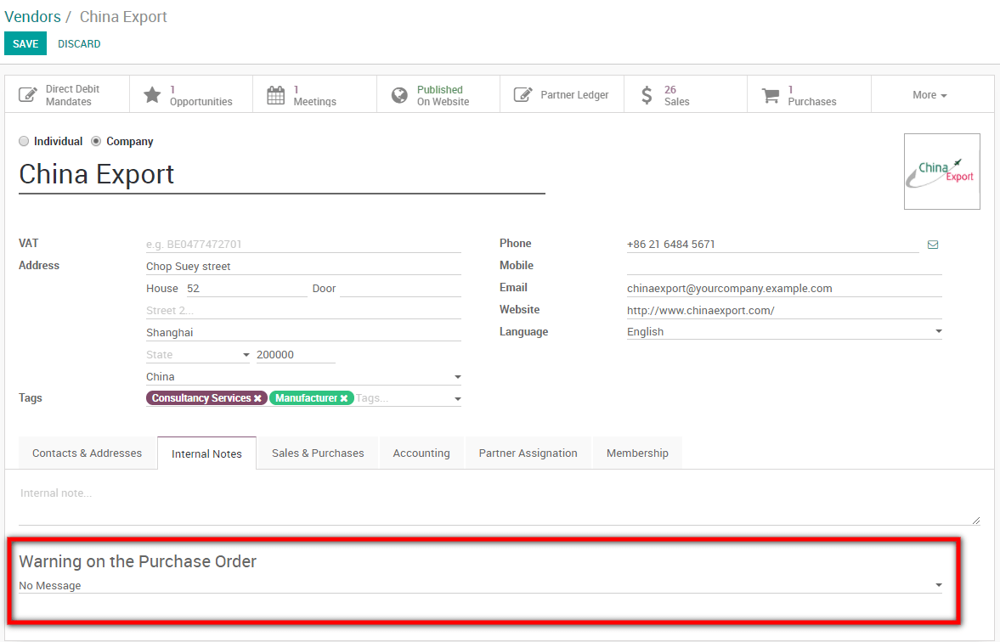
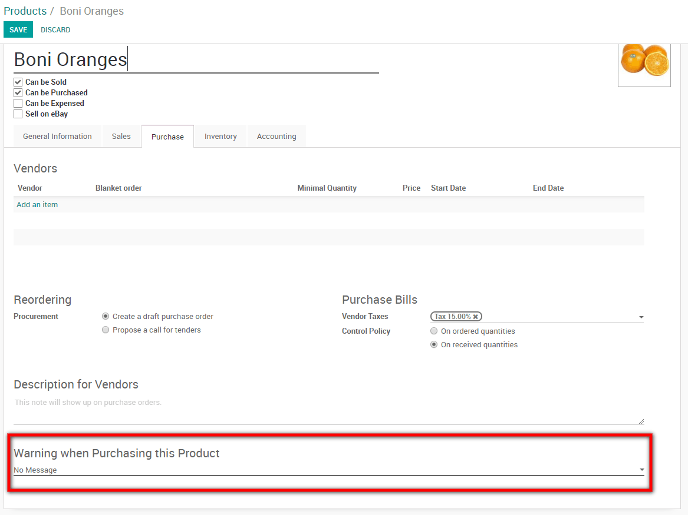

=================================
Raise warnings on purchase orders
=================================

The *Warnings* feature allows you to raise warnings or blocking
messages on purchase orders based on a vendor or a product.

For example, if you often have a problem with a vendor, you might want
to raise a warning when purchasing from that vendor. If a product is
about to be discontinued, you may want to raise a blocking message on
the purchase order.

Configuration
=============

For this feature to work, go to
:menuselection:`Purchases --> Configuration --> Settings` and activate
the *Warnings* feature.

.. image:: warning/warning01.png
    :align: center

Add a warning on a vendor
=========================

When you activate the feature, you get a new option under the *Internal
Notes* tab on vendors. You can decide to write a simple warning or a
blocking message.

Add a warning on a product
==========================

When you activate the feature, you get a new option under the
*Purchase* tab on the product page where you can add a warning or a
blocking message.

Trying to buy with warnings or blocking messages
------------------------------------------------

If you try to validate a *Purchase Order* from a vendor or with a
product with a warning, a message will be raised. You can ignore it by
clicking ok.

.. image:: warning/warning04.png
    :align: center

However, if it is a blocking message, you can not ignore it.
