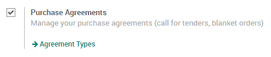
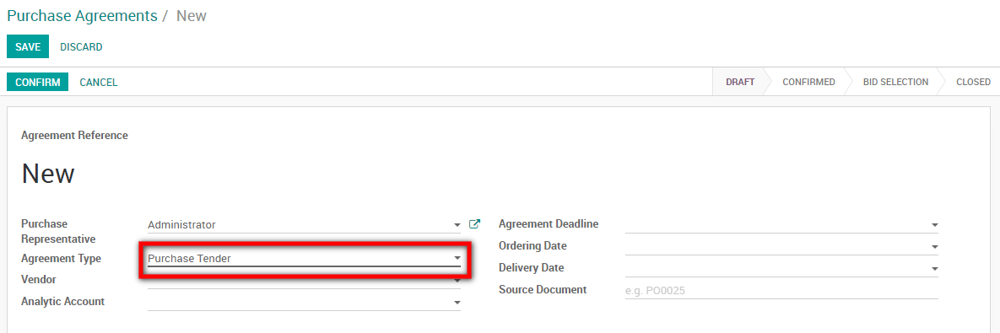
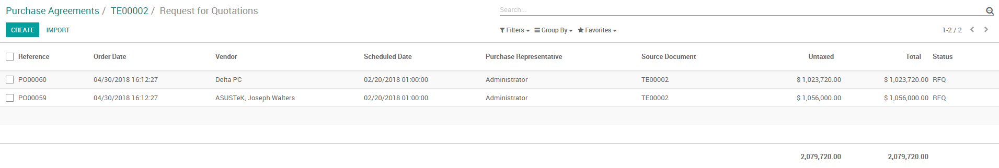
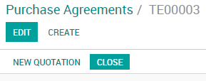

======================
Manage Call for Tender
======================

A Call for Tender is a special procedure to request offers from multiple
vendors to obtain the most interesting price.

Configuration
=============

For this feature to work, go to :menuselection:`Purchases -->
Configuration --> Settings` and activate the *Purchase Agreements*
feature.

Create a Call for Tender
========================

To use this feature go to :menuselection:`Purchases --> Purchase Agreements`.

Create a new purchase agreement, access the *Agreement Type* drop down
menu and select *Call for Tender*.

When you are satisfied with your purchase agreement, confirm it will
move from *Draft* to *Confirmed* and a new *RFQs/Orders* appeared
in the top right corner of the document.

Request new quotations from the Call for Tender
-----------------------------------------------

From the Call for Tender, Odoo will auto-fill the RFQ with the product(s)
from your Call for Tender.

Select the best offer
=====================

The various RFQs and orders linked to the Call for Tenders will be under
the *RFQs/Orders* button where you can select and confirm the best
offer.

Close the Call for Tender
-------------------------

Once you're done with your *Call for Tender* don't forget to close it.

