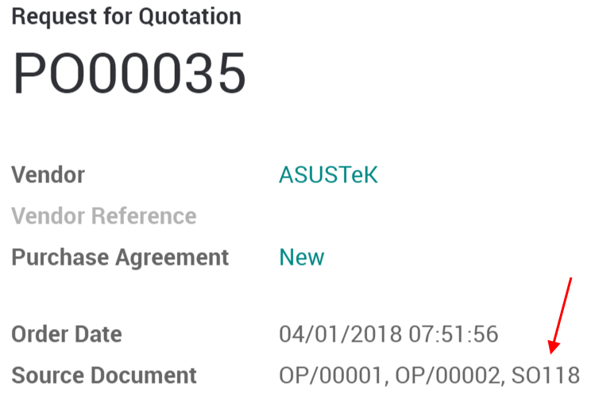

===========================================================
Trigger purchase of products based on sales (Make to Order)
===========================================================

If you don't keep stock of your products, you may need to trigger
purchase orders on each sale you make.

Thanks to being a fully integrated solution, Odoo lets you do that
easily in just one step.

Configure the product
=====================

Open a product form and, under the inventory tab, tick the routes
*Buy* and *Make To Order*.

Don't forget to also set a vendor under the *Purchase* tab.

.. note::
    The *Inventory*, *Sales* and *Purchases* modules have to be
    installed in Odoo for this feature to work.

Create a sales order using Buy & MTO
====================================

Create a new sales order with your product. When you confirm the order,
a delivery order is created with the status *Waiting for another
operation*.

A new RfQ will automatically be created in your *Purchases* module.
Note that you can see for which SO this RfQ has been created thanks to
the *Source Document* field, visible on the RfQ.

When you confirm the RfQ into a purchase order, a receipt is
automatically created and directly accessible from your purchase order
with the use of the *Shipment* button.

You can validate the receipt of your products. When you will go back to
the delivery order, you will see that the products are now ready to be
shipped.

.. tip::
    As long as your RfQ is not confirmed, Odoo will keep adding PO Lines
    automatically under it.

.. seealso::

    * :doc:`../../../purchase/replenishment/flows/setup_stock_rule`
