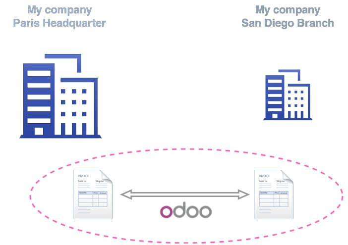

================================================
How to setup a multi-company sale/purchase flow?
================================================

Overview
========

Odoo is an outstanding solution to help small companies growing their
business. But it also perfectly meets the needs of multinational
companies.The inter-company feature helps you to buy and/or sell
products and services between different branches within your
conglomerate.

1.  Purchase orders and sales orders can be related. If a company within
    your group creates a purchase or a sales order, the corresponding
    document is automatically created for your company. All you
    have to do is check that everything is correct and confirm the
    sale. You can automate the validation on your sales and purchase
    orders.

2.  It is also possible to only handle invoices and refunds.

Manage intercompany rules
=========================

Go to :menuselection:`Settings --> General Settings`. 
Flag **Manage multiple companies** and then **Manage Inter Company**. 

Click on **Apply**.

.. image:: media/setup02.png
    :align: center

New options will appear.

In the drop-down list, choose the company on which you want to add
rules.

If you click on **SO and PO setting for inter company**, you will get
extra options.

When you are done, click on **Apply**, then you can repeat the same steps
for the other companies.

.. note::
    In order to be able to manage the inter-company rules, be sure
    that your user has the rights to manage the companies.