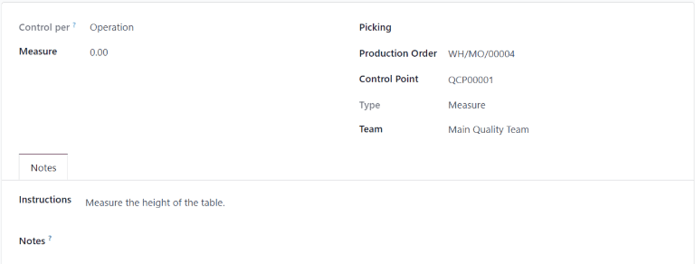
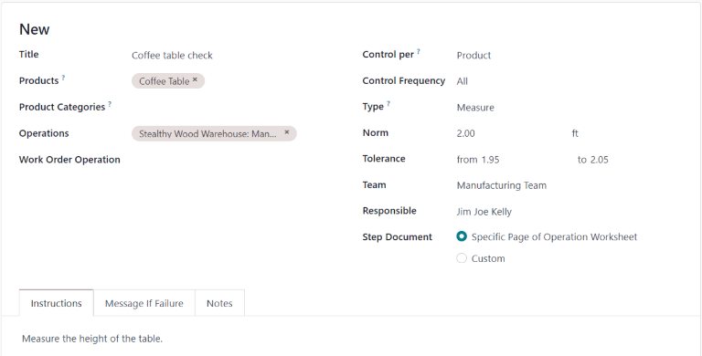
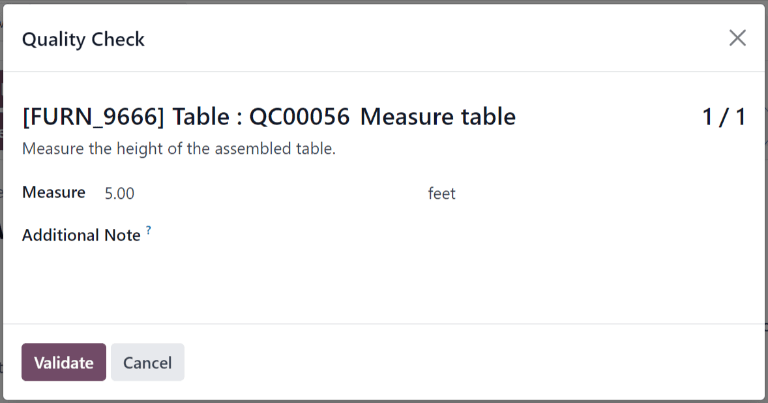
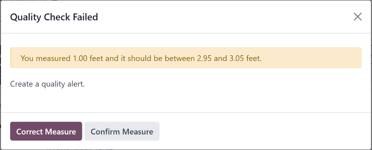
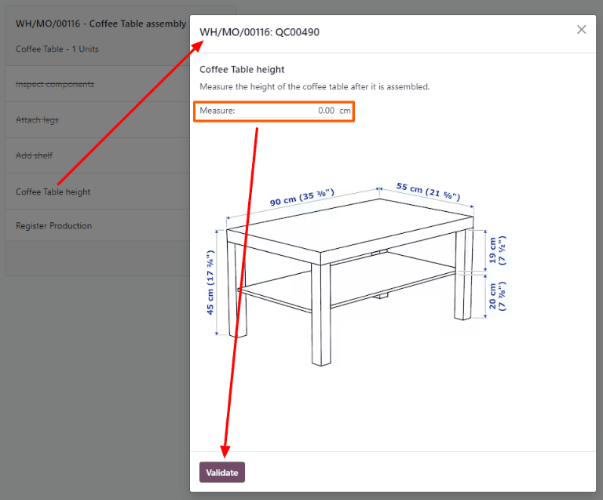
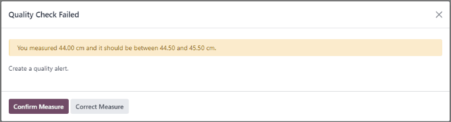

=====================
Measure quality check
=====================

.. |MO| replace:: :abbr:`MO (Manufacturing Order)`
.. |QCP| replace:: :abbr:`QCP (Quality Control Point)`
.. |QCPs| replace:: :abbr:`QCPs (Quality Control Points)`

In Odoo *Quality*, a *Measure* check is one of the quality check types that can be selected when
creating a new quality check or quality control point (QCP). *Measure* checks prompt users to
measure a certain aspect of a product and record the measurement in Odoo. For the quality check to
pass, the recorded measurement must be within a certain *tolerance* of a *norm* value.

Create a Measure quality check
==============================

There are two distinct ways that *Measure* quality checks can be created. A single check can be
manually created. Alternatively, a |QCP| can be configured that automatically creates checks at a
predetermined interval.

This documentation only details the configuration options that are unique to *Measure* quality
checks and |QCPs|. For a full overview of all the configuration options available when creating a
single check or a |QCP|, see the documentation on :ref:`quality checks
<quality/quality_management/quality-checks>` and :ref:`quality control points
<quality/quality_management/quality-control-points>`.

Quality check
-------------

To create a single *Measure* quality check, navigate to :menuselection:`Quality --> Quality Control
--> Quality Checks`, and click :guilabel:`New`. Fill out the new quality check form as follows:

- In the :guilabel:`Type` drop-down field, select the :guilabel:`Measure` quality check type.
- In the :guilabel:`Team` drop-down field, select the quality team responsible for managing the
  check.
- In the :guilabel:`Instructions` text field of the :guilabel:`Notes` tab, enter instructions for
  how the picture should be taken.

Quality control point (QCP)
---------------------------

To create a |QCP| that generates *Measure* quality checks automatically, navigate to
:menuselection:`Quality --> Quality Control --> Control Points`, and click :guilabel:`New`. Fill out
the new |QCP| form as follows:

- In the :guilabel:`Type` drop-down field, select the :guilabel:`Measure` quality check type. Doing
  so causes two new fields to appear: :guilabel:`Norm` and :guilabel:`Tolerance`.

  - Use the first text-entry field of the :guilabel:`Norm` field to record the ideal measurement
    that the product should conform to. Use the second text-entry field to specify the unit of
    measurement that should be used.
  - The :guilabel:`Tolerance` field features two sub-fields: :guilabel:`from` and :guilabel:`to`.
    Use the :guilabel:`from` field to specify the minimum acceptable measurement, and the
    :guilabel:`to` field to specify the maximum acceptable measurement.

- In the :guilabel:`Team` drop-down field, select the quality team responsible for managing the
  checks created by the |QCP|.
- In the :guilabel:`Instructions` text field, enter instructions for how the measurement should be
  taken.

Process a Measure quality check
===============================

Once created, there are multiple ways that *Measure* quality checks can be processed. If a quality
check is assigned to a specific inventory, manufacturing, or work order, the check can be processed
on the order itself. Alternatively, a check can be processed from the check's page.

From the check's page
---------------------

To process a *Measure* quality check from the check's page, begin by navigating to
:menuselection:`Quality --> Quality Control --> Quality Checks`, and select a quality check. Follow
the :guilabel:`Instructions` for how to take the measurement.

After taking the measurement, record the value in the :guilabel:`Measure` field on the quality check
form. To manually pass or fail the check, click :guilabel:`Pass` or :guilabel:`Fail` at the top-left
corner of the check.

Alternatively, if the quality check is assigned to a |QCP| for which *norm* and *tolerance* values
have been specified, click :guilabel:`Measure` at the top-left corner of the check instead. Doing so
automatically marks the check as *Passed* if the recorded value is within the specified *tolerance*,
or *Failed* if the value is outside of it.

On an order
-----------

To process a *Measure* quality check on an order, select a manufacturing order or inventory order
(receipt, delivery, return, etc.), for which a check is required. Manufacturing orders can be
selected by navigating to :menuselection:`Manufacturing --> Operations --> Manufacturing Orders`,
and clicking on an order. Inventory orders can be selected by navigating to
:menuselection:`Inventory`, clicking the :guilabel:`# To Process` button on an operation card, and
selecting an order.

On the selected manufacturing or inventory order, a purple :guilabel:`Quality Checks` button appears
at the top of the page. Click the button to open the :guilabel:`Quality Check` pop-up window, which
shows all of the quality checks required for that order.

To process a *Measure* quality check, measure the product as instructed, then enter the value in the
:guilabel:`Measure` field on the pop-up window. Finally, click :guilabel:`Validate` to register the
recorded value.

If the value entered is within the range specified in the :guilabel:`Tolerance` section of the
|QCP|, the quality check passes and the pop-up window closes. The rest of the manufacturing or
inventory order can then be processed as usual.

However, if the value entered is outside of the specified range, a new pop-up window appears, titled
:guilabel:`Quality Check Failed`. The body of the pop-up shows a warning message that states,
:guilabel:`You measured # units and it should be between # units and # units.`, as well as the
instructions entered in the :guilabel:`Message If Failure` tab of the |QCP|. At the bottom of the
pop-up, two buttons appear: :guilabel:`Correct Measure` and :guilabel:`Confirm Measure`.

If the measurement was not entered correctly and should be changed, select :guilabel:`Correct
Measure`. Doing so re-opens the :guilabel:`Quality Check` pop-up window. Enter the corrected
measurement in the :guilabel:`Measure` field, and then click :guilabel:`Validate` to complete the
check.

If the measurement was entered correctly, click :guilabel:`Confirm Measure` instead, and the quality
check fails. Follow any instructions that were listed on the :guilabel:`Quality Check Failed` pop-up
window.

If a quality alert must be created, click the :guilabel:`Quality Alert` button that appears at the
top of the manufacturing or inventory order after the check fails. Clicking :guilabel:`Quality
Alert` opens a quality alert form on a new page.

.. seealso::
   For a complete guide on how to fill out the quality alert form, view the documentation on
   :doc:`quality alerts <../quality_management/quality_alerts>`.

On a work order
---------------

When configuring a |QCP| that is triggered during manufacturing, a specific work order can also be
specified in the :guilabel:`Work Order Operation` field on the |QCP| form. If a work order is
specified, a *Measure* quality check is created for that specific work order, rather than the
manufacturing order as a whole.

*Measure* quality checks configured for work orders **must** be completed from the *Shop Floor*
module. To do so, begin by navigating to :menuselection:`Manufacturing --> Operations -->
Manufacturing Orders`. Select an |MO| that includes a work order for which a *Measure* quality check
is required.

On the |MO|, select the :guilabel:`Work Orders` tab, and click the :guilabel:`Open Work Order
(external link icon)` button on the line of the work order to be processed. On the resulting
:guilabel:`Work Orders` pop-up window, click the :guilabel:`Open Shop Floor` button to open the
*Shop Floor* module.

When accessed from a specific work order, the *Shop Floor* module opens to the page for the work
center where the order is configured to be processed, and isolates the work order's card, so no
other cards are shown.

Process the work order's steps until the *Measure* quality check step is reached. Click on the step
to open a pop-up window that includes instructions for how the measurement should be taken. After
taking the measurement, enter it in the :guilabel:`Measure` field of the pop-up window, and then
click :guilabel:`Validate`.

If the measurement entered is within the range specified in the :guilabel:`Tolerance` section of the
|QCP|, the quality check passes, and the pop-up window moves on to the next step of the work order.
However, if the measurement entered is outside of the specified range, a new pop-up window appears,
titled :guilabel:`Quality Check Failed`.

The body of the :guilabel:`Quality Check Failed` pop-up window shows a message that states,
:guilabel:`You measured # units and it should be between # units and # units`, as well as the
instructions entered in the :guilabel:`Message If Failure` tab of the |QCP|. At the bottom of the
pop-up window, two buttons appear: :guilabel:`Correct Measure` and :guilabel:`Confirm Measure`.

If the measurement was not entered correctly, and should be changed, select :guilabel:`Correct
Measure`. Doing so opens a new pop-up window, titled :guilabel:`Quality Check`. Enter the corrected
measure in the :guilabel:`Measure` field, and then click :guilabel:`Validate` to complete the check
and close the pop-up window.

If the measurement was entered correctly, click :guilabel:`Confirm Measure` instead, and the quality
check fails. Follow any instructions that were listed on the :guilabel:`Quality Check Failed` pop-up
window.

If a quality alert must be created, exit the pop-up window by clicking the :guilabel:`X (close)`
button in the top-right corner.

Then, click the :guilabel:`⋮ (three vertical dots)` button on the bottom-right corner of the work
order card to open the :guilabel:`What do you want to do?` pop-up window.

On the :guilabel:`What do you want to do?` pop-up window, select the :guilabel:`Create a Quality
Alert` button. Doing so opens a blank quality alert form in a new :guilabel:`Quality Alerts` pop-up
window.

.. seealso::
   For a complete guide on how to fill out quality alert forms, view the documentation on
   :doc:`quality alerts <../quality_management/quality_alerts>`.
