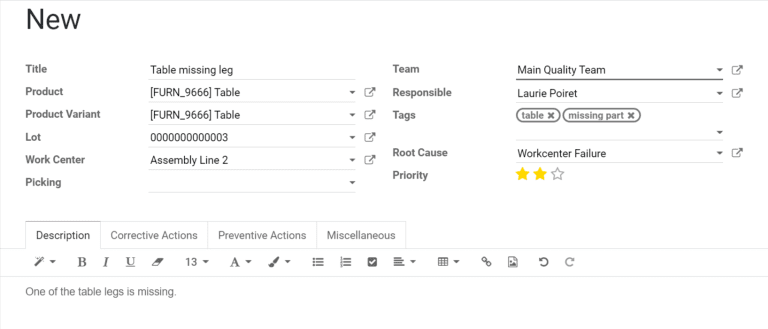

=====================
Create quality alerts
=====================

.. _quality/quality_management/quality-alerts:

Configuring quality control points is a great way to ensure that quality checks are performed at
routine stages during specific operations. However, quality issues can often appear outside of these
scheduled checks. Using Odoo *Quality*, users can create quality alerts for issues that are not
detected by automated processes.

.. seealso::
   :doc:`Add quality control points <quality_control_points>`

Find and fill out the quality alerts form
=========================================

In some situations, it is necessary to manually create quality alerts within the *Quality* module.

.. example::
   A helpdesk user who is notified of a product defect by a customer ticket can create an alert that
   brings the issue to the attention of the relevant quality team.

To create a new quality alert, start from the :menuselection:`Quality` module and select
:menuselection:`Quality Control --> Quality Alerts --> Create`. The quality alert form can then be
filled out as follows:

- :guilabel:`Title`: choose a concise, yet descriptive title for the quality alert
- :guilabel:`Product`: the product about which the quality alert is being created
- :guilabel:`Product Variant`: the specific variant of the product that has the quality issue, if
  applicable
- :guilabel:`Lot`: the lot number assigned to the product
- :guilabel:`Work Center`: the work center where the quality issue originated
- :guilabel:`Picking`: the picking operation during which the quality issue originated
- :guilabel:`Team`: the quality team that will be notified by the quality alert
- :guilabel:`Responsible`: the individual responsible for managing the quality alert
- :guilabel:`Tags`: classify the quality alert based on user-created tags
- :guilabel:`Root Cause`: the cause of the quality issue, if known
- :guilabel:`Priority`: assign a priority between one and three stars to ensure more
  urgent issues are prioritized

The tabs at the bottom of the form can be used to provide additional information to quality teams:

- :guilabel:`Description`: provide additional details about the quality issue
- :guilabel:`Corrective Actions`: the method for fixing affected products
- :guilabel:`Preventive Actions`: procedures for preventing the issue from occurring in
  the future
- :guilabel:`Miscellaneous`: the product vendor (if applicable), the company that produces
  the product, and the date assigned

Add quality alerts during the manufacturing process
===================================================

Odoo enables manufacturing employees to create quality alerts within a work order without accessing
the *Quality* module. From the work order tablet view, click the :guilabel:` ☰ ` hamburger menu
icon in the top left corner and select :guilabel:`Quality Alert`.

.. image:: quality_alerts/work-order-tablet-view-menu-button.png
   :align: center
   :alt: Access the work order menu.

The quality alert form can then be filled out as detailed in the previous section. After saving the
form, a new alert will appear on the :guilabel:`Quality Alerts` dashboard that can be found through
the :menuselection:`Quality --> Quality Control` menu.

Manage existing quality alerts
==============================

By default, quality alerts are organized in a kanban board view. The stages of the kanban board are
fully configurable and alerts can be moved from one stage to the next by dragging and dropping or
from within each alert. Additional options are available for viewing alerts, including graph,
calendar, and pivot table views.

.. tip::
   Filter alerts based on diverse criteria like date assigned or date closed. Alerts can also be
   grouped by quality team, root cause, or other parameters found under the :guilabel:`Filters`
   button menu.
