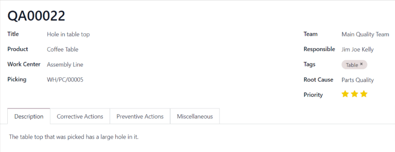
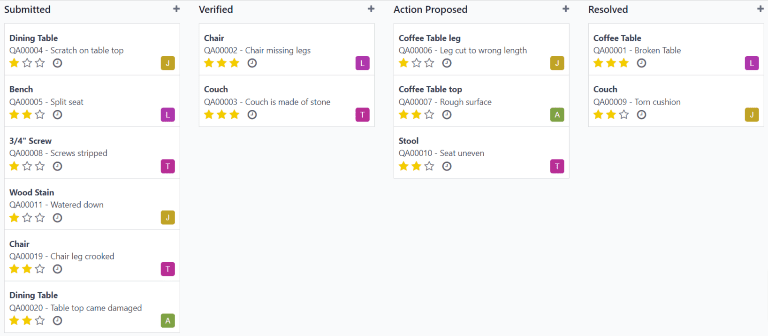

==============
Quality alerts
==============

.. _quality/quality_management/quality-alerts:
.. |MO| replace:: :abbr:`MO (Manufacturing Order)`

In the Odoo *Quality* app, *quality alerts* are used to notify quality teams of product defects or
other issues. Quality alerts can be created from a manufacturing or inventory order, from a work
order in the *Shop Floor* module, or directly within the *Quality* app.

Create quality alerts
=====================

There are multiple ways to create a new quality alert:

- **From the Quality app itself**, by to :menuselection:`Quality -->  Quality Control --> Quality
  Alerts`, and then click :guilabel:`New` to open a quality alert form.
- Navigate to :menuselection:`Manufacturing --> Operations --> Manufacturing Orders`, and then
  select an |MO|. Click the :guilabel:`Quality Alert` button at the top of the |MO| to open a
  quality alert form in a new page.

  .. important::
     This method can only be used if a quality check has been requested for the |MO|. The
     :guilabel:`Quality Alert` button will not appear otherwise.

- Open the :menuselection:`Inventory` app, click the :guilabel:`# To Process` button on an inventory
  order type card (Receipts, Delivery Orders, etc.), and then select an order. Click the
  :guilabel:`Quality Alert` button at the top of the order to open a quality alert form in a new
  page.

  .. important::
     This method can only be used if a quality check has been requested for the inventory order. The
     :guilabel:`Quality Alert` button will not appear otherwise. If the button does not appear, a
     quality alert can also be created by clicking the :guilabel:`⚙️ (gear)` icon at the top of the
     page and selecting the :guilabel:`Quality Alert` option from the resulting menu.

- Open the :menuselection:`Shop Floor` module, and then select a work center from the navigation bar
  at the top of the page. Then, click the :guilabel:`⋮ (three vertical dots)` button at the
  bottom-right of a work order card to open the :guilabel:`What do you want to do?` menu. Select the
  :guilabel:`Create a Quality Alert` option from this menu to open a quality alert in a pop-up
  window.

.. note::
   Depending on how a new quality alert form is opened, certain fields on the form may already be
   filled in. For example, if a quality alert is created from a work order card in the *Shop Floor*
   module, the :guilabel:`Product` and :guilabel:`Work Center` are pre-filled.

Quality alerts form
-------------------

After opening a new quality alert form, begin by giving it a short :guilabel:`Title` that summarizes
the issue with the product.

Then, if the quality alert is referencing:

- **A specific product or product variant**, select it from the :guilabel:`Product` or
  :guilabel:`Product Variant` drop-down menus.
- **A specific work center**, select it from the :guilabel:`Work Center` drop-down menu.
- **A specific picking order**, select it from the :guilabel:`Picking` drop-down menu.

Next in the :guilabel:`Team` field, select the quality team that is responsible for managing the
quality alert. If a specific employee should be responsible for the quality alert, select them from
the :guilabel:`Responsible` drop-down menu.

In the :guilabel:`Tags` field, select any tags relevant to the quality alert from the drop-down
menu.

Use the :guilabel:`Root Cause` field to select the cause of the quality issue, if known.

Lastly, choose a :guilabel:`Priority` level by selecting a :guilabel:`⭐ (star)` number between one
and three. Quality alerts with higher priorities appear at the top of the :guilabel:`Quality Alerts`
Kanban board in the *Quality* app.

At the bottom of the quality alert form are four tabs which aid in adding supplemental information
or actions to be taken for the quality alert. They can be filled out as follows:

- In the :guilabel:`Description` tab, enter a description of the quality issue.
- Use the :guilabel:`Corrective Actions` tab to detail the steps that should be taken to fix the
  issue.
- Use the :guilabel:`Preventive Actions` tab to detail what should be done to prevent the issue from
  occurring in the future.
- In the :guilabel:`Miscellaneous` tab, select the :guilabel:`Vendor` of the product. If using an
  Odoo database which manages multiple companies, select the relevant company in the
  :guilabel:`Company` field. Finally, specify when the alert was assigned to a quality team in the
  :guilabel:`Date Assigned` field.

Manage quality alerts
=====================

To view all existing quality alerts, navigate to :menuselection:`Quality --> Quality Control -->
Quality Alerts`. By default, alerts are displayed in a Kanban board view, which organizes them into
different stages based on where they are in the review process.

To move an alert to a different stage, simply drag and drop it on the desired stage. Alternatively,
select a quality alert to open it, and then click the desired stage above the top-right corner of
the quality alert form.

To create a new alert within a specific stage, click the :guilabel:`+ (plus)` button to the right of
the stage name. In the new alert card that appears below the stage title, enter the
:guilabel:`Title` of the alert, and then click :guilabel:`Add`. To configure the rest of the alert,
select the alert card to open its form.

