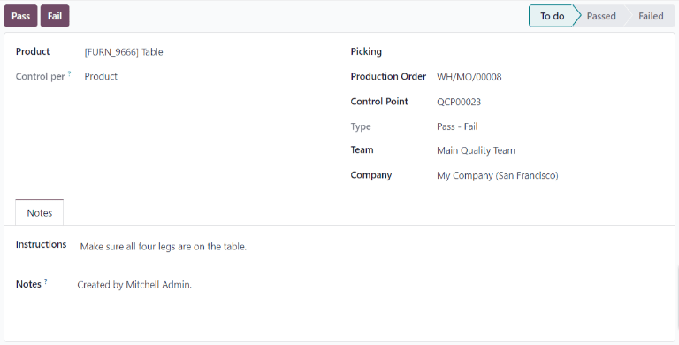
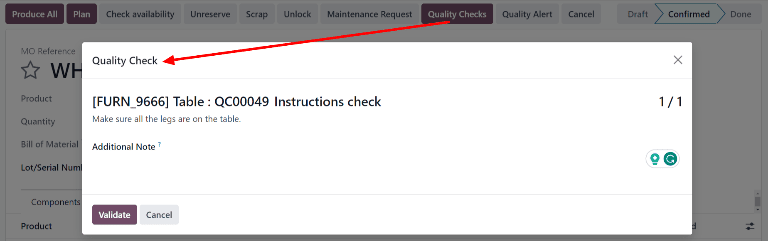

==============
Quality checks
==============

.. _quality/quality_management/quality-checks:
.. |MO| replace:: :abbr:`MO (Manufacturing Order)`
.. |QCP| replace:: :abbr:`QCP (Quality Control Point)`

Quality checks are manual inspections conducted by employees, and are used to ensure the quality of
products. In Odoo, a quality check can be conducted for a single product, or multiple products
within the same inventory operation or manufacturing order.

Using a Quality Control Point (QCP), it is possible to create quality checks automatically at
regular intervals. When quality checks are created by a |QCP|, they appear on a manufacturing or
inventory order, where the employee processing the order will be prompted to complete them. For a
full explanation of how to create and configure a |QCP|, see the documentation on :ref:`quality
control points <quality/quality_management/quality-control-points>`.

While quality checks are most commonly created automatically by a |QCP|, it is also possible to
manually create a single quality check. Creating a check manually is useful when an employee wants
to schedule a quality check that will only occur once, or register a quality check that they conduct
unprompted.

Manual quality check
====================

To manually create a single quality check, navigate to :menuselection:`Quality --> Quality Control
--> Quality Checks`, and click :guilabel:`New`. On the quality check form, begin by selecting an
option from the :guilabel:`Control per` drop-down menu:

- :guilabel:`Operation` requests a check for an entire operation (ex. delivery order) and all
  products within it.
- :guilabel:`Product` requests a check for every unit of a product that is part of an operation (ex.
  every unit of a product within a delivery order).
- :guilabel:`Quantity` requests a check for every quantity of a product that is part of an operation
  (ex. one check for five units of a product within a delivery order). Selecting
  :guilabel:`Quantity` also causes a :guilabel:`Lot/Serial` drop-down field to appear, from which
  can be selected a specific lot or serial number that the quality check should be conducted for.

Next, select an inventory operation from the :guilabel:`Picking` drop-down menu or a manufacturing
order from the :guilabel:`Production Order` drop-down menu. This is necessary because Odoo needs to
know for which operation the quality check is being conducted.

If the quality check should be assigned to a specific |QCP|, select it from the :guilabel:`Control
Point` drop-down menu. This is useful if the quality check is being created manually, but should
still be recognized as belonging to a specific |QCP|.

Select a quality check type from the :guilabel:`Type` drop-down field:

- :guilabel:`Instructions` provides specific instructions for how to conduct the quality check.
- :guilabel:`Take a Picture` requires a picture to be attached to the check before the check can be
  completed.
- :guilabel:`Pass - Fail` is used when the product being checked must meet a certain criteria to
  pass the check.
- Selecting :guilabel:`Measure` causes a :guilabel:`Measure` input field to appear, in which a
  measurement must be entered before the check can be completed.
- Selecting :guilabel:`Worksheet` causes a :guilabel:`Quality Template` drop-down field to appear.
  Use it to select a quality worksheet that must be filled out to complete the check.

In the :guilabel:`Team` field, select the quality team that is responsible for the quality check. In
the :guilabel:`Company` field, select the company that owns the product being inspected.

On the :guilabel:`Notes` tab at the bottom of the form, enter any relevant instructions in the
:guilabel:`Instructions` text entry box (ex. 'Attach a picture of the product'). In the
:guilabel:`Notes` text entry box, enter any relevant information about the quality check (who
created it, why it was created, etc.).

Finally, if the check is being processed immediately, click the :guilabel:`Pass` button at the top
left of the screen if the check passes, or the :guilabel:`Fail` button if the check fails.

Process quality check
=====================

Quality checks can be processed directly on the quality check's page, or from a manufacturing or
inventory order for which a check is required. Alternatively, if a quality check is created for a
specific work order operation, the check is processed in the *Shop Floor* module.

.. note::
   It is not possible to manually create a single quality check that is assigned to a specific work
   order operation. Quality checks for work order operations can only be created by a |QCP|. See the
   documentation on :ref:`Quality Control Points
   <quality/quality_management/quality-control-points>` for information about how to configure a
   |QCP| that will create quality checks for a specific work order operation.

Quality check page
------------------

To process a quality check from the check's page, begin by navigating to :menuselection:`Quality -->
Quality Control --> Quality Checks`, then select the check to process. Follow the instructions for
how to complete the check, listed in the :guilabel:`Instructions` field of the :guilabel:`Notes` tab
at the bottom of the page.

If the quality check passes, click the :guilabel:`Pass` button at the top of the page. If the check
fails, click the :guilabel:`Fail` button, instead.

Quality check on order
----------------------

To process a quality check on an order, select a manufacturing or inventory order (receipt,
delivery, return, etc.), for which a check is required. Manufacturing orders can be selected by
navigating to :menuselection:`Manufacturing --> Operations --> Manufacturing Orders`, and clicking
on an order. Inventory orders can be selected by navigating to :menuselection:`Inventory`, clicking
the :guilabel:`# To Process` button on an operation card, and selecting an order.

On the selected inventory or manufacturing order, a purple :guilabel:`Quality Checks` button appears
at the top of the order. Click the button to open the :guilabel:`Quality Check` pop-up window, which
shows all of the quality checks required for that order.

Follow the instructions that appear on the :guilabel:`Quality Check` pop-up window. If a Pass - Fail
check is being processed, complete the check by clicking :guilabel:`Pass` or :guilabel:`Fail` at the
bottom of the pop-up window. For all other quality check types, a :guilabel:`Validate` button
appears instead. Click it to complete the check.

Quality check on work order
---------------------------

To process a quality check for a work order, begin by navigating to :menuselection:`Manufacturing
--> Operations --> Manufacturing Orders`. Select an |MO| that includes a work order for which a
quality check is required.

On the |MO|, select the :guilabel:`Work Orders` tab, and then click the :guilabel:`Open Work Order
(external link icon)` button on the line of the work order to be processed. On the resulting
:guilabel:`Work Orders` pop-up window, click the :guilabel:`Open Shop Floor` button to open the
*Shop Floor* module.

.. seealso::
   For a full guide to the Shop Floor module, see the :doc:`Shop Floor overview
   <../../manufacturing/shop_floor/shop_floor_overview>` documentation.

When accessed from a specific work order, the *Shop Floor* module opens to the page for the work
center where the order is configured to be processed, and isolates the work order's card so that no
other cards are shown.

Process the work order's steps until the quality check step is reached. Click on the step to open a
pop-up window that details how the check should be completed. After following the instructions,
click :guilabel:`Validate` to complete the check. Alternatively, if a *Pass - Fail* check is being
processed, click either the :guilabel:`Pass` or :guilabel:`Fail` button.

It is also possible to complete a quality check by clicking the checkbox on the right side of the
step. Doing so automatically marks the check as *Passed*.

.. note::
   The specific steps for processing a quality check depend upon the type of check being conducted.
   For information about processing each type of quality check, see the associated documentation:

   - :doc:`../quality_check_types/instructions_check`
   - :doc:`../quality_check_types/pass_fail_check`
   - :doc:`../quality_check_types/measure_check`
   - :doc:`../quality_check_types/picture_check`
