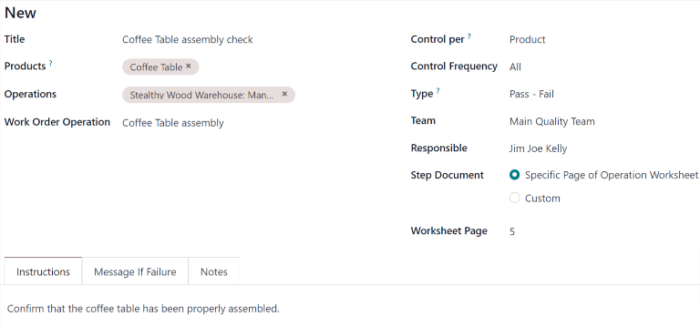

======================
Quality control points
======================

.. _quality/quality_management/quality-control-points:
.. |MO| replace:: :abbr:`MO (Manufacturing Order)`
.. |MOs| replace:: :abbr:`MOs (Manufacturing Orders)`
.. |QCP| replace:: :abbr:`QCP (Quality Control Point)`
.. |QCPs| replace:: :abbr:`QCPs (Quality Control Points)`

In Odoo, *quality control points* (QCPs), are used to automatically create :doc:`quality checks
<quality_checks>` at predetermined intervals. |QCPs| can be configured to create quality checks for
specific operations (manufacturing, delivery, etc.), as well as specific products within those
operations.

Using |QCPs| allows quality teams to ensure products are being regularly inspected for defects and
other issues.

Configure quality control points
================================

To create a new |QCP|, navigate to :menuselection:`Quality --> Quality Control --> Control Points`,
and then click :guilabel:`New`.

Begin filling out the new |QCP| by entering a unique :guilabel:`Title` that makes the |QCP| easily
identifiable.

In the :guilabel:`Products` field, select one or more products the |QCP| should apply to. If the
|QCP| should apply to an entire product category, select it in the :guilabel:`Product Categories`
field.

In the :guilabel:`Operations` field, select the operation(s) that should trigger the |QCP|. For
example, selecting the :guilabel:`Manufacturing` option in the :guilabel:`Operations` field causes a
quality check to be created for new manufacturing orders (MOs).

.. note::
   When creating a new |QCP|, at least one operation must be listed in the :guilabel:`Operations`
   field. However, the :guilabel:`Products` and :guilabel:`Product Categories` fields can be left
   blank. If they are left blank, the |QCP| generates quality checks for every instance of the
   specified operation(s).

If the :guilabel:`Manufacturing` operation is selected in the :guilabel:`Operations` field, a new
field appears below it, titled :guilabel:`Work Order Operation`. From this field, select a specific
work order to generate quality checks for that operation, rather than the manufacturing operation in
general.

For example, a |QCP| could be configured to create quality checks for the `Assembly` work order of
the `Coffee Table` product. Then, if a new |MO| is confirmed for a `Coffee Table`, the |QCP| creates
a quality check specifically for the `Assembly` operation.

The :guilabel:`Control Per` field is set to one of three options that determine *when* a new quality
check is created:

- :guilabel:`Operation`: one check is requested for the specified operation, as a whole.
- :guilabel:`Product`: one check is requested for each *unique* product included in the specified
  operation. For example, a delivery operation for one table and four chairs would generate two
  checks, since two *unique* products are included in the operation.
- :guilabel:`Quantity`: a check is requested for a certain percentage of items within the specified
  operation. This percentage is set by enabling the :guilabel:`Partial Transfer Test` checkbox, and
  then entering a numerical value in the :guilabel:`Percentage` field that appears below. If the
  checkbox is not enabled, one quality check is created for the full quantity.

The :guilabel:`Control Frequency` field is set to one of three options that determine *how often* a
new quality check is created:

- :guilabel:`All`: a quality check is requested every time the conditions of the |QCP| are met.
- :guilabel:`Randomly`: a quality check is randomly requested for a certain percentage of
  operations, which can be specified in the :guilabel:`Every #% of Transfers` field that appears
  below.
- :guilabel:`Periodically`: a quality check is requested once every set period of time, which is
  specified by entering a numerical value in the field below, and choosing either :guilabel:`Days`,
  :guilabel:`Weeks`, or :guilabel:`Months` as the desired time interval.

In the :guilabel:`Type` field, specify the type of quality check that should be performed. The
method for processing quality checks created by the |QCP| depends upon the type of quality check
selected:

- :guilabel:`Instructions` checks provide specific instructions for how to complete the quality
  check.
- :guilabel:`Take a Picture` checks require a picture of the product be uploaded for later review by
  the assigned quality team.
- :guilabel:`Register Production` checks prompt manufacturing employees to confirm the quantity of
  the product that was produced during the manufacturing operation.
- :guilabel:`Pass - Fail` checks specify a criterion that products must meet for the check to pass.
- :guilabel:`Measure` checks prompt employees to record a measurement of the product that must be
  within a tolerance of a norm value for the check to pass.
- :guilabel:`Worksheet` checks provide an interactive worksheet that must be filled out by the
  employee processing the check.

.. important::
   An *Instructions* check is the same as a step on a work order for an MO.

   When a step is added to a work order, Odoo stores it in the Quality app as a |QCP|. It is
   possible to manually create a |QCP| with the *Instructions* check type, and even assign it to an
   operation other than manufacturing, like receipts.

   However, when creating a control point specifically for quality control purposes, using a
   different check type is probably more effective.

In the :guilabel:`Team` field, specify the quality team that is responsible for managing the |QCP|,
and the quality checks it creates. If a specific quality team member is responsible for the |QCP|,
select them in the :guilabel:`Responsible` field.

The :guilabel:`Step Document` field has two options that specify the location of an instructional
document detailing how to complete the quality checks created by the |QCP|.

Select :guilabel:`Specific Page of Operation Worksheet` if the document is included with the
instructional worksheet for the work order, then enter the page number in the :guilabel:`Worksheet
Page` field that appears below.

Select :guilabel:`Custom` if the document should be included in the :guilabel:`Instructions` tab at
the bottom of the |QCP|.

In the :guilabel:`Instructions` tab at the bottom of the form, enter instructions for how to
complete the quality checks created by the |QCP|.

If the :guilabel:`Custom` option was selected in the :guilabel:`Step Document` field above, a
document can be attached in this tab. To do so, either select the :guilabel:`Upload your file`
button to open the device's file manager, and then select a file, or add a link to a Google Slides
document in the :guilabel:`Google Slide Link` field.

In the :guilabel:`Message If Failure` tab, include instructions for what to do if the quality check
fails. For example, instruct the employee processing the quality check to create a :doc:`quality
alert <quality_alerts>`.

The :guilabel:`Notes` tab is used to provide additional information about the |QCP|, like the reason
it was created. The information entered in this tab is **not** shown to employees processing the
quality checks created by the |QCP|.

