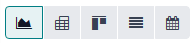
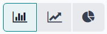
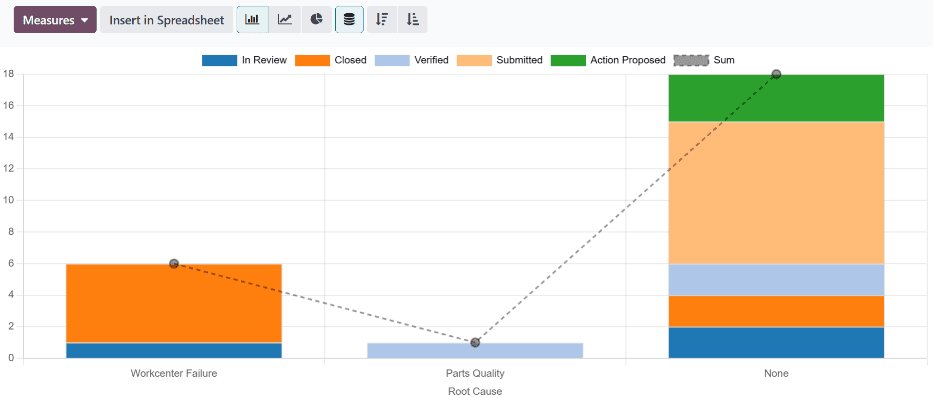
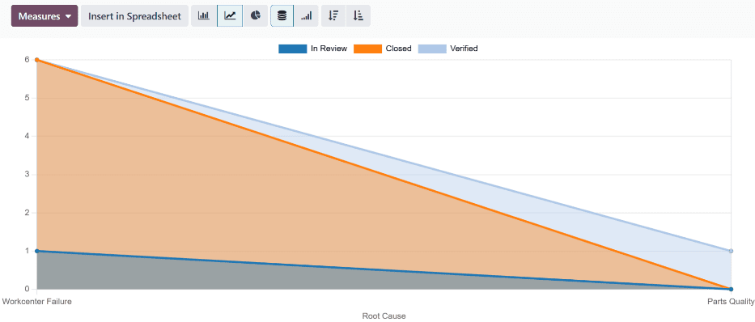
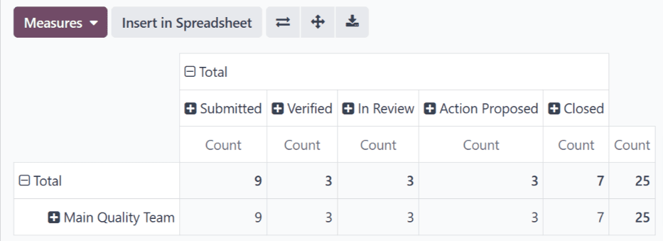
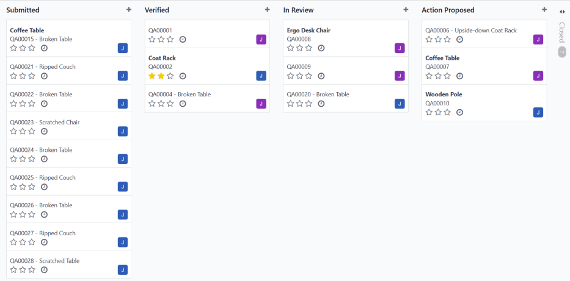
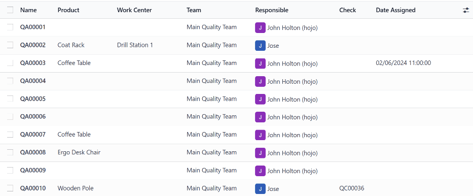
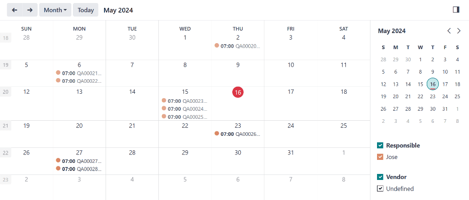

=====================
Quality alerts report
=====================

In Odoo's *Quality* app, the *Quality Alerts* report displays key statistics about existing alerts.
This includes the number of quality alerts in each stage, the number of alerts assigned to each
quality team, the root causes of the issues that led to alert creation, and more.

The report offers a number of options to help visualize the data, including customizable views and
three different graph types. This allows users to extract deeper insights from their quality alert
processes.

Report dashboard
================

To access the quality alerts report dashboard, navigate to :menuselection:`Quality app --> Reporting
--> Quality Alerts`.

There are five main views that can be used to display quality alert data:

- :ref:`Graph view <quality_alerts_report/graph-view>`
- :ref:`Pivot view <quality_alerts_report/pivot-view>`
- :ref:`Kanban view <quality_alerts_report/kanban-view>`
- :ref:`List view <quality_alerts_report/list-view>`
- :ref:`Calendar view <quality_alerts_report/calendar-view>`

By default, the dashboard displays data in the graph view, using the bar chart graph type. To select
a different view, click on the corresponding button in the top-right corner of the dashboard.

   The view select buttons on the Quality Alerts report dashboard. From left to right: Graph, Pivot,
   Kanban, List, and Calendar.

.. _quality_alerts_report/graph-view:

Graph view
----------

To display quality alert data in a graph view, click the :icon:`fa-area-chart` :guilabel:`(Graph)`
button in the top-right corner of the dashboard.

There are three chart types that can be used to visualize quality alert data:

- :ref:`Bar chart <quality_alerts_report/bar-chart>`
- :ref:`Line chart <quality_alerts_report/line-chart>`
- :ref:`Pie chart <quality_alerts_report/pie-chart>`

By default, the graph view displays data using the bar chart graph type. To select a different graph
type, click the corresponding button in the top-left corner of the dashboard.

   The graph select buttons on the Quality Alerts report dashboard. From left to right: Bar Chart,
   Line Chart, and Pie Chart.

.. _quality_alerts_report/bar-chart:

Bar chart
~~~~~~~~~

To display quality alert data in a bar chart, click the :icon:`fa-bar-chart` :guilabel:`(Bar Chart)`
button in the top-left corner of the dashboard, while in :ref:`graph view
<quality_alerts_report/graph-view>`.

The x-axis of the bar chart lists root causes that led to the creation of one or more alerts (e.g.
*Workcenter Failure*). Since root causes can be added by users, they may differ from one database to
another. The y-axis of the bar chart shows the number of quality alerts associated with each root
cause, which is represented by a bar above each stage name.

.. _quality_alerts_report/line-chart:

Line chart
~~~~~~~~~~

To display quality alert data in a line chart, click the :icon:`fa-line-chart` :guilabel:`(Line
Chart)` button in the top-left corner of the dashboard, while in :ref:`graph view
<quality_alerts_report/graph-view>`.

The x-axis of the line chart lists root causes that led to the creation of one or more alerts (e.g.
Workcenter Failure). Since root causes can be added by users, they may differ from one database to
another. The y-axis of the bar chart shows the number of quality alerts associated with each root
cause, which is represented by a point on the graph above each stage name. Each of these points is
linked by a line.

.. _quality_alerts_report/pie-chart:

Pie chart
~~~~~~~~~

To display quality alert data in a pie chart, click the :icon:`fa-pie-chart` :guilabel:`(Pie Chart)`
button in the top-left corner of the dashboard, while in :ref:`graph view
<quality_alerts_report/graph-view>`.

Each slice of the pie chart represents the quality alerts associated with a specific root cause, in
a specific stage of the alert review process (e.g. Workcenter Failure alerts in the *In Review*
stage). The size of each slice represents the number of alerts assigned to it, as a percentage of
the total number of alerts.

Each slice of the pie appears in a unique color, and a key at the top of the chart denotes the root
cause and review stage represented by each color.

To remove a slice from the pie chart, click its name in the key at the top of the chart. After doing
so, the remaining slices expand to fill the space vacated by the removed slice. Click the slice name
again to make the slice reappear on the chart.

.. image:: quality_alerts_report/pie-chart.png
   :align: center
   :alt: The pie chart graph view on the quality alerts report dashboard.

.. _quality_alerts_report/pivot-view:

Pivot view
----------

To display quality alert data in pivot view, click the :icon:`oi-view-pivot` :guilabel:`(Pivot)`
button in the top-right corner of the dashboard. The pivot view displays data in the form of a
spreadsheet.

By default, each column is labeled with the name of a quality alert stage (e.g. In Review). Since
alert stages are customizable, they may differ from one database to another.

By default, each row is labeled with the name of a quality alert team.

The cell at the intersection of a column and row displays a number, which signifies the number of
quality alerts in the column's stage which are assigned to the row's quality alert team.

To change the data displayed by the columns or rows, click the :guilabel:`Total` heading above
either. Then, click it again to open a popover menu, from which a new variable can be selected.

.. example::
   Click the :guilabel:`Total` heading above the columns to remove the stage names. Then, click the
   heading again, and select :guilabel:`Root Cause` from the popover menu. Each column is now titled
   with the name of a root cause.

   The default pivot view on the quality alerts report dashboard.

.. _quality_alerts_report/kanban-view:

Kanban view
-----------

To display quality alert data in a Kanban view, click the :icon:`oi-view-kanban`
:guilabel:`(Kanban)` button in the top-right corner of the dashboard.

The Kanban view displays all existing quality alerts in a Kanban board, with each alert organized
into a specific stage (e.g. In Review). Since Kanban stages are customizable, they may differ from
one database to another.

Quality alerts can be dragged-and-dropped from one stage to another. Doing so changes the status of
the quality alert.

Click on a quality alert to open it, and see its details.

.. _quality_alerts_report/list-view:

List view
---------

To display all quality alerts in a list view, click the :icon:`oi-view-list` :guilabel:`(List)`
button in the top-right corner of the dashboard.

The list view displays all existing quality alerts in a list. Click on a quality alert to open it,
and see its details.

.. _quality_alerts_report/calendar-view:

Calendar view
-------------

To display all quality alerts in a calendar view, click the :icon:`oi-view-calendar`
:guilabel:`(Calendar)` button in the top-right corner of the dashboard.

By default, the calendar view shows a calendar of the current month, with quality alerts listed on
the day they are assigned. To switch to a different month, click the :icon:`oi-arrow-left`
:guilabel:`(left arrow)` or :icon:`oi-arrow-right` :guilabel:`(right arrow)` buttons at the top-left
corner of the dashboard.

To choose a different timescale, click the :guilabel:`Month` button to the right of the
:icon:`oi-arrow-right` :guilabel:`(right arrow)` button, then select :guilabel:`Day`,
:guilabel:`Week`, or :guilabel:`Year`, from the drop-down menu.

On the calendar, click on a quality alert to open a popover menu displaying its details. Click the
:guilabel:`Edit` button at the bottom of the popover menu to open the alert in a new page, or the
:guilabel:`Delete` button to delete the alert.

