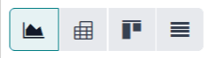
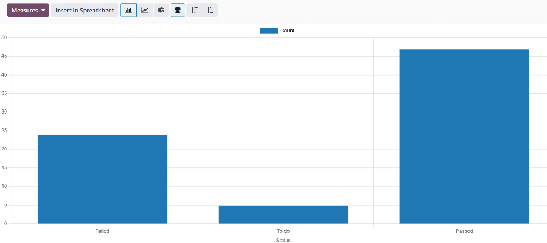
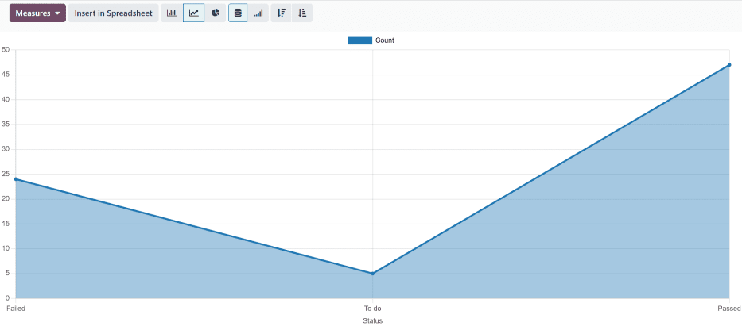
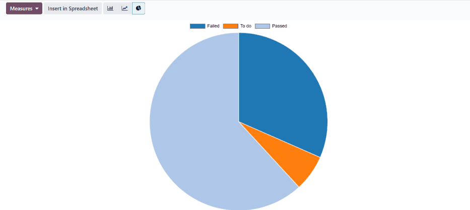
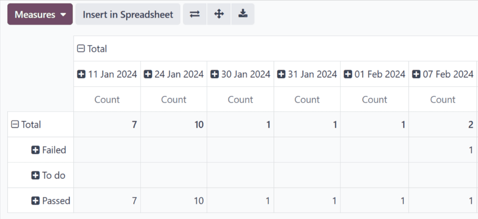
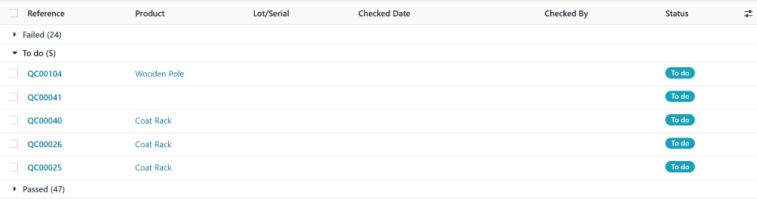

=====================
Quality checks report
=====================

In Odoo's *Quality* app, the *Quality Checks* report displays key statistics about existing quality
checks. This includes the number of quality checks in each stage, the dates on which checks were
passed or failed, the products for which checks were created, and more.

The report offers a number of options to help visualize the data, including customizable views and
three different graph types. This allows users to extract deeper insights from their quality check
processes.

Report dashboard
================

To access the :guilabel:`Quality Checks` report dashboard, navigate to :menuselection:`Quality app
--> Reporting --> Quality Checks`.

There are four main views that can be used to display quality check data:

- :ref:`Graph view <quality_alerts_report/graph-view>`
- :ref:`Pivot view <quality_alerts_report/pivot-view>`
- :ref:`Kanban view <quality_alerts_report/kanban-view>`
- :ref:`List view <quality_alerts_report/list-view>`

By default, the :guilabel:`Quality Checks` dashboard displays data in the graph view, using the bar
chart graph type. To select a different view, click on the corresponding button in the top-right
corner of the dashboard.

   The view select buttons on the Quality Checks report dashboard. From left to right: Graph, Pivot,
   Kanban, and List.

.. _quality_alerts_report/graph-view:

Graph view
----------

To display quality check data in graph view, click the :icon:`fa-area-chart` :guilabel:`(Graph)`
button in the top-right corner of the dashboard, while in :ref:`graph view
<quality_alerts_report/graph-view>`.

There are three chart types that can be used to visualize quality check data:

- :ref:`Bar chart <quality_alerts_report/bar-chart>`
- :ref:`Line chart <quality_alerts_report/line-chart>`
- :ref:`Pie chart <quality_alerts_report/pie-chart>`

By default, graph view displays data using the bar chart graph type. To select a different graph
type, click the corresponding button in the top-left corner of the dashboard.

.. figure:: quality_checks_report/graph-select.png
   :align: center
   :alt: The graph select buttons on the Quality Checks report dashboard.

   The graph select buttons on the Quality Checks report dashboard. From left to right: Bar Chart,
   Line Chart, and Pie Chart.

.. _quality_alerts_report/bar-chart:

Bar chart
~~~~~~~~~

To display quality check data in a bar chart, click the :icon:`fa-bar-chart` :guilabel:`(Bar Chart)`
button in the top-left corner of the dashboard, while in :ref:`graph view
<quality_alerts_report/graph-view>`.

The x-axis of the bar chart shows the three stages that a quality check can be organized under:
:guilabel:`Failed`, :guilabel:`To do`, and :guilabel:`Passed`. The y-axis of the bar chart shows the
number of quality checks in each stage, which is displayed by a bar above each stage name.

.. _quality_alerts_report/line-chart:

Line chart
~~~~~~~~~~

To display quality check data in a line chart, click the :icon:`fa-line-chart` :guilabel:`(Line
Chart)` button in the top-left corner of the dashboard, while in :ref:`graph view
<quality_alerts_report/graph-view>`.

The x-axis of the line chart shows the three stages that a quality check can be organized under:
:guilabel:`Failed`, :guilabel:`To do`, and :guilabel:`Passed`. The y-axis of the line chart shows
the number of quality checks in each stage, which is displayed by a point on the graph above each
stage name. Each of these points is linked by a line.

.. _quality_alerts_report/pie-chart:

Pie chart
~~~~~~~~~

To display quality check data in a pie chart, click the :icon:`fa-pie-chart` :guilabel:`(Pie Chart)`
button in the top-left corner of the dashboard.

The pie chart displays each quality check stage (:guilabel:`Failed`, :guilabel:`To do`, and
:guilabel:`Passed`) as a slice of the pie, with the size corresponding to the percentage of quality
checks assigned to that stage.

Each slice of the pie appears in a unique color, and a key at the top of the chart denotes the stage
represented by each color.

To remove a stage from the pie chart, click its name in the key at the top of the chart. After doing
so, the remaining stages expand to fill the space vacated by the removed stage. Click the stage name
again to make the stage reappear on the chart.

.. _quality_alerts_report/pivot-view:

Pivot view
----------

To display quality check data in pivot view, click the :icon:`oi-view-pivot` :guilabel:`(Pivot)`
button in the top-right corner of the dashboard.

The pivot view displays data in the form of a spreadsheet.

By default, each column is labeled with a date on which at least one quality check was passed or
failed. The left-most column displays the earliest date, with each successive column displaying the
next chronological date.

By default, each row is labeled with the name of one of the three quality check stages:
:guilabel:`Failed`, :guilabel:`To do`, and :guilabel:`Passed`.

The cell at the intersection of a column and row displays a number, which signifies the number of
quality checks that passed or failed on that specific date. Click on a cell to see the quality
checks displayed in a list.

To change the data displayed by the columns or rows, click the :guilabel:`Total` heading above
either. Then, click it again to open a popover menu, from which a new variable can be selected.

.. example::
   Click the :guilabel:`Total` heading above the columns to remove the date data. Then, click the
   heading again, and select :guilabel:`Product` from the popover menu. Each column is now titled
   with the name of a product for which a quality check has been created.

   The default pivot view on the Quality Checks report dashboard.

.. _quality_alerts_report/kanban-view:

Kanban view
-----------

To display quality check data in a Kanban view, click the :icon:`oi-view-kanban`
:guilabel:`(Kanban)` button in the top-right corner of the dashboard.

The Kanban view displays all existing quality checks in a Kanban board, with each check organized
into one of three stages, depending on their status: :guilabel:`Failed`, :guilabel:`To do`, and
:guilabel:`Passed`.

Quality checks can be dragged-and-dropped from one stage to another. Doing so changes the status of
the quality check.

Click on a quality check to open it, and see its details.

.. image:: quality_checks_report/kanban-view.png
   :align: center
   :alt: The Kanban view on the Quality Checks report dashboard.

.. _quality_alerts_report/list-view:

List view
---------

To display all quality checks in a list view, click the :icon:`oi-view-list` :guilabel:`(List)`
button in the top-right corner of the dashboard.

The list view displays all existing quality checks in a list, with each check organized under one of
three subheadings, depending on their status: :guilabel:`Failed`, :guilabel:`To do`, or
:guilabel:`Passed`.

Each subheading displays a number to the right of its name, which denotes the number of checks
assigned to it. To expand a subheading, and see all of the checks assigned to it, click on the
subheading's name.

Click on a quality check to open it, and see its details.

   The list view with the "To do" subheading expanded. The subheading's title shows the number five,
   which corresponds to the number of quality checks within it.
