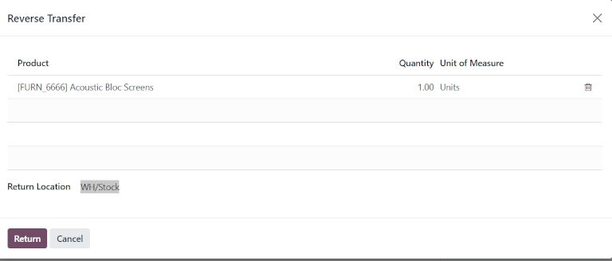
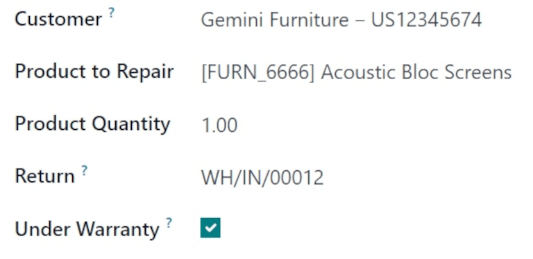
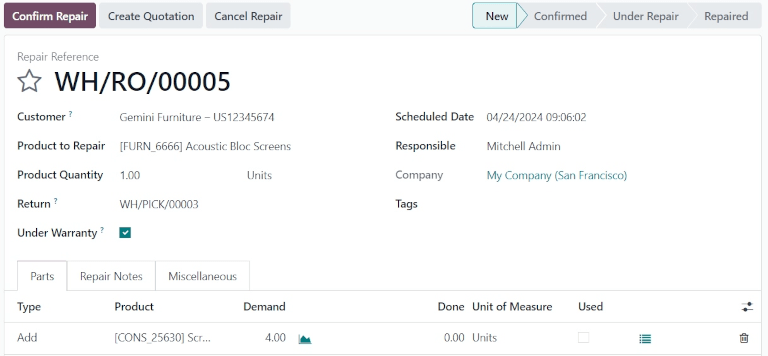
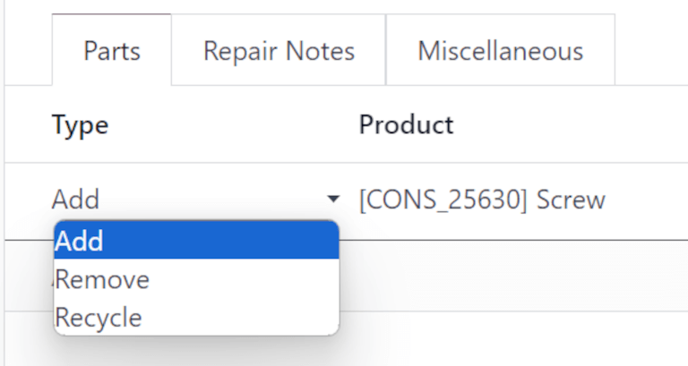
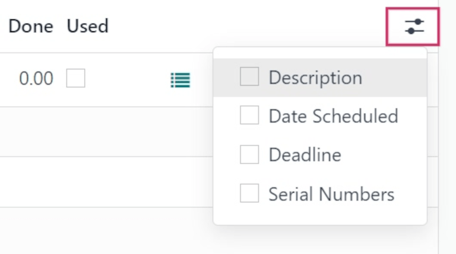
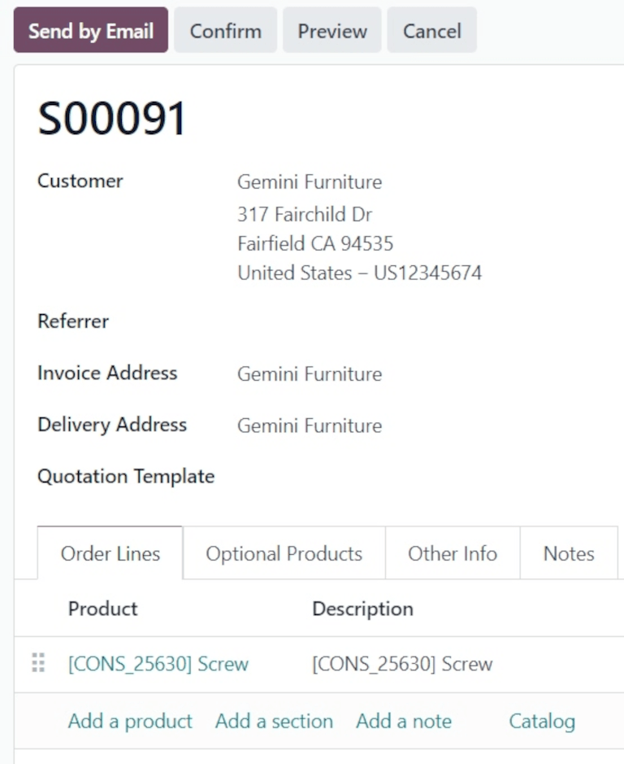

=====================
Process repair orders
=====================

.. |SO| replace:: :abbr:`SO (Sales Order)`
.. |DO| replace:: :abbr:`DO (Delivery Order)`
.. |RO| replace:: :abbr:`RO (Repair Order)`
.. |UoM| replace:: :abbr:`UoM (Unit of Measure)`

Sometimes, products delivered to customers can break or be damaged in transit, and need to be
returned for a refund, delivery of a replacement product, or repairs.

In Odoo, repairs for products returned by customers can be tracked in the *Repairs* app. Once
repaired, products can be redelivered to the customer.

The return and repair process for damaged products typically follows the below steps:

#. :ref:`Process return order for damaged product <repairs/repair_orders/return-order>`
#. :ref:`Create repair order for returned product <repairs/repair_orders/repair>`
#. :ref:`Return repaired product to customer <repairs/repair_orders/return-customer>`

.. _repairs/repair_orders/return-order:

Return order
============

Returns can be processed in Odoo via *reverse transfers*, created directly from a sales order (SO)
once products have been delivered to a customer.

To create a return, navigate to the :menuselection:`Sales app`, and click into an |SO| from which a
product should be returned. Then, from the |SO| form, click the :guilabel:`Delivery` smart button.
Doing so opens the delivery order (DO) form.

From this form, click :guilabel:`Return`. This opens a :guilabel:`Reverse Transfer` pop-up window.

This pop-up lists the :guilabel:`Product` included in the order, the :guilabel:`Quantity` delivered
to the customer, and the :guilabel:`Unit of Measure` the product was in.

Click the value in the :guilabel:`Quantity` field to change the quantity of the product to be
returned, if necessary.

Click the :guilabel:`🗑️ (trash)` icon at the far-right of the product line to remove it from the
return, if necessary.

Once ready, click :guilabel:`Return` to confirm the return. This creates a new receipt for the
returned products.

Once the product has been returned to the warehouse, receipt of the return can be registered in the
database by clicking :guilabel:`Validate` from the reverse transfer form.

.. tip::
   Once a reverse transfer for a return is validated, the value in the :guilabel:`Delivered` column
   on the original |SO| updates to reflect the difference between the original :guilabel:`Quantity`
   ordered, and the :guilabel:`Quantity` returned by the customer.

   .. image:: repair_orders/repair-orders-quantity-delivered.png
      :align: center
      :alt: Delivered and Quantity columns on sales order after return.

.. _repairs/repair_orders/repair:

Create repair order
===================

Once products have been returned, their repairs can be tracked by creating a repair order (RO).

To create a new |RO|, navigate to :menuselection:`Repairs app`, and click :guilabel:`New`. This
opens a blank |RO| form.

On this form, begin by selecting a :guilabel:`Customer`. The customer selected should be for whom
the order will be invoiced and delivered.

In the :guilabel:`Product to Repair` field, click the drop-down menu to select the product that
needs repair. If necessary, click :guilabel:`Search More...` to open a :guilabel:`Search: Product to
Repair` pop-up window, and browse all products in the database.

Once a :guilabel:`Product to Repair` is selected, a new :guilabel:`Product Quantity` field appears
below it. In that field, enter the quantity (in a `0.00` format) of the product that requires
repair.

To the right of that value, click the drop-down list to select the unit of measure (UoM) for the
product.

In the :guilabel:`Return` field, click the drop-down menu and select the return order from which the
product to be repaired comes from.

Tick the :guilabel:`Under Warranty` checkbox, if the product being repaired is covered by a
warranty. If ticked, the :guilabel:`Customer` is not charged for all the parts used in the repair
order.

In the :guilabel:`Scheduled Date` field, click the date to reveal a calendar popover window. From
this calendar, select a date for the repair, and click :guilabel:`Apply`.

In the :guilabel:`Responsible` field, click the drop-down menu and select the user who should be
responsible for the repair.

In the :guilabel:`Company` field, if in a multi-company environment, select which company this |RO|
belongs to.

In the :guilabel:`Tags` field, click the drop-down menu and select which tags should be applied to
this |RO|.

Parts tab
---------

Add, remove, or recycle parts in the :guilabel:`Parts` tab. To do so, click :guilabel:`Add a line`
at the bottom of the form.

In the :guilabel:`Type` column, click the box to reveal three options to choose from:
:guilabel:`Add` (selected by default), :guilabel:`Remove`, and :guilabel:`Recycle`.

Choosing :guilabel:`Add` adds this part to the |RO|. Adding parts lists components for use in the
repair. If the components are used, the user completing the repair can record they were used. If
they were not used, the user can indicate that, too, and the components can be saved for another
use.

Choosing :guilabel:`Remove` removes this part from the |RO|. Removing parts lists components that
should be removed from the product being repaired during the repair process. If the parts are
removed, the user completing the repair can indicate they were removed.

Choosing :guilabel:`Recycle` recycles this part from the |RO|, designating it for later use or to be
repurposed for another use in the warehouse.

In the :guilabel:`Product` column, select which product (part) should be added, removed, or
recycled. In the :guilabel:`Demand` column, change the quantity, if necessary, to indicate what
quantity of this part should be used in the repair process.

In the :guilabel:`Done` column, change the value (in a `0.00` format) once the part has been
successfully added, removed, or recycled.

In the :guilabel:`Unit of Measure` column, select the |UoM| for the part.

Finally, in the :guilabel:`Used` column, tick the checkbox once the part has been used in the repair
process.

To add additional columns to the line, click the :guilabel:`(optional columns drop-down)` icon, at
the far-right of the header row. Select the desired options to add to the line.

Repair Notes and Miscellaneous tabs
-----------------------------------

Click the :guilabel:`Repair Notes` tab to add internal notes about this specific |RO|, and anything
the user performing the repair might need to know.

Click the blank text field to begin writing notes.

Click the :guilabel:`Miscellaneous` tab to see the :guilabel:`Operation Type` for this repair. By
default, this is set to :guilabel:`YourCompany: Repairs`, indicating this is a repair type
operation.

Once all desired configurations have been made on the |RO| form, click :guilabel:`Confirm Repair`.
This moves the |RO| to the :guilabel:`Confirmed` stage, and reserves the necessary components needed
for the repair.

A new :guilabel:`Forecasted` column appears on the product lines under the :guilabel:`Parts` tab,
displaying the availability of all components needed for the repair.

Once ready, click :guilabel:`Start Repair`. This moves the |RO| to the :guilabel:`Under Repair`
stage (in the upper-right corner). If the |RO| should be canceled, click :guilabel:`Cancel Repair`.

Once all products have been successfully repaired, the |RO| is completed. To register this in the
database, click :guilabel:`End Repair`.

.. note::
   If all parts added to the |RO| were not used, clicking :guilabel:`End Repair` causes an
   :guilabel:`Uncomplete Move(s)` pop-up window to appear.

   .. image:: repair_orders/repair-orders-uncomplete-moves.png
      :align: center
      :alt: Uncomplete Moves pop-up window for unused parts.

   The pop-up window informs the user that there is a difference between the initial demand and the
   actual quantity used for the order.

   If the :guilabel:`Used` quantity should be changed, click :guilabel:`Discard` or close the pop-up
   window. If the order should be confirmed, click :guilabel:`Validate`.

This moves the |RO| to the :guilabel:`Repaired` stage. A :guilabel:`Product Moves` smart button also
appears above the form.

Click the :guilabel:`Product Moves` smart button to view the product's moves history during and
after the repair process.

.. image:: repair_orders/repair-orders-product-moves.png
   :align: center
   :alt: Moves history of product included in the repair order.

.. _repairs/repair_orders/return-customer:

Return product to customer
--------------------------

Product is under warranty
~~~~~~~~~~~~~~~~~~~~~~~~~

Once the product has been successfully repaired, it can be returned to the customer.

Product is not under warranty
~~~~~~~~~~~~~~~~~~~~~~~~~~~~~

If the product is not under warranty, or should the customer bear the repair costs, click
:guilabel:`Create Quotation`. This opens a new |SO| form, pre-populated with the parts used in the
|RO|, with the total cost of the repair calculated.

If this |SO| should be sent to the customer, click :guilabel:`Confirm`, and proceed to invoice the
customer for the repair.

.. tip::
   If the customer should be charged for a repair service, a service type product can be created and
   added to the |SO| for a repaired product.

To return the product to the customer, navigate to the :menuselection:`Sales app`, and select the
original |SO| from which the initial return was processed. Then, click the :guilabel:`Delivery`
smart button.

From the resulting list of operations, click the reverse transfer, indicated by the
:guilabel:`Source Document`, which should read `Return of WH/OUT/XXXXX`.

This opens the return form. At the top of this form, a :guilabel:`Repair Orders` smart button now
appears, linking this return to the completed |RO|.

Click :guilabel:`Return` at the top of the form. This opens a :guilabel:`Reverse Transfer` pop-up
window.

This pop-up lists the :guilabel:`Product` included in the order, the :guilabel:`Quantity` delivered
to the customer, and the :guilabel:`Unit of Measure` the product was in.

Click the value in the :guilabel:`Quantity` field to change the quantity of the product to be
returned, if necessary.

Click the :guilabel:`🗑️ (trash)` icon at the far-right of the product line to remove it from the
return, if necessary.

Once ready, click :guilabel:`Return` to confirm the return. This creates a new delivery for the
returned products.

When the delivery has been processed and the product has been returned to the customer, click
:guilabel:`Validate` to validate the delivery.

.. seealso::
   :doc:`../../sales/sales/products_prices/returns`
