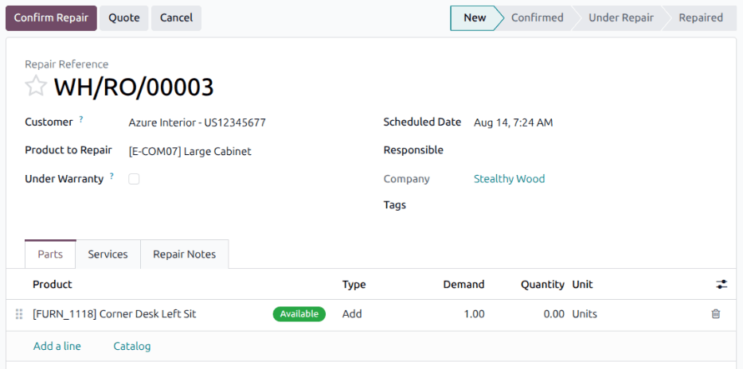
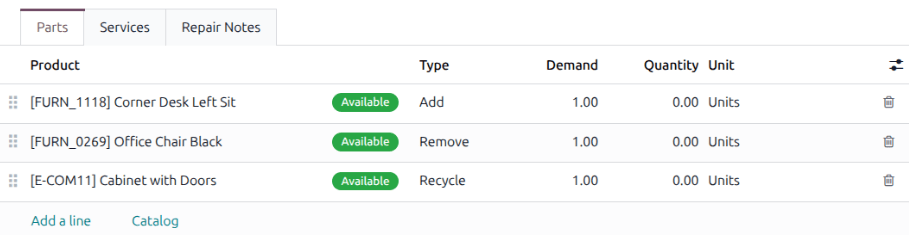
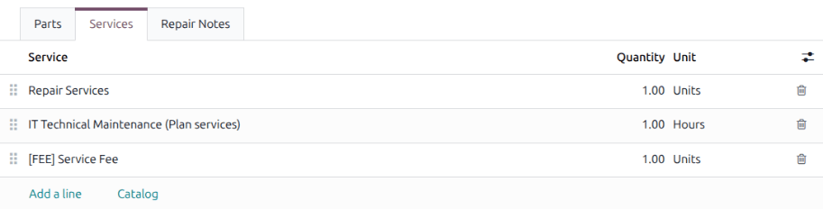

.. meta::
   :description: Repair orders track the repair of a damaged product. Learn how to create a repair
                 order with Parts, Services, and Repair Notes tabs, then process the repair order
                 and return the repaired product to the customer via the original sales order.

=============
Repair orders
=============

.. |SO| replace:: :abbr:`SO (Sales Order)`
.. |DO| replace:: :abbr:`DO (Delivery Order)`
.. |RO| replace:: :abbr:`RO (Repair Order)`

Sometimes, products delivered to customers can break or be damaged in transit, and need to be
returned for a refund, delivery of a replacement product, or repairs.

In Odoo, repairs for products returned by customers can be tracked in the **Repairs** app. Once
repaired, products can be redelivered to the customer.

The repair process for damaged products typically follows the steps below:

#. :ref:`Create a repair order <repairs/repair_orders/create-ro>` for the returned product.
#. :ref:`Process the repair <repairs/repair_orders/process-repair>` for the |RO|.
#. :ref:`Return the repaired product <repairs/repair_orders/return-to-customer>` to the customer.

.. seealso::
   :doc:`../../sales/sales/products_prices/returns`

.. _repairs/repair_orders/create-ro:

Create a repair order
=====================

When a damaged product is returned, its repair can be tracked by creating a repair order (RO). To
create a new |RO|, navigate to the **Repairs** app and click :guilabel:`New`, then fill in the
following form fields:

- :guilabel:`Customer`: The customer requesting the repair.
- :guilabel:`Product to Repair`: The product that needs repair. If the product is tracked by lot or
  serial number, an additional :guilabel:`Lot/Serial` field appears to specify the lot or serial
  number of the repair product.
- :guilabel:`Under Warranty`: Select this checkbox if the product being repaired is covered by a
  warranty. The :guilabel:`Customer` is not charged for |RO| parts covered under warranty.

After specifying details about the customer's repair, fill in the following fields:

- :guilabel:`Scheduled Date`: The date to start the repair.
- :guilabel:`Responsible`: The user in the database responsible for the repair.
- :guilabel:`Company`: The company this |RO| belongs to, if in a multi-company environment. This
  field is automatically populated and non-modifiable.
- :guilabel:`Tags`: Relevant tags to apply to this |RO|.

.. _repairs/repair_orders/parts-tab:

Parts tab
---------

The *Parts* tab tracks parts to add, remove, or recycle during the repair. To specify a part, click
:guilabel:`Add a line`.

- :guilabel:`Product`: The part to be added, removed, or recycled.
- :guilabel:`Type`: Select one of three options from the drop-down:

   - :guilabel:`Add`: Add this component for use during the repair.
   - :guilabel:`Remove`: Remove this component from the product being repaired.
   - :guilabel:`Recycle`: Save this component for later use in the warehouse.

- :guilabel:`Demand`: Specify the quantity of this part to be used in the repair, if necessary.
- :guilabel:`Quantity`: Automatically updated with the number of parts actually used. This field can
  be manually changed, if needed.
- :guilabel:`Unit`: Select the :doc:`unit of measure
  <../inventory/product_management/configure/uom>` for the part.

.. tip::
   To add additional columns to the line, click the :icon:`oi-settings-adjust` :guilabel:`(optional
   columns drop-down)` icon in the header row. Select the desired options to add to the line, such
   as the :guilabel:`Deadline` field and :guilabel:`Serial Numbers` field.

.. _repairs/repair_orders/services-tab:

Services tab
------------

The *Services* tab tracks service-type products for the |RO|, such as labor or diagnostics, for
traceability and invoicing purposes. To add a service, click :guilabel:`Add a line`, then select a
service product from the drop-down menu.

Set the :guilabel:`Quantity` and :guilabel:`Unit` of the service, then click :guilabel:`Save`.

.. _repairs/repair_orders/repair-notes-tab:

Repair Notes tab
----------------

The *Repair Notes* tab is used to internally document important information about the repair. Repair
notes should be added whenever information needs to be recorded for reference, clarification, or
documentation.

.. example::
   Repair notes can be used to document:

   - Visible damage that may show the repair is not covered under warranty.
   - The condition of the product before and after the repair.
   - Instructions for the repair process.
   - Specific customer requests.

.. _repairs/repair_orders/process-repair:

Process a repair order
======================

Once all desired configurations have been made on the |RO| form, click :guilabel:`Confirm Repair`.
This moves the |RO| to the :guilabel:`Confirmed` stage and reserves the necessary components needed
for the repair. Once confirmed, a :guilabel:`Component Status` field appears on the |RO| form,
indicating whether the repair order is *Available* or *Not Available* based on the availability of
the parts.

Once ready, click :guilabel:`Start Repair`. This moves the |RO| to the :guilabel:`Under Repair`
stage. If the |RO| should be canceled instead, click :guilabel:`Cancel`.

Once all products have been successfully repaired, the |RO| is completed. To register this in the
database, click :guilabel:`End Repair`.

.. note::
   When the quantity consumed for a part or service differs from the initial demand, click
   :guilabel:`End Repair`, and a *Consumption Warning* pop-up window appears, listing the expected
   (:guilabel:`To Consume`) and actual (:guilabel:`Consumed`) quantity for each affected product.
   Select one of three options to continue:

   - :guilabel:`Confirm`: Validate the |RO| with the quantities as they currently are.
   - :guilabel:`Set Quantities & Validate`: Update the demand of each line to match the quantity
     consumed before validating.
   - :guilabel:`Discard`: Close the pop-up window without ending the repair.

   .. image:: repair_orders/repair-order-consumption-warning.png
      :alt: Consumption Warning wizard comparing expected and consumed quantities.

Ending the repair moves the |RO| to the :guilabel:`Repaired` stage. If the repair recorded any
product moves, a :guilabel:`Product Moves` smart button also appears above the form. This smart
button does not appear if the |RO| is canceled.

Click the :guilabel:`Product Moves` smart button to view the product's :guilabel:`Inventory Moves`
history during and after the repair process.

.. _repairs/repair_orders/return-to-customer:

Return a product to the customer
================================

To return a repaired product to the customer, navigate to the **Sales** app and select the original
|SO| from which the initial return was processed. Then, click the :guilabel:`Delivery` smart button.

From the resulting list of operations, click the reverse transfer, indicated by the
:guilabel:`Source Document`, which should read `Return of WH/OUT/XXXXX`.

This opens the return form. At the top of this form, a :guilabel:`Repair Orders` smart button now
appears, linking this return to the completed |RO|.

Click :guilabel:`Return` at the top of the form. This opens a *Reverse Transfer* pop-up window.

This pop-up lists the :guilabel:`Product` included in the order, the :guilabel:`Quantity` delivered
to the customer, and the :guilabel:`Unit of Measure` the product was in.

Click the value in the :guilabel:`Quantity` field to change the quantity of the product to be
returned, if necessary.

Click the :icon:`fa-trash-o` :guilabel:`(trash)` icon at the far-right of the product line to remove
it from the return, if necessary.

Once ready, click :guilabel:`Return` to confirm the return. This creates a new delivery for the
returned products.

When the delivery has been processed and the product has been returned to the customer, click
:guilabel:`Validate` to validate the delivery.
