:show-content:

.. _email_marketing:

===============
Email Marketing
===============

The Odoo *Email Marketing* app provides drag-and-drop design tools, pre-built templates, and other
interactive features to create engaging email campaigns. The *Email Marketing* app also provides|
detailed reporting metrics to track the campaigns' overall effectiveness.

.. seealso::
   `Odoo Tutorial: Email Marketing
   <https://www.odoo.com/slides/slide/email-marketing-essentials-989?fullscreen=1>`_

.. cards::

   .. card:: Mailing lists
      :target: email_marketing/mailing_lists

      Silo contacts into specific mailing lists.

   .. card:: Manage unsubscriptions (Blacklist)
      :target: email_marketing/unsubscriptions

      Allow recipients to unsubscribe and blacklist from future mailings.

   .. card:: Lost leads reactivation email
      :target: email_marketing/lost_leads_email

      Target lost leads with Email Marketing.

   .. card:: Analyze Metrics
      :target: email_marketing/analyze_metrics

      Analyzing campaign metrics.

Email marketing dashboard
=========================

After installing the application, click the :menuselection:`Email Marketing` app icon from the main
Odoo dashboard. Doing so reveals the main :guilabel:`Mailings` dashboard in the default list view.

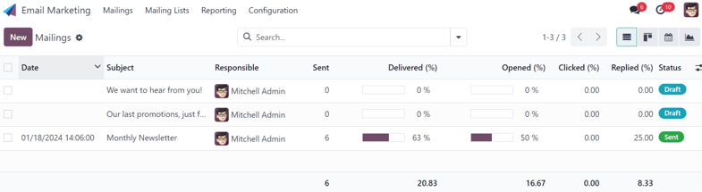

In the search bar, the default filter of :guilabel:`My Mailings` is present to show all the mailings
related to the current user. To remove that filter, click the :guilabel:`✖️ (remove)` icon next to
the filter in the search bar. Doing so reveals all the mailings in the database.

The information on the :guilabel:`Mailings` dashboard has four different view options, located in
the upper-right corner as individual icons.

The view options, from left-to-right, are:

- :ref:`List <email_marketing/list-view>` (default view)
- :ref:`Kanban <email_marketing/kanban-view>`
- :ref:`Calendar <email_marketing/calendar-view>`
- :ref:`Graph <email_marketing/graph-view>`

.. _email_marketing/list-view:

List view
---------

The list view, represented by the :guilabel:`☰ (horizontal lines)` icon in the upper-right corner,
is the default view of the :guilabel:`Mailings` dashboard in the :guilabel:`Email Marketing` app.

While in list view, there are columns dedicated to different aspects of information related to the
listed emails. Those columns are as follows:

- :guilabel:`Date`: the date the email was sent.
- :guilabel:`Subject`: the subject of the email.
- :guilabel:`Responsible`: the user who created the email, or the user who has been assigned to the
  email.
- :guilabel:`Sent`: how many times the email has been sent.
- :guilabel:`Delivered (%)`: percentage of sent emails that have been successfully delivered.
- :guilabel:`Opened (%)`: percentage of sent emails that have been opened by the recipients.
- :guilabel:`Clicked (%)`: percentage of sent emails that have been clicked by the recipients.
- :guilabel:`Replied (%)`: percentage of sent emails that have been replied to by the recipients.
- :guilabel:`Status`: the status of the email (:guilabel:`Draft`, :guilabel:`In Queue`, or
  :guilabel:`Sent`).

To add or remove columns, click the :guilabel:`Additional Options (two horizontal lines with dots)`
icon, located to the far-right of the column titles in list view. Doing so reveals a drop-down menu
of additional column options.

.. _email_marketing/kanban-view:

Kanban view
-----------

The Kanban view, represented by the :guilabel:`(inverted bar graph)` icon, can be accessed in the
upper-right corner of the :guilabel:`Mailings` dashboard in the :guilabel:`Email Marketing` app.

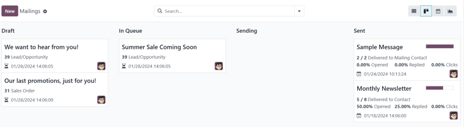

While in Kanban view, the email information is displayed in the various stages.

The stages are: :guilabel:`Draft`, :guilabel:`In Queue`, :guilabel:`Sending`, and :guilabel:`Sent`.

- :guilabel:`Draft`: the email is still being written/created.
- :guilabel:`In Queue`: the email is scheduled to be sent at a later date.
- :guilabel:`Sending`: the email is currently being sent to its recipients.
- :guilabel:`Sent`: the email has already been sent to its recipients.

In each stage, there are drag-and-drop cards representing the emails that have been created/sent,
and the stage they are in represents the current status of that mailing.

Each card on the :guilabel:`Mailings` dashboard provides key information related to that specific
email.

When the cursor hovers over the upper-right corner of an email campaign card, a :guilabel:`⋮ (three
vertical dots)` icon appears. When clicked, a mini drop-down menu reveals the option to color-code
the email, :guilabel:`Delete` the email, or :guilabel:`Archive` the message for potential future
use.

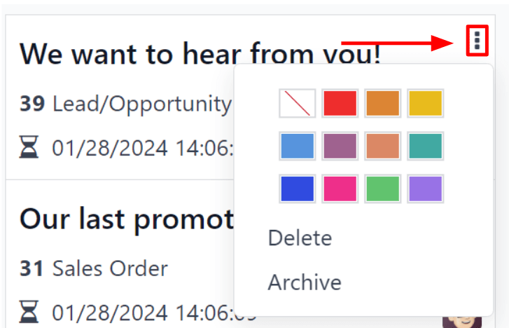

.. _email_marketing/calendar-view:

Calendar view
-------------

The calendar view, represented by a :guilabel:`📆 (calendar)` icon, can be accessed in the
upper-right corner of the :guilabel:`Mailings` dashboard in the :guilabel:`Email Marketing` app.

While in calendar view, a monthly calendar (by default), shows when the mailings have been sent or
are scheduled to be sent.

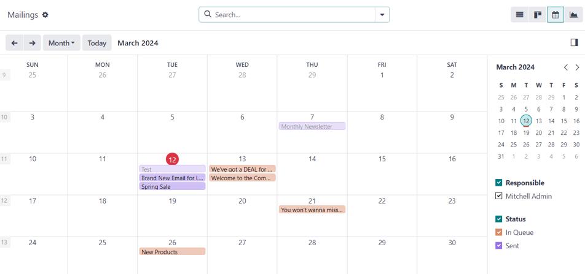

The current date is represented by a :guilabel:`🔴 (red circle)` icon over the date on the calendar.

To the right of the calendar, the options to filter the results by :guilabel:`Responsible` and/or
:guilabel:`Status` are available, via checkboxes.

.. tip::
   To hide the right sidebar, click the :guilabel:`(panel-right)` icon, located above the sidebar.

In the top-left corner, above the calendar, the option to change the time period being displayed is
available via a drop-down menu, which shows :guilabel:`Month`, by default. When clicked, the
drop-down menu that appears reveals the options: :guilabel:`Day`, :guilabel:`Week`,
:guilabel:`Month` (default), :guilabel:`Year`, and :guilabel:`Show weekends` (selected by default).

Clicking any of those options changes the calendar display to reflect that desired amount of time.

Clicking either :guilabel:`⬅️ (left arrow)` icon or :guilabel:`➡️ (right arrow)` icon changes the
calendar to a previous or future time, depending on what is clicked, based on the chosen amount of
time being represented.

To jump back to the current date, click the :guilabel:`Today` button.

.. _email_marketing/graph-view:

Graph view
----------

The graph view, represented by a :guilabel:`(line graph)` icon, can be accessed in the upper-right
corner of the :guilabel:`Mailings` dashboard in the :guilabel:`Email Marketing` app.

While in graph view, the status of the emails on the :guilabel:`Mailings` page is represented in a
bar graph, but other graph view options can be implemented, if needed.

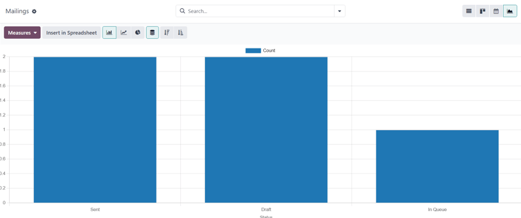

In the upper-left corner, above the graph, there is a :guilabel:`Measures` drop-down menu. When
clicked, different filter options become available to further customize the graph views.

Those :guilabel:`Measures` options are: :guilabel:`A/B Testing percentage` and :guilabel:`Count`
(default).

To the right of the :guilabel:`Measures` drop-down menu is an :guilabel:`Insert in Spreadsheet`
button, if the *Documents* application is installed. When clicked, a pop-up window appears, in which
the ability to add the graph to a spreadsheet or dashboard becomes available.

Beside the :guilabel:`Measures` drop-down menu and :guilabel:`Insert in Spreadsheet` button are
different graph view options. From left-to-right, those graph view options are: :guilabel:`(bar
chart)` (default), :guilabel:`(line chart)`, and :guilabel:`(pie chart)`.

.. note::
   Each graph view option provides its own series of additional view options, which appear to the
   right of the selected graph view option.

Search options
--------------

Regardless of the view chosen for the :guilabel:`Mailings` dashboard in the :guilabel:`Email
Marketing` app, the :guilabel:`Filters`, :guilabel:`Group by`, and :guilabel:`Favorites` options are
always available to further customize the information being displayed.

To access those options, click the :guilabel:`(downward arrow)` icon, located to the right of the
search bar. Doing so reveals a drop-down mega menu featuring those filtering and grouping options.

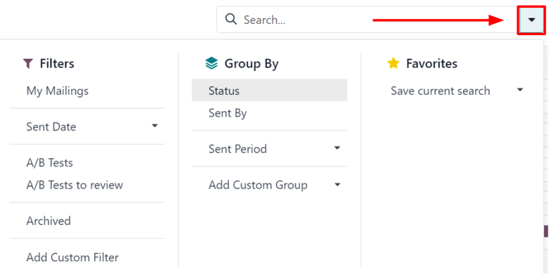

These options provide various ways to specify and organize the information seen on the
:guilabel:`Mailings` dashboard.

.. tabs::

   .. tab:: Filters

      This section of the drop-down mega menu provides different ways to filter email results being
      shown on the :guilabel:`Mailings` dashboard in the :guilabel:`Email Marketing` app.

      .. image:: email_marketing/filters-dropdown.png
         :align: center
         :alt: View of filters drop-down menu options on the Odoo Email Marketing dashboard.

      The options are: :guilabel:`My Mailings`, :guilabel:`Sent Date`, :guilabel:`A/B Tests`,
      :guilabel:`A/B Tests to review`, :guilabel:`Archived`, and :guilabel:`Add Custom Filter`.

      If :guilabel:`Add Custom Filter` is selected, Odoo reveals a pop-up window, with three
      customizable fields to fill in, in order to create custom filter rules for Odoo to use to
      retrieve results that fit more specific criteria.

      .. image:: email_marketing/add-custom-filter-popup.png
         :align: center
         :alt: Add custom filter pop-up window that appears in Odoo Email Marketing app.

   .. tab:: Group By

      This section of the drop-down mega menu provides different ways to group email results being
      shown on the :guilabel:`Mailings` dashboard in the :guilabel:`Email Marketing` app.

      .. image:: email_marketing/group-by-dropdown.png
         :align: center
         :alt: View of the Group By drop-down menu on the Odoo Email Marketing application.

      Using this section, the data can be grouped by the messages' :guilabel:`Status`, or who it was
      :guilabel:`Sent By`.

      There is also the option to group the data by :guilabel:`Sent Period`, which has its own
      sub-menu of options to choose from. The :guilabel:`Sent Period` options are :guilabel:`Year`,
      :guilabel:`Quarter`, :guilabel:`Month`, :guilabel:`Week`, and :guilabel:`Day`.

      If none of the above :guilabel:`Group By` options deliver the desired results, click
      :guilabel:`Add Custom Group` at the bottom of the :guilabel:`Group By` section. Doing so
      reveals a drop-down menu, wherein custom criteria can be selected and applied, thus delivering
      any grouping of data that may be desired.

   .. tab:: Favorites

      This section provides the opportunity to save custom filters and/or groupings for future use.
      To utilize this section, click the :guilabel:`Save current search` field, which reveals
      additional fields.

      .. image:: email_marketing/favorites-dropdown.png
         :align: center
         :alt: View of the Favorites drop-down menu on the Odoo Email Marketing application.

      Give the favorited filter/grouping a title on the blank line above the checkboxes for
      :guilabel:`Default filter` and :guilabel:`Shared`.

      Ticking the box for :guilabel:`Default filter` makes this favorited filter/grouping the
      default option. Ticking the box for :guilabel:`Shared` allows other users to see and use this
      favorited filter/grouping.

      When all desired options are configured, click :guilabel:`Save` to save the filter/grouping in
      the :guilabel:`Favorites` section of the mega drop-down menu.

Settings
========

To view and modify the *Email Marketing* settings, navigate to :menuselection:`Email Marketing app
--> Configuration --> Settings`.

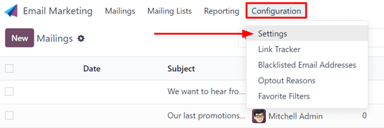

On the :guilabel:`Settings` page, there are four features available.

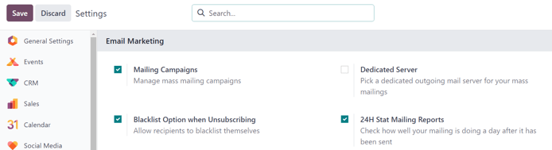

The features are:

- :guilabel:`Mailing Campaigns`: enables the option to manage mass mailing campaigns.
- :guilabel:`Blacklist Option when Unsubscribing`: allows recipients to blacklist themselves from
  future mailings during the unsubscribing process.
- :guilabel:`Dedicated Server`: provides the option to utilize a separate, dedicated server for
  mailings. When enabled, Odoo reveals a new field (and link), in which the specific server
  configurations must be entered, in order for it to connect properly to Odoo.
- :guilabel:`24H Stat Mailing Reports`: allows users to check how well mailings have performed a day
  after it has been sent.

.. _email_marketing/create_email:

Create an email
===============

To create an email, open the :menuselection:`Email Marketing` application, and click the
:guilabel:`New` button in the upper-left corner of the :guilabel:`Mailings` dashboard page.

Clicking :guilabel:`New` reveals a blank email form.

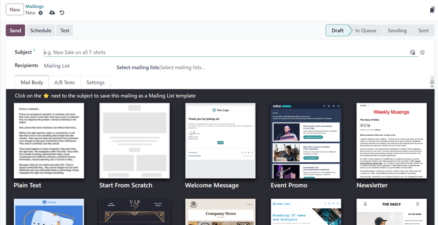

On the email form, there are fields for the :ref:`Subject <email_marketing/subject>` and
:ref:`Recipients <email_marketing/recipients>` of the email.

Beneath that, there are three tabs: :ref:`Mail Body <email_marketing/mail_body>`, :ref:`A/B Tests
<email_marketing/ab_tests>`, and :ref:`Settings <email_marketing/settings_tab>`.

.. _email_marketing/subject:

Subject
-------

First, enter a :guilabel:`Subject` to the email. The :guilabel:`Subject` is visible in the
recipients' inbox, allowing them to quickly see what the message is about.

.. note::
   The :guilabel:`Subject` field is mandatory. An email can **not** be sent without a
   :guilabel:`Subject`.

The :guilabel:`(smiley face with a plus sign)` icon at the end of the :guilabel:`Subject` field
represents emojis that can be added to the :guilabel:`Subject` field. Clicking that icon reveals a
pop-up menu of emojis that can be used.

Beside the :guilabel:`(smiley face with a plus sign)` icon at the end of the :guilabel:`Subject`
field is an empty :guilabel:`(star)` icon. When clicked, the :guilabel:`(star)` icon turns gold, and
the email is saved as a template in the :guilabel:`Mail Body` tab, which can be used again in the
future.

.. _email_marketing/recipients:

Recipients
----------

Beneath the :guilabel:`Subject` field on the email form is the :guilabel:`Recipients` field. In this
field, select the recipients of the email. By default, the :guilabel:`Mailing List` option is
selected, but clicking the field reveals a drop-down menu of other recipient options.

With the default :guilabel:`Mailing List` option selected, a specific mailing list **must** be
chosen from the adjacent :guilabel:`Select mailing lists` field drop-down menu.

.. tip::
   More than one mailing list can be chosen from the :guilabel:`Select mailing lists` field.

Odoo then sends the email to contacts on that specific mailing list(s).

.. seealso::
   :doc:`email_marketing/mailing_lists`

When the :guilabel:`Recipients` field is clicked, a drop-down menu of other options is revealed.
Each option provides different ways Odoo can create a target audience for the email.

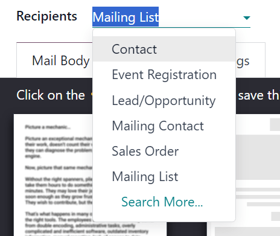

Those options (excluding the default :guilabel:`Mailing List`) provide the option to create a more
specified recipient filter, in an equation-like format, which appears beneath the
:guilabel:`Recipients` field.

The :guilabel:`Recipients` field options, other than the default :guilabel:`Mailing List` option,
are as follows:

- :guilabel:`Contact`: ties specifically to the *Contacts* app, and includes all the contacts
  entered in the database.
- :guilabel:`Event Registration`: ties specifically to the *Events* app, and provides opportunities
  to interact with event registrants, in order to communicate important information about the
  event(s), or nurture other valuable actions, such as post-event surveys, purchases, etc.
- :guilabel:`Lead/Opportunity`: ties specifically to records in the *CRM* application, which opens
  up a number of opportunities to influence sales or purchase decisions.
- :guilabel:`Mailing Contact`: ties specifically to the *Email Marketing* app, and focuses on
  specific mailing contacts that have been entered in that specific application, and are related to
  a specific mailing list. These contacts are also unique because they do *not* have their own
  contact card in the *Contacts* application. This list can be accessed by navigating to
  :menuselection:`Email Marketing app --> Mailing Lists --> Mailing List Contacts`.
- :guilabel:`Sales Order`: ties specifically to the *Sales* app, and focuses on a specific sales
  orders in the database.

Add recipient filter
~~~~~~~~~~~~~~~~~~~~

To add a more specific recipient filter to any :guilabel:`Recipient` option, select any recipient
option (other than :guilabel:`Mailing List`), and click the :guilabel:`Modify filter (right-facing
arrow)` icon beneath the :guilabel:`Recipient` field to reveal three subsequent filter rule fields,
formatted like an equation.

It is highly recommended that users implement detailed targeting criteria for the
:guilabel:`Recipients` field. Typically, a single line of targeting logic is not sufficient enough
for an email campaign.

While the :guilabel:`Mailing List` option is adequate for the :guilabel:`Recipients` field, the
:guilabel:`Lead/Opportunity` and :guilabel:`Event Registration` options provide far more detailed
targeting criteria, which can be added on top of those seed sources.

.. example::
   For example, with the :guilabel:`Lead/Opportunity` option chosen in the :guilabel:`Recipients`
   field, users can add various custom criteria related to :guilabel:`Created on` dates,
   :guilabel:`Stages`, :guilabel:`Tags`, :guilabel:`Lost Reasons`, :guilabel:`Sales Teams`,
   :guilabel:`Active` statuses, :guilabel:`Country`, and so much more.

   .. image:: email_marketing/detailed-filter-records.png
      :align: center
      :alt: View of how recipient filters can be customized in Odoo Email Marketing.

To reveal the sub-menu options within the filter rule fields, click each field, and make the desired
selections, until the preferred configuration has been achieved.

The number of :guilabel:`records` in the database that match the configured rule(s) are indicated
beneath the configured filter rule(s), in green.

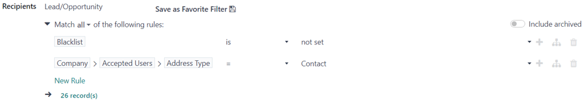

.. note::
   Some sub-menu options in the first rule field allow for a second choice to provide even more
   specificity.

To the right of each rule, there are three additional options, represented by :guilabel:`➕ (plus
sign)`, :guilabel:`(sitemap)`, and :guilabel:`🗑️ (trash)` icons.

- The :guilabel:`➕ (plus sign)` icon adds a new node (line) to the overall targeting logic.
- The :guilabel:`(sitemap)` icon adds a branch to the node. A branch contains two additional,
  indented sub-nodes that are related to that specific rule, providing even more specificity to the
  parent line above it.
- The :guilabel:`🗑️ (trash)` icon deletes a specific node (line) in the array of logic.

.. _email_marketing/mail_body:

Mail Body tab
-------------

In the :guilabel:`Mail Body` tab, there are a number of pre-configured message templates to choose
from.

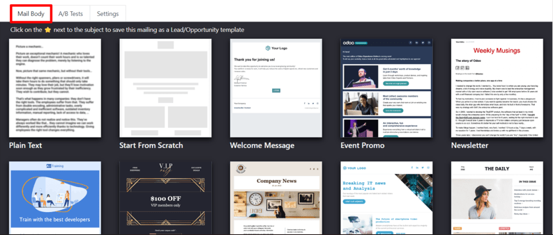

Select the desired template, and proceed to modify every element of its design details with Odoo's
drag-and-drop building blocks, which appear on the right sidebar when a template is chosen.

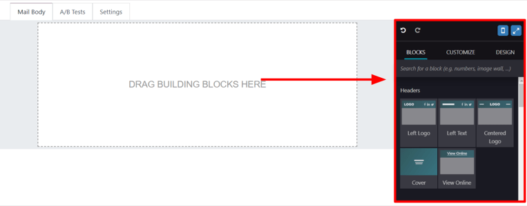

The features on the sidebar used to create and customize emails are separated into three sections:
:guilabel:`Blocks`, :guilabel:`Customize`, and :guilabel:`Design`.

Each building block provides unique features and professional design elements. To use a building
block, drag-and-drop the desired block element onto the body of the email being built. Once dropped,
various aspects of the building block can be customized.

.. tip::
   To build an email from the ground up, without any building block elements, select the
   :guilabel:`Plain Text` template. When selected, Odoo provides a completely blank email canvas,
   which can be customized in a number of way using the front-end rich text editor that accepts
   forward slash `/` commands.

   When `/` is typed into the blank body of the email, while using a :guilabel:`Plain Text`
   template, a drop-down menu of various design elements appears, which can be used to create the
   desired email design.

   .. image:: email_marketing/template-blank-slash.png
      :align: center
      :alt: View of the rich text editor drop-down in the Odoo Email Marketing application.

.. _email_marketing/ab_tests:

A/B Tests tab
-------------

Initially, when the :guilabel:`A/B Tests` tab is opened on an email form, the only option available
is :guilabel:`Allow A/B Testing`. This is **not** a required option.

If this option is enabled, recipients are only mailed *once* for the entirety of the campaign.

This allows the user to send different versions of the same mailing to randomly selected recipients
to gauge the effectiveness of various designs, formats, layouts, content, and so on -- without any
duplicate messages being sent.

When the checkbox beside :guilabel:`Allow A/B Testing` is ticked, an :guilabel:`on (%)` field
appears, in which the user determines the percentage of the pre-configured recipients that are going
to be sent this current version of the mailing as part of the test.

.. note::
   The default figure in the :guilabel:`on (%)` field is `10`, but that figure can be changed at any
   time.

Beneath that, two additional fields appear:

The :guilabel:`Winner Selection` field provides a drop-down menu of options, wherein the user
decides what criteria should be used to determine the "winning" version of the email tests that are
sent.

The options in the :guilabel:`Winner Selection` field are as follows:

- :guilabel:`Manual`: allows the user to determine the "winning" version of the mailing. This option
  removes the :guilabel:`Send Final On` field.
- :guilabel:`Highest Open Rate` (default): the mailing with the highest open rate is determined to
  be the "winning" version.
- :guilabel:`Highest Click Rate`: the mailing with the highest click rate is determined to be the
  "winning" version.
- :guilabel:`Highest Reply Rate`: the mailing with the highest reply rate is determined to be the
  "winning" version.
- :guilabel:`Leads`: the mailing with the most leads generated is determined to be the "winning"
  version.
- :guilabel:`Quotations`: the mailing with the most quotations generated is determined to be the
  "winning" version.
- :guilabel:`Revenues`: the mailing with the most revenue generated is determined to be the
  "winning" version.

The :guilabel:`Send Final On` field allows users to choose a date that is used to know *when* Odoo
should determine the "winning" email, and subsequently, send that version of the email to the
remaining recipients.

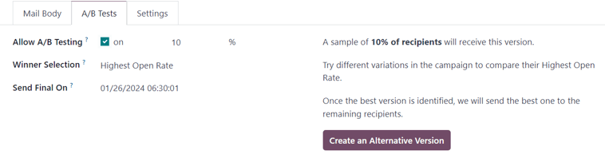

To the right of those fields is a :guilabel:`Create an Alternative Version` button. When clicked,
Odoo presents a new :guilabel:`Mail Body` tab for the user to create an alternate version of the
email to test.

.. _email_marketing/settings_tab:

Settings tab
------------

The options present in the :guilabel:`Settings` tab of the mail form are divided into two sections:
:guilabel:`Email Content` and :guilabel:`Tracking`.

.. note::
   The options available in the :guilabel:`Settings` tab vary depending on if the *Mailing
   Campaigns* feature is activated in :menuselection:`Email Marketing --> Configuration -->
   Settings`. See :ref:`email_marketing/mailing-campaigns` for more information.

Without the *Mailing Campaigns* feature activated, the :guilabel:`Settings` tab on the email form
only contains the :guilabel:`Preview Text`, :guilabel:`Send From`, :guilabel:`Reply To`,
:guilabel:`Attachments`, and :guilabel:`Responsible` fields.

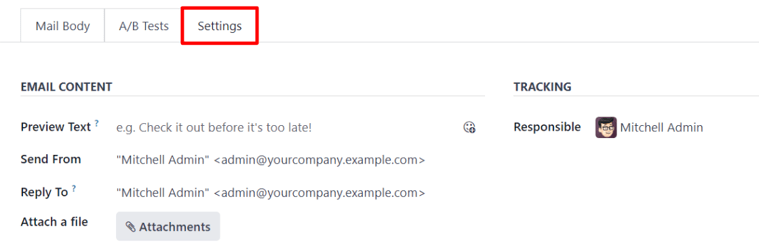

Email content
~~~~~~~~~~~~~

- :guilabel:`Preview Text`: allows the user to enter a preview sentence to encourage recipients to
  open the email. In most inboxes, this is displayed next to the subject. If left empty, the first
  characters of the email content appear, instead. The ability to add an emoji in this field is
  available, as well, via the :guilabel:`(smiley face with a plus sign)` icon.
- :guilabel:`Send From`: designate an email alias that displays as the sender of this particular
  email.
- :guilabel:`Reply To`: designate an email alias to whom all the replies of this particular email
  are sent.
- :guilabel:`Attach a file`: if any specific files are required (or helpful) for this email, click
  the :guilabel:`Attachments` button, and upload the desired file(s) to the email.

Tracking
~~~~~~~~

- :guilabel:`Responsible`: designate a user in the database to be responsible for this particular
  email.

.. note::
   If the *Mailing Campaign* feature *is* activated, an additional :guilabel:`Campaign` field
   appears in the :guilabel:`Tracking` section of the :guilabel:`Settings` tab.

   .. image:: email_marketing/settings-tab-with-campaign.png
      :align: center
      :alt: View of settings tab in Odoo Email Marketing when campaign setting is activated.

   The additional :guilabel:`Campaign` field allows users to attach this particular email to a
   mailing campaign, if desired.

   If the desired campaign is not available in the initial drop-down menu, select :guilabel:`Search
   More` to reveal a complete list of all mailing campaigns in the database.

   Or, type the name of the desired mailing campaign in the :guilabel:`Campaign` field, until Odoo
   reveals the desired campaign in the drop-down menu. Then, select the desired campaign.

Send, schedule, test
====================

Once the mailing is finalized, the following options can be utilized, via buttons located in the
upper-left corner of the email form: :ref:`Send <email_marketing/send>`, :ref:`Schedule
<email_marketing/schedule>`, and :ref:`Test <email_marketing/test>`.

.. _email_marketing/send:

Send
----

The :guilabel:`Send` button reveals a :guilabel:`Ready to unleash emails?` pop-up window.

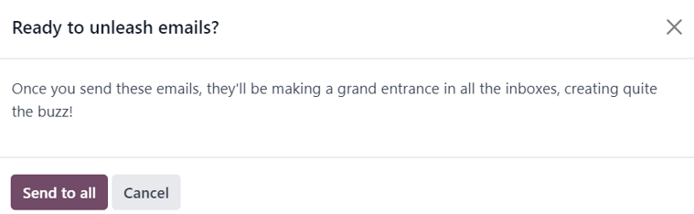

When the :guilabel:`Send to all` button is clicked, Odoo sends the email to the desired recipients.
Once Odoo has sent the mailing, the status changes to :guilabel:`Sent`.

.. _email_marketing/schedule:

Schedule
--------

The :guilabel:`Schedule` button reveals a :guilabel:`When do you want to send your mailing?` pop-up
window.

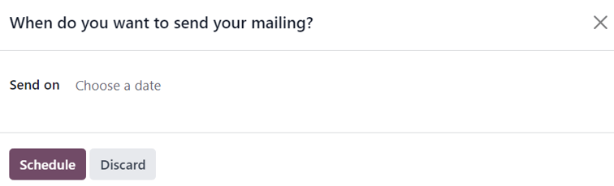

In this pop-up window, click the :guilabel:`Send on` field to reveal a calendar pop-up window.

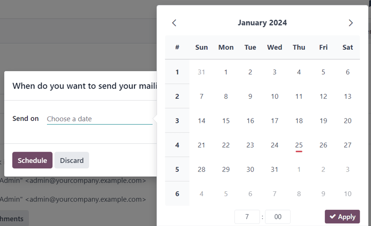

From the calendar pop-up window, select the future date and time for Odoo to send this email. Then,
click :guilabel:`✔️ Apply`. When a date and time are chosen, click the :guilabel:`Schedule` button,
and the status of the mailing changes to :guilabel:`In Queue`.

.. _email_marketing/test:

Test
----

The :guilabel:`Test` button reveals a :guilabel:`Test Mailing` pop-up window.

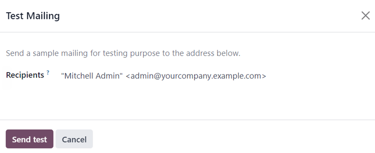

From this pop-up window, enter the email addresses of the contacts to whom Odoo should send this
test email in the :guilabel:`Recipients` field. Multiple contacts can be added in this field, if
desired.

Once all the desired email addresses have been entered in the :guilabel:`Recipients` field, click
the :guilabel:`Send Test` button.

.. warning::
   By default, there's a daily limit applied for **all emails** sent throughout **all
   applications**. So, if there are remaining emails to be sent after a limit has been reached,
   those mailings are **not** sent automatically the next day. The sending needs to be forced, by
   opening the email and clicking :guilabel:`Retry`.

.. _email_marketing/mailing-campaigns:

Mailing campaigns
=================

The *Email Marketing* application provides users with the ability to build mailing campaigns.

In order to create and customize mailing campaigns, the *Mailing Campaigns* feature **must** be
activated in the *Settings* page of the *Email Marketing* application. To do that, navigate to
:menuselection:`Email Marketing app --> Configuration --> Settings`, tick the box beside
:guilabel:`Mailing Campaigns`, and click the :guilabel:`Save` button.

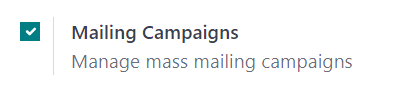

Once the :guilabel:`Mailing Campaigns` feature is activated, a new :guilabel:`Campaigns` menu option
appears in the header.

When that is clicked, Odoo reveals a separate :guilabel:`Campaigns` page, displaying all the mailing
campaigns in the database, and the current stage they are in, showcased in a default Kanban view.

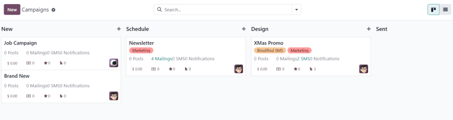

.. note::
   This information can also be viewed in a list, by clicking the :guilabel:`☰ (horizontal lines)`
   icon in the upper-right corner.

Clicking any campaign from the :guilabel:`Campaigns` page reveals that campaign's form.

There are two different ways to create and customize campaigns in the *Email Marketing* application,
either directly from the :ref:`Campaigns page <email_marketing/campaign-page>` or through the
:ref:`Settings tab <email_marketing/campaign-settings>` on an email form.

.. _email_marketing/campaign-page:

Create mailing campaign (from campaigns page)
---------------------------------------------

When the *Mailing Campaigns* feature is activated, a new *Campaigns* option appears in the header of
the *Email Marketing* application. Campaigns can be created directly on the *Campaigns* page in the
*Email Marketing* app.

To do that, navigate to :menuselection:`Email Marketing app --> Campaigns --> New`.

Kanban view
~~~~~~~~~~~

When the :guilabel:`New` button is clicked in the default Kanban view on the :guilabel:`Campaigns`
page, a Kanban card appears in the :guilabel:`New` stage.

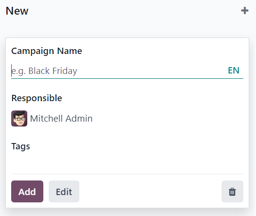

New campaign cards can also be made by clicking the :guilabel:`➕ (plus sign)` at the top of any
Kanban stage on the :guilabel:`Campaigns` page.

When the new campaign Kanban card appears, the options to enter a :guilabel:`Campaign Name`, a
:guilabel:`Responsible`, and :guilabel:`Tags` become readily available.

To add the campaign to the Kanban stage, click the :guilabel:`Add` button.

To delete the campaign, click the :guilabel:`🗑️ (trash can)` icon.

To further customize the campaign, click the :guilabel:`Edit` button, which reveals the campaign
form for additional modifications.

.. note::
   A :guilabel:`Campaign Name` **must** be entered in the Kanban card, in order for the
   :guilabel:`Edit` button to reveal the campaign form for further modifications.

List view
~~~~~~~~~

To enter the list view on the :guilabel:`Campaigns` page, click the :guilabel:`☰ (horizontal lines)`
icon in the upper-right corner. Doing so reveals all campaign information in a list format.

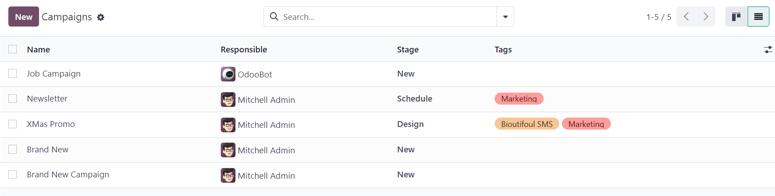

To create a campaign from the :guilabel:`Campaigns` page while in list view, click the
:guilabel:`New` button. Doing so reveals a blank campaign form.

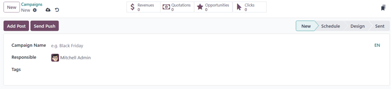

From this campaign form, a :guilabel:`Campaign Name`, a :guilabel:`Responsible`, and
:guilabel:`Tags` can be added.

At the top of the form, various metric-related smart buttons can be seen that showcase specific
analytics related to the campaign. Those smart buttons are: :guilabel:`Revenues`,
:guilabel:`Quotations`, :guilabel:`Opportunities`, and :guilabel:`Clicks`.

.. note::
   Once a :guilabel:`Campaign Name` is entered and saved, additional buttons appear at the top of
   the campaign form.

   Those additional buttons are: :guilabel:`Send Mailing` and :guilabel:`Send SMS`.

Campaign form
-------------

On the campaign form (after clicking :guilabel:`Edit` from the Kanban card, or selecting an existing
campaign from the :guilabel:`Campaigns` page) there are additional options and metrics available.

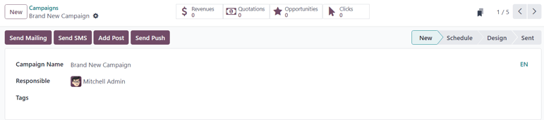

At the top of the form, various smart buttons can be seen that showcase specific analytics related
to the campaign. Those smart buttons are: :guilabel:`Revenues`, :guilabel:`Quotations`,
:guilabel:`Opportunities`, and :guilabel:`Clicks`.

There are also buttons to :guilabel:`Send Mailing`, :guilabel:`Send SMS`, :guilabel:`Add Post`, and
:guilabel:`Add Push` (push notification).

.. note::
   If the :guilabel:`Send Mailing` and :guilabel:`Send SMS` buttons are not readily available, enter
   a :guilabel:`Campaign Name`, then save (either manually or automatically). Doing so reveals those
   buttons.

The status of the campaign can be viewed in the upper-right corner of the campaign form, as well.

.. _email_marketing/campaign-settings:

Create mailing campaign (from settings tab)
-------------------------------------------

To create a new campaign from the :guilabel:`Settings` tab of a mailing form, click the
:guilabel:`Campaign` field, and start typing the name of the new campaign. Then, select either
:guilabel:`Create "[Campaign Name]"` or :guilabel:`Create and edit...` from the drop-down menu that
appears.

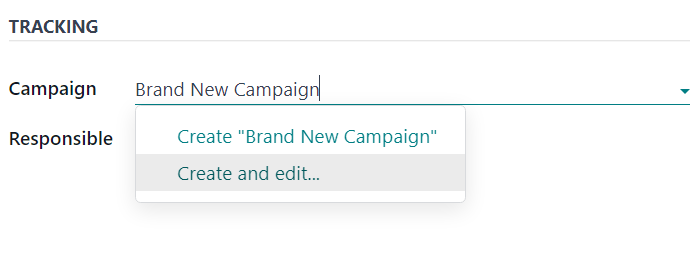

Select :guilabel:`Create` to add this new mailing campaign to the database, and modify its settings
in the future.

Select :guilabel:`Create and Edit...` to add this new mailing campaign to the database, and reveal a
:guilabel:`Create Campaign` pop-up window.

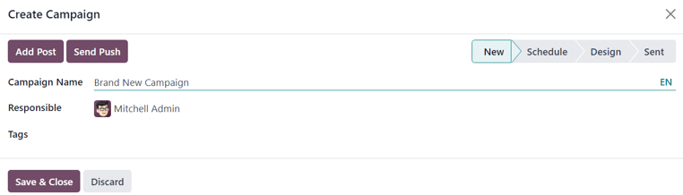

Here, the new mailing campaign can be further customized. Users can adjust the :guilabel:`Campaign
Name`, assign a :guilabel:`Responsible`, and add :guilabel:`Tags`.

Buttons to :guilabel:`Add Post` or :guilabel:`Send Push` (push notifications) are also available.

There is also a status located in the upper-right corner of the :guilabel:`Create Campaign` pop-up
window.

When all modifications are ready to be finalized, click :guilabel:`Save & Close`. To delete the
entire campaign, click :guilabel:`Discard`.

.. seealso::
   - :doc:`email_marketing/mailing_lists`
   - :doc:`email_marketing/unsubscriptions`
   - :doc:`email_marketing/lost_leads_email`
   - :doc:`email_marketing/analyze_metrics`

.. toctree::
   :titlesonly:

   email_marketing/mailing_lists
   email_marketing/unsubscriptions
   email_marketing/lost_leads_email
   email_marketing/analyze_metrics
