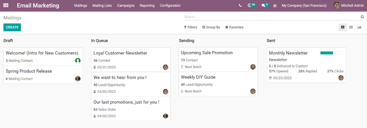
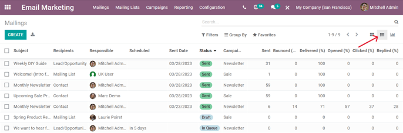
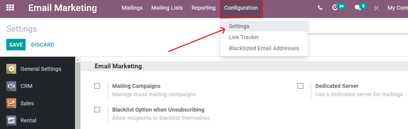
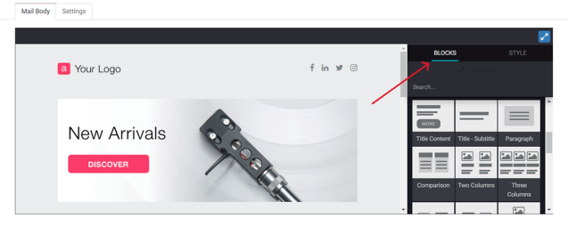
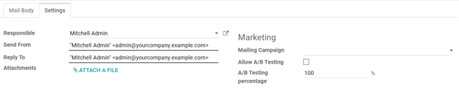
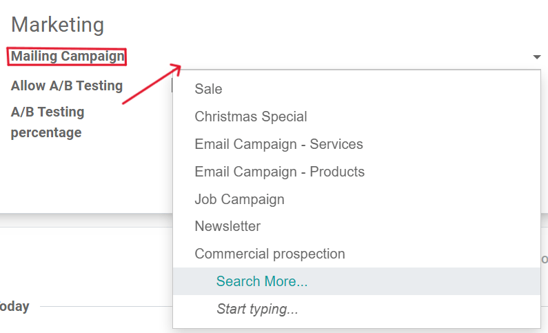
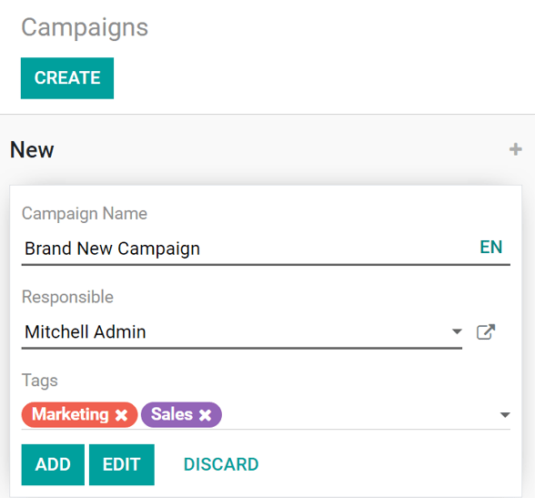

:show-content:
:show-toc:

===============
Email marketing
===============

Emails are an effective, fully-customizable form of communication that are able to reach any target
audience - large or small. The success of an email is easily measurable, especially when a creative
call-to-action is involved.

Odoo *Email Marketing* provides professional-grade email design tools, templates, and features,
designed to simplify the otherwise complex process required to create engaging emails, build
successful campaigns, and track their overall effectiveness in a single application.

.. seealso::
   - :doc:`/applications/marketing/email_marketing/mailing_lists`
   - :doc:`/applications/marketing/email_marketing/unsubscriptions`

Email marketing dashboard
=========================

To get started, click on the :menuselection:`Email Marketing` app icon, located on the main Odoo
dashboard, which leads to the main :guilabel:`Email Marketing` dashboard (in the default kanban
view).

To see all the mailings in the database, remove the default :guilabel:`My Mailings` filter from the
search bar.

.. note::
   In the search bar, by default, the filter: :guilabel:`My Mailings` is present. That means the
   only information being seen (at that time) on the :guilabel:`Email Marketing` dashboard are
   emails that the current user has created, sent, or is responsible for.

   This filter can be removed by clicking the :guilabel:`X` next to :guilabel:`My Mailings` in the
   search bar. Doing so, reveals all the information for every email in the database.

Default kanban view and stages
------------------------------

The four kanban columns each represent the various stages of emails that have been built or sent
within the *Email Marketing* application.

The stages are: :guilabel:`Draft`, :guilabel:`In Queue`, :guilabel:`Sending`, :guilabel:`Sent`.

- :guilabel:`Draft`: means the email is still being written/created.
- :guilabel:`In Queue`: means the email is scheduled, and sent at a later date.
- :guilabel:`Sending`: means the email is currently being sent to its recipients.
- :guilabel:`Sent`: means the email has already been sent to its recipients.

In each stage, there are drag-and-drop cards representing the email campaigns that have been
created, and the stage they are in represents the current status of that mailing.

Each mailing block on the :guilabel:`Email Marketing` dashboard provides key information related to
that specific email.

When the cursor hovers over the upper-right corner of an email campaign card, three vertical dots
(:guilabel:`⋮`) appear. When clicked, a mini drop-down menu reveals the option to color-code the
email :guilabel:`Delete` the email altogether, or :guilabel:`Archive` the message for potential
future use.

.. image:: email_marketing/three-dot-dropdown.png
   :align: center
   :alt: View of the three-dot drop-down menu on the Odoo Email Marketing dashboard.

In the upper-right corner of the main :guilabel:`Email Marketing` dashboard, there are other view
options to choose from: :guilabel:`List` and :guilabel:`Graph`.

List view
---------

The :guilabel:`List` view (represented by the :guilabel:`☰ (three vertical lines)` icon) provides
the same key information, but in a classic list format.

Graph view
----------

The :guilabel:`Graph` view (represented by the :guilabel:`📊 (bar graph)` icon) provides the same
key information, but in a variety of customizable graph (and chart) layouts.

.. image:: email_marketing/graph-view.png
   :align: center
   :alt: How the Graph view appears in the Odoo Email Marketing application.

In the upper-left corner, there is a :guilabel:`Measures`  menu, providing even more filter options
to further customize the graph views.

Those :guilabel:`Measures` options are: :guilabel:`A/B Testing percentage`, :guilabel:`Color Index`,
and :guilabel:`Count` (which is selected, by default).

Filters, Group By, and Favorites search options
-----------------------------------------------

Regardless of the view chosen for the :guilabel:`Email Marketing` dashboard, the
:guilabel:`Filters`, :guilabel:`Group by`, and :guilabel:`Favorites` options are always available.

These options provide various ways to specify and organize the information seen on the
:guilabel:`Email Marketing` dashboard.

.. tabs::

   .. tab:: Filters

      This drop-down menu provides different ways to filter email campaigns on the dashboard. The
      options are: :guilabel:`My Mailings`, :guilabel:`Sent Date`, :guilabel:`Archived`, and
      :guilabel:`Add Custom Filter`. If :guilabel:`Add Custom Filter` is selected, Odoo reveals an
      additional drop-down menu, with three customizable fields to fill in, in order to retrieve
      results that fit more specific criteria.

      .. image:: email_marketing/filters-dropdown.png
         :alt: View of filters drop-down menu options on the Odoo Email Marketing dashboard.

   .. tab:: Group By

      This drop-down menu provides additional ways to organize the data on the dashboard by grouping
      them in specific ways. Using this drop-down menu, the data can be grouped by the messages'
      :guilabel:`Status`, or who it was :guilabel:`Sent By`.

      There is also the option to group the data by :guilabel:`Sent Period`, which has its own
      sub-menu of options to choose from. The :guilabel:`Sent Period` options are :guilabel:`Year`,
      :guilabel:`Quarter`, :guilabel:`Month`, :guilabel:`Week`, and :guilabel:`Day`.

      If none of the above :guilabel:`Group By` options deliver the desired results, click
      :guilabel:`Add Custom Group` at the bottom of the drop-down menu. Doing so reveals a new
      field, wherein custom criteria can be selected and applied, thus delivering any grouping of
      data that may be desired.

      .. image:: email_marketing/group-by-dropdown.png
         :alt: View of the Group By drop-down menu on the Odoo Email Marketing application.

   .. tab:: Favorites

      This drop-down menu provides different ways to incorporate past search filters and other
      record-related options to customize the dashboard. The options are: :guilabel:`Save current
      search`, :guilabel:`Import records`, :guilabel:`Add to my dashboard`, and :guilabel:`Add to
      Google Spreadsheet`.

      .. image:: email_marketing/favorites-dropdown.png
         :alt: View of the Favorites drop-down menu on the Odoo Email Marketing application.

Settings
========

To view (and modify) the *Email Marketing* settings, navigate to :menuselection:`Email Marketing
application --> Configuration --> Settings`.

On this :guilabel:`Settings` page, there are three features available. The features are:
:guilabel:`Mailing Campaigns`, :guilabel:`Blacklist Option when Unsubscribing`, and
:guilabel:`Dedicated Server`.

- :guilabel:`Mailing Campaigns`: enables the option to manage mass mailing campaigns.
- :guilabel:`Blacklist Option when Unsubscribing`: allows recipients to blacklist themselves from
  future mailings during the unsubscribing process.
- :guilabel:`Dedicated Server`: provides the option to utilize a separate, dedicated server for
  mailings. When enabled, Odoo reveals a new field (and link), in which the specific server
  configurations must be entered, in order for it to connect properly to Odoo.

Create an email
===============

To create an email, open the :menuselection:`Email Marketing` application, and click the
:guilabel:`Create` button in the upper-left corner.

Clicking :guilabel:`Create` reveals a blank email detail form.

.. image:: email_marketing/blank-email-detail-form.png
   :align: center
   :alt: View of a blank email detail form in Odoo Email Marketing application.

First, enter a :guilabel:`Subject` to the email. The :guilabel:`Subject` is visible in the
recipients' inbox, allowing them to get quickly see what the message is about.

.. note::
   The :guilabel:`Subject` field is mandatory. An email can not be sent without a
   :guilabel:`Subject`.

.. tip::
   The :guilabel:`☺ (smiley face)` icon at the end of the :guilabel:`Subject` field (and
   :guilabel:`Preview Text` field) represents emojis. Click that :guilabel:`☺ (smiley face)` icon to
   reveal a menu of emojis that can be used in either field.

Next, there is the option to enter some :guilabel:`Preview Text`. This text is a catchy preview
sentence that encourages recipients to open the message. In most inboxes, this is displayed next to
the subject.

.. tip::
   Keep the :guilabel:`Preview Text` empty to show the first characters of the email content,
   instead.

Recipients
----------

After that, it's time to choose the recipients of this email, which can be completed in the
:guilabel:`Recipients` field.

.. image:: email_marketing/recipients-dropdown.png
   :align: center
   :alt: View of recipients drop-down menu in the Odoo Email Marketing application.

The default option is :guilabel:`Mailing List`. If :guilabel:`Mailing List` option is selected, a
specific :guilabel:`Mailing List` needs to be chosen from the adjacent :guilabel:`Select mailing
lists` field drop-down menu.

Then, Odoo will only send this email to contacts on that specific mailing list.

.. seealso::
   :doc:`/applications/marketing/email_marketing/mailing_lists`

When the :guilabel:`Recipients` field is clicked, a drop-down menu of other options is revealed.
Each option provides different ways Odoo can create a target audience for the email.

Those options (excluding the default :guilabel:`Mailing List`) provide the option to create a more
specified recipient filter, in an equation-like format.

The :guilabel:`Recipients` field options are as follows:

- :guilabel:`Applicant`: filter focuses on specific job applicants in the database.
- :guilabel:`Contact`: filter focuses on specific contacts in the database.
- :guilabel:`Event Registration`: filter focuses on people in the database who purchased event
  registrations.
- :guilabel:`Event Track`: filter focuses on people in the database who hosted a specific talk
  (track) at an event.
- :guilabel:`Lead/Opportunity`: filter focuses on leads or opportunities in the database.
- :guilabel:`Mailing Contact`: filter focuses on specific mailing contacts in the database.
- :guilabel:`Sales Order`: filter focuses on a specific sales orders in the database.

If the specified recipient fields don't automatically reveal themselves, simply click the
:guilabel:`Add Filter` button beneath the :guilabel:`Recipients` field, and Odoo reveals the
necessary equation fields to further drill down the target recipients for this mailing.

Add a recipient filter
----------------------

To add a more specified recipient filter, select any recipient option (other than :guilabel:`Mailing
List`), and clicking :guilabel:`Add Filter`, if needed, to reveal three fields, formatted like an
equation.

To reveal the sub-menu options, click each field, and make the desired selections, until the
preferred configuration has been achieved. The number of :guilabel:`Records` that match the rule(s)
are indicated to the right of the :guilabel:`Recipients` field, in green.

.. image:: email_marketing/add-filter-button.png
   :align: center
   :alt: View of how recipient filters can be customized in Odoo Email Marketing.

.. note::
   Some sub-menu options in the first rule field allow for a second choice to provide even more
   specificity.

To the right of each rule, are :guilabel:`× (Delete node)`, :guilabel:`＋ (Add node)`, and
:guilabel:`⋯ (Add branch)` icons.

The :guilabel:`× (Delete node)` icon deletes a specific node (line) of the rule. The :guilabel:`＋
(Add node)` icon adds a node (line) to the rule. And, the :guilabel:`⋯ (Add branch)` icon adds a
branch to the node. A branch means two additional, indented sub-nodes are added to the rule,
providing even more specificity to the line above it.

Mail body tab
-------------

At the bottom of the email form are two tabs: :guilabel:`Mail Body` and :guilabel:`Settings`. Let's
focus on :guilabel:`Mail Body` tab first.

In the :guilabel:`Mail Body` tab, there are a number of pre-configured message templates to choose
from. Select the desired template, and modify every element of its design details with Odoo's
drag-and-drop building blocks, located on the right sidebar. Each building block provides unique
features and professional design elements.

.. tip::
   To build an email from scratch, select the :guilabel:`Plain Text` template, and Odoo provides a
   blank email canvas, which can be customized in a number of ways - either by using the front-end
   rich text editor that accepts slash (:guilabel:`/`) commands, or with the XML code editor when
   :ref:`Developer Mode (debug mode) <developer-mode>` is engaged, and the :guilabel:`</>` icon is
   clicked.

Settings tab
------------

To the right of the :guilabel:`Mail Body` tab is the :guilabel:`Settings` tab.

.. note::
   The options available in the :guilabel:`Settings` tab will be different, depending on if the
   :guilabel:`Mailing Campaigns` feature is activated in the :guilabel:`Settings` page of the
   :menuselection:`Email Marketing` application (:menuselection:`Email Marketing --> Configuration
   --> Settings`).

Without the :guilabel:`Mailing Campaigns` feature activated, the :guilabel:`Settings` tab on the
email detail form looks like this:

.. image:: email_marketing/settings-without-features.png
   :align: center
   :alt: View of settings tab in Odoo Email Marketing app, without settings activated.

- :guilabel:`Responsible`: choose an employee (in the database) to be responsible for this
  particular email.
- :guilabel:`Send From`: designate an email alias that'll display as the sender of this particular
  email.
- :guilabel:`Reply To`: designate an email alias to whom all the replies to this particular email
  will be sent.
- :guilabel:`Attachments`: if any specific documents are required (or helpful) for this event
  invite, they can be sent along with this email, by clicking :guilabel:`ATTACH A FILE`, and adding
  the appropriate document(s).

When the :guilabel:`Mailing Campaigns` feature *is* activated, additional :guilabel:`Marketing`
options appear in the :guilabel:`Settings` tab, which look like this:

The additional features are: :guilabel:`Mailing Campaign`, :guilabel:`Allow A/B Testing`, and
:guilabel:`A/B Testing percentage`.

Mailing campaigns
=================

The :guilabel:`Mailing Campaign` field provides the option to add this particular email to a
previously-made email campaign in the database. Click the empty field to reveal a drop-down menu
containing all previously-made mailing campaigns in the database.

If the desired campaign isn't available in the initial drop-down menu, select :guilabel:`Search
More` to reveal a complete list of all mailing campaigns in the database. Or, type the name of the
desired mailing campaign in the :guilabel:`Mailing Campaign` field, until Odoo reveals the desired
campaign in the drop-down menu. Then, select the desired campaign.

Create new mailing campaign (from Settings tab)
-----------------------------------------------

To create a new campaign from this :guilabel:`Mailing Campaign` field, start typing the name of this
new campaign, and select :guilabel:`Create [Campaign Name]` or :guilabel:`Create and Edit...`.

Click :guilabel:`Create` to add this new mailing campaign to the database, and modify its settings
in the future. And click :guilabel:`Create and Edit...` to add this new mailing campaign to the
database, and Odoo reveals a pop-up window.

.. image:: email_marketing/mailing-campaign-popup.png
   :align: center
   :alt: View of the email mailing campaign pop-up window in Odoo Email Marketing application.

Here, the new mailing campaign can be further customized. Adjust the :guilabel:`Campaign Name`,
assign a :guilabel:`Responsible`, and add :guilabel:`Tags`.

The top row of the :guilabel:`Create: Mailing Campaign` pop-up window is filled with analytical
smart buttons. Each of which displays various metrics related to the campaign. When clicked, Odoo
reveals a separate, more detailed page with even more in-depth statistics.

The option to instantly a new communication from this pop-up window is available in the upper-left
corner. The adjustable status bar is located in the upper-right.

When all modifications are ready to be finalized, click :guilabel:`Save`. To delete the entire
campaign, click :guilabel:`Discard`.

Create new mailing campaign (from Campaigns page)
-------------------------------------------------

When the :guilabel:`Mailing Campaigns` feature is activated, a new :guilabel:`Campaigns` option
appears in the header of the *Email Marketing* application. Campaigns can also be created on this
:guilabel:`Campaigns` page in the *Email Marketing* app.

To do that, navigate to :menuselection:`Email Marketing app --> Campaigns --> Create`. When that's
clicked, a pop-up window appears, in which the :guilabel:`Campaign Name`, :guilabel:`Responsible`,
and :guilabel:`Tags` can be added directly on the :guilabel:`Campaigns` dashboard.

Click :guilabel:`Add` to add the campaign to the database, and freely edit it later on. Or, click
:guilabel:`Edit` and Odoo reveals the campaign template form on a separate page, providing the
opportunity to further edit the campaign, send communications related to the campaign, and analyze
various metrics related to the campaign, via the smart buttons at the top of the form.

A/B testing
===========

Back in the :guilabel:`Settings` tab of the mailing, if the :guilabel:`Allow A/B Testing` box is
checked, recipients are only be mailed to once. This allows different mailings to be sent to
randomly selected recipients. This tests the overall effectiveness of the mailing, and eliminates
the need for duplicate messages.

The :guilabel:`A/B Testing percentage` field represents the percentage of contacts in the database
that this message will be mailed to, as a part of the :guilabel:`A/B Testing`. Enter a number
between `1-100`. The recipients are randomly chosen.

Send, schedule, or test
=======================

After finalizing the mailing, Odoo provides the following options in the upper-left corner of the
email template page. Those options are: :guilabel:`Send`, :guilabel:`Schedule`, and
:guilabel:`Test`.

While in :guilabel:`Edit` mode, there are also buttons to :guilabel:`Save` or :guilabel:`Discard`
the mailing, as well.

- :guilabel:`Send` - Click to have Odoo send the email to the desired recipients. When Odoo has sent
  the mailing, the status changes to *Sent*.
- :guilabel:`Schedule` - Click to reveal a pop-up window, in which a future date-time is chosen.
  Odoo sends the mailing to the desired recipients at that specified date-time. When a date-time is
  chosen, the status of the mailing changes to *In Queue*.
- :guilabel:`Test` - Click to reveal a pop-up window, in which Odoo allows a sample email to be sent
  for testing purposes. Enter the desired recipient's email address in the :guilabel:`Recipients`
  field, and click :guilabel:`Send Sample Mail`.
- :guilabel:`Save` - Click to save the mailing as a draft, which can be edited (and sent) at a later
  date. When clicked, the status of the mailing stays as :guilabel:`Draft`.
- :guilabel:`Discard` - Click to discard any changes that have been made since the last save.

.. tip::
   When :guilabel:`Save` or :guilabel:`Discard` is selected (while in :guilabel:`Edit` mode), those
   options are replaced with an :guilabel:`Edit` button and a :guilabel:`Create` button. Click
   :guilabel:`Edit` to re-enter :guilabel:`Edit` mode. Click :guilabel:`Create` to start creating a
   new mailing.

.. note::
   By default, there's a daily limit applied for **all emails** sent throughout *all* applications.
   So, if there are remaining emails to be sent after a limit has been reached, those mailings *will
   not* be sent automatically the next day. The sending needs to be forced, by opening the email and
   clicking :guilabel:`Retry`.

.. toctree::
   :titlesonly:

   email_marketing/mailing_lists
   email_marketing/unsubscriptions
