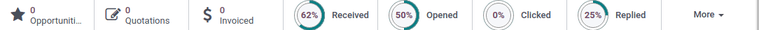

===============
Analyze metrics
===============

.. |CTR| replace:: :abbr:`CTR (Click through rate)`

In order to properly understand the success or failure of an email marketing campaign, it is
necessary to monitor several key metrics. The insights gained from these metrics can then be used to
optimize future campaigns. Odoo's *Email Marketing* application tracks several :ref:`key metrics
<email-marketing/key-metrics>`, that can be interpreted to improve future campaigns.

View metrics
============

After a mass mail has been sent, the results for that particular mailing are displayed in multiple
locations.

To access the metrics for an individual mailing, navigate to :menuselection:`Email Marketing app
--> Mailings`. Locate the specific mailing in the list view, and use the column headings to view the
results for that mailing. Click on one of the mailings in the list to open the record. At the top of
the record, detailed metrics are displayed as smart buttons.

.. tip::
   Click on the smart buttons to see the recipient records for each metric.

.. _email-marketing/key-metrics:

Opened rate
-----------

The *Opened* rate measures the percentage of emails opened by recipients against the total number of
sent emails.

A high open rate may indicate that the subject line was timely, compelling, and successfully
prompted the recipients to view the message.

A low open rate may indicate the subject line failed to capture the recipients' interest. It could
also indicate the email ended up in a spam or junk folder due to having a poor sender reputation or
failing to :doc:`configure the proper DNS records <../../general/email_communication/email_domain>`.

Replied rate
------------

The *Replied* rate measures the percentage of recipients who responded to the email directly against
the total number of sent emails.

A high replied rate may indicate the email resonated with recipients, prompting them to take action
or provide feedback.

A low replied rate may suggest that the message lacked relevance or did not contain a clear call to
action.

Clicked rate
------------

The *Clicked* through rate (CTR), measures the percentage of recipients who clicked on a link within
the email against the total number of sent emails.

A high |CTR| may indicate the email content was relevant and appropriately targeted. Recipients were
motivated to click the links provided, and likely found the content engaging.

A low |CTR| may indicate issues with either the targeting, or the content itself. Recipients may
have been unmotivated by the calls to action, if there were any, or the message itself may have been
directed toward the wrong audience.

Received rate
-------------

The *Received* rate measures the percentage of emails that were successfully delivered against the
total number of sent emails.

A high received rate can indicate that the mailing list used is up to date and the sender
authentication is trusted by email providers.

A low received rate may indicate issues either with the mailing list used for the mailing or with
the sender authentication. View the :ref:`email-marketing/deliverability-issues` section for more
information.

Bounced rate
------------

The *Bounced* rate measures the percentage of emails that were unsuccessfully delivered, against the
total number of sent emails.

A high bounce rate could indicate issues either with the mailing list used for the mailing or with
the sender authentication.

A low bounce rate may indicate that the mailing list used is up to date and the sender
authentication is trusted by email providers. View the :ref:`email-marketing/deliverability-issues`
section for more information.

.. _email-marketing/deliverability-issues:

Deliverability issues
=====================

The following define possible reasons for a high bounce rate or low received rate:

- Using a mailing list that contains outdated contact information, or malformed email addresses are
  likely to result in a high bounce rate and/or a low received rate.
- Mailings sent using a *From* email address that differs from the sender's domain are likely to
  bounce with certain email providers due to failing :ref:`DMARC authentication
  <email_domain/DMARC_policy>`.
- Failing to :doc:`configure the proper DNS records
  <../../general/email_communication/email_domain>` can also result in a high bounce rate.

.. seealso::
   - :ref:`Mailing campaigns <email_marketing/mailing-campaigns>`
   - :doc:`Manage unsubscriptions <unsubscriptions>`
