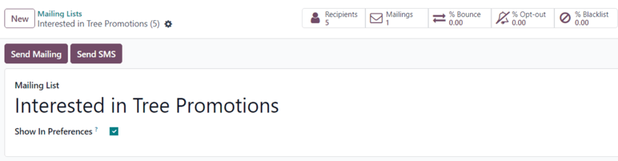
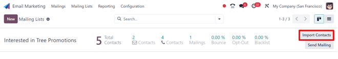
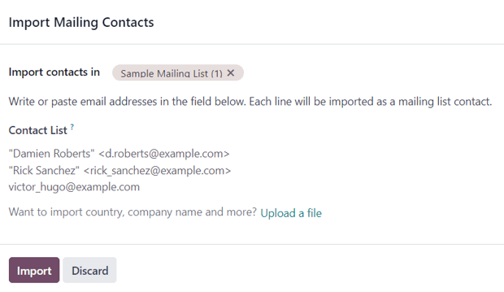
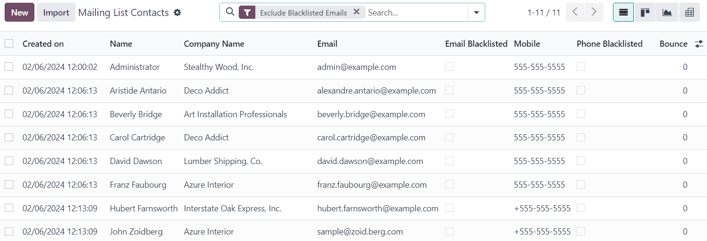
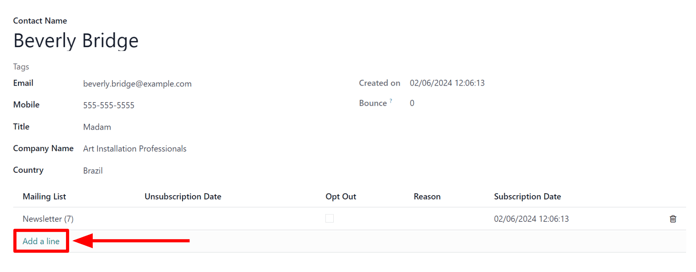
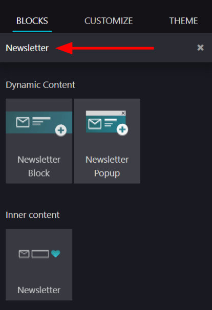
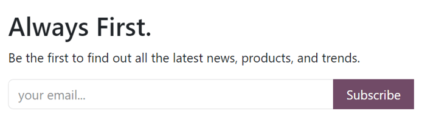
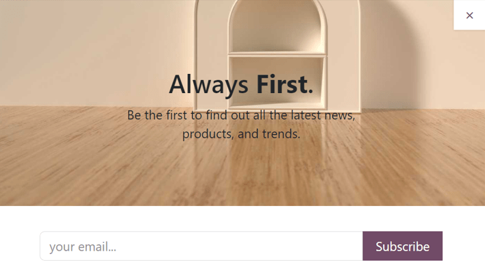
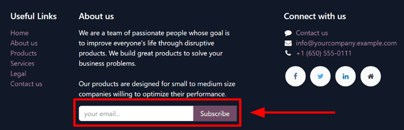
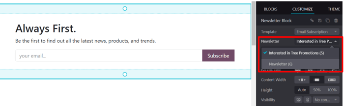

=============
Mailing lists
=============

Mailing lists in Odoo are used for both pre and post sales communications in the *Email Marketing*
application. They provide sales teams with qualified lead lists, focus group participants, or
current customers that fulfill specific criteria.

Mailing lists can be generated in Odoo, and exported as a downloadable file, or into the
*Knowledge*, *Dashboards*, or *Spreadsheets* applications, or imported via copy/paste or file
upload.

Create mailing lists
====================

To create a mailing list in the *Email Marketing* application, navigate to :menuselection:`Email
Marketing app --> Mailing Lists --> Mailing Lists --> New`.

Clicking :guilabel:`New` reveals a blank mailing list form.

On the form, type a name in the :guilabel:`Mailing List` field at the top.

If the mailing list should be accessible by recipients from the subscription management page,
allowing them to update their preferences, tick the box next to :guilabel:`Show In Preferences`.

In the upper-left corner of the mailing list form, there are two buttons: :guilabel:`Send Mailing`
and :guilabel:`Send SMS`.

.. important::
   The :guilabel:`Send SMS` button **only** appears if the *SMS Marketing* application is installed.

Clicking :guilabel:`Send Mailing` reveals a separate page with a blank email template form, which
can be filled out by following steps explained in the :doc:`Email Marketing doc
<../email_marketing>`.

Clicking :guilabel:`Send SMS` reveals a separate page with a blank SMS template form, which can be
filled out by following steps explained in the :doc:`SMS Marketing doc
<../sms_marketing>`.

At the top of the mailing list form is a series of smart buttons that display a variety of metrics
related to the specific mailing list. When any of the smart buttons are clicked, a separate page is
revealed, showcasing detailed analytics related to that particular statistic.

The smart buttons available on a mailing list form are:

- :guilabel:`Recipients`: how many people are subscribed to the mailing list
- :guilabel:`Mailings`: how many mailings have been sent using this mailing list
- :guilabel:`% Bounce`: percentage of mailings related to this mailing list that have been bounced
  back
- :guilabel:`% Opt-out`: percentage of recipients that have opted-out of mailings from this mailing
  list
- :guilabel:`% Blacklist`: percentage of recipients that have blacklisted themselves from the
  mailing list altogether

Once all the configurations on the mailing list form are complete, Odoo automatically adds the new
mailing list to the :guilabel:`Mailing List` page in the *Email Marketing* app
(:menuselection:`Email Marketing app --> Mailing Lists --> Mailing Lists`).

Add contacts to mailing list
============================

In Odoo *Email Marketing*, there are a few different ways to add contacts to a mailing list.

From the :guilabel:`Mailing Lists` page (:menuselection:`Email Marketing --> Mailing Lists -->
Mailing Lists`), click the :guilabel:`Total Contacts` link on the line of the desired mailing list
to which contacts should be added.

Doing so reveals a separate :guilabel:`Mailing List Contacts` page for that specific mailing list,
where contacts can be created or imported, and then added to the specific mailing list.

This same page can also be accessed by clicking the desired mailing list from the :guilabel:`Mailing
Lists` page, and then clicking the :guilabel:`Recipients` smart button on the mailing list form.

Doing so *also* reveals a separate :guilabel:`Mailing List Contacts` page for that specific mailing
list, where contacts can be created or imported, and then added to the specific mailing list.

Contacts can also be directly imported to a specific mailing list from the :guilabel:`Mailing Lists`
page, by clicking :guilabel:`Import Contacts` to the far-right of the desired mailing list.

Doing so reveals an :guilabel:`Import Mailing Contacts` pop-up form.

Here, the desired mailing list is auto-populated in the :guilabel:`Import contacts in` field.
Beneath that, write or paste email addresses in the :guilabel:`Contact List` field.

The option to import a country, company name, and more is available, via the :guilabel:`Upload a
file` link at the bottom of the pop-up form.

When all contacts and configurations are complete, click :guilabel:`Import`.

To add contacts to a specific mailing list from a master list of all mailing list contacts in the
database, navigate to :menuselection:`Email Marketing app --> Mailing Lists --> Mailing List
Contacts`. Doing so reveals the :guilabel:`Mailing List Contacts` page, featuring a list of all
contacts associated with every mailing list.

The default :guilabel:`Exclude Blacklisted Emails` filter appears in the search bar.

From the :guilabel:`Mailing List Contacts` page, contacts can be created and/or imported, and then
added to a mailing list.

To add an existing contact to a mailing list, select the desired contact from the list on the
:guilabel:`Mailing List Contacts` page to reveal their contact form.

At the bottom of their contact form, click :guilabel:`Add a line` under the :guilabel:`Mailing List`
column, locate the desired mailing list from the drop-down menu, and select it.

.. tip::
   A mailing list can be created directly from a contact form, by typing the name of the new mailing
   list in the :guilabel:`Mailing List` field. Then, after a new mailing list name has been entered,
   two options appear on the drop-down menu beneath the new mailing list name.

   From this drop-down menu, select :guilabel:`Create` to create the mailing list and edit it later,
   or select :guilabel:`Create and edit...` to create and edit the new mailing list right away.

To remove a contact from a mailing list that the contact has been added to, enable the
:guilabel:`Opt Out` checkbox. If the :guilabel:`Opt Out` checkbox is ticked, the ability to add a
:guilabel:`Reason` why the contact opted-out is also available.

When/if a contact *has* opted-out of a mailing list, the date they activated their opt-out appears
in the :guilabel:`Unsubscription Date` column on their contact form.

Lastly, the initial :guilabel:`Subscription Date` can be seen, as well. This field is auto-populated
with the date and time their subscription to the mailing list has been saved.

Multiple mailing lists can be added to a single contact form.

To delete any mailing list from a contact form, simply click the :guilabel:`🗑️ (trash can)` icon.

Link mailing list to website
============================

When a mailing list is created in the database, Odoo provides the option to directly link the
mailing list to the Odoo-built website (created via the Odoo *Website* application).

To link a mailing list to a website, navigate to the front-end of the website, which can be
accomplished in a variety of ways throughout the database. The most direct way to get to the
front-end of the website is to simply open the :menuselection:`Website` application from the main
Odoo dashboard.

Doing so reveals the designated homepage of the Odoo-built website for the database.

From the front-end of the website, click the :guilabel:`Edit` button in the upper-right corner. When
clicked, Odoo reveals a right-sidebar, filled with drag-and-drop *building blocks*, packed with
various features, options, and design elements.

Next, in the search bar of the right-sidebar, search for `Newsletter`. The :guilabel:`Newsletter`
selection of building blocks is used to add subscription fields for any mailing list onto the
website.

Doing so reveals the following building block options: :guilabel:`Newsletter Block`,
:guilabel:`Newsletter Popup`, and :guilabel:`Newsletter`. Any of these options can be used to add
subscription fields for a mailing list onto the website.

The :guilabel:`Newsletter Block` option places a customizable block onto the body of the website
where a visitor to enter their email and click a button to subscribe to a designated mailing list.

The :guilabel:`Newsletter Popup` option reveals a customizable pop-up window that appears when a
visitor scrolls to the specific section of the webpage on which the building block is placed. When
the visitor reaches the designated section, a pop-up window appears, in which a visitor can enter
their email address, click a button, and subscribe to that predetermined mailing list.

The :guilabel:`Newsletter` option provides the same functionality as the other options. However, it
only consists of a field for the visitor to enter their email address, and a button to subscribe to
the mailing list.

It is covertly designed in this fashion to be cleanly implemented into the content of the webpage
and/or footer.

Once the desired newsletter building block is chosen, drag-and-drop it onto the body of the
website. Then, select the newly-placed newsletter building block to reveal its configuration options
on the right-sidebar.

From there, open the :guilabel:`Newsletter` drop-down menu, and select the specific mailing list
that should be applied to the block.

Once the desired configurations and customizations are complete, be sure to click the
:guilabel:`Save` button in the upper-right corner.

Now, when a visitor enters their email address, and clicks the button to subscribe, they are
instantly subscribed to that pre-configured mailing list. They are also added as a contact for that
mailing list in Odoo *Email Marketing*.

.. seealso::
   - :doc:`../email_marketing`
   - :doc:`unsubscriptions`
