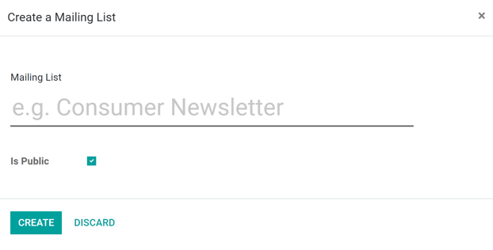
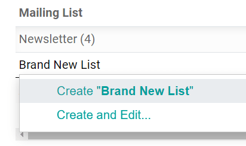

=============
Mailing lists
=============

Mailing lists are important for a number of reasons. Mailing lists can provide valuable leads for
sales teams, communicate with focus groups participants, contact consumers directly for useful
feedback, and more.

Create mailing lists
====================

To create a mailing list in the *Email Marketing* application, navigate to :menuselection:`Mailing
lists --> Mailing lists --> Create`. Clicking :guilabel:`Create` reveals a pop-up window.

In the pop-up, name the mailing list and designate if the mailing list should be public with the
:guilabel:`Is Public` checkbox.

The :guilabel:`Is Public` option allows the mailing list to be accessible by recipients in the
unsubscription page, making it possible for them to update their subscription preferences.

After those options have been configured, click :guilabel:`Create` to create the mailing list, which
Odoo automatically adds to the :guilabel:`Mailing Lists` page.

Add contacts to a mailing list
==============================

After a mailing list has been created (and added to the :guilabel:`Mailing Lists` dashboard), click
on the desired mailing list to add contacts to the list.

Clicking the desired mailing list reveals a separate :guilabel:`Mailing List Contacts` page, in
which contacts can be added to this specific list by clicking :guilabel:`Create`, and adding contact
information directly on a separate contact detail form.

Or, while in the :menuselection:`Email Marketing` application, navigate to :menuselection:`Mailing
Lists --> Mailing List Contacts`. Doing so reveals a separate page with all the mailing list
contacts in the database.

From here, click :guilabel:`Create`, and add a contact with the same previous steps. Or, click the
:guilabel:`Import` icon (to the right of the :guilabel:`Create` button) to import contacts into the
database.

Once contacts are in the database, click into the desired contact's detail form, and add the
preferred mailing list in the :guilabel:`Mailing List` tab (at the bottom of the contact detail
form), by clicking :guilabel:`Add a line`, and selecting the desired mailing list. Multiple mailing
lists can be added to a single contact's detail form.

.. image:: mailing_lists/contact-form-mailing-list-tab.png
   :align: center
   :alt: View of a contact detail form with mailing list tab in Odoo Email Marketing.

Create new mailing list from contact detail form
------------------------------------------------

To create a mailing list from a contact detail form, click :guilabel:`Add a line`, and type in the
name of a new mailing list in the empty field that appears. Then, select either :guilabel:`Create`
or :guilabel:`Create and Edit...`.

The :guilabel:`Create` option quickly creates the mailing list to the contact detail form, and the
list can be configured at a later date. The :guilabel:`Create and Edit...` option creates the
mailing list, and reveals a pop-up window, in which the new mailing list can be configured right
away.

.. image:: mailing_lists/create-and-edit-mailing-list-popup.png
   :align: center
   :alt: View of the create and edit mailing list pop-up in Odoo Email Marketing.

Link a mailing list to website (Newsletter blocks)
==================================================

When a mailing list is created in the database, Odoo provides the option to directly link the
mailing list on the Odoo-built website (created via Odoo's :guilabel:`Website` application).

To link a mailing list to a website, navigate to the front-end of the website, and enter
:guilabel:`Edit` mode by clicking :guilabel:`Edit` in the upper-right corner. When clicked, Odoo
reveals a right-sidebar, filled with drag-and-drop *Building Blocks* that are packed with various
features, options, and design elements.

Then, to add a *subscription field* for a specific mailing list onto a website, drag-and-drop any of
the :guilabel:`Newsletter` options (:guilabel:`Newsletter Block`, :guilabel:`Newsletter Popup`, or
:guilabel:`Newsletter`).

.. tip::
   To quickly locate the :guilabel:`Newsletter` building block options (while in :guilabel:`Edit`
   mode on the front-end of the website), type `Newsletter` into the search bar, located in the
   right sidebar, under the :guilabel:`Blocks` tab, and Odoo reveals the three different
   :guilabel:`Newsletter` block options.

   .. image:: mailing_lists/newsletter-block-search.png
      :align: center
      :alt: View of how to quickly search for Newsletter blocks in the Odoo Website application.

When a :guilabel:`Newsletter` block is dragged onto the body of the website, Odoo reveals a pop-up
window, in which the desired mailing list is selected from a drop-down menu (and linked) to this
block on the website.

.. image:: mailing_lists/add-mailing-list-popup-website.png
   :align: center
   :alt: View of the add mailing list subscription pop-up on an Odoo Website.

- :guilabel:`Newsletter Block` - Adds a block onto the webpage, providing visitors with the
  option to add their email address to this mailing list, and subscribe to future communications.

  Here's an example of a :guilabel:`Newsletter Block`.

  .. image:: mailing_lists/newsletter-block-sample.png
     :alt: View of a sample newsletter block in the Odoo Website application.

- :guilabel:`Newsletter Popup` - Tells Odoo to reveal a subscription pop-up window to occur at
  a certain part of the webpage. When the visitor scrolls to this predetermined point, a pop-up
  subscription window appears, asking for their email address to subscribe to the mailing list.
  The pop-up window can be edited further to fit any business needs.

  Here's an example of a :guilabel:`Newsletter Popup`.

  .. image:: mailing_lists/newsletter-popup-sample.png
     :alt: View of a sample newsletter pop-up sample on an Odoo Website.

- :guilabel:`Newsletter` - Provides visitors with a simple field to add their email address to the
  mailing list, and subscribe to future mailings in the footer (or anywhere else on the page).

  Here's an example of a :guilabel:`Newsletter` dynamic block.

  .. image:: mailing_lists/newsletter-footer-block-sample.png
     :alt: View of a Newsletter dynamic block on an Odoo Website.

.. seealso::
   - :doc:`/applications/marketing/email_marketing`
   - :doc:`/applications/marketing/email_marketing/unsubscriptions`
