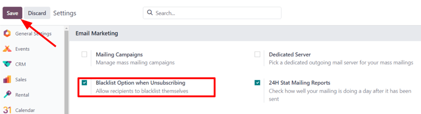
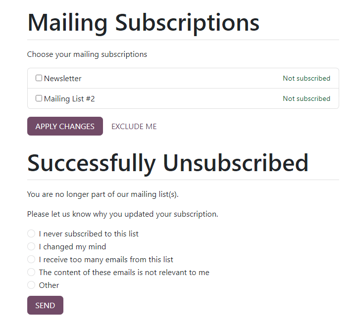
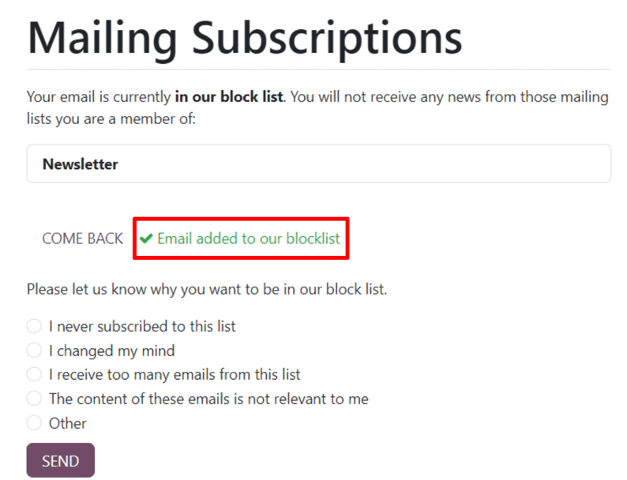
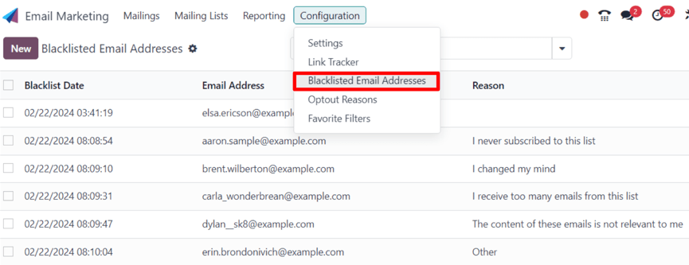
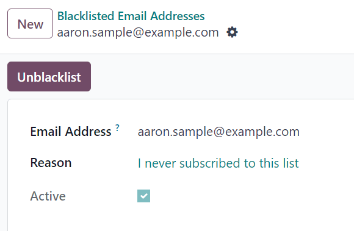
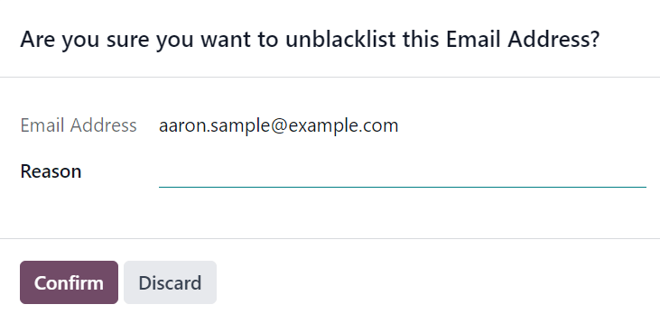

==================================
Manage unsubscriptions (blacklist)
==================================

Providing recipients with the power to unsubscribe from mailing lists is not only a smart business
practice, it's often a legal requirement. Allowing recipients to unsubscribe from a mailing list
establishes a sense of trust and control with an audience. It also helps companies appear more
genuine, and less *spammy*.

Unsubscribe and blacklist
=========================

In addition to having the option to unsubscribe from specific mailing lists, the recipient can also
*blacklist* themselves during the unsubscription process, meaning they will not receive *any* more
marketing emails from the Odoo database.

In order to provide recipients with the ability to blacklist themselves, a specific feature **must**
be enabled in the *Email Marketing* application.

Navigate to :menuselection:`Email Marketing app --> Configuration --> Settings`, and tick the
checkbox next to the :guilabel:`Blacklist Option when Unsubscribing` feature. Then, click
:guilabel:`Save` in the upper-left corner of the :guilabel:`Settings` page.

Unsubscribe
-----------

By default, an *Unsubscribe* link appears at the bottom of all mailing templates.

.. warning::
   The *Unsubscribe* link does **not** appear by default if the *Start From Scratch* template is
   used to create a mailing. The user **must** manually add the specific unsubscribe link
   `/unsubscribe_from_list` in the body of the email, or use a block from the *Footers* section of
   the email builder, which includes the unsubscribe link.

If a recipient clicks the *Unsubscribe* link in a mailing, Odoo instantly unsubscribes them from the
mailing list, presents them with a :guilabel:`Mailing Subscriptions` page where they can directly
manage their subscriptions, and informs them that they've been :guilabel:`Successfully
Unsubscribed`.

Beneath that, Odoo asks the former subscriber to :guilabel:`Please let us know why you updated your
subscription`, and the user can proceed to choose the appropriate opt-out reason from a series of
options presented to them.

.. note::
   The opt-out answer options can be created and modified by navigating to :menuselection:`Email
   Marketing app --> Configuration --> Optout Reasons`.

Once they've chosen the appropriate opt-out reason from the options presented to them, they can
click the :guilabel:`Send` button. Odoo then logs their reasoning for unsubscribing in the *Email
Marketing* app for future analysis.

Blacklist
---------

For a recipient to remove (i.e. blacklist) themselves from **all** marketing emails during the
unsubscription process, on the :guilabel:`Mailing Subscriptions` page, they must click
:guilabel:`Exclude Me`.

Upon clicking :guilabel:`Exclude Me`, Odoo informs the recipient they have been successfully
blacklisted, with a message reading: :guilabel:`✔️ Email added to our blocklist`.

Beneath that, Odoo asks the former subscriber to :guilabel:`Please let us know why you want to be
added to our blocklist`, and the user can proceed to choose the appropriate reason from a series of
options presented to them.

Once they've chosen the appropriate reason from the options presented to them, they can click the
:guilabel:`Send` button. Odoo then logs their reasoning for blacklisting themselves in the *Email
Marketing* app for future analysis.

Blacklisted email addresses
===========================

To view a complete list of all blacklisted email addresses, navigate to :menuselection:`Email
Marketing app --> Configuration --> Blacklisted Email Addresses`.

When a blacklisted record is selected from this list, Odoo reveals a separate page with the
recipient's contact information, along with the provided :guilabel:`Reason` why they chose to
blacklist themselves.

In the *chatter* of the blacklisted record page, there's a time-stamped message, informing the user
when the recipient blacklisted themselves (via a :guilabel:`Mail Blacklist created` log note).

.. note::
   Blacklisted emails are excluded from all marketing mailings, however, these emails can still
   receive transactional emails, such as order confirmations, shipping notifications, etc.

Unblacklist contacts
====================

To *Unblacklist* contacts, click the :guilabel:`Unblacklist` button in the upper-left corner of a
blacklisted record's page to remove the contact from the blacklist, allowing them to receive
mailings once again.

When :guilabel:`Unblacklist` is clicked, an :guilabel:`Are you sure you want to unblacklist this
Email Address?` pop-up window appears.

In this pop-up window, the email address of the selected blacklisted record is shown, and there's a
:guilabel:`Reason` field, in which a reason can be entered, explaining why this particular contact
was removed from the blacklist.

After filling in the fields, click :guilabel:`Confirm` to officially remove that particular contact
from the blacklist.

.. seealso::
   - :doc:`../email_marketing`
   - :doc:`mailing_lists`
