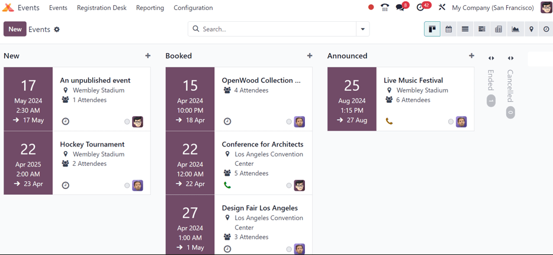
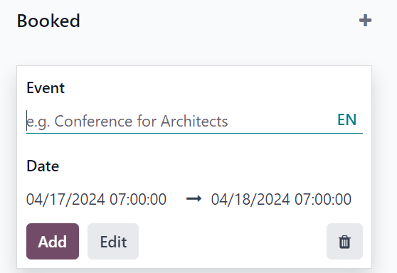
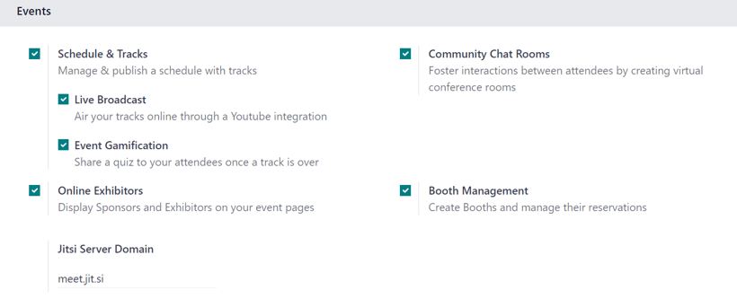
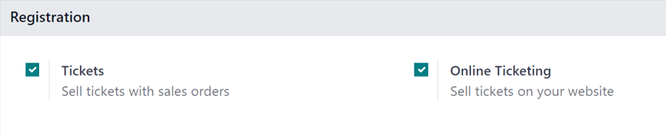
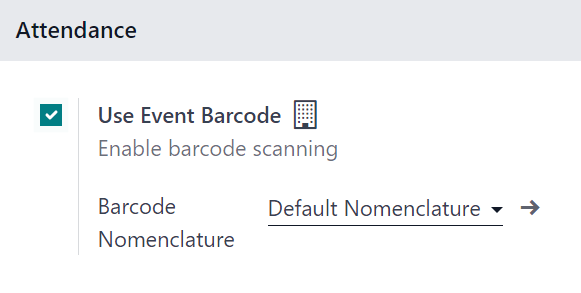

:show-content:

======
Events
======

Explore the various aspects of the Odoo **Events** detailed dashboard, and useful settings, that can
be utilized to generate and gather valuable data about events (and their attendees), which can then
be used to improve decision-making and event-planning.

.. seealso::
   `Odoo Tutorials: Events <https://www.odoo.com/slides/surveys-63>`_

.. cards::

   .. card:: Create events
      :target: events/create_events

      Discover how to create events with Odoo.

   .. card:: Sell event tickets
      :target: events/sell_tickets

      Learn how to create, configure, and sell event tickets.

   .. card:: Track and manage talks
      :target: events/track_manage_talks

      See how to create, track, and manage event tracks with Odoo.

   .. card:: Event templates
      :target: events/event_templates

      Expedite the event-creation process with event templates.

   .. card:: Event tracks
      :target: events/event_tracks

      Learn how to create, track, and manage event tracks with Odoo.

   .. card:: Event booths
      :target: events/event_booths

      Create, manage, and sell event booths.

   .. card:: Registration Desk
      :target: events/registration_desk

      Instantly grant access to event attendees with Odoo's Registration Desk feature.

   .. card:: Revenues report
      :target: events/revenues_report

      Analyze the financial success of events with Odoo.

Events dashboard
================

When the **Events** application is opened, Odoo reveals the main :guilabel:`Events` dashboard, which
can be viewed in a number of different ways. Those different view options are accessible from the
:guilabel:`Events` dashboard in the upper-right corner, via a series of view-related icon buttons.

By default, the :guilabel:`Events` dashboard is displayed in the :icon:`oi-view-kanban`
:guilabel:`Kanban` view, which is populated with a variety of pipeline stages.

This view showcases all the events in the database in their respective stages. By default, the
stages are: :guilabel:`New`, :guilabel:`Booked`, :guilabel:`Announced`, :guilabel:`Ended`, and
:guilabel:`Cancelled`.

.. note::
   The :guilabel:`Ended` and :guilabel:`Cancelled` stages are folded, by default, and located to the
   right of the other stages.

On each event card, find the scheduled date of the event, the name of the event, the location, the
number of expected :guilabel:`Attendees`, any scheduled activities related to the event, the status
of the event, and the person responsible for the event.

To quickly add a new event to a pipeline, click the :icon:`fa-plus` :guilabel:`(plus)` icon at the
top of the stage to which the event should be added to reveal a blank Kanban card to fill out.

In this blank Kanban card, enter the name of :guilabel:`Event`, along with the start and end
:guilabel:`Date` and time.

Then, either click :guilabel:`Add` to add it to the stage and edit it later, or click
:guilabel:`Edit` to add the event to stage and edit its configurations on a separate page.

Each event card can be dragged-and-dropped into any stage on the Kanban pipeline, providing easy
organizational access.

Settings
========

To access the event settings and feature options in Odoo **Events**, navigate to
:menuselection:`Events app --> Configuration --> Settings`. From here, tick the checkboxes beside
the desired settings and/or features, and click :guilabel:`Save` to activate them.

Events section
--------------

In the :guilabel:`Events` section of the :guilabel:`Settings` page, there are selectable features
that can be enabled to add various elements to events created with the Odoo **Events** application.

The :guilabel:`Schedule & Tracks` feature allows users to manage and publish a schedule with tracks
for events. *Tracks* is a catch-all term that refers to talks, lectures, demonstrations,
presentations, and other similar elements that users may choose to include as part of an event.

When the :guilabel:`Schedule & Tracks` feature is enabled, two additional fields appear beneath it:
:guilabel:`Live Broadcast` and :guilabel:`Event Gamification`.

The :guilabel:`Live Broadcast` feature lets users air tracks online, via a *YouTube* integration.

The :guilabel:`Event Gamification` feature lets users share a quiz after any event track, in order
for attendees to gauge how much they learned from the track they just saw/heard. Companies can also
benefit from this feature, in that the subsequent responses and results of the quizzes can help
determine where a company's strengths and weaknesses are, when it comes to their presentations.

Next, is the :guilabel:`Online Exhibitors` feature. This feature allows users to display sponsors
and exhibitors on event pages, which can serve as a valuable incentive to encourage partners and
businesses to participate in the event.

The :guilabel:`Jitsi Server Domain` field represents an external conferencing service that is
integrated with Odoo. It is what is used to create and host virtual conferences, community rooms,
and other similar elements for events.

The :guilabel:`Community Chat Rooms` feature allows users to create virtual conference rooms for
event attendees, providing them with a centralized place to meet and discuss anything related to the
event.

Lastly, there is the :guilabel:`Booth Management` feature. This feature provides users with the
ability to create and manage event booths and booth reservations. When enabled, users can create
different booth tiers, with individual price points, and sell them to interested parties.

Registration section
--------------------

The :guilabel:`Registration` section of the :guilabel:`Settings` page provides selectable settings
that are directly related to event registration.

The :guilabel:`Tickets` setting allows users to sell event tickets, via standard sales orders.

The :guilabel:`Online Ticketing` setting creates a selectable *Event Ticket* product type on product
forms, which provides users with the ability to sell event tickets online, via their
website/eCommerce store.

Attendance section
------------------

In the :guilabel:`Attendance` section of the :guilabel:`Settings` page, there is a selectable
setting that is directly related to how attendees can attend/enter the event.

The :guilabel:`Use Event Barcode` setting, when activated, enables barcode (and QR code) scanning
for attendees to enter the event. This provides attendees with quick access, and helps Odoo users
easily track, manage, and analyze all event attendees.

The :guilabel:`Barcode Nomenclature` field, beneath the :guilabel:`Use Event Barcode` setting, is
set to :guilabel:`Default Nomenclature`, by default, but can be changed at any time.

Create events
=============

With Odoo **Events**, events can be manually created from scratch or built off of pre-made
templates.

Once launched, the **Events** application then integrates with the **Website** app for the front-end
promotion and registration of the event for attendees, the **Sales** app for the purchasing ability
of paid tickets, and the **CRM** application through customizable lead generation rules.

.. seealso::
   :doc:`events/create_events`

Sell event tickets
==================

Create custom ticket tiers (with various price points) for potential event attendees to choose from,
directly on the event template form, under the *Tickets* tab.

Odoo simplifies the ticket-purchasing process by providing plenty of payment method options, as
well.

.. seealso::
   :doc:`events/sell_tickets`

Track and manage talks
======================

Discover how to access various event tracks (talks, presentations, etc.), view entire agendas, and
learn how attendees can propose talks for the event.

.. seealso::
   :doc:`events/track_manage_talks`

Event templates
===============

Learn the process to customize and configure event templates, which can be used to expedite the
event-creation process.

.. seealso::
   :doc:`events/event_templates`

Event booths
============

Explore the various ways to create, manage, and sell event booths with the Odoo **Events**
application.

.. seealso::
   :doc:`events/event_booths`

Event tracks
============

Find out how to create, manage, and schedule different experiences (aka *Tracks*) for events with
Odoo.

.. seealso::
   :doc:`events/event_tracks`

Registration desk
=================

Grant access to event attendees quickly and easily with the Odoo **Events** *Registration Desk*
feature.

.. seealso::
   :doc:`events/registration_desk`

Revenues report
===============

Gain invaluable insight into event-related revenues with customizable reports and metrics.

.. seealso::
   :doc:`events/revenues_report`

.. toctree::

   events/create_events
   events/sell_tickets
   events/track_manage_talks
   events/event_templates
   events/event_booths
   events/event_tracks
   events/registration_desk
   events/revenues_report
