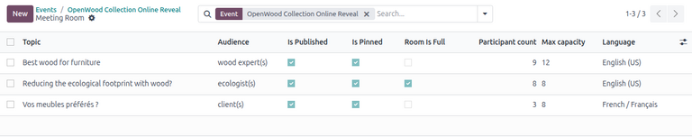
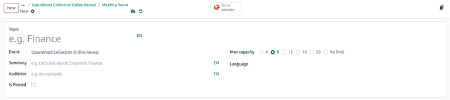
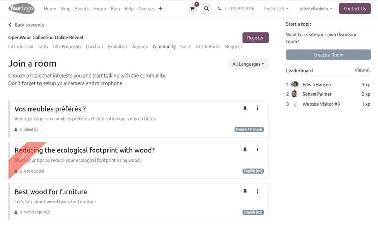
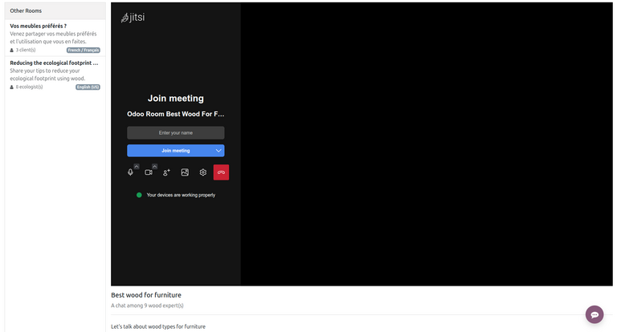

====================
Community Chat Rooms
====================

In the **Events** app, users can create *Jitsi* video conference rooms for event attendees to
connect and discuss topics related to the event.

Configuration
=============

To set up community rooms, the *Community Chat Rooms* feature needs to be enabled in the **Events**
settings by navigating to :menuselection:`Events app --> Configuration --> Settings`. In the
*Events* section, enable :guilabel:`Community Chat Rooms` and click :guilabel:`Save`.

With the *Community Chat Rooms* feature enabled, users can then :ref:`create community rooms
<community_rooms/create-room>` in the database and publish them on the website. Event attendees can
not only join rooms but also create them directly :ref:`on the website <community_rooms/website>`.

.. _community_rooms/create-room:

Create a room
=============

To create a community room in the database, open the **Events** app, then select or create an event.

A :icon:`fa-comments-o` :guilabel:`Rooms` smart button appears at the top of the event form. Click
it to open the list of meeting rooms created for the event.

Meeting room form
-----------------

To create a new room, click :guilabel:`New`. This opens a form to configure details about the room.

Begin by entering the name of the topic in the :guilabel:`Topic` field.

Then, complete the information in the following fields:

- :guilabel:`Event`: Select the corresponding event for the meeting room. This field is
  automatically populated.
- :guilabel:`Summary`: Enter a short description of the meeting room's purpose.
- :guilabel:`Audience`: Specify the intended audience of the meeting room.
- :guilabel:`Is Pinned`: Specify whether the meeting room should be pinned on the event website.
- :guilabel:`Max capacity`: Select the maximum number of participants allowed in the room.
- :guilabel:`Language`: Select the language of the meeting.

The :guilabel:`Chat Room` field is automatically populated with a generated name for the *Jitsi*
conference room. If desired, the user can change this name by clicking the field and modifying any
details on the resulting form.

Finally, the :guilabel:`Participant count` field automatically populates with the number of
attendees currently in the meeting room.

Once the meeting room form is complete, a :guilabel:`Reporting` tab appears at the bottom of the
form, allowing users to monitor the :guilabel:`Last activity` date and the :guilabel:`Peak
participants` count for the event.

Publish meeting room
--------------------

After configuring the meeting room form, users must publish the room on the event website to make it
visible for event attendees. To do this, click the :icon:`fa-globe` :guilabel:`Go to Website` smart
button at the top of the meeting room form.

This opens the meeting room page on the event website, currently invisible to attendees. To publish
it, toggle the :icon:`fa-toggle-off` :guilabel:`Unpublished` button. The meeting room is then
:icon:`fa-toggle-on` :guilabel:`Published` and available for attendees to join.

.. _community_rooms/website:

Community rooms on the website
==============================

Once published, community rooms appear on the event's webpage. To access them, open the **Website**
app and navigate to the :guilabel:`Events` header menu item on the website. Then, select the desired
event to open the event-specific webpage. The sub-menu appears with the :guilabel:`Community`
option.

.. note::
   If the :guilabel:`Community` sub-menu item is not displayed, the website must first be modified
   in the database using the editor mode in order to display the sub-menu.

   To start, click :guilabel:`Edit` in the top corner. In the :guilabel:`Customize` tab, toggle the
   :guilabel:`Sub-menu (Specific)` option, then click :guilabel:`Save`.

Clicking the :guilabel:`Community` sub-menu item opens the *Join a room* page, listing all published
meeting rooms, along with information including the topic title, a short summary of the room's
purpose, and the number of participants in the room. Optionally, attendees can also pin a meeting
room by clicking the :icon:`fa-thumb-tack` :guilabel:`(pin)` icon next to the title.

To join a room, click on the desired topic. This opens the *Jitsi* video conferencing room where
attendees can chat.

Create a room as an attendee
----------------------------

The *Join a room* page on the event website also features an option for attendees to launch a new
meeting room for a specific topic.

To create a new meeting room as an attendee, click the :guilabel:`Create a Room` button. This opens
a *Launch a new topic* pop-up window.

Similar to creating a room in the database, continue by filling in the following details about the
room:

- :guilabel:`Room Topic`: The name of the topic.
- :guilabel:`Short Summary`: A short description about the meeting's purpose.
- :guilabel:`Target People`: The intended audience of the meeting.
- :guilabel:`Language`: The target language of the meeting.
- :guilabel:`Capacity`: The maximum capacity of the room.

After completing the form, click :guilabel:`Create` to finish. The room is then created and the
attendee is redirected to the conferencing page.
