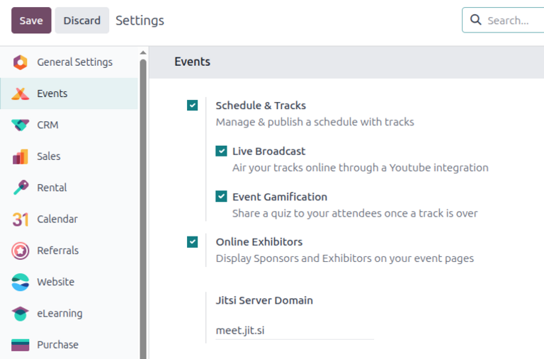
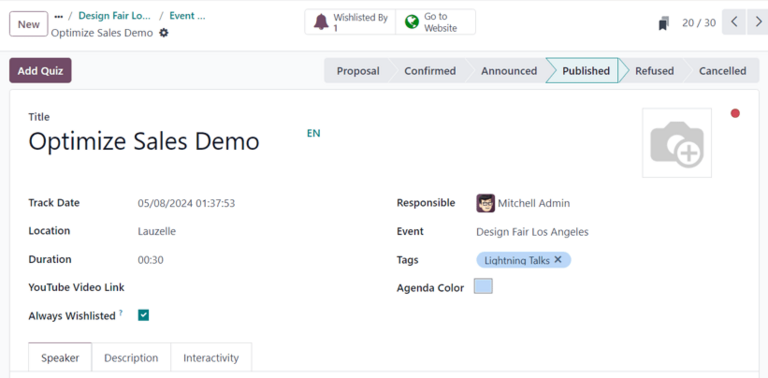
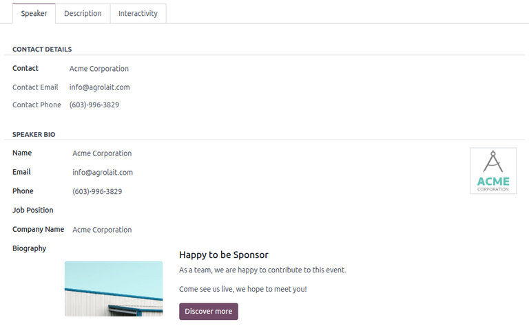
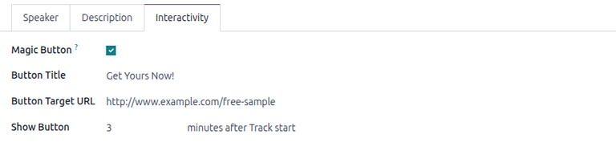
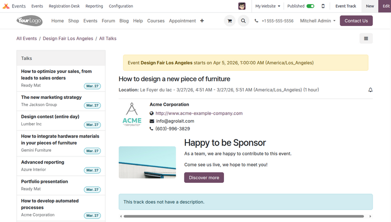
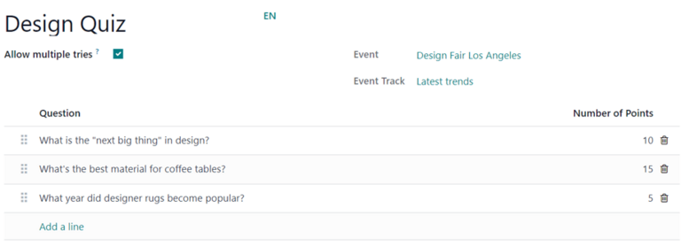
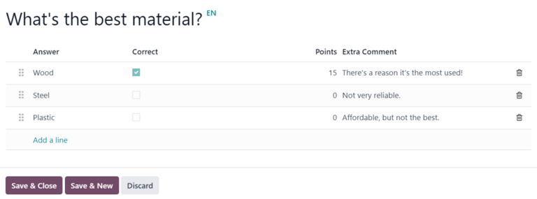

============
Event tracks
============

Odoo **Events** provides users the ability to create, schedule, and manage *tracks*, which are
talks, lectures, presentations, etc.

Configuration
=============

To enable tracks in Odoo, navigate to :menuselection:`Events app --> Configuration --> Settings`,
and tick the checkbox beside the :guilabel:`Schedule & Tracks` setting.

Once the setting is selected, two additional configuration options appear beneath it:

- :guilabel:`Live Broadcast`: :ref:`Broadcast tracks online
  <events/additional-configs/live-broadcasting>` through a *YouTube* integration.
- :guilabel:`Event Gamification`: :ref:`Share quizzes with attendees
  <events/additional-configs/event-gamification>` after a track concludes.

Once all desired settings have been enabled, click the :guilabel:`Save` button in the upper-left
corner of the :guilabel:`Settings` page.

.. _events/tracks-dashboard:

Event tracks dashboard
======================

To access, modify, and/or create tracks for an event, navigate to :menuselection:`Events app`, and
either select an existing event from the :guilabel:`Events` dashboard or :doc:`create a new one
<../event_setup/create_events>`.

On the selected event form, click the :guilabel:`Tracks` smart button at the top to land on the
:guilabel:`Event Tracks` page, which presents all the tracks (both scheduled and proposed) for the
event.

.. _events/tracks-dashboard/views:

Views
-----

The :guilabel:`Event Tracks` page can be displayed in six different views:

.. tabs::

   .. tab:: Kanban

      By default, the :guilabel:`Event Tracks` page opens in the :icon:`oi-view-kanban`
      :guilabel:`(Kanban)` view, providing users an at-a-glance overview of all tracks for the
      selected event.

      .. image:: event_tracks/event-tracks-page.png
         :alt: Typical event tracks page for an event in the Odoo Events application.

      In the default :icon:`oi-view-kanban` :guilabel:`(Kanban)` view, the tracks are categorized
      into several modifiable stages: :guilabel:`Proposal` :guilabel:`Confirmed`,
      :guilabel:`Announced`, :guilabel:`Published`, :guilabel:`Refused` (collapsed), and
      :guilabel:`Cancelled` (collapsed).

      Records displayed in the Kanban can be narrowed down using :ref:`grouping
      <events/tracks-dashboard/group>` and :ref:`filter <events/tracks-dashboard/filter>` options.

      For more information about using the Kanban view, see the :ref:`Kanban
      <studio/views/multiple-records/kanban>` documentation.

   .. tab:: List

      The :icon:`oi-view-list` :guilabel:`(List)` view displays a detailed list of all tracks for
      the selected event in a centralized view. Each track is displayed on a line along with its
      :guilabel:`Title`, the speaker's :guilabel:`Name`, :guilabel:`Email`, :guilabel:`Phone`, and
      the track's :guilabel:`Stage`.

      .. image:: event_tracks/track-page-list.png
         :alt: List view in the events tracks page for an event.

      Records displayed in the List view can be narrowed down using :ref:`grouping
      <events/tracks-dashboard/group>` and :ref:`filter <events/tracks-dashboard/filter>` options.

      For more information about using the List view, see the :ref:`List
      <studio/views/multiple-records/list>` documentation.

   .. tab:: Gantt

      The :icon:`fa-tasks` :guilabel:`(Gantt)` view displays all tracks as horizontal bars against
      an adjustable timeline, providing the user a chronological view of their tracks' progress.

      .. image:: event_tracks/track-page-gantt.png
         :alt: Gantt view in the events tracks page for an event.

      Records displayed in the List view can be narrowed down using :ref:`grouping
      <events/tracks-dashboard/group>` and :ref:`filter <events/tracks-dashboard/filter>` options.

      For more information about using the Gantt view, see the :ref:`Gantt
      <studio/views/timeline/gantt>` documentation.

   .. tab:: Calendar

      The :icon:`fa-calendar` :guilabel:`(Calendar)` view displays all tracks for the selected event
      as clickable entries in a calendar view, providing users an interactive schedule by day, week,
      month, or year.

      .. image:: event_tracks/track-page-calendar.png
         :alt: Calendar view in the events tracks page for an event.

      Records displayed in the Calendar view can be narrowed down using :ref:`filter
      <events/tracks-dashboard/filter>` options.

      For more information about using the Calendar view, see the :ref:`Calendar
      <studio/views/timeline/calendar>` documentation.

   .. tab:: Graph

      The :icon:`fa-area-chart` :guilabel:`(Graph)` view allows users to visually compare
      tracks-related data for the selected event using multiple different charts.

      .. image:: event_tracks/track-page-graph.png
         :alt: Graph view in the events tracks page for an event.

      Records displayed in the Graph view can be narrowed down using :ref:`grouping
      <events/tracks-dashboard/group>` and :ref:`filter <events/tracks-dashboard/filter>` options.

      For more information about using the Graph view, see the :ref:`Graph
      <studio/views/reporting/graph>` documentation.

   .. tab:: Activity

      The :icon:`fa-clock-o` :guilabel:`(Activity)` view displays a table of all scheduled
      activities linked to tracks for the selected event.

      .. image:: event_tracks/track-page-activity.png
         :alt: Activity view in the events tracks page for an event.

      Records displayed in the Activity view can be narrowed down using :ref:`filter
      <events/tracks-dashboard/filter>` options.

      For more information about using the Activity view, see the :ref:`Activity
      <studio/views/general/activity>` documentation.

.. _events/tracks-dashboard/filter:

Filter options
~~~~~~~~~~~~~~

The :guilabel:`Filters` column in the search bar's drop-down menu filters track-related data by
specific criteria in any given view. Multiple filters can be selected at once.

The :guilabel:`Filters` column has the following options:

- :guilabel:`My Tracks`: Filter by tracks with the *Responsible* user set to the current user
  profile.
- :guilabel:`Published`: Filter by published tracks.
- :guilabel:`Always Wishlisted`: Filter by tracks with the *Always Wishlisted* field enabled.
- :guilabel:`Track Date`: Filter by a specific track date. Click the :icon:`fa-caret-down`
  :guilabel:`(down)` arrow to reveal a list of month, quarter, and year options.
- :guilabel:`Archived`: Filter by archived tracks.
- :guilabel:`Custom Filter...`: Create and apply a :ref:`custom filter <search/custom-filters>`.

.. _events/tracks-dashboard/group:

Group By options
~~~~~~~~~~~~~~~~

The :guilabel:`Group By` column in the search bar's drop-down menu groups track-related data by
specific criteria in the Kanban, List, Gantt, and Graph views only. Multiple grouping options can be
selected at once.

The :guilabel:`Group By` column has the following options:

- :guilabel:`Responsible`: Group data by the *Responsible* user specified across all tracks.
- :guilabel:`Stage`: Group data by stage.
- :guilabel:`Date`: Group data by a specific date. Click the :icon:`fa-caret-down`
  :guilabel:`(down)` arrow to reveal a list of day, week, month, quarter, and year options.
- :guilabel:`Event`: Group data by event.
- :guilabel:`Location`: Group data by location.
- :guilabel:`Custom Group...`: Group data by a :ref:`custom group <search/group>`.

Create event track
==================

New event tracks are created from the :guilabel:`Event Tracks` page.

To create a new event track, click :guilabel:`New` in the upper-left corner to reveal a blank event
track form.

Start by giving this track a :guilabel:`Title`. This field is **required**.

Optionally, upload an image for the track to be displayed on the track's webpage.

Next, enter details for the track in the following fields:

- :guilabel:`Track Date`: Specify the date of the track.
- :guilabel:`Location`: Specify the location of the track.
- :guilabel:`Duration`: Specify the duration of the track (in minutes).
- :guilabel:`Always Wishlisted`: Specify whether to automatically set the track as favorite for each
  registered attendee.
- :guilabel:`Responsible`: Select the database user responsible for managing the track. By default,
  this field is assigned to the user who initially created the track.
- :guilabel:`Event`: Select the track's associated event. By default, this field is already
  populated with the event from the *Event Tracks* page.
- :guilabel:`Tags`: Select one or multiple tags for the track to add as filters on the *Talks*
  webpage.
- :guilabel:`Agenda Color`: Select a color to represent the track on the *Agenda* webpage.

.. tip::
   To access a complete list of locations for event tracks, which can be modified (and added to) at
   any time, navigate to :menuselection:`Events app --> Configuration --> Track Locations`.

.. _events/track-speaker-tab:

Speaker tab
-----------

The :guilabel:`Speaker` tab on an event track form contains various fields to configure information
about the track host or speaker.

Contact Details section
~~~~~~~~~~~~~~~~~~~~~~~

In the :guilabel:`Contact Details` section, click the :guilabel:`Contact` drop-down field to select
an existing contact from the database as the main point of contact for the talk.

If this contact is not yet in the database, type in the name of the contact, and click
:guilabel:`Create` to create and edit the contact form later, or click :guilabel:`Create and
edit...` to be taken to that new contact's contact form for immediate configuration.

The :guilabel:`Contact Email` and :guilabel:`Contact Phone` fields are greyed-out and populated with
the information found on the chosen contact's form. These fields are not modifiable once the
:guilabel:`Contact` field is selected.

Speaker Bio section
~~~~~~~~~~~~~~~~~~~

In the :guilabel:`Speaker Bio` section, enter any information related to the specific speaker
scheduled to conduct/host the track.

If the chosen contact in the :guilabel:`Contact Details` section is properly configured, the
:guilabel:`Name`, :guilabel:`Email`, and :guilabel:`Phone` fields are automatically populated.
Otherwise, manually enter the information.

.. note::
   This information appears on the front-end of the event website, on the specific track webpage,
   providing more information about the speaker to the track attendees.

Optionally, upload an image to appear alongside the speaker biography on the event website.

Then, enter a :guilabel:`Job Position` for the designated speaker, followed by the
:guilabel:`Company Name` associated with the speaker.

In the :guilabel:`Biography` field, proceed to enter a custom biography with any speaker-related
information.

.. _events/track-description-tab:

Description tab
---------------

The :guilabel:`Description` tab of an event track form contains a blank text field to enter any
additional information about the track. This information appears on the specific track page on the
event website.

.. _events/track-interactivity-tab:

Interactivity tab
-----------------

The :guilabel:`Interactivity` tab of the track form provides users the option to display an
interactive button for additional attendee engagement.

When the :guilabel:`Magic Button` checkbox is ticked, Odoo displays a *call to action* button to
attendees on the sidebar of the track webpage while the track is taking place.

With that checkbox ticked, three more options appear below to configure the button:

- :guilabel:`Button Title`: Enter a title to appear on the button for attendees.
- :guilabel:`Button Target URL`: Enter a URL that leads attendees to a specific page.
- :guilabel:`Show Button`: Enter how many :guilabel:`minutes after Track start` the button should
  appear.

.. note::
   The magic button **only** appears if there is more than one published track.

Publish event track
===================

Once all the desired configurations are complete on an event track form, publish the track on the
event website by clicking the :guilabel:`Published` stage in the upper-right corner.

.. note::
   The stage of a track can also be changed from the :guilabel:`Event Tracks` page, where the
   desired track card can be dragged-and-dropped into the appropriate Kanban stage.

An event track can also be published by opening the desired event track form and clicking the
:guilabel:`Go to Website` smart button. Then, toggle the :icon:`fa-toggle-off`
:guilabel:`Unpublished` button at the top of the page to :icon:`fa-toggle-on` :guilabel:`Published`.

.. _events/additional-configs:

Additional track configurations
===============================

The :guilabel:`Schedule & Tracks` setting in the **Events** configuration page provides additional
configuration options for users to enable live broadcasting and gamification for tracks.

.. _events/additional-configs/live-broadcasting:

Live broadcasting
-----------------

If the :guilabel:`Live Broadcast` setting is enabled in the **Events** app settings, the option to
add a corresponding link in the :guilabel:`YouTube Video Link` field appears in the track form.

.. _events/additional-configs/event-gamification:

Event gamification
------------------

If the :guilabel:`Event Gamification` setting is enabled, an :guilabel:`Add Quiz` button appears on
the top-left of a track form, allowing the user to create a quiz for attendees to complete after the
track ends.

Track quiz form
~~~~~~~~~~~~~~~

To add a quiz to the event track, click the :guilabel:`Add Quiz` button. Doing so opens a form to
configure the quiz.

Start by entering a title for the quiz in the blank field at the top of the page.

If participants are allowed to take the quiz multiple times, tick the checkbox beside
:guilabel:`Allow multiple tries`.

The :guilabel:`Event` and :guilabel:`Event Track` fields are automatically populated with the
corresponding event and track. These fields are non-modifiable.

Add questions and answers
*************************

To add questions to the quiz, click :guilabel:`Add a line` beneath the :guilabel:`Question` column.
Doing so reveals a :guilabel:`Create Questions` pop-up window.

.. note::
   **All** track quiz questions are multiple choice.

From the pop-up window, enter the question in the blank field at the top. Then, click :guilabel:`Add
a line` to add an answer option.

Optionally, fill in the following fields:

- :guilabel:`Correct`: Designate whether the option is the correct response.
- :guilabel:`Points`: Specify a point value for the answer option.
- :guilabel:`Extra Comment`: Add any additional comments that should accompany the answer option.

Once all desired answer options are completed, click :guilabel:`Save & Close` to save the question,
close the pop-up window, and return to the track quiz form. Or, click :guilabel:`Save & New` to save
this question and instantly start creating another question on a new :guilabel:`Create Questions`
pop-up form.

.. seealso::
   - :doc:`../event_setup/create_events`
   - :doc:`../attendee_experience/track_manage_talks`
