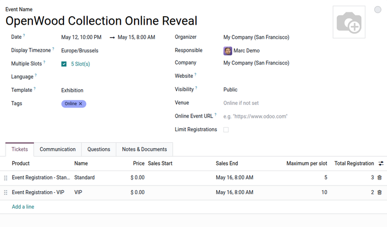
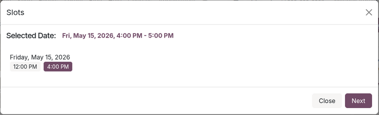

==============
Multiple slots
==============

In the Odoo **Events** app, users can create multiple time-slots for an event, giving attendees the
flexibility to register for a specific time or session instead of the entire event. This feature
also allows organizers to manage high-capacity events by spreading out attendees across multiple
slots.

.. _multi-slots/configuration:

Configuration
=============

To create slots for an event, the feature must be enabled on an event form. To do this, open the
**Events** app, then navigate to an existing event or :doc:`create a new one
<../event_setup/create_events>`.

On the event form, select the :guilabel:`Multiple Slots` checkbox. A :guilabel:`# Slot(s)` link
appears next to the field, displaying the total number of slots for the event.

Additionally, under the *Tickets* tab, a :guilabel:`Maximum per slot` column appears on event
registration lines. This option allows the user to specify the maximum number of registrations
allowed for a slot. If a slot reaches the maximum registration count, it is marked as *Sold Out* on
the registration webpage.

.. _multi-slots/view-slots:

Viewing slots
=============

To access a dashboard of slots, click the :guilabel:`# Slot(s)` link next to the :guilabel:`Multiple
Slots` checkbox on the event form. By default, this opens a :icon:`fa-calendar`
:guilabel:`(Calendar)` view with clickable entries for valid event dates, allowing users to
interactively :ref:`create <multi-slots/create-slots>` as well as :ref:`delete or modify
<multi-slots/delete-modify-slots>` slots.

Alternatively, users can also see a list of all created slots via the :icon:`oi-view-list`
:guilabel:`(List)` view.

.. _multi-slots/create-slots:

Creating slots
==============

.. tabs::

   .. tab:: Calendar

      To create slots in the calendar view, click on a calendar entry, or click and drag to select
      multiple entries. A :guilabel:`# Selected` appears at the top of the calendar, displaying the
      selected slots.

      Then, click the :guilabel:`Add` button at the top of the calendar. On the resulting popover,
      select the start and end time of the slot. Next, specify the :guilabel:`Timezone` and an
      optional display :guilabel:`Color` for the slot.

      Finally, click the :guilabel:`Add` button in the popover to create the slot, or click
      :guilabel:`Discard` to cancel.

      .. image:: multi_slots/add-slot-calendar.png
         :alt: Adding a slot in the calendar view.

   .. tab:: List

      To create a slot in the list view, click :guilabel:`New`. This creates a new line to configure
      slot options.

      In the calendar popover, select the :guilabel:`Date` of the slot. Then, under the
      :guilabel:`From` and :guilabel:`To` columns, specify the respective start and end times.
      Optionally, select a display :guilabel:`Color` to represent the slot.

      Finally, click :guilabel:`Save` to create the slot, or click :guilabel:`Discard` to cancel.

      .. warning::
         Odoo returns an error if the configured date and time of the slot is outside of the valid
         date range of the event.

      .. image:: multi_slots/add-slot-list.png
         :alt: Adding a slot in the list view.

.. _multi-slots/delete-modify-slots:

Deleting and editing slots
==========================

.. tabs::

   .. tab:: Calendar

      To delete or modify a specific slot, click the specific slot item. Then, on the resulting
      popover, click :guilabel:`View` to modify the slot on a separate page. Or, to delete the
      record, click :icon:`fa-trash` :guilabel:`(Delete)`.

      Alternatively, to delete all records for a particular date, click the corresponding calendar
      entry and click :icon:`fa-trash` :guilabel:`(Delete)` at the top of the calendar.

      .. image:: multi_slots/delete-slot-calendar.png
         :alt: Deleting and modifying a slot in the calendar view.

   .. tab:: List

      Existing slots can be directly modified in the list view by clicking on its details and making
      the desired edits.

      To delete a specific slot, click the checkbox next to the desired slot. Or, to delete all
      records, click the checkbox next to the :guilabel:`Date` column. Then, click the
      :icon:`fa-cog` :guilabel:`Actions` button and select :icon:`fa-trash` :guilabel:`Delete`.

      .. image:: multi_slots/delete-slot-list.png
         :alt: Deleting and modifying a slot in the list view.

.. _multi-slots/register-slots:

Registering for slots as an attendee
====================================

The process of registering for a slot as an attendee is similar to :doc:`registering for regular
events <../promote_monetize/sell_tickets>` via the *Website* app.

To register, visitors on the website navigate to the desired event. Next, they click the
:guilabel:`Register` button to open a :guilabel:`Slots` pop-up window. Then, they select their
desired slot and click :guilabel:`Next`.

After confirming their selection, visitors follow the rest of the ticket registration process,
including choosing their desired tickets, entering their contact information, and finalizing their
payment.

.. note::
   Visitors are not able to see or register for any slots ending before the time of registration.

.. seealso::
   :doc:`../promote_monetize/sell_tickets`
