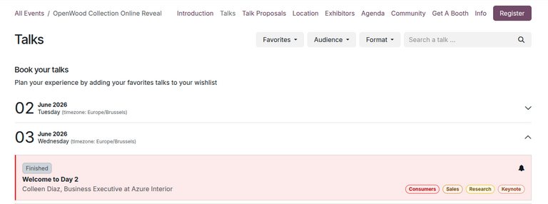
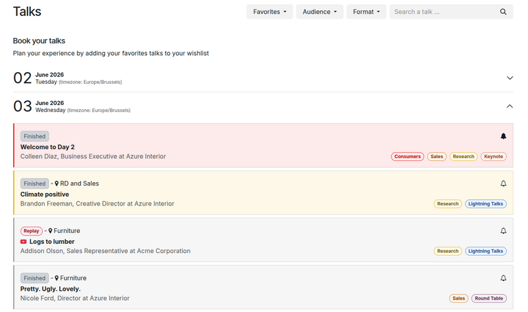
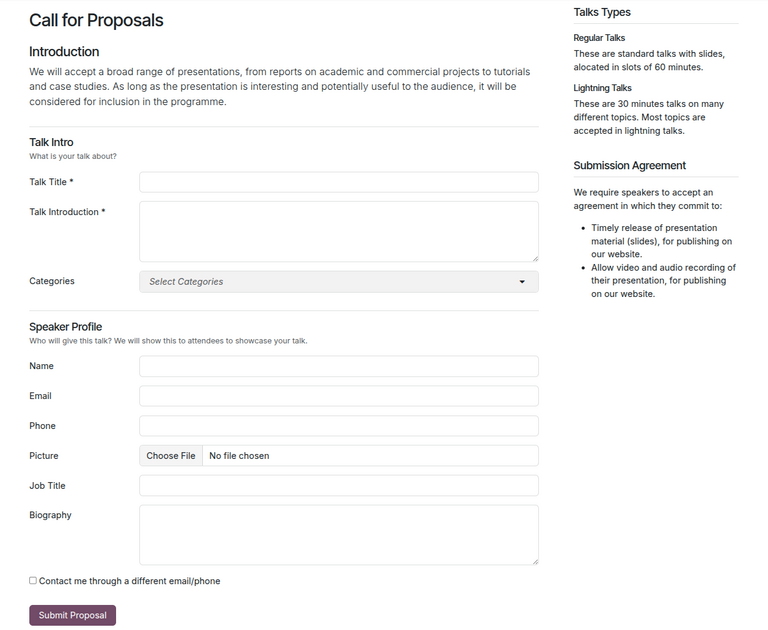
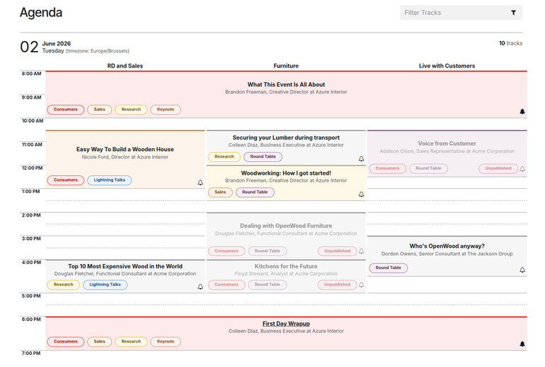

============================
Talks, proposals, and agenda
============================

With Odoo **Events**, visitors can use the event website to view tracks, propose talks, and see a
detailed agenda for their events.

.. important::
   In order to access talks, proposals, and agendas, internal users must have event tracks enabled
   and set up. See the :doc:`event_tracks` documentation to learn more about enabling and creating
   tracks.

.. _events/talks-proposals-agenda/website:

Event website
=============

When an internal user :doc:`creates an event <../event_setup/create_events>`, Odoo **Events**
generates a separate website for it on the user's Odoo-built website.

Visitors can access that event website in two ways:

#. Open the **Events** app, navigate to the specific event, and click the :guilabel:`Go to Website`
   smart button.

#. Or, while on the Odoo-built website, click the :guilabel:`Events` header option, then select the
   desired event.

On the event website, there is a sub-header menu with different pages, including the following:

- :guilabel:`Talks`: :ref:`View a schedule <events/talks-proposals-agenda/view-talks>` of all tracks
  scheduled for the event, listed by date.
- :guilabel:`Talk Proposals`: :ref:`Submit a proposal <events/talks-proposals-agenda/propose-talks>`
  to participate as a speaker during the event.
- :guilabel:`Agenda`: :ref:`View a calendar <events/talks-proposals-agenda/view-agenda>` of all
  scheduled tracks for the event, showing detailed times for each date.

.. note::
   If the sub-header menu does not appear, it must be manually enabled by the internal user.

   To do so, click the :guilabel:`Edit` button at the top. In the editor panel, click the
   :guilabel:`Customize` tab at the top, then enable the :guilabel:`Sub-menu (Specific)` setting.
   Finally, click :guilabel:`Save` to apply changes.

.. _events/talks-proposals-agenda/view-talks:

View talks
==========

The *Talks* page displays a schedule of planned tracks for the event, sorted by date.

Visitors can mark a track as a *Favorite* by clicking the :icon:`fa-bell-o` :guilabel:`(empty bell)`
icon to the right of the track title. A track marked as a *Favorite* appears with the
:icon:`fa-bell` :guilabel:`(filled bell)` icon. Visitors can then :ref:`filter tracks by favorites
<events/talks-proposals-agenda/filter-favorites>`.

Additionally, visitors can also :ref:`filter tracks by their tags
<events/talks-proposals-agenda/filter-tags>` (customized on each track's form).

.. _events/talks-proposals-agenda/filter-favorites:

Filter by favorites
-------------------

To filter the *Talks* page by any tracks marked as a *Favorite*, click on the :guilabel:`Favorites`
drop-down menu.

Visitors can then choose one of two options:

- :guilabel:`Favorites`: shows **only** tracks marked as *Favorite*.

- :guilabel:`All Talks`: shows **all** tracks.

.. note::
   If the visitor applies the :guilabel:`Favorites` option without having marked any tracks as a
   *Favorite*, all event tracks are displayed.

.. _events/talks-proposals-agenda/filter-tags:

Filter by tags
--------------

If any tracks have tags and tag categories configured in the database during :ref:`track creation
<events/event_tracks/create-track>`, additional drop-down filter menus will appear at the top of the
page next to the :guilabel:`Favorites` drop-down, allowing users to filter tracks by tag categories.

.. tip::
   To add tags and tag categories to track forms, navigate to the **Events** app and open the
   desired event. Click the :icon:`fa-microphone` :guilabel:`Tracks` smart button and open the
   desired event track.

   On the track form, type a new tag in the :guilabel:`Tags` field. Then, click :guilabel:`Create
   and edit...` from the resulting drop-down menu.

   Doing so reveals a :guilabel:`Create Tags` pop-up form with the following fields:

   - :guilabel:`Tag Name`: The name of the tag. This field is already populated.
   - :guilabel:`Color Index`: The color of the track associated with this tag, displayed on the
     website.
   - :guilabel:`Category`: The category of the tag. This category appears as the drop-down filter
     menu on the *Talks* page.

   .. image:: track_manage_talks/create-tags-popup.png
      :alt: The Create Tags pop-up form that coincides with drop-down filter menus on Talks page.

.. _events/talks-proposals-agenda/propose-talks:

Propose talks
=============

The *Talk Proposals* page allows visitors to submit a proposal for a talk via a custom online form.

.. tip::
   By default, the *Talk Proposals* page is automatically generated by Odoo. If needed, internal
   users can :doc:`edit <../../../websites/website/web_design/elements>` any part of the page,
   including the proposal form.

To submit their proposal, visitors fill out the form, then click the :guilabel:`Submit Proposal`
button.

Doing so creates a new track form in the database. Internal users can access it by navigating to the
**Events** app, clicking the relevant event, and selecting the :icon:`fa-microphone`
:guilabel:`Tracks` smart button. The newly-proposed talk now appears as a new track in the
:guilabel:`Proposal` stage.

At this point, an internal user can review the proposed talk and accept or deny the proposal by
moving the track to the appropriate stage in the pipeline.

If accepted, the internal user can publish the track on the event website by clicking the
:guilabel:`Go to Website` smart button and toggling the :guilabel:`Unpublished` switch at the top to
:guilabel:`Published`.

Visitors can then see the track on the *Talks* page.

.. _events/talks-proposals-agenda/view-agenda:

View agenda
===========

The *Agenda* page displays an event calendar, showing each talk's specified location by column and
its scheduled time by row.

Visitors can click any track on the calendar to open the track's specific page on the website.

.. tip::
   A talk's location can be found on its track form. To find it, navigate to **Events** app, click
   on the relevant event, click the :icon:`fa-microphone` :guilabel:`Tracks` smart button, and
   select the desired track. In the track form, view or modify the :guilabel:`Location` field.

