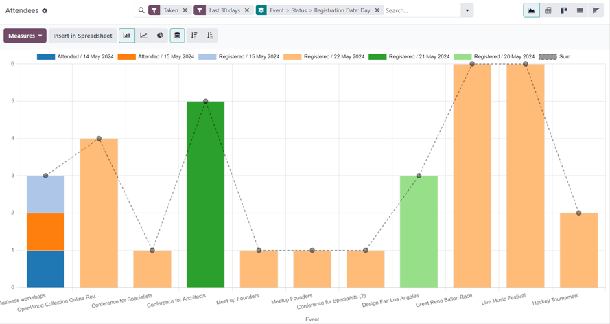
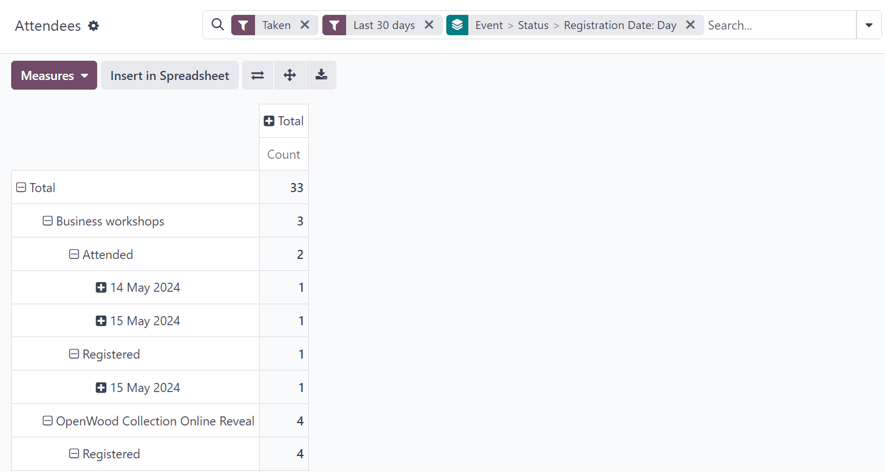
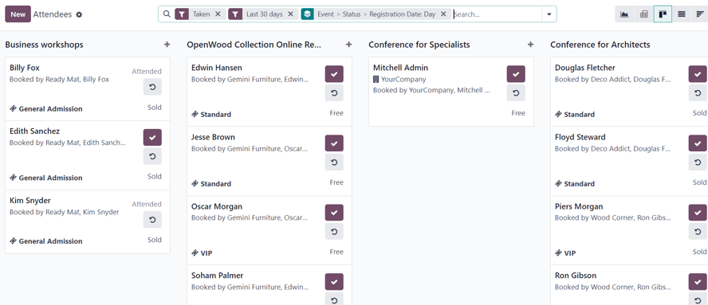
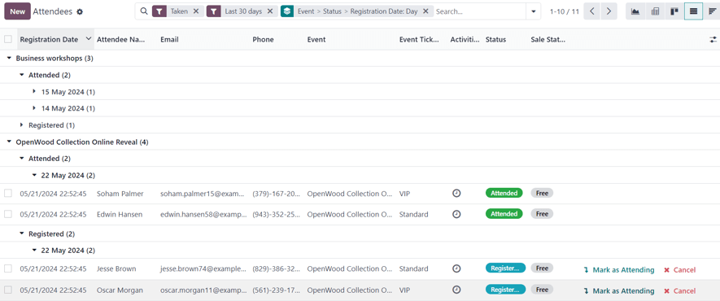
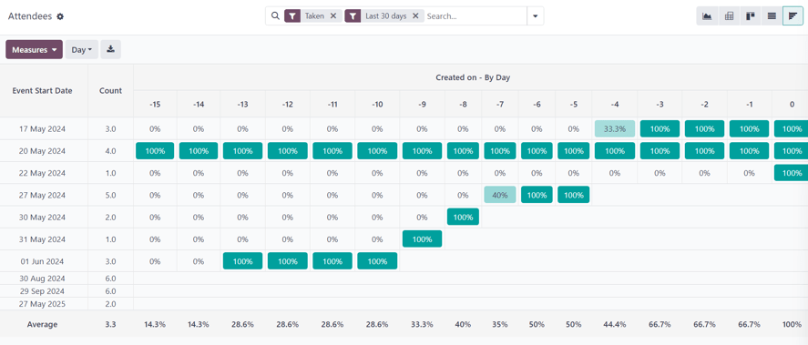

=================
Attendees reports
=================

The Odoo *Events* application allows users to create custom reports, based on the analytics and data
collected related to events. These reports can either be focused on the *Attendees* or the
*Revenues*. Both reporting pages offer their own unique array of metrics and options.

The following documentation focuses solely on the reporting options related to event *Attendees*.

Attendees reporting page
========================

To access the *Attendees* reporting page in the Odoo *Events* application, navigate to
:menuselection:`Events app --> Reporting --> Attendees`.

From the :guilabel:`Attendees` reporting page, users can create custom reports, based on a series of
metrics and data related to event attendees.

This reporting page can be viewed as a :icon:`fa-area-chart` :ref:`graph <attendees_reports/graph>`,
:icon:`oi-view-pivot` :ref:`pivot <attendees_reports/pivot>` table, :icon:`oi-view-kanban`
:ref:`Kanban <attendees_reports/kanban>`, :icon:`oi-view-list` :ref:`list <attendees_reports/list>`,
or :icon:`oi-view-cohort` :ref:`cohort <attendees_reports/cohort>`.

These views are accessible, via their respective icons, located in the upper-right corner of the
:guilabel:`Attendees` reporting page, and have the same options as other
:doc:`reporting <../../essentials/reporting>` pages, with the same :doc:`search, filter, and group
by <../../essentials/search>` functionality.

.. note::
   The ability to :ref:`export data <export-data>` is **only** available in the :ref:`pivot
   <attendees_reports/pivot>` and :ref:`cohort <attendees_reports/cohort>` views.

.. _attendees_reports/graph:

Graph view
----------

The :guilabel:`Attendees` reporting page appears in the graph view, with the stacked bar chart view
option, by default.

In the :guilabel:`Search...` bar, there are also some default filters and grouping selections. The
filter options specifically focus on attendee data :guilabel:`Taken` in the :guilabel:`Last 30
days`, and groups them by the date the attendees registered for the event (:guilabel:`Event > Status
> Registration Date: Day`).

.. note::
   Unless manually removed from the :guilabel:`Search...` bar, these default filters and groupings
   are applied to three other view options available on the :guilabel:`Attendees` page: pivot,
   Kanban, and list.

   The cohort view **only** has the :guilabel:`Taken` and :guilabel:`Last 30 days` filter options
   present, by default.

The :ref:`graph-specific view options <reporting/using-graph>` found on most reporting pages
throughout Odoo are present on the :guilabel:`Attendees` page, as well.

.. example::
   One way to utilize this view to analyze vital information related to events could be by using the
   following configurations on the :guilabel:`Attendees` reporting, while in graph view.

   First, switch to the :icon:`fa-pie-chart` :guilabel:`pie chart` option. Then, click the
   :icon:`fa-caret-down` :guilabel:`(down arrow)` icon to the right of the :guilabel:`Search...`
   bar, and choose to :guilabel:`Group By`: :guilabel:`Event` and :guilabel:`Ticket Type`.

   With those configurations, the pie chart showcases every event in the database, with each
   slice representing an event and ticket type, which would help determine what ticket types from
   each event resulted in the most attendees.

.. _attendees_reports/pivot:

Pivot view
----------

Click the :icon:`oi-view-pivot` :guilabel:`(pivot)` icon in the upper-right corner to view the
:guilabel:`Attendees` reporting metrics in a pivot table.

Unless manually removed from the :guilabel:`Search...` bar, the filter options specifically focus on
attendee data :guilabel:`Taken` in the :guilabel:`Last 30 days`, and groups them by :guilabel:`Event
> Status > Registration Date: Day`.

It should also be noted that the only option available in the :guilabel:`Measures` drop-down menu is
:guilabel:`Count`, which is selected, by default.

The default pivot table showcases the event names as rows, with subsequent rows for
:guilabel:`Attended` (if applicable) and :guilabel:`Registered`, along with specific dates (based on
the default filters in the :guilabel:`Search...` bar). There is only one row, showcasing the
:guilabel:`Count` for each related row.

The :ref:`functionality and use of this pivot view <reporting/using-pivot>` is the same as other
reporting pages throughout Odoo, which can be utilized to create custom pivot table results for a
variety of metrics.

.. example::
   This report can be modified to show which partners generated the most attendee registrations for
   each event.

   While in pivot view, remove the default filters and groupings from the :guilabel:`Search...` bar,
   and enter in the following configurations.

   Keep the event names as the rows, and click :icon:`fa-plus-square` :guilabel:`Total` at the top
   of the columns, above the :guilabel:`Count` , and select :guilabel:`Partner` from the resulting
   drop-down menu. Doing so shows how many attendees each partner was associated with for each event
   listed in the rows.

   That analysis can be taken even further by clicking the :icon:`fa-plus-square` beside any
   other available option to view more detailed options, via another drop-down menu, if desired.

.. _attendees_reports/kanban:

Kanban view
-----------

Click the :icon:`oi-view-kanban` :guilabel:`(Kanban)` icon in the upper-right corner to view the
:guilabel:`Attendees` reporting metrics in a Kanban view.

Unless manually removed from the :guilabel:`Search...` bar, the filter options specifically focus on
attendee data :guilabel:`Taken` in the :guilabel:`Last 30 days`, and groups them by :guilabel:`Event
> Status > Registration Date: Day`.

With those default filters and grouping in place, each event in the database appears as its own
Kanban stage, with each attendee represented by their own Kanban card beneath their respective
event.

Each attendee Kanban card shows their name, who they were booked by, the type of ticket they
purchased (if applicable), an indicator if the ticket was :guilabel:`Sold` or :guilabel:`Free`,
along with two clickable icon buttons: a :icon:`fa-check` :guilabel:`(checkmark)` icon and a
:icon:`fa-undo` :guilabel:`(undo)` icon.

When the :icon:`fa-check` :guilabel:`(checkmark)` icon is clicked, the attendee is manually marked
as :guilabel:`Attended`.

If the attendee was accidentally marked as :guilabel:`Attended`, click the :icon:`fa-undo`
:guilabel:`(undo)` icon to revert that action, which makes the :icon:`fa-check`
:guilabel:`(checkmark)` icon reappear on the attendee Kanban card.

Like with other reporting pages, the usual :doc:`search, filter, and group by
<../../essentials/search>` functionality can be utilized for more customized organization, if
needed.

.. example::
   The report can be modified to show a company how many people are showing up (and expected to show
   up) for an event that is currently taking place. To display this information, make the following
   adjustments to the report.

   In Kanban view on the :guilabel:`Attendees` reporting page, remove all the default filters and
   groupings from the :guilabel:`Search...` bar, and click the :icon:`fa-caret-down`
   :guilabel:`(down arrow)` icon to reveal the mega menu of :guilabel:`Filters` and :guilabel:`Group
   By` options.

   From that mega menu, select :guilabel:`Ongoing Events` from the :guilabel:`Filters` column. Then,
   select :guilabel:`Status` from the :guilabel:`Group By` column.

   With those configurations in place, the :guilabel:`Attendees` reporting page displays two
   columns: :guilabel:`Attended` and :guilabel:`Registered`.

.. _attendees_reports/list:

List view
---------

Click the :icon:`oi-view-list` :guilabel:`(list)` icon in the upper-right corner to view the
:guilabel:`Attendees` reporting metrics in a list view.

Unless manually removed from the :guilabel:`Search...` bar, the filter options specifically focus on
attendee data :guilabel:`Taken` in the :guilabel:`Last 30 days`, and groups them by :guilabel:`Event
> Status > Registration Date: Day`.

With those default filters and grouping in place, the data is presented in a nested list format,
with each event in the database revealing a nested sub-list that either contains the data for people
who have :guilabel:`Attended` or :guilabel:`Registered` for the event.

By default, the list view of the :guilabel:`Attendees` page showcases the following information in columns:
:guilabel:`Registration Date`, :guilabel:`Attendee Name`, :guilabel:`Email`, :guilabel:`Phone`,
:guilabel:`Event`, :guilabel:`Event Ticket`, :guilabel:`Activities` (if applicable),
:guilabel:`Status`, and :guilabel:`Sale Status`.

To add (or remove) columns from the list view of the :guilabel:`Attendees` reporting page, click the
:icon:`oi-settings-adjust` :guilabel:`(additional options)` icon, located to the far-right of the
column names, to reveal a drop-down menu of additional column options to choose from.

When the :icon:`fa-caret-right` :guilabel:`(right arrow)` beside a row title is clicked, the
sub-list for that row is revealed below. To re-tuck the list, click the subsequent
:icon:`fa-caret-down` :guilabel:`(down arrow)` beside the desired row title.

Like with other reporting pages, the usual :doc:`search, filter, and group by
<../../essentials/search>` functionality can be utilized for more customized organization, if
needed.

.. example::
   A company can modify this list to analyze which partners are registering the most attendees for
   events over a specific period of time (a month, quarter, or year). In this example, the data is
   analyzed for the current month (May), and is further organized by event and ticket type.

   To view a report with these parameters, the following configurations must be made.

   While in list view, remove all the default filters and groupings from the :guilabel:`Attendees`
   reporting page. Then, click the :icon:`fa-caret-down` :guilabel:`(down arrow)` to the right of
   the :guilabel:`Search...` bar to reveal the mega menu of :guilabel:`Filters` and :guilabel:`Group
   By` options.

   From this mega menu, select the :guilabel:`Registration Date` :icon:`fa-caret-down` drop-down
   menu, and select the current month, :guilabel:`May`. Doing so also selects the current year, as
   well.

   Then, choose the :guilabel:`Partner`, :guilabel:`Event`, :guilabel:`Ticket Type`, and
   :guilabel:`Status` from the :guilabel:`Group By` column.

.. _attendees_reports/cohort:

Cohort view
-----------

Click the :icon:`oi-view-cohort` :guilabel:`(cohort)` icon in the upper-right corner to view the
:guilabel:`Attendees` reporting metrics in a cohort table.

By default, the cohort view **only** has the :guilabel:`Taken` and :guilabel:`Last 30 days` filter
options present in the :guilabel:`Search...` bar, by default.

The data displayed in the cohort table is organized by :guilabel:`Day`, by default.

It should also be noted that the only option available in the :guilabel:`Measures` drop-down menu is
:guilabel:`Count`, which is selected, by default.

On the far-left, the column shows the :guilabel:`Event Start Date`, and next to the that is the
default :guilabel:`Count` measure option.

To the right of those columns is the body of the cohort table, showcasing the :guilabel:`Created on
- (selected time period)` data, which is :guilabel:`Day`, by default. The numbered columns below
that show the days (via negative integers) leading up to the start of the event (represented by the
:guilabel:`0` to the far-right).

Beneath each of those days leading up to the start of the event, there is a percentage indicating
how many tickets were :guilabel:`Taken` on that particular day (per the default settings present in
the :guilabel:`Search...` bar).

.. example::
   If an :guilabel:`Event Start Date` is May 17th, and has a :guilabel:`Count` of :guilabel:`3`,
   that means three total tickets were sold for that event, prior to it starting.

   If one of those three tickets was sold on May 13th (four days prior to the :guilabel:`Event Start
   Date`), a percentage of `33%` appears in the `-4` column for that event, indicating that one of
   the three possible tickets was sold four days prior to the event.

To change the designated time period, click :guilabel:`Day` (next to :guilabel:`Measures`) to reveal
a drop-down menu of options. Those options are the folowing: :guilabel:`Day`, :guilabel:`Week`,
:guilabel:`Month`, and :guilabel:`Year`.
