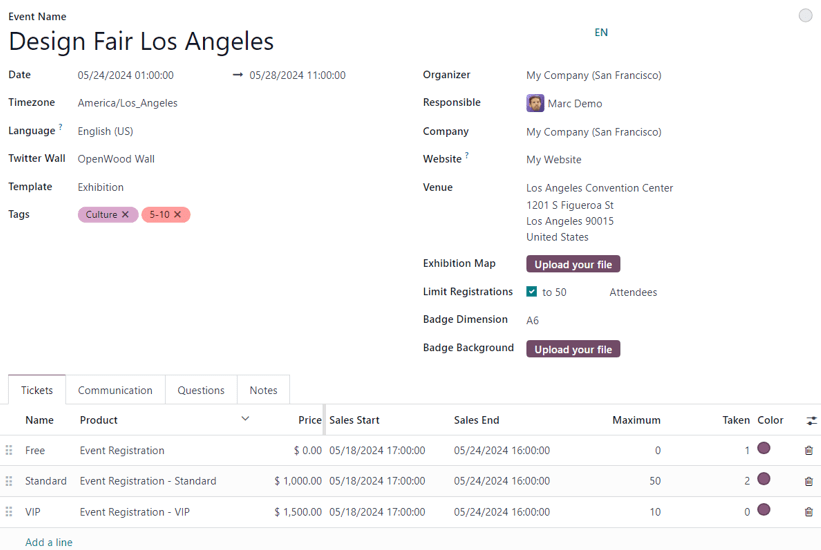
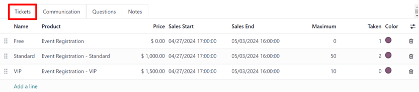
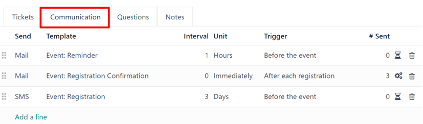
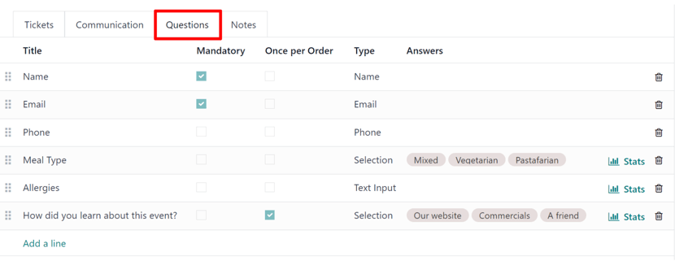
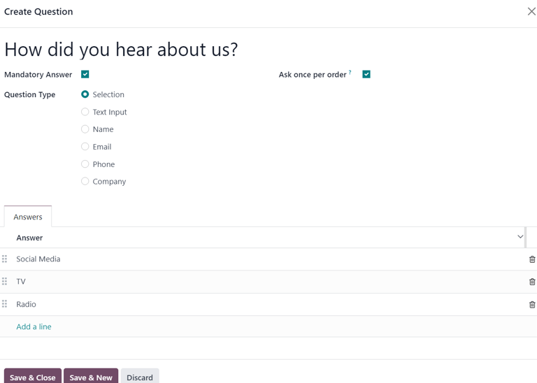
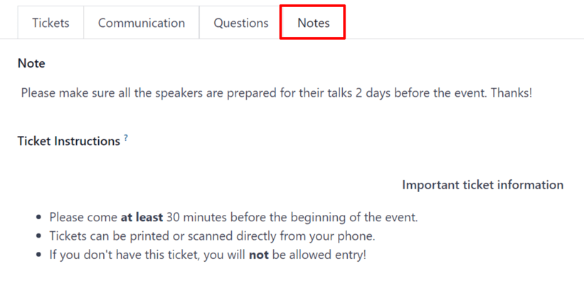

=============
Create events
=============

With the *Events* application, event organizers can create and configure in-person or online-only
events in Odoo. Each new event contains a number of customizable options that are geared around
specific event logistics, as needed per event, such as ticket sales and registration desk, booths,
tracks, sponsors, rooms, and more.

Events can be manually created from scratch or built off of pre-made templates. Once launched, the
*Events* application then integrates with the *Website* app for the front-end promotion and
registration of the event for attendees, the *Sales* app for the purchasing ability of paid tickets,
as well the *CRM* application through customizable lead generation rules.

New event
=========

To create a new event, begin by navigating to the :menuselection:`Events app` to land on the default
:guilabel:`Events` dashboard, in the :icon:`oi-view-kanban` :guilabel:`Kanban` view. From there, or
alternatively from the :icon:`oi-view-list` :guilabel:`List` or :icon:`fa-tasks` :guilabel:`Gantt`
views, click the :guilabel:`New` button in the upper-left corner of the dashboard to open up a new
event form.

.. note::
   If certain fields do not readily appear on the event form, that means an additional application
   needs to be installed, or the database is not operating in a multi-company environment.

   For example, the :guilabel:`Twitter Wall` field **only** appears if the *Social Marketing* app is
   installed, and the :guilabel:`Company` field **only** appears if the database is working in a
   multi-company environment.

   These are just *additional* elements that can be used for an event. They are **not** required to
   create, host, and manage an event with Odoo *Events*.

Event form
==========

At the top of the event form are a series of smart buttons related to various event metrics, which
will autopopulate with pertinent data once attendees begin to register, booths and sponsors sign on
for the event, the event takes place, and so on.

Primarily, these smart buttons are used as logistical portals to perform specific actions for the
event. The numeric displays are primarily for quick reference points.

While those visual metrics are useful, they can still be clicked, and used to navigate to
specific event-related pages to modify and/or perform any desired actions.

Beneath the smart buttons is the event form, which contains various fields and clickable tabs that
serve to configure the initial, necessary details of the event.

The following are fields found on an event form:

- :guilabel:`Event Name`: the title of the event. This field is **required**.

  .. note::
     To the right of the entered :guilabel:`Event Name`, there is a language tooltip, represented by
     an abbreviated language indicator (e.g. `EN`). When clicked, a :guilabel:`Translate: name`
     pop-up window appears, displaying various pre-configured language translation options available
     in the database.

- :guilabel:`Date`: when the event is scheduled to take place. This field is auto-populated, but
  modifiable, and is **required**.
- :guilabel:`Timezone`: the corresponding timezone related to the event. This field is
  auto-populated, but modifiable, and is **required**.
- :guilabel:`Language`: designate a specific language for all event communications to be translated
  into, if necessary. This field is blank, by default, so if event-related communications are being
  sent to recipients who speak a different language, be sure to configure this field properly.
- :guilabel:`Twitter Wall`: creates a separate page on the event website to feature specific social
  posts on X (formerly Twitter) that contain pre-determined desired elements.

  .. tip::
     To create and customize a :guilabel:`Twitter Wall`, type the name of the desired wall into the
     field, and select :guilabel:`Create and edit...` from the resulting drop-down menu.

     Doing so reveals :guilabel:`Create Twitter Wall` pop-up window.

     .. image:: create_events/twitter-wall-popup.png
        :align: center
        :alt: The Twitter Wall pop-up window in the Odoo Events application.

     From this window, enter a :guilabel:`Wall Name`. Then, select a certain word or hashtag for
     Odoo to search for on X, like `#WoodWorkingExpo24`, for example.

     Next, determine the :guilabel:`Type of tweets` Odoo should showcase with that predetermined
     criteria. The choices in this field are: :guilabel:`Recent`, :guilabel:`Popular`, or
     :guilabel:`Mixed`.

     Users also have the option to add a brief :guilabel:`Description` to the wall, as well.

     Lastly, the greyed-out, non-modifiable :guilabel:`Website URL` field will autopopulate with the
     full URL needed to access the document through the event website.

     An image can also be added to the wall by clicking the :icon:`fa-pencil` :guilabel:`(pencil)`
     icon that appears when the cursor hovers over the :guilabel:`(camera)` placeholder image in the
     upper-right corner of the pop-up window.

     Then, from the resulting file explorer window, select the desired image to be added to the
     wall.

     This :guilabel:`Twitter Wall` field **only** appears on the event form if the *Social
     Marketing* app is installed, and an X account has been added as a stream on the application. To
     learn more, check out the :doc:`Social marketing essentials
     <../social_marketing/essentials/social_essentials>` documentation.

- :guilabel:`Template`: choose a pre-configured event template from the resulting drop-down menu.

  Or, create a new one directly from this field, by typing in the name of the new template, and
  selecting either:

  - :guilabel:`Create` (which creates the template, and can be edited later) or
  - :guilabel:`Create and edit...` (which creates the template, and reveals a separate template page
    to configure the template in greater detail).

- :guilabel:`Tags`: add any corresponding tags to briefly describe the event (e.g. `Online`,
  `Conference`, etc.). Multiple tags can be added per event.

  .. tip::
     Tags can be displayed on events that are listed on the website by enabling the *Show on
     Website* checkbox from :menuselection:`Events app --> Configuration --> Event Tag Categories`.

- :guilabel:`Organizer`: designate the organizer of the event (a company, contact, or employee).
- :guilabel:`Responsible`: designate a user in the database to be responsible for this event.
- :guilabel:`Company`: designate which company in the database to which this event is related. This
  field **only** appears if working in a multi-company environment. This field is auto-populated,
  but modifiable, and is **required**.
- :guilabel:`Website`: choose to restrict the publishing of this event to a specific website created
  in Odoo. If this field is left blank, the event can be published on *all* websites in the
  database. To learn more, refer to the :doc:`Multiple websites
  <../../websites/website/configuration/multi_website>` documentation.
- :guilabel:`Venue`: enter event venue details. This field pulls pertinent information from the
  *Contacts* application. Alternatively, :guilabel:`Venue` information can be manually added in this
  field, as well. At the very least, there **must** be a venue name, address, city, zip code/region,
  and country entered.
- :guilabel:`Exhibition Map`: if desired, click the :guilabel:`Upload your file` button to upload an
  image of the event venue map.
- :guilabel:`Limit Registrations`: if this checkbox is ticked, a limit to the amount of
  registrations is added to the event, and that desired limit amount **must** be entered in the
  blank field before :guilabel:`Attendees`.
- :guilabel:`Badge Dimension`: select a desired paper format dimension for event badges. The options
  are: :guilabel:`A4 foldable`, :guilabel:`A6`, or :guilabel:`4 per sheet`.
- :guilabel:`Badge Background`: if desired, click the :guilabel:`Upload your file` button to upload
  a custom background image for event badges.

When the above fields in the event form have been adequately filled in, move on to the four tabs at
the bottom of the event form for further customization.

Those tabs are: :ref:`Tickets <events/event-tickets>`, :ref:`Communication
<events/event-communication>`, :ref:`Questions <events/event-questions>`, and :ref:`Notes
<events/event-notes>`.

.. _events/event-tickets:

Tickets tab
-----------

Create custom tickets (and ticket tiers) for events in the :guilabel:`Tickets` tab of an event form.

To create a ticket, click :guilabel:`Add a line` in the :guilabel:`Tickets` tab. Then, enter a name
for the ticket (e.g. `Basic Ticket` or `VIP`) in the :guilabel:`Name` field.

In the :guilabel:`Product` field, either select the pre-configured :guilabel:`Event Registration`
product, or create a new one by typing in the name of the new event registration product, and then
select either :guilabel:`Create` or :guilabel:`Create and edit...` from the resulting drop-down
menu.

.. important::
   Upon installing Odoo *Events*, a new product type, *Event Ticket*, becomes available on product
   forms (:menuselection:`Sales --> Products --> Products`). In order for an event registration
   product to be selectable in the *Tickets* tab, the event registration :guilabel:`Product Type`
   **must** be set to :guilabel:`Event Ticket`.

.. tip::
   Existing event registration products can be modified directly from this field, as well, by
   clicking the :icon:`oi-arrow-right` :guilabel:`(right arrow)` icon, located beside the event
   registration product. Doing so reveals that product's form. If the *Inventory* application is
   installed, additional choices are available to customize for the product.

Next, set the registration cost of the ticket in the :guilabel:`Price` field.

.. note::
   The *Sales Price* defined on the event registration product's product form sets the default cost
   of a ticket. Modifying the :guilabel:`Price` of a ticket in the :guilabel:`Tickets` tab, sets a
   new registration cost of the ticket for that event.

Next, determine a :guilabel:`Sales Start` and :guilabel:`Sales End` date in their respective fields.
To do that, click into the blank field to reveal a calendar popover. From there, select the desired
date and time, then click :icon:`fa-check` :guilabel:`Apply`.

Then, if desired, designate a :guilabel:`Maximum` amount of that specific ticket that can be sold.

The :guilabel:`Taken` column populates with the number of tickets that are sold.

Optionally, in the :guilabel:`Color` column, add a custom color to differentiate ticket badges. The
selected color displays on ticket badges when printed.

To delete any tickets from the :guilabel:`Tickets` tab, click the :icon:`fa-trash-o`
:guilabel:`(trash can)` icon on the corresponding line for the ticket that should be deleted.

.. tip::
   To add an optional :guilabel:`Description` column to the :guilabel:`Tickets` tab, click the
   :icon:`oi-settings-adjust` :guilabel:`(additional options)` drop-down menu, located to the
   far-right of the column titles.

   Then, tick the checkbox beside :guilabel:`Description` from the resulting drop-down menu.

   When added, the option to add brief descriptions for each event ticket appears, which can be used
   to inform attendees of any perks or amenities that may coincide with specific ticket purchases.

.. _events/event-communication:

Communication tab
-----------------

In the :guilabel:`Communication` tab of an event form, create various marketing communications that
can be scheduled to be sent at specific intervals leading up to, and following, the event.

.. note::
   By default, Odoo provides three separate pre-configured communications on every new event form.
   One is an email sent after each registration to confirm the purchase with the attendee. The other
   two are email event reminders that are scheduled to be sent at different time intervals leading
   up to the event to remind the recipient of the upcoming event.

To add a communication in the :guilabel:`Communication` tab, click :guilabel:`Add a line`. Then,
select the desired type of communication in the :guilabel:`Send` field. The options are:
:guilabel:`Mail`, :guilabel:`SMS`, :guilabel:`Social Post`, or :guilabel:`WhatsApp`.

There is no limit to the number of communications that can be added in the :guilabel:`Communication`
tab of an event form.

To delete a communication from the :guilabel:`Communication` tab, click the :icon:`fa-trash-o`
:guilabel:`(trash can)` icon on the corresponding communication line. Doing so removes the
communication from the event entirely.

.. important::
   The :guilabel:`Social Post` option **only** appears if the *Social Marketing* application is
   installed. The :guilabel:`WhatsApp` option **only** appears if the *WhatsApp Integration* module
   is installed.

   :doc:`WhatsApp <../../productivity/whatsapp>` templates **cannot** be edited during active
   configuration. A separate approval from *Meta* is required.

Mail
~~~~

Select an existing email template from the :guilabel:`Template` drop-down menu.

Next, define the :guilabel:`Interval`, :guilabel:`Unit`, and :guilabel:`Trigger` from their
respective drop-down fields, letting Odoo know when the communication should be sent.

The :guilabel:`Unit` options are: :guilabel:`Immediately`, :guilabel:`Hours`, :guilabel:`Days`,
:guilabel:`Weeks`, and :guilabel:`Months`.

Then, select an option from the :guilabel:`Trigger` drop-down menu. The options are:
:guilabel:`After each registration`, :guilabel:`Before the event`, and :guilabel:`After the event`.

The :guilabel:`Sent` column populates with the number of sent communications. And, beside the
number are different icons that appear, depending on the status of that particular communication.

The status of *Running* is represented by a :icon:`fa-cogs` :guilabel:`(three gears)` icon. The
status of *Sent* is represented by a :icon:`fa-check` :guilabel:`(checkmark)` icon. And, the status
of *Scheduled* is represented by an :icon:`fa-hourglass-half` :guilabel:`(hourglass)` icon.

.. example::
   To send a confirmation email an hour after an attendee registers for an event, configure the
   following communication:

   - :guilabel:`Interval`: `1`
   - :guilabel:`Unit`: :guilabel:`Hours`
   - :guilabel:`Trigger`: :guilabel:`After each registration`

.. note::
   Existing email templates can be modified directly from the :guilabel:`Template` drop-down menu,
   if necessary, by clicking the :icon:`oi-arrow-right` :guilabel:`(right arrow)` icon next to the
   template name. Doing so reveals a separate page where users can edit the :guilabel:`Content`,
   :guilabel:`Email Configuration`, and :guilabel:`Settings` of that particular email template.

   To view and manage all email templates, activate :ref:`developer-mode` and navigate to
   :menuselection:`Settings --> Technical --> Email: Email Templates`. Modify with caution as email
   templates effect all communications where the template is used.

.. _events/event-questions:

Questions tab
-------------

In the :guilabel:`Questions` tab of an event form, users can create brief questionnaires for
registrants to interact with, and respond to, after they register for the event.

These questions can be focused on gathering basic information about the attendee, learning about
their preferences, expectations, and other things of that nature. This information can also be used
to create more detailed reporting metrics, in addition to being utilized to create specific lead
generation rules.

.. note::
   By default, Odoo provides three questions in the :guilabel:`Questions` tab for every event form.
   The default questions require the registrant(s) to provide their :guilabel:`Name` and
   :guilabel:`Email`, and make it optional to include their :guilabel:`Phone` number, as well.

   The information gathered from the :guilabel:`Questions` tab can be found on the
   :guilabel:`Attendees` dashboard, accessible via the :icon:`fa-users` :guilabel:`Attendees` smart
   button. Odoo populates individual records that contain basic information about the registrant(s),
   as well as their preferences.

To add a question in the :guilabel:`Questions` tab, click :guilabel:`Add a line`. Doing so reveals a
:guilabel:`Create Question` pop-up window. From here, users can create and configure their question.

First, enter the question in the field at the top of the form. Then, decide if the question should
require a :guilabel:`Mandatory Answer` and/or if Odoo should :guilabel:`Ask once per order`, by
ticking their respective boxes, if desired.

If the :guilabel:`Ask once per order` checkbox is ticked, the question will only be asked once, and
its value is propogated to every attendee in the order (if multiple tickets are purchased at once).
If the checkbox is *not* ticked for this setting, Odoo will present the question for every attendee
that is connected to that registration.

Next, select a :guilabel:`Question Type` option:

- :guilabel:`Selection`: provide answer options to the question for registrants to choose from.
  Selectable answer options can be managed in the :guilabel:`Answers` column at the bottom of the
  pop-up window.
- :guilabel:`Text Input`: lets the users enter a custom response to the question in a text field.
- :guilabel:`Name`: provides registrants with a field for them to enter their name.
- :guilabel:`Email`: provides registrants with a field for them to enter their email address.
- :guilabel:`Phone`: provides registrants with a field for them to enter their phone number.
- :guilabel:`Company`: provides registrants with a field for them to enter a company they are
  associated with.

Once all the desired configurations have been entered, either click :guilabel:`Save & Close` to save
the question, and return to the :guilabel:`Questions` tab on the event form, or click
:guilabel:`Save & New` to save the question and immediately create a new question on a new
:guilabel:`Create Question` pop-up window.

As questions are added to the :guilabel:`Questions` tab, the informative columns showcase the
configurations of each question.

The informative columns are the following:

- :guilabel:`Title`
- :guilabel:`Mandatory`
- :guilabel:`Once per Order`
- :guilabel:`Type`
- :guilabel:`Answers` (if applicable)

For :guilabel:`Selection` and :guilabel:`Text Input` types, a :icon:`fa-bar-chart` :guilabel:`Stats`
button appears on the right side of the question line. When clicked, Odoo reveals a separate page,
showcasing the response metrics to that specific question.

To delete any question from the :guilabel:`Questions` tab, click the :icon:`fa-trash-o`
:guilabel:`(trash can)` icon on the corresponding question line.

There is no limit to the number of questions that can be added in the :guilabel:`Questions` tab of
an event form.

.. _events/event-notes:

Notes tab
---------

In the :guilabel:`Notes` tab of an event form, users can leave detailed internal notes and/or
event-related instructions/information for attendees.

In the :guilabel:`Note` field of the :guilabel:`Notes` tab, users can leave internal notes for other
event employees, like "to-do" lists, contact information, instructions, and so on.

In the :guilabel:`Ticket Instructions` field of the :guilabel:`Notes` tab, users can leave specific
instructions for people attending the event that appear on the attendees ticket.

Publish events
==============

Once all configurations and modifications are complete on the event form, it is time to publish the
event on the website. Doing so makes the event visible to website visitors, and makes it possible
for people to register for the event.

To publish an event after all the customizations are complete, click the :icon:`fa-globe`
:guilabel:`Go to Website` smart button at the top of the event form. Doing so reveals the event's
web page, which can be customized like any other web page on the site, via the :guilabel:`Edit`
button.

To learn more about website design functionality and options, consult the :doc:`Building block
<../../websites/website/web_design/building_blocks>` documentation.

Once the event website is ready to be shared, click the red :guilabel:`Unpublished` toggle switch
in the header menu, changing it to a green :guilabel:`Published` switch. At this point, the event
web page is published, and viewable/accessible by all website visitors.

Send event invites
==================

To send event invites to potential attendees, navigate to the desired event form, via
:menuselection:`Events app --> Events`, and click into the desired event. Following this, click the
:guilabel:`Invite` button in the upper-left corner of the event form.

Doing so reveals a blank email form to fill out, as desired. To learn more about how to create and
customize emails like this, refer to the :ref:`Create an email <email_marketing/create_email>`
documentation.

Proceed to create and customize an email message to send as an invite to potential attendees.
Remember to include a link to the registration page on the event website, allowing interested
recipients to quickly register.

.. tip::
   Sending emails from Odoo is subject to a daily limit, which, by default, is 200. To learn more
   about daily limits, visit the :ref:`email_issues/daily_limit_mail` documentation.

.. seealso::
   :doc:`track_manage_talks`
