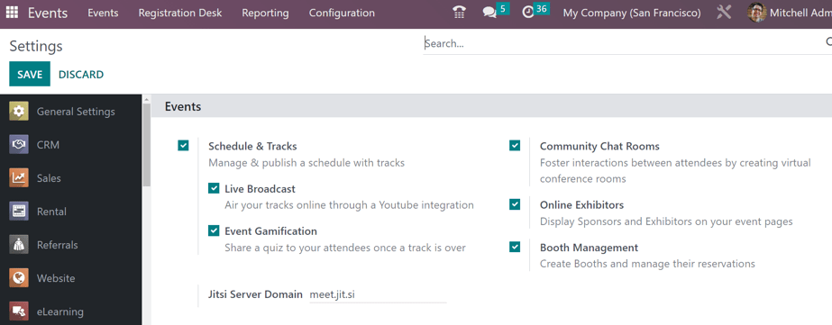
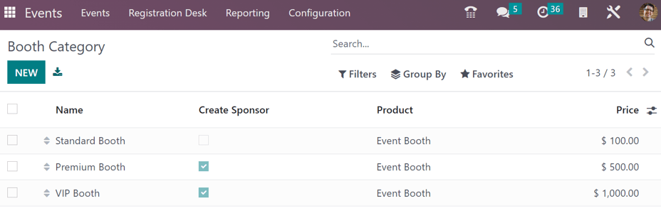
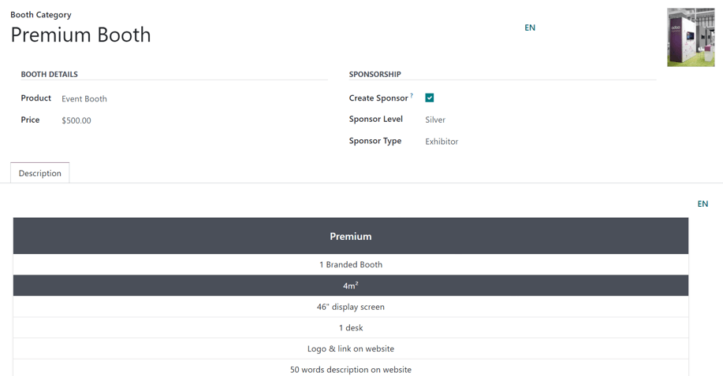
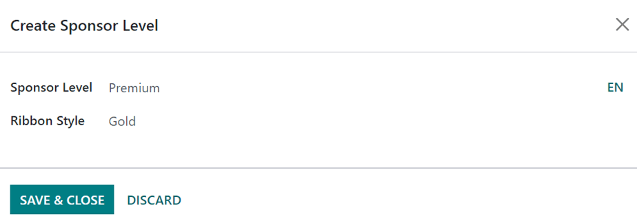
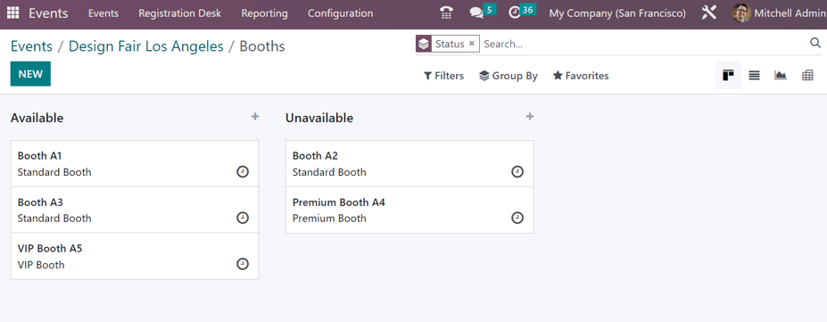
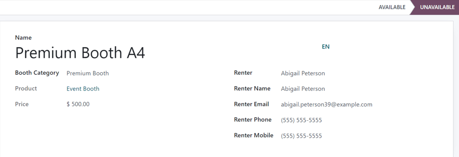
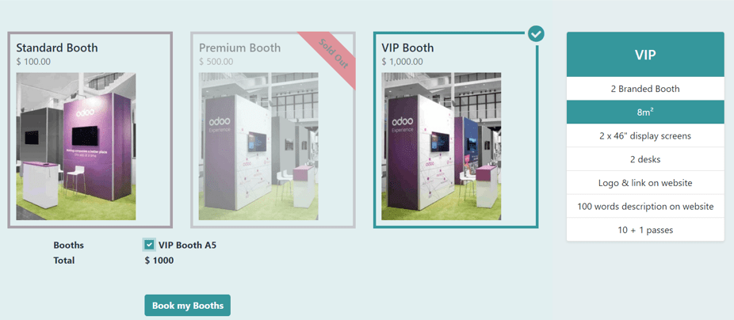

============
Event booths
============

Create event booths, sell their availability, and manage reservations with the Odoo **Events**
application.

Configuration
=============

To create, sell, and manage booths for events, the *Booth Management* feature **must** be
activated.

Navigate to :menuselection:`Events app --> Configuration --> Settings`, and in the
:guilabel:`Events` section, tick the :guilabel:`Booth Management` checkbox. Then, click
:guilabel:`Save`.

   The Booth Management setting in the Odoo Events application.

.. important::
   When the :guilabel:`Booth Management` setting is activated, a new *Product Type* becomes
   available on all product forms: *Event Booth*.

   Every created booth **must** be assigned a *Booth Category* on its respective booth form, and
   every booth category **must** have an *Event Booth* product assigned to it.

Booth categories
================

With the *Booth Management* setting activated in the **Events** app, the *Booth Categories* option
appears in the :guilabel:`Configuration` menu.

To access the :guilabel:`Booth Category` dashboard, go to :menuselection:`Events app -->
Configuration --> Booth Categories`, which reveals a list of all created booth categories.

On the :guilabel:`Booth Category` page, the following information for each booth category is listed:

- :guilabel:`Name`: the name of the booth category.
- :guilabel:`Create Sponsor`: If ticked, booking this booth category creates a sponsor for the user.
- :guilabel:`Product`: the *Event Booth* product associated with that specific booth category.
- :guilabel:`Price`: the price of a booth in that booth category.

When the :icon:`oi-settings-adjust` :guilabel:`(settings)` icon, located to the far-right of the
column titles, is clicked, a drop-down menu of additional column options appears. From the resulting
drop-down menu, tick the checkbox beside :guilabel:`Sponsor Level` and/or :guilabel:`Sponsor Type`
to reveal those columns on the :guilabel:`Booth Category` page.

To edit an existing booth category, select it from the list, and make any desired modifications.

Create booth category
---------------------

To create a booth category from the :guilabel:`Booth Category` page, click the :guilabel:`New`
button in the upper-left corner to reveal a blank booth category form.

Enter a name for the booth category in the top :guilabel:`Booth Category` field. This is a
**required** field.

To add a corresponding image to the booth category (e.g. a sample photo of the booth), click the
:icon:`fa-pencil` :guilabel:`(pencil)` icon that appears when the cursor hovers over the camera
placeholder in the upper-right corner of the booth category form. Then, upload the desired image to
the booth category form, if needed.

In the :guilabel:`Booth Details` section, users **must** assign a :guilabel:`Product` to the
category, and it **must** have *Event Booth* set as the *Product Type* on the product form.

Regardless of the listed price on the *Event Booth* product chosen, a custom :guilabel:`Price` can
be applied for this booth category in that field.

In the :guilabel:`Sponsorship` section, tick the :guilabel:`Create Sponsor` checkbox option, if the
user should be created as an official *Sponsor* of the event, whenever a booth belonging to this
category is booked.

When the :guilabel:`Create Sponsor` checkbox is ticked, two additional fields appear beneath it:
:guilabel:`Sponsor Level` and :guilabel:`Sponsor Type`.

.. note::
   :guilabel:`Sponsor Level` and :guilabel:`Sponsor Type` establish different distinctions of
   sponsors.

   For example, if a sponsor has been attached to a company for multiple years, they would be
   granted a higher level (e.g. *Gold* level), which provides them with immediate credibility and
   status. Whereas, conversely, a relatively new sponsor would be granted a lower level (e.g.
   *Bronze* level), which coincides with its own credibility and status.

Select a desired level of sponsorship from the :guilabel:`Sponsor Level` drop-down field.

.. tip::
   To modify any existing :guilabel:`Sponsor Level`, select it from the drop-down field, then click
   the :icon:`fa-arrow-right` :guilabel:`(right arrow)` that appears at the end of the line. Doing
   so opens a separate page, wherein the :guilabel:`Sponsor Level` name and :guilabel:`Ribbon Style`
   can be changed, if necessary.

Users can also create a new :guilabel:`Sponsor Level`, by typing in the name of the new level, and
clicking :guilabel:`Create and edit...` from the resulting drop-down menu.

Doing so reveals a :guilabel:`Create Sponsor Level` pop-up window.

.. note::
   Clicking :guilabel:`Create` from the resulting drop-down menu in this instance, creates the
   sponsor level, but does **not** immediately prompt the user to further configure it, via a
   :guilabel:`Create Sponsor Level` pop-up window.

From the :guilabel:`Create Sponsor Level` pop-up window, confirm the newly-created
:guilabel:`Sponsor Level`, and decide what kind of :guilabel:`Ribbon Style` should be applied, if
any.

The :guilabel:`Ribbon Style` options available in that drop-down field are: :guilabel:`No Ribbon`,
:guilabel:`Gold`, :guilabel:`Silver`, and :guilabel:`Bronze`.

If one is selected, that :guilabel:`Ribbon Style` appears with the sponsor's name on the event
website.

In the :guilabel:`Sponsor Type` field, choose one of the following options from the drop-down menu:
:guilabel:`Footer Logo Only`, :guilabel:`Exhibitor`, or :guilabel:`Online Exhibitor`.

- :guilabel:`Footer Logo Only`: the sponsor is only featured on the footer of the event website.
- :guilabel:`Exhibitor`: the sponsor is scheduled to be an exhibitor at the event.
- :guilabel:`Online Exhibitor`: the sponsor is scheduled to be an online exhibitor for a virtual
  event.

On the booth category form, beneath those sections (:guilabel:`Booth Details` and
:guilabel:`Sponsorship`), there is the :guilabel:`Description` tab. In this tab, enter any vital
information related to the booth category that would be important for any potential booth-buyer to
know about (e.g., the square footage, available amenities, size of display screen, etc.).

Add booth to an event
=====================

To add a booth to an event, navigate to an existing event form, via :menuselection:`Events
app --> Events`, and select the desired event from the :guilabel:`Events` dashboard. Or, click
:guilabel:`New` to open a blank event form.

From the event form, click the :guilabel:`Booths` smart button at the top of the page to reveal the
:guilabel:`Booths` page for that event.

The :guilabel:`Booths` page is displayed in a Kanban view, by default, with two different stages:
:guilabel:`Available` and :guilabel:`Unavailable`.

.. note::
   The :guilabel:`Booths` page of an event is also viewable in a :icon:`oi-view-list`
   :guilabel:`List` view, :icon:`fa-area-chart` :guilabel:`Graph` view, and :icon:`oi-view-pivot`
   :guilabel:`Pivot` view. All of which are accessible, via their icons, in the upper-right corner
   of the :guilabel:`Booths` page.

The booths present in the :guilabel:`Available` stage are still available for purchase. The booths
present in the :guilabel:`Unavailable` stage have already been purchased, and are no longer
available.

To modify any existing booth, click the desired booth from the :guilabel:`Booths` page, and make any
necessary changes from the booth form. Or, create a new one, by clicking the :guilabel:`New` button
in the upper-left corner of the :guilabel:`Booths` page to reveal a blank booth form.

Booth form
----------

The booth form in Odoo **Events** lets users customize and configure event booths.

Start by typing in a :guilabel:`Name` for the booth. This is a **required** field.

Then, apply a :guilabel:`Booth Category` to the booth. This is a **required** field.

.. tip::
   A new :guilabel:`Booth Category` can be created from this field, by typing in the name of the
   new category, and clicking :guilabel:`Create and edit...` from the resulting drop-down menu.
   Doing so reveals a :guilabel:`Create Booth Category` pop-up window, with all the standard fields
   found on a common booth category form.

   Clicking :guilabel:`Create` from the resulting drop-down menu that appears after typing in a new
   name creates the category, but does **not** reveal the :guilabel:`Create Booth Category` pop-up
   window. The category would have to be modified later, via the *Booth Categories* page
   (:menuselection:`Events app --> Configuration --> Booth Categories`).

Upon selecting a :guilabel:`Booth Category`, two additional, non-modifiable fields appear:
:guilabel:`Product` and :guilabel:`Price`. Both fields represent their respective selections for
that specific booth category.

When a person purchases a booth rental through the event website, the subsequent renter-related
fields on the form auto-populate, based on the information provided by the purchaser during the
online transaction. The booth also automatically changes its status from :guilabel:`Available` to
:guilabel:`Unavailable`.

However, if the rental of a booth is conducted in any other way (e.g., in person, via sales order,
etc.), the :guilabel:`Renter`, :guilabel:`Renter Name`, :guilabel:`Renter Email`, :guilabel:`Renter
Phone`, and :guilabel:`Renter Mobile` fields can be entered manually.

The status of the booth (:guilabel:`Available` or :guilabel:`Unavailable`) can also be changed
manually, either by clicking the appropriate status from the status bar present on the booth form,
or by dragging-and-dropping the desired booth into the appropriate stage, via the *Booths* page,
while in Kanban view.

Sell event booths
=================

With event booths configured on the event form, Odoo presents them on the event website, via the
*Get A Booth* event subheader link.

To access the *Get A Booth* page on the event website, open the :menuselection:`Events app`, and
select the desired event from the :guilabel:`Events` dashboard. From the event form, click the
:guilabel:`Go to Website` smart button to be taken to the Odoo-built event website.

If the event subheader menu (with the :guilabel:`Get A Booth` option) is *not* showing up on the
event website, there are two ways to make it appear.

While on the event website, enter the edit mode by clicking the :guilabel:`Edit` button in the
upper-right corner. Then, click into the :guilabel:`Customize` tab of the resulting sidebar of web
design tools.

In the :guilabel:`Customize` tab, click the toggle switch for :guilabel:`Sub-Menu (Specific)`, and
click :guilabel:`Save`. Doing so reveals the event subheader menu with various options.

Alternatively, enter :doc:`Debug mode <../../general/developer_mode>`, and open the specific event
form in the **Events** application.

On the event form, with *Debug mode* on, an array of subheader menu options appears. Tick the
checkbox for :guilabel:`Website Submenu`, in order for the submenu to appear on the event website.
Doing so also ticks every other submenu-related checkbox automatically.

At this point, choose which options to keep on the event subheader menu. In this case, make sure the
:guilabel:`Booth Register` checkbox is ticked.

On the event website, click the :guilabel:`Get A Booth` event subheader menu option. Doing so
reveals the :guilabel:`Get A Booth` page, showcasing all the configured event booths that were
created.

From here, the visitor can select their desired booth option. Next, they would click the
:guilabel:`Book my Booths` button, located at the bottom of the :guilabel:`Get A Booth` page.

Doing so reveals a :guilabel:`Sponsor Details` page, wherein they fill out either *Sponsor Details*
or *Contact Details*, depending on how the booth was configured on the event form. The fields
present on this form vary, depending on whether it is meant for a basic contact or an event sponsor.

.. note::
   If the selected booth has the *Create Sponsor* checkbox ticked, this page reads as *Sponsor
   Details*.

The information provided on this page is used to auto-populate the renter-related information on the
booth form.

Once the necessary information has been entered, the booth purchaser then clicks the :guilabel:`Book
my Booths` button at the bottom of the page, and completes the typical checkout process.

Upon successful payment confirmation, that selected booth automatically moves to the *Unavailable*
stage on the event-specific *Booths* page in the **Events** application (accessible via the *Booths*
smart button on the event form).

Also, the provided *Sponsor* information (if applicable), and *Sales Order* information, are
accessible from the specific event form, via their respective smart buttons that appear at the top
of the form.

.. note::
   Click the *Sponsors* smart button on an event form to view and modify any information about the
   sponsor, if necessary.
