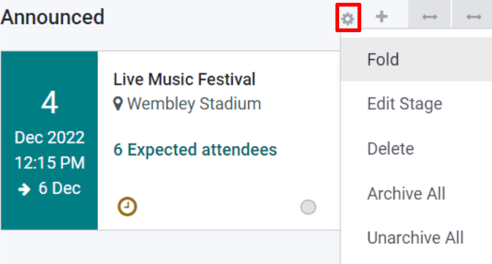
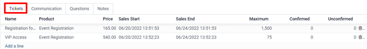
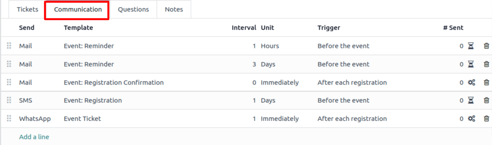
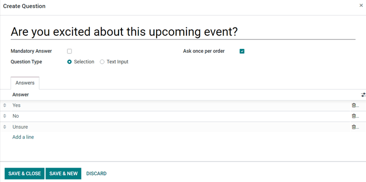
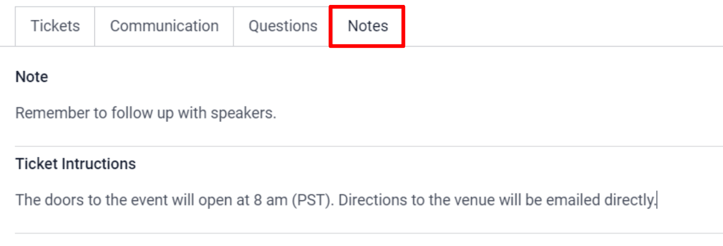
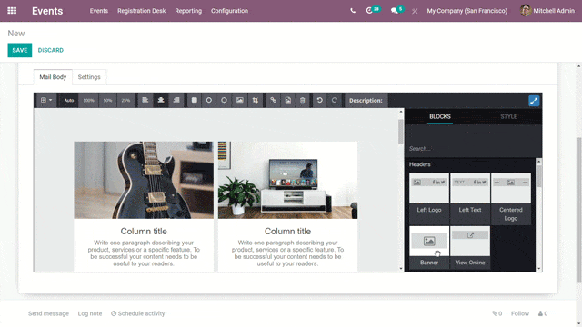
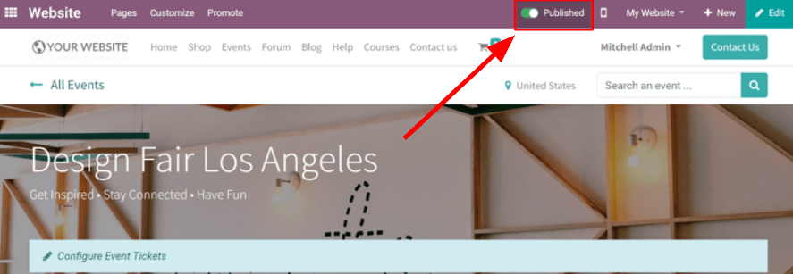

================
Event essentials
================

Odoo Events provides event coordinators with an arsenal of planning, communications, and reporting
tools to create immersive and engaging experiences for customers. Namely, staff can create and
publish events on their website, sell tickets online, scan tickets with Odoo barcode, send out
automated emails, and generate rich reporting data once the event accepts registrations.

Kanban concepts and organization
================================

To get started, click on the :guilabel:`Events` application on the home dashboard, which then leads
to the kanban view populated with a variety of pipeline stages. Key information is listed on each
event card, such as the date/time of the event, along with the number of expected (and confirmed)
attendees.

To create a new stage, click :guilabel:`Add a Column` and provide a befitting title to reflect the
purpose of that stage.

To reorganize the stages, just drag-and-drop them until they are in the correct order. Stages can
also be “folded” in the kanban for a cleaner presentation, via the :guilabel:`Settings` menu to the
right of each stage's title, which is represented by a gear icon.

.. note::
   The gear icon, by default, is hidden and will appear next to the  :guilabel:`+` icon when moused
   over.

When clicked, a drop-down menu of settings will appear.

Create a new event
==================

To create an event, click :guilabel:`Create` from the Events dashboard. Odoo will then direct the
page to a blank event template form.

From the event form, fill out the necessary fields, either by choosing from existing data in the
Odoo database or by creating and editing new field data. Key information to enter for the event
includes:

- :guilabel:`Event Name`: give the event a title.
- :guilabel:`Date`: includes the start and end dates/times for the event.
- :guilabel:`Timezone`: covers the timezone for when the event is taking place.
- :guilabel:`Template`: choose from a pre-built event template or build a custom one and connect it
  here.
- :guilabel:`Tags`: add tags to indicate briefly what the event is for (e.g. `tradeshow`). Tags
  help better organize event cards in the kanban and are useful when using search filters during
  reporting periods.
- :guilabel:`Organizer`: detail the organizer(s) for the event. This field is usually the company
  that owns the Odoo database, or a vendor.
- :guilabel:`Responsible`: name the point person who is responsible for organizing the event.
- :guilabel:`Website`: indicate which Odoo website(s) the event event should be published to.
- :guilabel:`Venue`: list the venue details here if it's a new record, or choose from an existing
  location.
- :guilabel:`Limit Registrations`: when enabled, this setting caps the attendee registrations to a
  specified amount
- :guilabel:`Autoconfirmation`: when enabled, this setting skips the confirmation request that gets
  sent by email to event registrants, and automatically confirms their registration.

Once the fields in the event form are set, move on to the :guilabel:`Tickets` and
:guilabel:`Communication` tabs, and optionally the :guilabel:`Questions` tab if registrations
should require additional information.

Add and sell event tickets
--------------------------

Under the :guilabel:`Tickets` tab, add line items for each type of ticket the event plans to offer.
Here, determine the ticket price, start/end dates for registrations, as well as the maximum number
of tickets that can be sold.

If selling tickets isn't necessary for the event, a simple :guilabel:`Registration` button will be
displayed on the event's page by default.

Send automated emails, text, and social posts to event attendees
----------------------------------------------------------------

Under the :guilabel:`Communication` tab, configure personalized email, SMS, or social post messages
to keep in touch with event attendees. For each communication, click :guilabel:`Add a line` in the
:guilabel:`Communication` tab form, and then choose (or create) a communications template using
the drop-down menu under the :guilabel:`Template` column.

Next, define the :guilabel:`Interval` and :guilabel:`Unit` of time for how often the communication
should be sent; use these time fields to specify the frequency of :guilabel:`Hours`,
:guilabel:`Days`, :guilabel:`Weeks`, or :guilabel:`Months` communications should be sent. There is
also the option to send communications `Immediately` after a specified :guilabel:`Trigger` is
activated.

In the last column, determine the :guilabel:`Trigger` which controls how and when the communication
is sent. For this action, choose between: :guilabel:`Before the event`, :guilabel:`After each
registration`, or :guilabel:`After the event`.

Attach a questionnaire to event registrations
---------------------------------------------

Implementing a questionnaire during event sign up is an effective way to gauge the wants, needs,
and interests of the event's attendees ahead of time. Questionnaires also act as informative
analytics tools for reporting periods before (or after) events take place.

To create a questionnaire, from the :guilabel:`Events` application, navigate to
:menuselection:`Configuration --> Settings` and then enable the :guilabel:`Questions` setting.

With the setting enabled, questions and answers can now be added (and recorded) under the the
:guilabel:`Questions` tab back on the event form. For each question, specify if it should only
be asked once with the :guilabel:`Ask once per order` checkbox, or if the question requires a
:guilabel:`Mandatory Answer`, which will make the question required for registration.

.. example::
   If the :guilabel:`Once per order` checkbox is enabled, then a single registration for 3 event
   attendees will show the questionnaire only once.

There are two :guilabel:`Question Types` to choose from: :guilabel:`Selection` and :guilabel:`Text
Input`. The :guilabel:`Selection` type, allows attendees to select an answer from pre-configured
options, which are entered in the :guilabel:`Answers` tab below. The :guilabel:`Text Input` type
allows attendees to write in their own answer to the question in a text box.

Log internal notes or add ticket instructions
---------------------------------------------

In the :guilabel:`Notes` tab, there is the option to add a :guilabel:`Note` and/or :guilabel:`Ticket
instructions`.

Under :guilabel:`Note`, internal notes can be left (such as: to-do lists, contact information,
etc.) for event staff to reference. In the :guilabel:`Ticket instructions` field, helpful
information for staff and attendees can be shared (like, directions to the venue, opening/closing
times, etc.)

.. tip::
   Type `/` in either text field (:guilabel:`Note` or :guilabel:`Ticket instructions`) to reveal a
   sub-menu of :guilabel:`Structure` options. These options provide various formatting options to
   ensure vital internal information is organized for event staff to review.

Invite attendees to the event
=============================

To invite people to an event, click the :guilabel:`Invite` button located in the top left corner of
the event form.

Inside the invite template form, are options to sent email or SMS invites. Each message can be fully
customized, and recipients can be added.

Adding a :guilabel:`Subject` line for the invite message is required, but the :guilabel:`Preview
Text` field is optional. The :guilabel:`Preview Text` is a catchy preview sentence meant to
encourage recipients to open the email.

.. note::
   In most cases, the :guilabel:`Preview Text` is displayed next to the subject. Keep this field
   empty to ensure the first characters of the email content appear, instead.

Select invitees and configure recipient filters
-----------------------------------------------

In the middle of the invitation form, find and click the :guilabel:`Recipients` field, to reveal a
drop-down menu of recipient options. These choices represent where Odoo will find the desired
recipients' information.

Once an option from this menu is selected (e.g. :guilabel:`Applicant`, :guilabel:`Contact`,
:guilabel:`Event Registration`, :guilabel:`Lead/Opportunity`, etc.), Odoo will send the invitation
to all recipients who match that initial rule. Additional rules can be added to narrow down the
target recipients, by clicking :guilabel:`Add Filter`.

.. image:: event_essentials/add-filter-button.png
   :align: center
   :alt: View of the add filter button beneath the recipients field in Odoo Events.

Clicking :guilabel:`Add Filter` reveals three fields, formatted like an equation. To reveal the
sub-menu options, click each field, and make the desired selections, until the preferred
configuration has been acheived. The number of :guilabel:`Records` that match the rule(s) are
indicated to the right of the :guilabel:`Recipients` field, in green.

.. note::
   Some sub-menu options in the first rule field allow for a second choice to provide even more
   specificity.

To the right of each rule, are :guilabel:`x`, :guilabel:`+`, and :guilabel:`...` icons. The
:guilabel:`x` icon deletes a specific node (line) of the rule. The :guilabel:`+` icon adds a node
(line) to the rule. And, the :guilabel:`...` icon adds a branch to the node. A branch means two
additional, indented sub-nodes are added to the rule, providing even more specificity to the line
above it.

Build a custom event invite
---------------------------

In the :guilabel:`Mail Body` tab, there are a number of pre-configured message templates to choose
from. Select the desired template, and modify every element of its design details with Odoo's
drag-and-drop web builder, located on the right sidebar.

.. tip::
   To build an email event invite from scratch, select the :guilabel:`Plain Text` template, and
   Odoo will provide a blank email canvas, which can be customized either by using the frontend
   rich text editor that accepts slash (`/`) commands, or the XML code editor when :ref:`developer
   mode <developer-mode>` is engaged and the :guilabel:`</>` icon is pressed.

.. note::
   The :guilabel:`Mail Body` tab (and template options), are only available if the event invite
   :guilabel:`Mailing Type` is designated as an :guilabel:`Email`. If :guilabel:`SMS` is the
   :guilabel:`Mailing Type`, a :guilabel:`SMS Content` tab (consisting of a blank text space), is
   available, instead.

Modify event invite settings
----------------------------

The options under the :guilabel:`Settings` tab are different, depending on the specified
:guilabel:`Mailing Type`.

If the :guilabel:`Email` option is selected as the :guilabel:`Mailing Type`, an employee can be
designated as the :guilabel:`Responsible`, meaning that person is the one responsible for this
particular invite message. :guilabel:`Send From` and :guilabel:`Reply To` email aliases can be
designated here, as well.

Also, if any specific documents are required (or helpful) for this event invite, they can be sent
along with this email, by clicking :guilabel:`ATTACH A FILE`, and adding the appropriate
document(s).

If the :guilabel:`SMS` option is selected as the :guilabel:`Mailing Type`, a :guilabel:`Responsible`
can be designated, and the option to :guilabel:`Include an opt-out link` is available.

Send event invitations to recipients
------------------------------------

If the selected :guilabel:`Mailing Type` is :guilabel:`Email`, there are three options to send the
invite: :guilabel:`Send`, :guilabel:`Schedule`, and :guilabel:`Test`.

The :guilabel:`Send` option sends the invite right away. The :guilabel:`Schedule` option reveals a
pop-up, in which a scheduled date/time can be selected for the email to be sent. The
:guilabel:`Test` option reveals a :guilabel:`Test Mailing` pop-up, where specific recipient email
addresses can be entered for Odoo to send them the current version of the mailing for review before
officially sending it out to prospective event attendees.

If the selected :guilabel:`Mailing Type` is :guilabel:`SMS`, there are four options to send the
invite: :guilabel:`Put in Queue`, :guilabel:`Send Now`, :guilabel:`Schedule`, and :guilabel:`Test`.

The :guilabel:`Put in Queue` option schedules an SMS message to all recipients (that match the
designated rules, if any) in the near future. Clicking :guilabel:`Put in Queue` reveals a pop-up,
requiring confirmation. When confirmed, a blue banner appears on the event invite template form,
indicating that the SMS will be sent later that day.

.. note::
   The :guilabel:`Send Now`, :guilabel:`Schedule`, and :guilabel:`Test` options all function the
   same way for both :guilabel:`Mailing Type` options.

Publish events
==============

Until an event is published, it will remain hidden from public view on the website and registering
for it will not be possible. To publish an event, navigate to it either from the backend of Odoo
through the :guilabel:`Events` application, or access the hidden event page through the frontend
as either a priveliged user or administrator.

If navigating from the backend, go to the event form, and click the :guilabel:`Go to Website`
smart button to reach the event page on the website (on the frontend). If starting from the frontend
, simply navigate to the event page that needs to be published.

No matter the route, an event page can only be published from the frontend. In the upper right
corner of the event page on the website, toggle the switch from the red :guilabel:`Unpublished`
status to the green :guilabel:`Published` status. Doing so instantly makes the event page
accessible to the public on the website.

