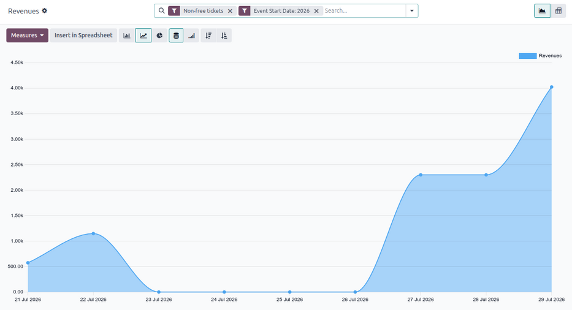
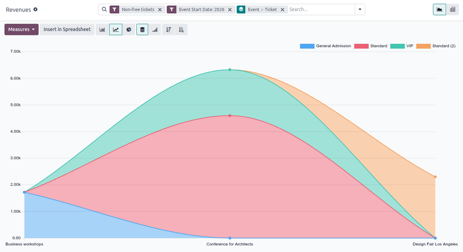
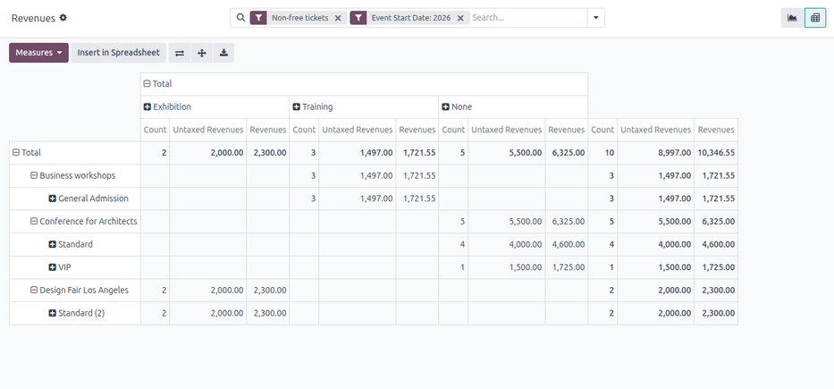

===============
Revenues report
===============

The Odoo **Events** application creates custom reports, based on event-related data and analytics.
These reports can either be focused on *Attendees* or *Revenues*.

The following documentation focuses on the reporting options related to event *Revenues*.

Revenues reporting page
=======================

To access the *Revenues* reporting page, navigate to :menuselection:`Events app --> Reporting -->
Revenues`.

By default, the :guilabel:`Revenues` reporting page appears as a graph (a :icon:`fa-line-chart`
:guilabel:`(Line Chart)` with :icon:`fa-database` :guilabel:`(Stacked)` data). The default filters,
:guilabel:`Non-free tickets` and :guilabel:`Event Start Date: (current year)`, are applied in the
search bar.

.. tip::
   To learn more about the various graph views (and graph view options), refer to the :ref:`Graph
   views <reporting/using-graph>` documentation.

The *Revenues* reporting page can also be viewed as a :ref:`pivot table <reporting/views/pivot>`, by
clicking the :icon:`oi-view-pivot` :guilabel:`(Pivot)` icon in the upper-right corner.

Measures
--------

Choosing specific :ref:`measures <reporting/choosing-measures>` allows users to customize reporting
pages.

Clicking the :guilabel:`Measures` drop-down button reveals the following options:

- :guilabel:`Revenues`: Shows the revenues generated from events.
- :guilabel:`Untaxed Revenues`: Shows the untaxed revenues generated from events.
- :guilabel:`Count`: Shows the total number of registrants who attended events.

.. note::
   In graph view, only one of the :guilabel:`Measures` can be selected at a time.

   When the pivot option is selected, all :guilabel:`Measures` options are selected, by default.

Filters and grouping options
----------------------------

To reveal a drop-down menu of filter and grouping options, click the :icon:`fa-caret-down`
:guilabel:`(down arrow)` next to the search bar.

The drop-down menu allows users to set :ref:`Filters <search/preconfigured-filters>` and :ref:`Group
By <search/group>` options.

.. note::
   If a time-related option has been selected from the :guilabel:`Filters` column (e.g. the default
   :guilabel:`Event Start Date: (year)` filter), a :guilabel:`Comparison` column appears, with
   comparison options for the corresponding time-related filter option selected.

   Only **one** selection can be made from the :guilabel:`Comparison` column at a time.

.. seealso::
   :doc:`../../../essentials/search`

Filter options
~~~~~~~~~~~~~~

The :guilabel:`Filters` column in the search bar's drop-down menu allows users to restrict the data
to specific criteria.

Multiple options in the :guilabel:`Filters` column can be selected at once. Options can be applied
to any view.

The :guilabel:`Filters` column has the following options:

- :guilabel:`Non-free tickets`: Filter by event tickets/registrations that are not free.
- :guilabel:`Free`: Filter by event tickets/registrations that are free.
- :guilabel:`Pending payment`: Filter by event tickets/registrations that are purchased but are
  pending payment.
- :guilabel:`Sold`: Filter by event tickets/registrations that are sold and paid for.
- :guilabel:`Registration Date`: Filter by a specific registration date. Click the
  :icon:`fa-caret-down` :guilabel:`(down arrow)` icon to reveal a list of month, quarter, and year
  options.
- :guilabel:`Upcoming/Running`: Filter by current or future events.
- :guilabel:`Past Events`: Filter by completed events.
- :guilabel:`Event Start Date`: Filter by a specific event start date. Click the
  :icon:`fa-caret-down` :guilabel:`(down arrow)` icon to reveal a list of month, quarter, and year
  options.
- :guilabel:`Event End Date`: Filter by a specific event end date. Click the :icon:`fa-caret-down`
  :guilabel:`(down arrow)` icon to reveal a list of month, quarter, and year options.
- :guilabel:`Published Events`: Filter by published events.
- :guilabel:`Add Custom Filter`: Create a :ref:`custom filter <search/custom-filters>` to analyze
  event-related revenue data.

Group By options
~~~~~~~~~~~~~~~~

The :guilabel:`Group By` column in the search bar's drop-down menu allows users to group the data by
specific criteria.

Multiple :guilabel:`Group By` options can be selected at once.

The :guilabel:`Group By` column has the following options:

- :guilabel:`Event Type`: Group data based on the type of event.
- :guilabel:`Event`: Organize data into individual groups, separated by events.
- :guilabel:`Product`: Group data based on the event registration product.
- :guilabel:`Ticket`: Group data based on the type of event ticket purchased by attendees.
- :guilabel:`Registration Status`: Group data based on the status of registrations.
- :guilabel:`Sale Order Status`: Group data based on the status of event-related sales orders.
- :guilabel:`Customer`: Group data based on customer records.
- :guilabel:`Add Custom Group`: Create a :ref:`custom group <search/group>` to organize data by
  additional fields. Click the :icon:`fa-caret-down` :guilabel:`(down arrow)` icon to reveal a
  drop-down of grouping options. Multiple selections can be made.

Sample report: event ticket analysis (graph)
============================================

The following is an example of how various filters and grouping options can be used to compare the
distributions of paid tickets and free tickets for published events, organized by ticket type and
event.

To create this report, navigate to :menuselection:`Events app --> Reporting --> Revenues`. Stay in
the default graph view but remove the default filters from the search bar.

Then, click the :icon:`fa-caret-down` :guilabel:`(down arrow)` next to the search bar. From here,
select :guilabel:`Free` and :guilabel:`Sold` from the :guilabel:`Filters` column.

To view data related **only** to already published events, select the :guilabel:`Published Events`
option in the :guilabel:`Filters` column.

Next, in the :guilabel:`Group By` column, select the :guilabel:`Event` and :guilabel:`Ticket`
options, **in that order**. Doing so first groups the data by event, then by ticket type.

.. important::
   The order in which the options are selected in the :guilabel:`Group By` column directly affects
   how the data is grouped and displayed on the report.

Sample report: event type analysis (pivot table)
================================================

The following is an example of how to create a report analyzing revenue by event type to determine
which event types are most profitable.

First, navigate to :menuselection:`Events app --> Reporting --> Revenues` and switch to the pivot
table view by clicking the :icon:`oi-view-pivot` :guilabel:`(Pivot)` icon in the upper-right corner.

Keep the default filters (:guilabel:`Non-free tickets` and :guilabel:`Event Start Date: (year)`) in
the search bar.

Next, open the :guilabel:`Measures` drop-down menu and deselect the option for :guilabel:`Count` as
this report focuses only on revenues.

Then, click :icon:`fa-plus-square` :guilabel:`Total` above the column titles, and select
:guilabel:`Event Type` from the resulting drop-down menu.

With these configurations, all revenues generated from the events and their corresponding
registrations are organized by the event type.

