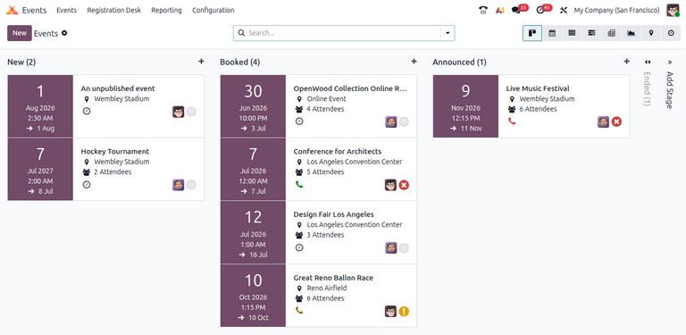
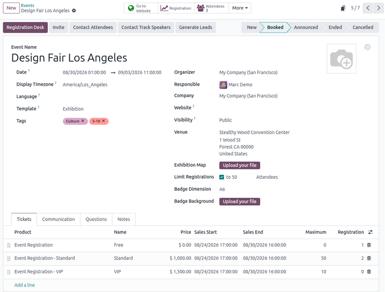
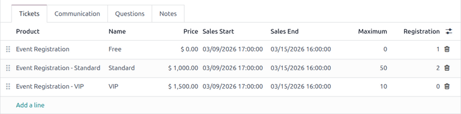
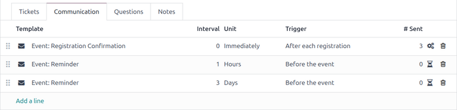
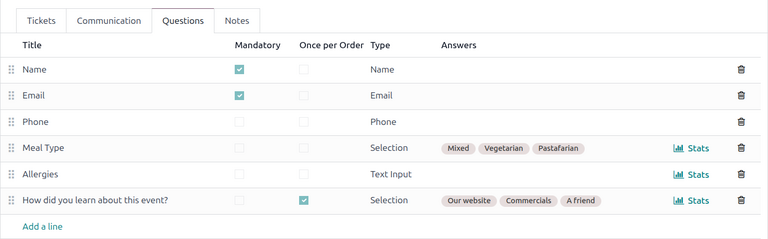
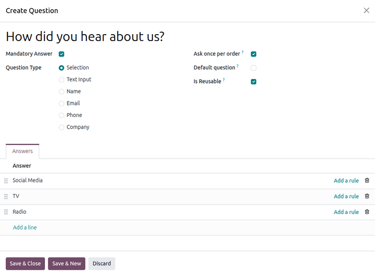
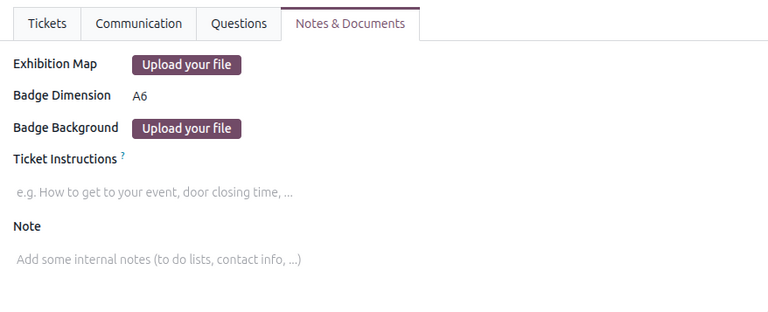

=============
Create events
=============

With the **Events** application, organizers can create and configure in-person or online events in
Odoo. Each new event contains a number of options to customize specific logistics such as ticket
sales, registration desk, booths, tracks, sponsors, rooms, and more.

Events can be manually created from scratch or built from preconfigured templates. Once launched,
the **Events** app integrates with other apps for enhanced functionalities, including promoting
events, selling registration tickets to attendees, and generating leads using customizable rules.

.. _events/new-event:

Dashboard
=========

To create an event, navigate to the :menuselection:`Events` app to land on the dashboard. By
default, the :guilabel:`Events` dashboard uses the :icon:`oi-view-kanban` :guilabel:`(Kanban)` view,
which showcases all events in the database in their respective pipeline stages. Other views can be
set using the buttons at the top.

Each event card displays the name of the event, its scheduled date, location, number of expected
:guilabel:`Attendees`, any scheduled activities related to the event, and the responsible event
manager.

The default stages in the :guilabel:`Kanban` view are :guilabel:`New`, :guilabel:`Booked`,
:guilabel:`Announced`, :guilabel:`Ended`, and :guilabel:`Cancelled`. The cards can be dragged and
dropped into any stage in the pipeline.

.. note::
   The :guilabel:`Ended` and :guilabel:`Cancelled` stages are folded by default and located at the
   end of the dashboard, next to the final stage.

To add a new stage, click the :icon:`fa-plus` :guilabel:`Add Stage` button at the end of the
dashboard. Enter a name for the stage, then click :guilabel:`Add` to add the stage or press
:kbd:`Esc` to cancel.

.. _events/create_events/event-form:

Add a new event
===============

Events can be created by opening the :menuselection:`Events` app and clicking :guilabel:`New`. This
opens a new *Events* form.

At the top of the event form are a series of clickable smart buttons to view details about event
metrics, including attendee registrations, :doc:`booths <../promote_monetize/event_booths>`, ticket
:doc:`sales <../promote_monetize/sell_tickets>`, event :doc:`tracks
<../attendee_experience/event_tracks>`, and :doc:`sponsors <../promote_monetize/event_sponsors>`.

Beneath the smart buttons is the event form, which contains various fields and clickable tabs to
configure the necessary details of the event.

To start, enter some basic information about the event in the following fields:

- :guilabel:`Event Name`: The title of the event. This field is **required**.
- :guilabel:`Date`: The scheduled date or date range of the event (expressed in the local timezone).
  This field is auto-populated but modifiable and is **required**.
- :guilabel:`Display Timezone`: The timezone in which the event date is displayed on the website.
  This field is auto-populated but modifiable and is **required**.
- :guilabel:`Language`: The chosen language for all event communications.

.. note::
   Next to the entered :guilabel:`Event Name`, there is a language tooltip, represented by an
   abbreviated language indicator (e.g., `EN`). When clicked, a *Translate: name* pop-up window
   appears, displaying various preconfigured language translation options available in the database.

Alternatively, to populate the event form from an event template, select an option in the
:doc:`Template <event_templates>` drop-down menu.

Additionally, add any corresponding tags (e.g., `Online`, `Conference`) for the event in the
:guilabel:`Tags` field. Multiple tags can be added per event.

.. tip::
   Tags can be displayed on events that are listed on the website by enabling the :guilabel:`Show on
   Website` checkbox from :menuselection:`Events app --> Configuration --> Event Tag Categories`.

Continue by entering information such as points of contact and venue location in the following
fields:

- :guilabel:`Organizer`: The organizer of the event (a company, contact, or employee).
- :guilabel:`Responsible`: The specific user responsible for managing the event in the database.
- :guilabel:`Company`: The specific company in the database to which the event is related. This
  field **only** appears if working in a multi-company environment. This field is auto-populated but
  modifiable. It is **required**.
- :guilabel:`Website`: The specific :doc:`website
  <../../../websites/website/configuration/multi_website>` in the database on which the event is
  published. If this field is left blank, the event can be published on **all** websites in the
  database.
- :guilabel:`Visibility`: The visibility of the event on the specified :guilabel:`Website` and in
  searches. The following options can be specified:

  - :guilabel:`Public`: The event is searchable and visible to **all** website visitors.
  - :guilabel:`Via a Link`: The event is visible **only** to visitors with a direct URL or
    already-registered participants.
  - :guilabel:`Logged Users`: The event is visible **only** to logged-in visitors or visitors with a
    direct URL.

- :guilabel:`Venue`: The event venue location. This field pulls information from the **Contacts**
  application. Alternatively, the information can be entered manually.
- :guilabel:`Exhibition Map`: The image of the event venue map. Click the :guilabel:`Upload your
  file` button to upload an image of the event venue map.

To limit the number of registrations for the event, check the :guilabel:`Limit Registrations` and
enter the maximum number of attendees allowed in the resulting field.

Optionally, to create event badges for attendees, fill in the following fields:

- :guilabel:`Badge Dimension`: The desired paper format dimension for the badges. The options are
  :guilabel:`A4 foldable`, :guilabel:`A6`, or :guilabel:`4 per sheet`.
- :guilabel:`Badge Background`: The custom background image for the badges. Click the
  :guilabel:`Upload your file` button to upload an image.

Additional event configurations
===============================

After filling out the fields on the event form, move on to the four tabs at the bottom for further
customization.

.. _events/event-tickets:

Tickets tab
-----------

In the *Tickets* tab of the event form, create custom registration tickets and ticket tiers for
events.

To create a ticket, click :guilabel:`Add a line` in the *Tickets* tab. In the :guilabel:`Product`
field, either select the preconfigured :guilabel:`Event Registration` product, or create a new one
by typing in the name of the new event registration product and then selecting either
:guilabel:`Create` or :guilabel:`Create and edit...` from the resulting drop-down menu. Then, enter
a name for the ticket (e.g., `Basic Ticket` or `VIP`) in the :guilabel:`Name` field.

.. important::
   In order for an event registration product to be selectable in the *Tickets* tab, the event
   registration :guilabel:`Product Type` **must** be set to :guilabel:`Service` and the
   :guilabel:`Create on Order` field **must** be set to :guilabel:`Event Registration`.

.. tip::
   Existing event registration products can be modified directly from the :guilabel:`Product` field
   by clicking the :icon:`oi-arrow-right` :guilabel:`(right arrow)` icon next to the product. Doing
   so reveals that product's form. If the **Inventory** application is installed, additional choices
   are available to customize for the product.

Next, set the registration cost of the ticket in the :guilabel:`Price` field.

.. note::
   The :guilabel:`Sales Price` defined on the event registration product's form sets the default
   cost of a ticket. Modifying the :guilabel:`Price` of the event ticket in the *Tickets* tab
   overrides the ticket's default price with this new price.

Next, enter the :guilabel:`Sales Start` and :guilabel:`Sales End` dates in their respective fields.
To do so, click into the blank field to reveal a calendar pop-over. Then, select the desired date
and time and click :icon:`fa-check` :guilabel:`Apply`.

Optionally, designate a :guilabel:`Maximum` amount of the ticket that can be sold.

As attendees register, the :guilabel:`Registration` column automatically populates with the number
of tickets sold.

To delete any tickets from the *Tickets* tab, click the :icon:`fa-trash-o` :guilabel:`(trash can)`
icon in the ticket's corresponding line.

.. tip::
   To add an optional :guilabel:`Description` column to the :guilabel:`Tickets` tab, click the
   :icon:`oi-settings-adjust` :guilabel:`(additional options)` drop-down menu at the end of the
   column titles.

   Then, select the checkbox beside :guilabel:`Description` to add a brief description for each
   event ticket, informing registrants about ticket details.

.. _events/event-communication:

Communication tab
-----------------

In the *Communication* tab of an event form, create various marketing communications that can be
scheduled to be sent at specific intervals leading up to and following the event.

.. note::
   By default, Odoo provides three separate preconfigured communications on every new event form.
   One is an email sent after each registration to confirm the purchase with the attendee. The other
   two are email event reminders that are scheduled to be sent at different time intervals leading
   up to the event to remind the recipient of the upcoming event.

To add a communication in the *Communication* tab, click :guilabel:`Add a line`. Then, select the
desired type of communication from the first drop-down menu in the :guilabel:`Template` column. The
options are: :guilabel:`Mail`, :guilabel:`SMS`, :guilabel:`Social Post`, or :guilabel:`WhatsApp`.

.. important::
   The :guilabel:`Social Post` option only appears if the **Social Marketing** application is
   installed. The :guilabel:`WhatsApp` option only appears if the **WhatsApp** module is installed.

   :doc:`WhatsApp <../../../productivity/whatsapp>` templates **cannot** be edited during active
   configuration. A separate approval from *Meta* is required.

Then, select an existing email template from the second drop-down menu in the :guilabel:`Template`
field.

Next, define the :guilabel:`Interval` and :guilabel:`Unit` from their respective drop-down fields to
specify when the communication should be sent. The :guilabel:`Unit` options are:
:guilabel:`Immediately`, :guilabel:`Hours`, :guilabel:`Days`, :guilabel:`Weeks`, and
:guilabel:`Months`.

Then, select one of the following options from the :guilabel:`Trigger` drop-down menu:

- :guilabel:`After each registration`
- :guilabel:`Before the event`
- :guilabel:`After the event`

The :guilabel:`(#) Sent` column populates with the number of sent communications, along with
different icons indicating the status of the communication:

- :icon:`fa-cogs` :guilabel:`(Running)`: The communication is active and running.
- :icon:`fa-check` :guilabel:`(Sent)`: The communications were sent and are no longer active.
- :icon:`fa-hourglass-half` :guilabel:`(Scheduled)`: The communication is scheduled but has not been
  deployed.

Any number of communications can be added in the *Communication* tab of an event form.

.. example::
   To send a confirmation email an hour after an attendee registers for an event, configure the
   communication as follows:

   - :guilabel:`Interval`: `1`
   - :guilabel:`Unit`: :guilabel:`Hours`
   - :guilabel:`Trigger`: :guilabel:`After each registration`

.. note::
   Existing email templates can be modified directly from the :guilabel:`Template` drop-down menu by
   clicking the :icon:`oi-arrow-right` :guilabel:`(Internal link)` icon next to the template name.
   Doing so reveals a separate page where users can edit the :guilabel:`Content`, :guilabel:`Email
   Configuration`, and :guilabel:`Settings` of that particular email template.

   To view and manage all email templates, activate :ref:`developer-mode` and navigate to
   :menuselection:`Settings --> Technical --> Email: Email Templates`. Modify with caution as email
   templates affect all communications where the template is used.

.. _events/event-questions:

Questions tab
-------------

In the *Questions* tab of an event form, users can create questionnaires to gather information from
attendees when registering for the event.

.. note::
   By default, Odoo provides three questions in the *Questions* tab for every event form. The
   default questions require registrants to provide their :guilabel:`Name`, :guilabel:`Email`, and
   an optional :guilabel:`Phone` number.

   The information gathered from the *Questions* tab can be found on the *Attendees* dashboard,
   accessible via the :icon:`fa-users` :guilabel:`Attendees` smart button. Odoo populates individual
   records that contain basic information about the registrants, as well as their preferences.

To add a question in the *Questions* tab, click :guilabel:`Add a line`. Doing so reveals a *Create
Question* pop-up window. From here, users can create and configure their question.

First, enter the question in the field at the top of the form. Then, specify if the question
requires a :guilabel:`Mandatory Answer`.

Additionally, specify whether to :guilabel:`Ask once per order` to apply the answer to every
attendee in the order (if multiple tickets are purchased at once). If the checkbox is **not**
ticked, the question is asked for every attendee in the registration.

Next, select a :guilabel:`Question Type` option:

- :guilabel:`Selection`: Provide answer options to the question for registrants to choose from.
  Selectable answer options can be managed in the :guilabel:`Answers` column at the bottom of the
  pop-up window.
- :guilabel:`Text Input`: Provides registrants with a text field to enter a custom response to the
  question.
- :guilabel:`Name`: Provides registrants with a field for them to enter their name.
- :guilabel:`Email`: Provides registrants with a field for them to enter their email address.
- :guilabel:`Phone`: Provides registrants with a field for them to enter their phone number.
- :guilabel:`Company`: Provides registrants with a field for them to enter a company they are
  associated with.

If :guilabel:`Selection` was chosen as the :guilabel:`Question Type`, an *Answers* tab appears. Add
any answers to the question under this tab by clicking :guilabel:`Add a line`.

Once all the desired configurations have been entered, click :guilabel:`Save & Close` to save the
question and return to the *Questions* tab on the event form. Or, click :guilabel:`Save & New` to
save the question and configure another question on a new :guilabel:`Create Question` pop-up window.

Users can add as many questions in the *Questions* tab as needed.

.. tip::
   For :guilabel:`Selection` and :guilabel:`Text Input` types, a :icon:`fa-bar-chart`
   :guilabel:`Stats` button appears next to the question line. Clicking this button reveals a
   separate page, showcasing the response metrics to that specific question.

To delete any question from the *Questions* tab, click the :icon:`fa-trash-o` :guilabel:`(trash
can)` icon on the corresponding question line.

.. _events/event-notes:

Notes tab
---------

In the *Notes* tab of an event form, users can leave detailed internal notes and/or event-related
instructions/information for attendees.

In the :guilabel:`Note` field, users can leave internal notes for other event employees, like
"to-do" lists, contact information, instructions, and so on.

In the :guilabel:`Ticket Instructions` field, users can leave specific instructions for attendees
and display them on attendees' tickets.

.. _events/create_events/publish:

Publish events
==============

Once all configurations and modifications are complete on the event form, the event can be published
on the website. Doing so makes the event visible to website visitors and allows them to register for
the event.

To publish an event, click the :icon:`fa-globe` :guilabel:`Go to Website` smart button to open the
event webpage. Then, toggle the :guilabel:`Unpublished` button in the header menu, changing it to a
:guilabel:`Published` switch. The event webpage is now published and accessible by all website
visitors.

.. seealso::
   To learn more about website design functionality and options, consult the :doc:`Building block
   <../../../websites/website/web_design/building_blocks>` documentation.

Send event invites
==================

To send event invites to potential attendees, navigate to the desired event form via
:menuselection:`Events app --> Events` and click into the desired event. On the event form, click
the :guilabel:`Invite` button.

Doing so reveals a blank :ref:`email form <email_marketing/create_email>`. Customize the message by
specifying a mailing type, subject, recipients, and the mail body.

.. tip::
   Sending emails from Odoo is subject to a daily limit, which, by default, is 200. To learn more
   about daily limits, visit the :ref:`email-issues-outgoing-delivery-failure-messages-limit`
   documentation.

.. seealso::
   :doc:`../attendee_experience/track_manage_talks`
