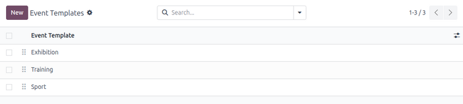
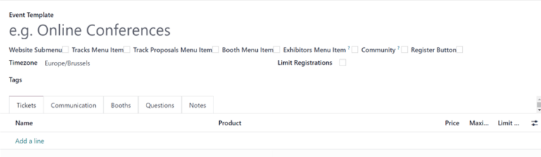
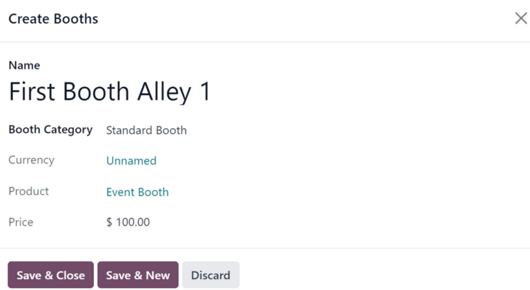

===============
Event templates
===============

Odoo **Events** app allows users to create and configure reusable event templates.

With templates, users can automatically configure similar events without needing to recreate them
from scratch.

Event templates dashboard
=========================

To view and manage event templates, navigate to :menuselection:`Events app --> Configuration -->
Event Templates`.

.. tip::
   Drag-and-drop the event templates using the :icon:`oi-draggable` :guilabel:`(draggable)` icon to
   change the order in which they appear in the *Template* drop-down field on an event form.

Create event template
=====================

To create a new event template, click :guilabel:`New` in the upper-left corner of the dashboard.

On the form, provide the template with a name in the :guilabel:`Event Template` field.

Beneath the field, the user may customize navigation options on the event website by selecting one
or more of the following checkboxes:

- :guilabel:`Website Submenu`: Display a submenu on the event website. When selected, every other
  checkbox in this series is automatically selected. Deselect any of the checkbox options as
  desired.
- :guilabel:`Tracks Menu Item`: Display a submenu item that navigates to a page of all planned
  tracks for the event.
- :guilabel:`Track Proposals Menu Item`: Display a submenu item that navigates to a :doc:`track
  <../attendee_experience/track_manage_talks>` proposal form.
- :guilabel:`Booth Menu Item`: Display a submenu item that navigates to the Booths purchasing page.
- :guilabel:`Exhibitors Menu Item`: Display a submenu item that navigates to a page of the event's
  exhibitors.
- :guilabel:`Community`: Display a submenu item allowing attendees to access preconfigured virtual
  community rooms to meet with other attendees. When this checkbox is ticked, the :guilabel:`Allow
  Room Creation` feature becomes available.
- :guilabel:`Allow Room Creation`: If the :guilabel:`Community` option is enabled, allow visitors to
  create their own community rooms.
- :guilabel:`Register Button`: Display a button taking visitors to the event-specific registration
  page.

Once the desired checkboxes have been ticked, select an appropriate :guilabel:`Timezone` for the
event from the available drop-down menu.

Optionally, add any desired :guilabel:`Tags` to this event template for organizational purposes.

To limit the number of event attendees, click the :guilabel:`Limit Registrations` checkbox and enter
the maximum number of :guilabel:`Attendees` allowed for the event.

Additional configuration options
================================

Beneath the general information fields at the top of the event template form, users can configure
additional event options using the following tabs:

- :ref:`Tickets <events/event-tickets>`
- :ref:`Communication <events/event-communication>`
- :ref:`Booths <event_templates/event_template/booths>`
- :ref:`Questions <events/event-questions>`
- :ref:`Notes <events/event-notes>`

These tabs (except for *Booths*) can also be found on a standard event form during :doc:`event
creation <create_events>`.

.. _event_templates/event_template/booths:

Booths tab
----------

The :guilabel:`Booths` tab allows users to add booths to an event directly within the event template
form.

To add a booth, click :guilabel:`Add a line`. Doing so reveals a blank :guilabel:`Create Booths`
pop-up window.

Start by providing a :guilabel:`Name` for this booth in the corresponding field.

Then, select an appropriate :guilabel:`Booth Category` from the drop-down field below.

Once the desired :guilabel:`Booth Category` is selected, the remaining fields in the window
(:guilabel:`Currency`, :guilabel:`Product`, and :guilabel:`Price`) are automatically populated.

.. note::
   These fields **cannot** be modified from the :guilabel:`Create Booths` pop-up window. They can
   only be modified from the specific booth category form page.

When all desired configurations are complete, click :guilabel:`Save & Close` to save the booth and
return to the event template form. Or click :guilabel:`Save & New` to save the booth and start
creating another booth in a new :guilabel:`Create Booths` pop-up window. Click :guilabel:`Discard`
to remove all changes and return to the event template form.

Once the booth has been saved, it appears in the :guilabel:`Booths` tab on the event template form.

Use event templates
===================

Once an event template is created, it is accessible on all event forms in the Odoo **Events**
application.

To use an event template, navigate to the :menuselection:`Events app` and click :guilabel:`New` to
open a new event form.

In the event form, click the :guilabel:`Template` field to view all event templates in the database.

.. note::
   Event templates in the drop-down field appear in the same order as they are listed in on the
   *Event Templates* page (:menuselection:`Events app --> Configuration --> Event Templates`).

Upon selecting the desired event template, the event form is automatically populated with the
template's configuration.

The resulting configuration can be further modified as desired.

.. seealso::
   :doc:`create_events`
