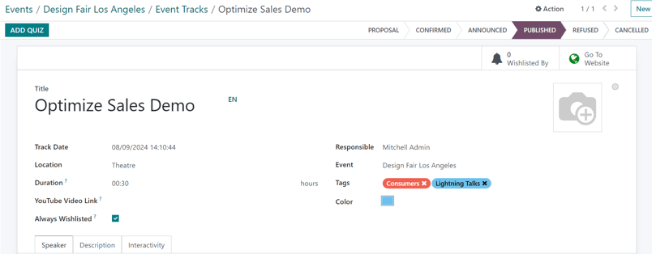

============
Event tracks
============

In Odoo, *Tracks* is a term used for talks, lectures, demonstrations, presentations, etc. that occur
at an event.

With the **Events** application, create, schedule, and manage tracks for any event.

There is also the option to allow attendees to propose talks (tracks) for an event, which can then
be approved or denied.

Configuration
=============

Navigate to :menuselection:`Events app --> Configuration --> Settings`, and tick the
:guilabel:`Schedule & Tracks` checkbox.

When that checkbox is ticked, two additional setting options appear: :guilabel:`Live Broadcast` and
:guilabel:`Event Gamification`.

.. image:: event_tracks/track-settings.png
   :align: center
   :alt: The Schedule and Tracks setting in the Odoo Events app, along with corresponding options.

The :guilabel:`Live Broadcast` option provides the ability to air tracks online, through a YouTube
integration.

The :guilabel:`Event Gamification` option provides the ability to share a quiz with attendees once
the track is over.

.. note::
   With the :guilabel:`Event Gamification` setting enabled, an :guilabel:`Add Quiz` button appears
   on track forms.

Once all desired settings have been enabled, click :guilabel:`Save`.

Event Tracks page
=================

To access, modify, and/or create tracks for an event, navigate to a preconfigured event, or
:ref:`create a new one <events/create-event>`.

On the desired event form, click the :guilabel:`Tracks` smart button at the top of the form.

.. tip::
   If the :guilabel:`Tracks` smart button is not readily available, click the :guilabel:`More`
   :icon:`fa-sort-desc` drop-down menu to reveal hidden smart buttons. Then, click
   :guilabel:`Tracks` from the resulting drop-down menu.

Clicking the :guilabel:`Tracks` smart button reveals the :guilabel:`Event Tracks` page, with all the
tracks (both scheduled and proposed) for the event, if there are any.

.. image:: event_tracks/event-tracks-page.png
   :align: center
   :alt: Typical event tracks page for an event in the Odoo Events application.

The tracks are presented in a default :icon:`oi-view-kanban` :guilabel:`(Kanban)` view, but there is
the option to view these tracks in a :icon:`oi-view-list` :guilabel:`(List)`, :icon:`oi-view-cohort`
:guilabel:`(Gantt)` chart, :icon:`fa-calendar-check-o` :guilabel:`(Calendar)`, :icon:`fa-area-chart`
:guilabel:`(Graph)`, or :icon:`fa-clock-o` :guilabel:`(Activity)` view. All of which are accessible
in the upper-right corner.

In the default :icon:`oi-view-kanban` :guilabel:`(Kanban)` view, the tracks are categorized into
different stages. The default stages are: :guilabel:`Proposal`, :guilabel:`Confirmed`,
:guilabel:`Announced`, :guilabel:`Published`, :guilabel:`Refused` (collapsed stage), and
:guilabel:`Cancelled` (collapsed stage). All of which can be edited, if needed.

.. tip::
   To edit a stage, hover over the stage name, click the :icon:`fa-cog` :guilabel:`(gear)` icon, and
   select :guilabel:`Edit Stage` from the resulting drop-down menu.

Clicking into a track from the :guilabel:`Event Tracks` page reveals the track form for that
particular track.

Create event track
------------------

From the :guilabel:`Event Tracks` page, click :guilabel:`New` in the upper-left corner to reveal a
blank event track form to create an event track.

Start by giving the track a :guilabel:`Title`. This field is **required** by Odoo.

If desired, add an accompanying image to the track, via the :icon:`fa-pencil` :guilabel:`(pencil)`
icon that appears when the cursor hovers over the :icon:`fa-camera` :guilabel:`(camera)` icon. When
clicked, upload the desired image for the track. This image appears on the event website, on this
specific track's page.

Enter a :guilabel:`Track Date` and time for the track, and designate a :guilabel:`Location` where
the talk is planning to be held.

.. tip::
   To access a complete list of locations for event tracks, which can be modified at any time,
   navigate to :menuselection:`Events app --> Configuration --> Track Locations`.

Add a :guilabel:`Duration` to the track (in hours).

If the *Live Broadcast* setting is enabled, the option to add a corresponding link in the
:guilabel:`YouTube Video Link` field is available.

If the :guilabel:`Always Wishlisted` checkbox is ticked, the talk is automatically set as a favorite
for each registered event attendee.

Assign someone to be in charge of managing this track in the :guilabel:`Responsible` field. By
default, the person who created the track is assigned.

Ensure the track is applied to the correct event in the :guilabel:`Event` field. By default, this
field is auto-populated with the event related to the *Event Tracks* page the track was created
from.

Choose to add existing :guilabel:`Tags`, or create new ones, to further organize the track. These
tags, and their corresponding categories, are utilized on the event specific website.

Beneath that general information section, there are three tabs: :ref:`Speaker
<events/track-speaker-tab>`, :ref:`Description <events/track-description-tab>`, and
:ref:`Interactivity <events/track-interactivity-tab>`.

.. _events/track-speaker-tab:

Speaker tab
~~~~~~~~~~~

The :guilabel:`Speaker` tab on an event track form has fields related to the specific speaker/host
of the track.

.. image:: event_tracks/speaker-tab.png
   :align: center
   :alt: The Speaker tab on an event track form in the Odoo Events application.

Contact details
***************

In the :guilabel:`Contact Details` section, use the :guilabel:`Contact` drop-down field to select an
existing contact from the database as the main point of contact for the talk.

If this contact is not in the database, type in the name of the contact, and click :guilabel:`Create
[contact name]`, to create and edit the contact form later, or click :guilabel:`Create and edit...`
to be taken to that new contact's contact form, where the rest of their pertinent information can be
entered.

The :guilabel:`Contact Email` and :guilabel:`Contact Phone` fields are populated with the
information found on that chosen contact's contact form. These fields are not modifiable once the
:guilabel:`Contact` is selected.

Speaker bio
***********

In the :guilabel:`Speaker Bio` section, enter information related to the speaker. Portions of this
section may auto-populate, based on the :guilabel:`Contact` selected in the :guilabel:`Contact
Details` section. If not, enter information in the necessary fields.

.. note::
   This information appears on the event website, on the specific track page.

Enter a :guilabel:`Name`, :guilabel:`Email`, and :guilabel:`Phone` number for the speaker.

If desired, add an image to appear alongside the speaker biography on the event website, via the
:icon:`fa-pencil` :guilabel:`(pencil)` icon that appears when the cursor hovers over the
:icon:`fa-camera` :guilabel:`(camera)` icon. When clicked, upload the desired image for the speaker.

Enter a :guilabel:`Job Position` for the designated speaker, and the :guilabel:`Company Name`
associated with the speaker.

In the :guilabel:`Biography` field, enter a custom biography with any speaker-related information.

.. _events/track-description-tab:

Description tab
~~~~~~~~~~~~~~~

The :guilabel:`Description` tab of an event track form is a blank text field, in which a description
of the track can be entered. The information entered here appears on the specific track page on the
event website.

.. _events/track-interactivity-tab:

Interactivity tab
~~~~~~~~~~~~~~~~~

The :guilabel:`Interactivity` tab on an event track form only has a single option at first:
:guilabel:`Magic Button`.

When the :guilabel:`Magic Button` checkbox is ticked, Odoo displays a *call-to-action* button
to attendees on the track sidebar, while the track is taking place.

With that checkbox ticked, three more options appear, all of which are related to the
:guilabel:`Magic Button`:

- :guilabel:`Button Title`: Enter a title to appear on the button for attendees.
- :guilabel:`Button Target URL`: Enter a URL that leads attendees to a specific page.
- :guilabel:`Button appears`: Enter a number in the field, and the button appears that number of
  :guilabel:`minutes after track starts`.

.. note::
   The magic button **only** appears if there is more than one published track.

.. _events/track-add-quiz:

Add Quiz button
~~~~~~~~~~~~~~~

The :guilabel:`Add Quiz` button **only** appears on event track forms if the *Event Gamification*
setting is enabled.

To add a quiz to the event track, click the :guilabel:`Add Quiz` button to reveal a separate page,
where an event track quiz can be configured.

Enter a title for the quiz in the blank field at the top of the page.

If participants can try the quiz multiple times, tick the :guilabel:`Allow multiple tries` checkbox.

The :guilabel:`Event` and :guilabel:`Event Track` fields are non-modifiable, and show the
corresponding event and track the quiz is associated with.

To add questions to the quiz, click :guilabel:`Add a line` beneath the :guilabel:`Question` column
to reveal a :guilabel:`Create Questions` pop-up window.

.. image:: event_tracks/create-questions.png
   :align: center
   :alt: The Create Questions pop-up window on an event-specific track quiz in the Odoo Events app.

.. note::
   **All** track quiz questions are multiple choice.

From the pop-up window, enter the question in the blank field at the top. Then, click :guilabel:`Add
a line`, and a new line appears, in which an answer option can be entered.

Once an answer option has been entered, designate whether it is the :guilabel:`Correct` response, by
ticking the checkbox in the :guilabel:`Correct` column. If it is incorrect, leave the checkbox
unticked.

There is also the option to add a point value to each answer option in the :guilabel:`Points`
column.

If there are any additional comments that should accompany an answer option, type them into the
:guilabel:`Extra Comment` field.

.. note::
   The :guilabel:`Points` and :guilabel:`Extra Comment` fields are optional.

Repeat this process for all answer options.

To remove an answer option, click the :icon:`fa-trash-o` :guilabel:`(trash can)` icon on the
far-right of the desired answer line.

Once all answer options are complete, click :guilabel:`Save & Close` to save the question, close the
pop-up window, and return to the track quiz form. Or, click :guilabel:`Save & New` to save this
question, and instantly start creating another question on a new :guilabel:`Create Questions` pop-up
form.

Publish event track
===================

Once all desired configurations are complete on an event track form, click the desired stage it
should be in from the status bar in the upper-right corner (e.g. :guilabel:`Confirmed`,
:guilabel:`Announced`, etc.).

.. note::
   The stage of a track can also be changed from the *Event Tracks* page, where the desired track
   card can be dragged-and-dropped into the appropriate Kanban stage.

If an event track has *not* been published yet, and it is moved to the :guilabel:`Published` stage,
Odoo automatically publishes the track on the event website.

An event track can also be published by opening the desired event track form, and clicking the
:guilabel:`Go to Website` smart button. Then, toggle the :icon:`fa-toggle-off`
:guilabel:`Unpublished` switch at the top of the page to :icon:`fa-toggle-on` :guilabel:`Published`;
thus turning it from red to green, and making it accessible for attendees.

.. seealso::
   :doc:`track_manage_talks`
