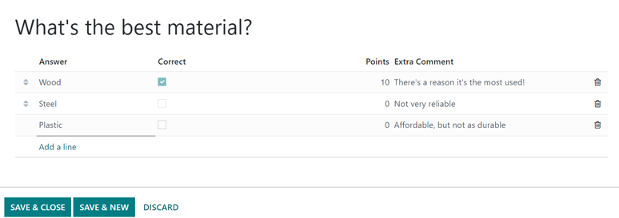

============
Event tracks
============

Odoo *Events* provides the ability to create, schedule, and manage talks, lectures, demonstrations,
presentations, etc., which known as *Tracks* in Odoo.

The Odoo *Events* application also has an option to allow event attendees to propose talks (tracks)
for an event, which can then be approved (or disapproved).

Configuration
=============

First, there are some settings that need to be enabled, in order to get the most out of event
tracks.

To do that, navigate to :menuselection:`Events app --> Configuration --> Settings`, and tick the
checkbox beside the :guilabel:`Schedule & Tracks` setting. Doing so provides the ability to manage
and publish an event schedule with various tracks.

Also, when that setting checkbox is ticked, two additional setting options appear beneath it:
:guilabel:`Live Broadcast` and :guilabel:`Event Gamification`.

The :guilabel:`Live Broadcast` option provides the ability to air tracks online through a *YouTube*
integration.

The :guilabel:`Event Gamification` options provides the ability to share a quiz with track attendees
once the track is over, in order to test how much they learned.

.. note::
   With the :guilabel:`Event Gamification` setting enabled, an :guilabel:`Add Quiz` button appears
   on track forms, providing the ability to :ref:`quickly create a quiz <events/track-add-quiz>`
   specific to the topic related to that particular track.

Once all desired settings have been enabled, be sure to click the :guilabel:`Save` button in the
upper-left corner of the :guilabel:`Settings` page.

Event Tracks page
=================

To access, modify, and/or create tracks for an event, first navigate to a preconfigured event, or
:doc:`create a new one <create_events>` from the *Events* application.

To do that, navigate to :menuselection:`Events app`, and either select a pre-existing event from the
:guilabel:`Events` dashboard, or create a new one by clicking :guilabel:`New`.

Once on the desired event form, click into the :guilabel:`Tracks` smart button at the top of the
form.

.. tip::
   If the :guilabel:`Tracks` smart button is not readily available, click the :guilabel:`More`
   :icon:`fa-sort-desc` drop-down menu to reveal hidden smart buttons. Then, click
   :guilabel:`Tracks` from the resulting drop-down menu.

Clicking the :guilabel:`Tracks` smart button reveals the :guilabel:`Event Tracks` page for that
particular event, which presents all the tracks (both scheduled and proposed) for the event, if
there are any.

The tracks are presented in a default :icon:`oi-view-kanban` :guilabel:`(Kanban)` view, but there is
also the option to view these tracks in a :icon:`oi-view-list` :guilabel:`(List)`,
:icon:`oi-view-cohort` :guilabel:`(Gantt)` chart, :icon:`fa-calendar-check-o`
:guilabel:`(Calendar)`, :icon:`fa-area-chart` :guilabel:`(Graph)`, or :icon:`fa-clock-o`
:guilabel:`(Activity)` view. All of which are accessible in the upper-right corner of the
:guilabel:`Tracks` page.

In the default :icon:`oi-view-kanban` :guilabel:`(Kanban)` view, the tracks are categorized into
different stages. The default stages are: :guilabel:`Proposal`, :guilabel:`Confirmed`,
:guilabel:`Announced`, :guilabel:`Published`, :guilabel:`Refused` (collapsed stage), and
:guilabel:`Cancelled` (collapsed stage). All of which can be edited, if needed.

.. tip::
   To edit a stage, hover over the stage name, click the :icon:`fa-cog` :guilabel:`(Settings)` icon,
   and select :guilabel:`Edit` from the resulting drop-down menu.

Clicking into a track from the :guilabel:`Event Tracks` page reveals the track form for that
particular track.

Create event track
------------------

From the :guilabel:`Event Tracks` page, click :guilabel:`New` in the upper-left corner to reveal a
blank event track form to create an event track.

.. image:: event_tracks/event-track-form.png
   :align: center
   :alt: Typical event track form in the Odoo Events application.

Start by giving this track a :guilabel:`Title`. This field is **required** by Odoo.

Then, if desired, add an accompanying image to the track via the :icon:`fa-pencil`
:guilabel:`(pencil)` icon that appears when the cursor hovers over the :icon:`fa-camera`
:guilabel:`(camera)` icon in the upper-right corner of the form. When clicked, proceed to upload the
desired image for the track. This image appears on the front-end of the event website, on this
specific tracks webpage.

Next, enter a :guilabel:`Track Date` and time for the track, and designate a :guilabel:`Location`
where the talk is planning to be held.

.. tip::
   To access a complete list of locations for event tracks, which can be modified (and added to) at
   any time, navigate to :menuselection:`Events app --> Configuration --> Track Locations`.

Then, add a :guilabel:`Duration` to the track (in minutes).

If the *Live Broadcast* setting has been enabled in the *Events* app settings, the option to add a
corresponding link in the :guilabel:`YouTube Video Link` field is available.

If the :guilabel:`Always Wishlisted` checkbox is ticked, the talk is automatically set as a favorite
for each registered event attendee.

Assign someone to be in charge of managing this track in the :guilabel:`Responsible` field. By
default, the person who initially created the track is assigned.

Then, ensure the track is applied to the correct event in the :guilabel:`Event` field. By default,
this field is auto-populated with the event related to the *Event Tracks* page the track was
originally created from.

Next, choose to add existing tags, or create new ones, to further organize the track. These tags,
and their corresponding tag categories are utilized on the event specific website - mainly on the
*Talks* web page on the event website, via the drop-down filter menus.

Beneath that general information section, there are three tabs: :ref:`Speaker
<events/track-speaker-tab>`, :ref:`Description <events/track-description-tab>`, and
:ref:`Interactivity <events/track-interactivity-tab>`.

.. _events/track-speaker-tab:

Speaker tab
~~~~~~~~~~~

The :guilabel:`Speaker` tab on an event track form is filled with various fields related to the
specific speaker who is planning to conduct/host the track.

Contact Details section
***********************

In the :guilabel:`Contact Details` section, proceed to use the :guilabel:`Contact` drop-down field
to select an existing contact from the database as the main point of contact for the talk.

If this contact is not yet in the database, type in the name of the contact, and click
:guilabel:`Create` to create and edit the contact form later, or click :guilabel:`Create and
edit...` to be taken to that new contact's contact form, where the rest of their pertinent
information can be entered.

The :guilabel:`Contact Email` and :guilabel:`Contact Phone` fields are greyed-out and populated with
the information found on that chosen contact's contact form. These fields are not modifiable once
the :guilabel:`Contact` field is selected.

Speaker Bio section
*******************

In the :guilabel:`Speaker Bio` section, proceed to enter information related to the specific speaker
scheduled to conduct/host the track. This section may auto-populate based on the :guilabel:`Contact`
selected in the :guilabel:`Contact Details` section. If not, enter information in the necessary
fields.

.. note::
   This information appears on the front-end of the event website, on the specific track webpage,
   providing more information about the speaker to the track attendees.

Start by entering a :guilabel:`Name`, :guilabel:`Email`, and :guilabel:`Phone` number for the
speaker.

Next, if desired, add an image to appear alongside the speaker biogrpahy on the event website, via
the :icon:`fa-pencil` :guilabel:`(pencil)` icon that appears when the cursor hovers over the
:icon:`fa-camera` :guilabel:`(camera)` icon. When clicked, proceed to upload the desired image for
the speaker.

Then, enter a :guilabel:`Job Position` for the designated speaker, followed by the
:guilabel:`Company Name` associated with the speaker.

In the :guilabel:`Biography` field, proceed to enter in a custom biography with any speaker-related
information.

.. _events/track-description-tab:

Description tab
~~~~~~~~~~~~~~~

The :guilabel:`Description` tab of an event track form is a blank text field, in which a description
of the track can be entered. The information entered here appears on the specific track page on the
event website.

.. _events/track-interactivity-tab:

Interactivity tab
~~~~~~~~~~~~~~~~~

The :guilabel:`Interactivity` tab on an event track form features a single option at first:
:guilabel:`Magic Button`.

.. image:: event_tracks/interactivity-tab.png
   :align: center
   :alt: The Interactivity tab on an event track form in the Odoo Events application.

When the checkbox beside :guilabel:`Magic Button` is ticked, Odoo displays a *call to action* button
to attendees on the track sidebar, while the track is taking place.

With that checkbox ticked, three more options appear, all of which are related to the
:guilabel:`Magic Button`:

- :guilabel:`Button Title`: enter a title to appear on the button for attendees.
- :guilabel:`Button Target URL`: enter a URL that leads attendees, who click the button, to a
  specific page.
- :guilabel:`Show Button`: enter a number in the field, and the button will appear that number of
  :guilabel:`minutes after Track start`.

.. note::
   The magic button **only** appears if there is more than one published track.

.. _events/track-add-quiz:

Add Quiz button
~~~~~~~~~~~~~~~

The :guilabel:`Add Quiz` button **only** appears on event track forms if the *Event Gamification*
setting is enabled in the Odoo *Events* settings.

To add a quiz to the event track, click the :guilabel:`Add Quiz` button. Doing so reveals a separate
page where an event track quiz can be created and configured.

.. image:: event_tracks/add-quiz.png
   :align: center
   :alt: The Add Quiz page in the Odoo Events application for an event track.

Start by entering a title for the quiz in the blank field at the top of the page. Then, if
participants should be allowed to try the quiz multiple times, tick the checkbox beside
:guilabel:`Allow multiple tries`.

The :guilabel:`Event` and :guilabel:`Event Track` fields are non-modifiable, and show the
corresponding event and track this quiz is associated with.

To add questions to the quiz, click :guilabel:`Add a line` beneath the :guilabel:`Question` column.
Doing so reveals a :guilabel:`Create Questions` pop-up window.

.. note::
   **All** track quiz questions are multiple choice.

From the pop-up window, enter the question in the blank field at the top. Then, click :guilabel:`Add
a line` to add answer options. Upon clicking :guilabel:`Add a line`, a new line appears, in which an
answer option can be entered.

Once an answer option has been entered, proceed to designate whether it is the :guilabel:`Correct`
response, by ticking the checkbox in the :guilabel:`Correct` column.

Then, there is the option to add a point value in the :guilabel:`Points` column.

And, if there are any additional comments that should accompany an answer option, type them into the
:guilabel:`Extra Comment` field.

.. note::
   The :guilabel:`Correct`, :guilabel:`Points`, and :guilabel:`Extra Comment` fields are all
   optional.

Repeat this process for all the answer options.

To remove an answer option, click the :icon:`fa-trash-o` :guilabel:`(trash can)` icon on the
far-right.

Once all desired answer options (and their configurations) are complete, click :guilabel:`Save &
Close` to save the question, close the pop-up window, and return to the track quiz form. Or, click
:guilabel:`Save & New` to save this question, and instantly start creating another question on a new
:guilabel:`Create Questions` pop-up form.

To remove any question from the quiz, click the :icon:`fa-trash-o` :guilabel:`(trash can)` icon on
the far-right of the question line.

Publish event track
===================

Once all the desired configurations are complete on an event track form, click the desired stage it
should be in from the status bar in the upper-right corner (e.g. :guilabel:`Confirmed`,
:guilabel:`Announced`, etc.).

.. note::
   The stage of a track can also be changed from the :guilabel:`Event Tracks` page, where the
   desired track card can be dragged-and-dropped into the appropriate Kanban stage.

If an event track has *not* been published yet, and it is moved to the :guilabel:`Published` stage,
Odoo automatically publishes the track on the event website.

An event track can *also* be published by opening the desired event track form, and clicking the
:guilabel:`Go to Website` smart button. Then, in order for the track page to be viewable (and
accessible) for event attendees, toggle the :icon:`fa-toggle-off` :guilabel:`Unpublished` switch at
the top of the page to :icon:`fa-toggle-on` :guilabel:`Published`; thus turning it from red to
green, and making it accessible for attendees.

.. image:: event_tracks/published-toggle.png
   :align: center
   :alt: The track-related event submenu options on an event website built with Odoo Events.

.. seealso::
   - :doc:`create_events`
   - :doc:`track_manage_talks`
