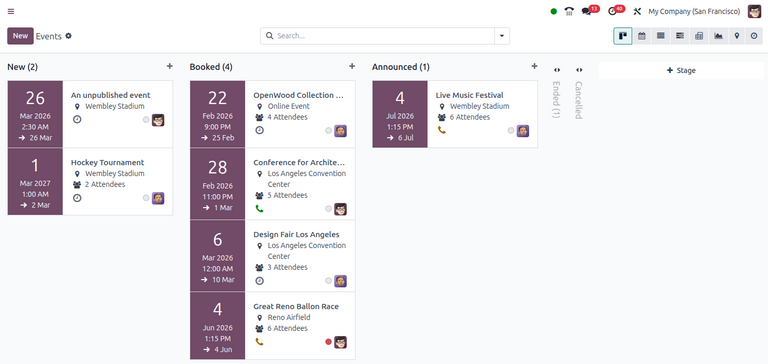
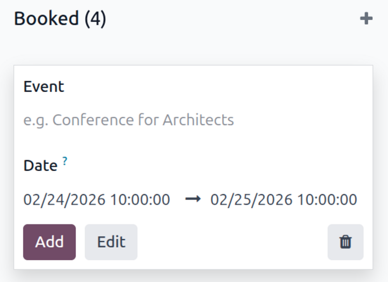

================
Events dashboard
================

When the **Events** application is opened, Odoo reveals the main :guilabel:`Events` dashboard, which
can be viewed in a number of different ways. Those different view options are accessible from the
:guilabel:`Events` dashboard in the upper-right corner, via a series of view-related icon buttons.

By default, the :guilabel:`Events` dashboard is displayed in the :icon:`oi-view-kanban`
:guilabel:`Kanban` view, which is populated with a variety of pipeline stages.

This view showcases all the events in the database in their respective stages. The number of events
in a stage is indicated next to each stage's name. By default, the stages are: :guilabel:`New`,
:guilabel:`Booked`, :guilabel:`Announced`, :guilabel:`Ended`, and :guilabel:`Cancelled`.

.. note::
   The :guilabel:`Ended` and :guilabel:`Cancelled` stages are folded by default and located to the
   right of the other stages.

On each event card, find the scheduled date of the event, the name of the event, the location, the
number of expected :guilabel:`Attendees`, any scheduled activities related to the event, the status
of the event, and the person responsible for the event.

To add a new event to a pipeline, click the :icon:`fa-plus` :guilabel:`(plus)` icon at the
top of the stage to which the event should be added to reveal a blank Kanban card to fill out.

In this blank Kanban card, enter the name of :guilabel:`Event`, along with the start and end
:guilabel:`Date` and time.

Then, either click :guilabel:`Add` to add it to the stage and edit it later, or click
:guilabel:`Edit` to add the event to stage and edit its configurations on a separate page.

Each event card can be dragged-and-dropped into any stage on the Kanban pipeline.
