===============
Events workflow
===============

The Odoo **Events** app allows users to organize events directly within Odoo. In a typical workflow,
users (such as event organizers) create and configure events, sell event tickets online, manage
registrations and attendance, and track reports on event attendance and revenue.

The following documentation outlines the step-by-step process of managing an event in Odoo
**Events** from creation to reporting.

Create a new event
==================

A workflow in **Events** typically begins with creating an event.

To create an event, go to :menuselection:`Events app --> Events` and click :guilabel:`New` to
:doc:`create a new event <create_events>`.

On the event form, enter the details of the event, including the name, date, organizer, venue, etc.

Next, under the :guilabel:`Tickets` tab, select or create an event registration product, along with
a name and price of the ticket.

Under the :guilabel:`Communication` tab, add any additional communications to attendees, such as
reminder emails before the start of an event.

Similarly, under the :guilabel:`Questions` tab, add any additional questions for attendees to answer
during registration.

Miscellaneous information can be added for event employees under the :guilabel:`Notes` tab.

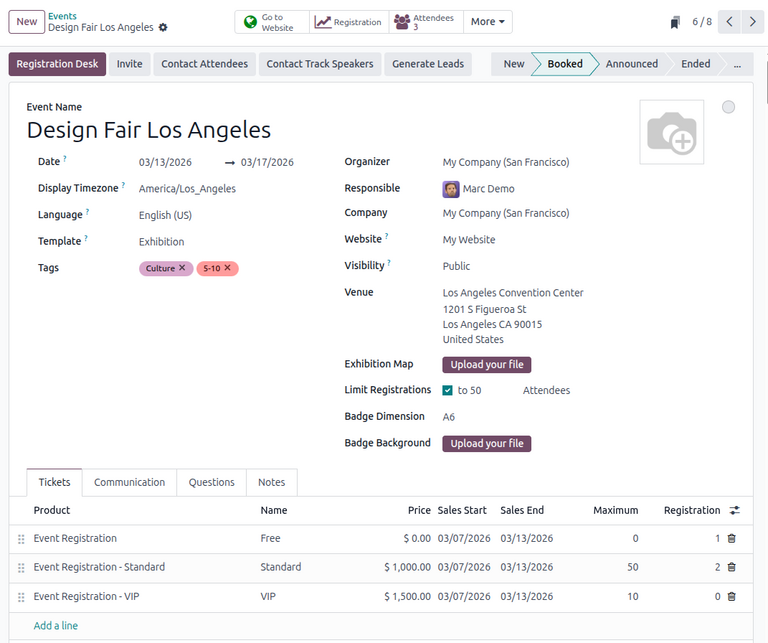

For more information about creating an event using the event form, see the :doc:`create_events`
documentation.

.. tip::
    To speed up the process of creating similar events in the future, users can also
    configure event templates. To learn more, see the :doc:`event_templates` documentation.

Publish an event
================

Once an event has been created, publish the event on the website by clicking the :icon:`fa-globe`
:guilabel:`Go to Website` smart button at the top of the event form.

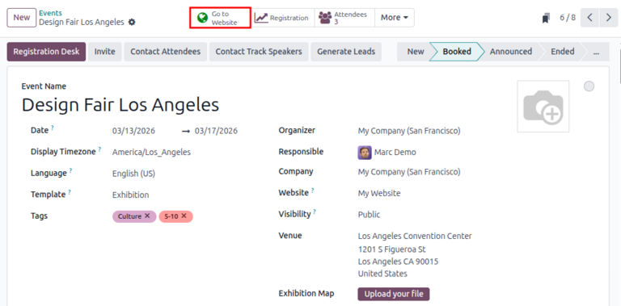

Then, click the :guilabel:`Unpublished` toggle button on the upper-right to publish the event,
rendering it visible for all visitors to the website.

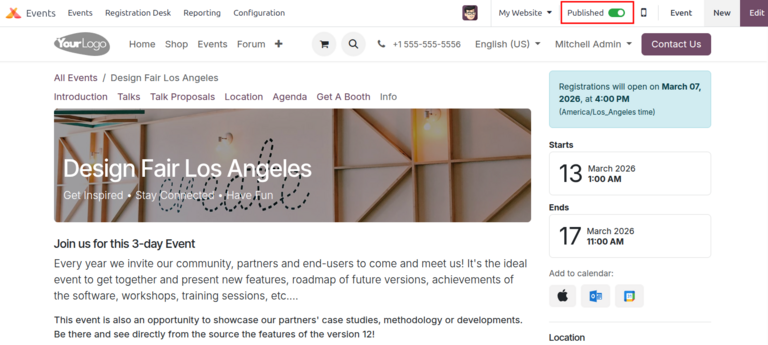

Event pages on the website can also be modified and customized using building blocks and templates.
For more information, see the :doc:`../../websites` documentation.

Create event tracks, if any
===========================

In Odoo, tracks are additional sessions such as talks, lectures, demonstrations, presentations, etc.
**Events** allows users to :doc:`add tracks <event_tracks>` to an event and publish them on the
website.

To begin, navigate to :menuselection:`Events app --> Configuration --> Settings` and click the
:guilabel:`Schedule & Tracks` checkbox to enable the user to manage and publish event tracks. Click
:guilabel:`Save` to load the changes.

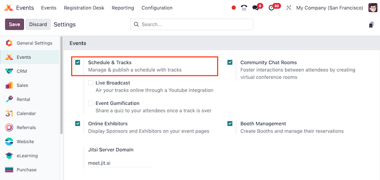

To add a track to an event, click on the event then navigate to the :guilabel:`Tracks` smart button
at the top of the event form.

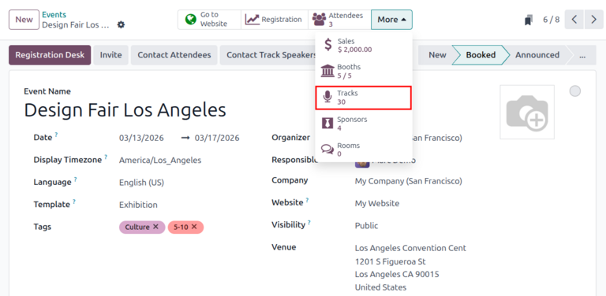

In the dashboard view, click :guilabel:`New` to open an event track form.

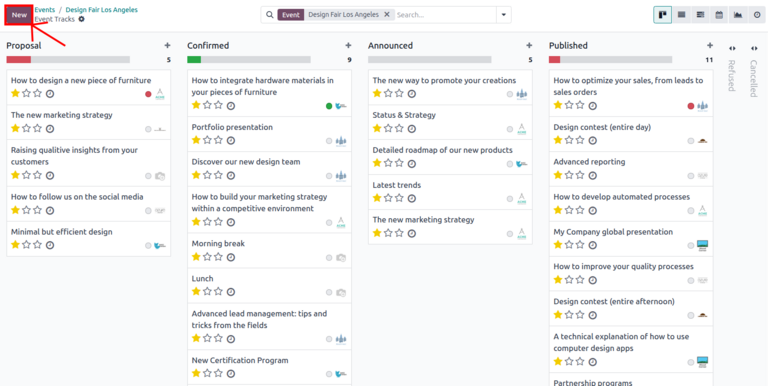

Enter the track's details, including the name, date, etc.

Under the :guilabel:`Speaker` tab, enter the presenter's contact and biographical details.

Under the :guilabel:`Description` tab, enter a description for the track.

Optionally, under the :guilabel:`Interactivity` tab, click the :guilabel:`Magic Button` checkbox to
display a *Call to Action* button to attendees on the track's webpage during the event.

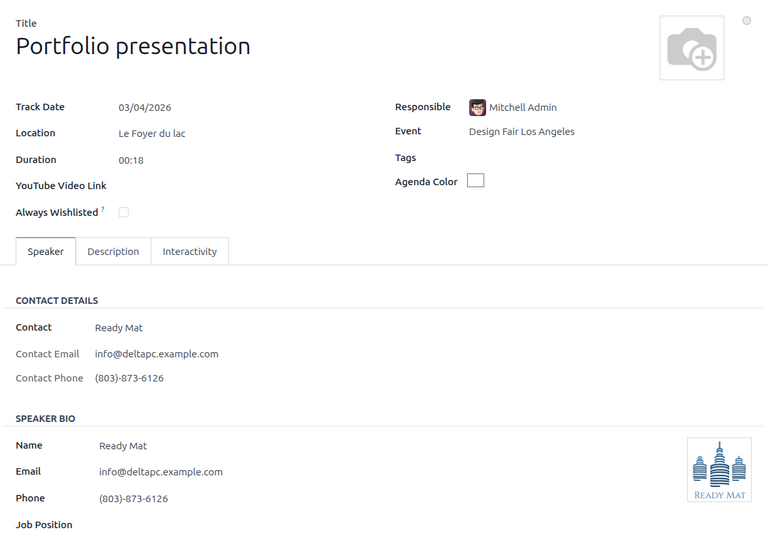

Once the track has been created, publish it by clicking the :icon:`fa-globe`
:guilabel:`Go to Website` smart button at the top of the event track form, rendering the track
visible to all visitors to the website.

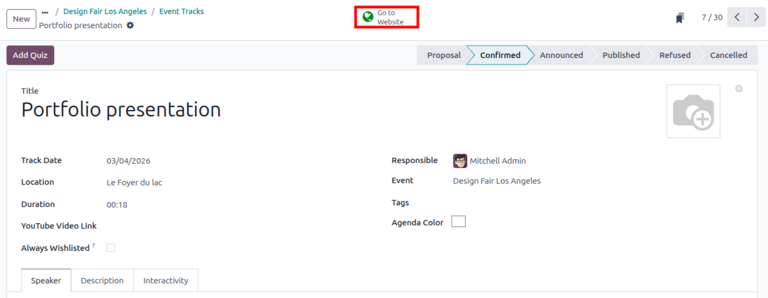

For more details about creating and configuring event tracks, see the :doc:`event_tracks`
documentation.

Create event booths, if any
===========================

For in-person events, organizers can also allow exhibitors and sponsors to reserve booths at
various prices.

First, navigate to :menuselection:`Events app --> Configuration --> Settings` and click the
:guilabel:`Booth Management` checkbox to enable the user to create and manage event booths. Click
:guilabel:`Save` to load the changes.

To :doc:`create a booth <event_booths>` for an event, click on the event then navigate to the
:icon:`fa-university` :guilabel:`Booths` smart button at the top of the event form.

In the dashboard view, click on :guilabel:`New` to open a booth form.

Enter the booth's name, then pick a booth category. The :guilabel:`Product` and :guilabel:`Price`
fields are automatically populated with the details of the event booth product specified for the
booth category.

.. note::
    By default, **Events** creates three booth categories: a *Standard Booth*, a *Premium Booth*,
    and a *VIP Booth*. After selecting the booth category, its price can be changed by clicking on
    the :icon:`oi-arrow-right` icon at the right of the drop-down and entering a new price on the
    booth category form under the :guilabel:`Booth Details` section.

    Optionally, a booth category can also be configured to take a sponsor by checking the
    :guilabel:`Create Sponsor` in the :guilabel:`Sponsorship` section at the right of the
    :guilabel:`Booth Details` section. Once checked, enter a :guilabel:`Sponsor Level` and a
    :guilabel:`Sponsor Type`.

After entering the booth category, select or create the contact of the renter under the
:guilabel:`Renter` drop-down, which populates the remaining :guilabel:`Renter Name`,
:guilabel:`Renter Email`, and :guilabel:`Renter Phone` fields.

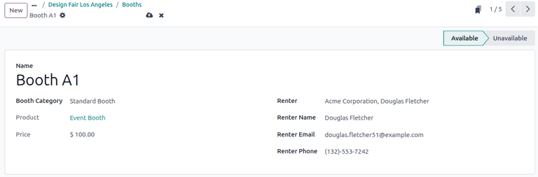

The new booth now appears as :guilabel:`Available` for reservation.

For more details about creating and configuring event booths, see the :doc:`event_booths`
documentation.

Add sponsors, if any
====================

For both online and in-person events, organizers can allow sponsors to reserve booths and/or connect
with participants online.

To start, navigate to :menuselection:`Events app --> Configuration --> Settings` and click the
:guilabel:`Online Exhibitors` checkbox to enable the user to add and manage event sponsors. Click
:guilabel:`Save` to load the changes.

To add a sponsor, click on the event then navigate to the :icon:`fa-black-tie` :guilabel:`Sponsors`
smart button at the top of the event form.

In the dashboard view, click on :guilabel:`New` to open an event sponsor form.

Enter the sponsor's name, a slogan, and a partner from the :guilabel:`Partner` drop-down. The
remaining :guilabel:`Email`, :guilabel:`Phone`, :guilabel:`Mobile`, and :guilabel:`Website` fields
are then populated.

At the right, the :guilabel:`Sponsor Type` drop-down offers several options for featuring the
sponsor during the event:

- :guilabel:`Footer Logo Only`: Displays the sponsor's logo in the footer of the event page on the
  website. If selected, a :guilabel:`Display in footer` toggle button appears on the sponsor form,
  allowing the user to enable the feature.
- :guilabel:`Exhibitor`: Allows sponsors to reserve booths and exhibit in-person. If selected, an
  :guilabel:`Opening Hours` selection appears on the sponsor form, allowing the user to specify the
  opening hours of the sponsor's exhibition.
- :guilabel:`Online Exhibitor`: Displays a :guilabel:`Connect` button over the sponsor's image on
  the website, allowing event attendees to connect with the sponsor online. Similar to
  :guilabel:`Exhibitor`, selecting this option displays the :guilabel:`Opening Hours` selection,
  allowing the user to specify the opening hours of the sponsor's exhibition.

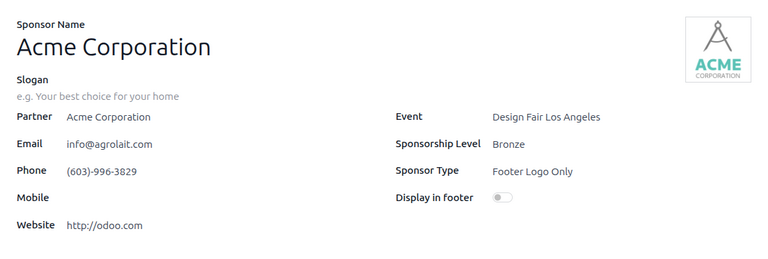

If the :guilabel:`Exhibitor` sponsor type is selected, add a description for the sponsor under the
:guilabel:`Description` tab.

An additional :guilabel:`Option` tab appears if the :guilabel:`Online Exhibitor` option is selected,
allowing the user to enter the name, language, and max capacity of the exhibition's *Jitsi*
integration.

Sell tickets for the event
==========================

After creating and configuring an event, organizers can then :doc:`sell tickets <sell_tickets>` for
the event in two ways: through manual sales orders in the **Sales** app, or online through the event
webpage in the **Website** app.

Before selling tickets either through sales orders or through the website, some settings must first
be configured. Navigate to :menuselection:`Events app --> Configuration --> Settings` and click both
the :guilabel:`Tickets with Sale` and :guilabel:`Online Ticketing` checkboxes to enable the
features. Click :guilabel:`Save` at the top-left to load the changes.

Sales orders
------------

To sell tickets through a sales order, open the **Sales** app.

Click :guilabel:`New` to open a new quotation form and enter any details such as the customer,
expiration date, and any payment terms.

Then, click :guilabel:`Add a product` under the :guilabel:`Order Lines` tab and add an event
registration product.

.. note::
    To create a sales order for event tickets, the selected product **must** be configured with a
    :guilabel:`Product Type` of :guilabel:`Service` and the :guilabel:`Create on Order` field set to
    :guilabel:`Event Registration`. By default, **Events** creates a product called
    *Event Registration*, which can be added to a sales order.

On the :guilabel:`Select an Event` pop-up window, select the relevant event under the
:guilabel:`Event` drop-down.

Under the :guilabel:`Ticket Type` drop-down, select the name of the ticket. Finally, click
:guilabel:`Add` to add the event registration product to the quotation.

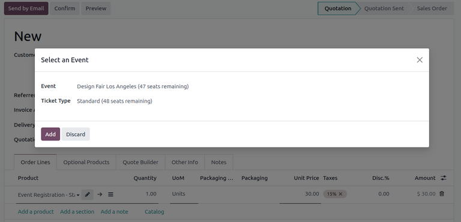

Continue with the process of confirming and closing the sales order. For more information, refer to
the :doc:`Sales <../../sales>` documentation.

Online orders
-------------

By default, **Events** allows attendees to purchase tickets for an event through its webpage, as
long as it is published.

Customers can purchase tickets by navigating to the :guilabel:`Events` header menu on the website
then selecting the relevant event.

On the event webpage, customers can click the :guilabel:`Register` button at the top-right.
Then, after selecting the number of tickets using the drop-down, they click
:guilabel:`Register`. This opens the :guilabel:`Attendees` window, where the customer enters their
contact information as well as any additional questions.

.. note::
    The questions on the :guilabel:`Attendees` form are configured on the form for the event under
    the :guilabel:`Questions` tab. For more information, see the
    :doc:`Create events <create_events>` documentation.

Once the information is entered, the customer confirms their registration by clicking
:guilabel:`Go to Payment`.

.. note::
    If the event registration products are free (i.e., no sales price is specified on their
    event forms), the button on the :guilabel:`Attendees` window is labeled
    :guilabel:`Confirm Registration`. The attendees then land directly on the confirmation page.
    They do **not** need to enter any payment information.

On the checkout page, the attendee enters their billing address, then clicks :guilabel:`Confirm`
in the :guilabel:`Order summary`.

On the :guilabel:`Confirm order` page, they enter their payment method then click
:guilabel:`Pay now` in the :guilabel:`Order summary` to complete their order.

The attendee finally lands on a confirmation page with details about their registration as well as
the option to download their tickets.

For more details about selling event tickets, see the :doc:`sell_tickets` documentation.

Grant access to registered attendees
====================================

During an event, users can :doc:`grant access to event attendees <registration_desk>` using the
*Registration Desk*. Attendance for event attendees can be logged manually or by using a barcode
scanner.

To manually grant access to an attendee during an event, navigate to
:menuselection:`Events app --> Registration Desk` and select the :guilabel:`Select Attendee` option.

On the :guilabel:`Attendees` dashboard, select the attendee's card. This opens a pop-up window
displaying the name and event registration details of the attendee. To log the attendee's
attendance, click :guilabel:`Continue`.

The attendee then appears with the green status label of :guilabel:`Attended`.

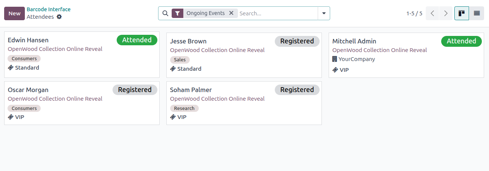

Alternatively, **Events** also allows users to log an attendee's attendance by scanning their
barcode. To begin, navigate to :menuselection:`Events app --> Registration Desk` and scan the
attendee's barcode. If the scanned barcode is invalid, an error pop-up message appears in the
upper-right corner.

The attendee's attendance is then logged in the **Events** app.

For more details about logging attendance, see the :doc:`registration_desk` documentation.

View reporting data for events
==============================

Event organizers may also want to view or :doc:`create reports <revenues_report>` based on analytics
about their events' attendance or revenue.

Attendance reporting
--------------------

To view or create attendance-related reports, navigate to
:menuselection:`Events app --> Reporting --> Attendees`. By default, the :guilabel:`Attendees`
reporting page displays the data in the :icon:`fa-area-chart` (:guilabel:`Graph`) view. To view the
data in a pivot table, click the :icon:`oi-view-pivot` (:guilabel:`Pivot`) icon at the top-right.

The data can also be grouped by different dimensions such as the event, status, or registration date
by clicking the search bar at the top and selecting the relevant dimensions. Additionally, the
:guilabel:`Measures` drop-down at the top-left can also be used to filter only relevant records. For
more information, see the :doc:`Reporting <../../essentials/reporting>` documentation.

Revenues reporting
------------------

Viewing or creating revenue-related reports is similar to attendance reporting. To view or create
a revenues report, navigate to :menuselection:`Events app --> Reporting --> Revenues`. Similar to
attendance reports, the graph view can be changed to a pivot view. Data can also be grouped by
different dimensions and filtered using the :guilabel:`Measures` drop-down at the top-left.

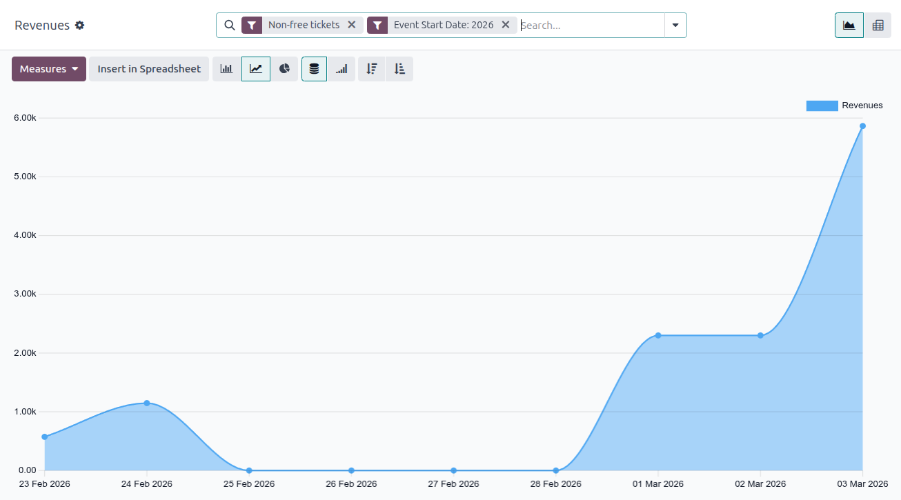

For more information about revenues reporting, see the :doc:`revenues_report` documentation.

.. seealso::
    - :doc:`create_events`
    - :doc:`sell_tickets`
    - :doc:`event_templates`
    - :doc:`event_booths`
    - :doc:`event_tracks`
    - :doc:`registration_desk`
    - :doc:`revenues_report`
