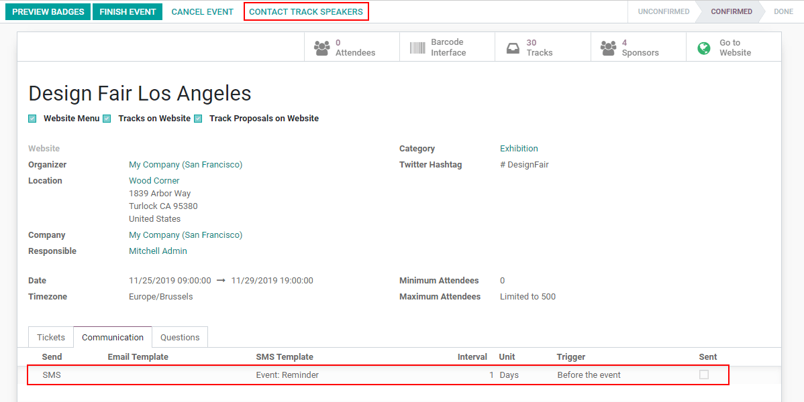
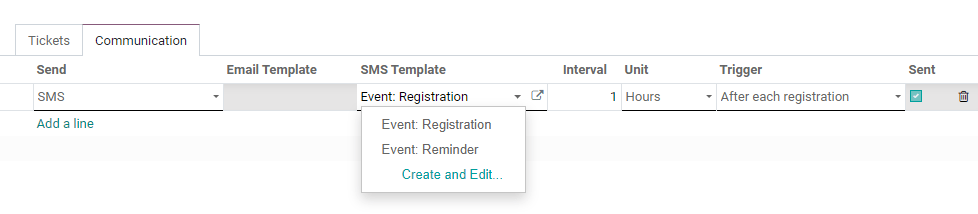
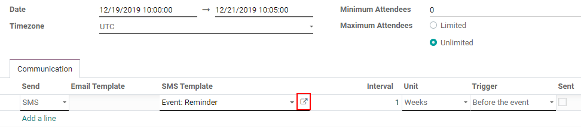
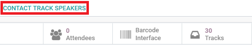
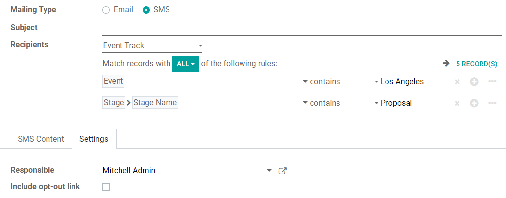

====================================================
Communicating about my Event using SMS Text Messages
====================================================

Using SMS as a communication strategy for your event establishes interaction between organizers,
attendees, speakers and further targets. It allows your message to be heard whether the goal is to
send out reminders, teasers or to advertise.

Configuration
=============

| Under *Communication* SMS is a standard feature. That means nothing needs to be enabled or
  installed.
| On the other hand, to contact the speakers of your event, you need the *SMS Marketing* application
  installed, and to enable *Schedule & Tracks* under :menuselection:`Events --> Configuration -->
  Settings`.

.. tip::
   The *Schedule & Tracks* feature allows you to manage the agenda and speakers of your event. For
   more details watch: `Creating an agenda for your event
   <https://www.odoo.com/slides/slide/create-an-agenda-for-your-event-717?fullscreen=1>`_.

Send SMSs to attendees
======================

| Under *Communication*, the message’s target is the attendees of your event.
| You can choose to confirm each registration with the *Registration* template, and to send a
  reminder shortly before the event takes place with the *Reminder* template.

To make changes in an existing template, click on the external link.

Send SMSs to speakers and further targets
=========================================

The benefit of the integration with the *SMS Marketing* application is that you can choose the
target you would like your message to be delivered to. To get started, click on *Contact Track
Speakers*.

| If *Event Track* is not your target (*Recipient*), choose the right one. *Filters* are eligible
  here.
| In the example below, the SMS would be sent to the speakers who are in the stage *Proposal* on
  *Event Track*.

.. note::
   Credits are required to be able to send SMSs. For more information about Pricing :doc:`click here
   <../../sms_marketing/pricing/pricing_and_faq>`, and, about IAP Services :doc:`here
   </applications/general/in_app_purchase>`.

