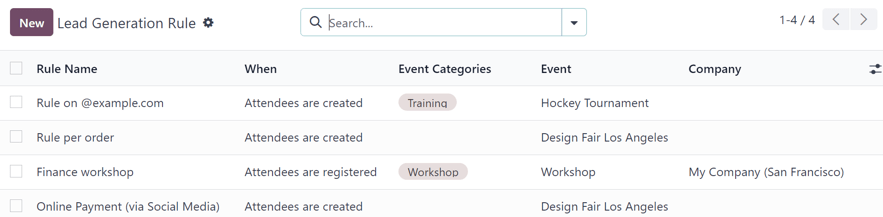
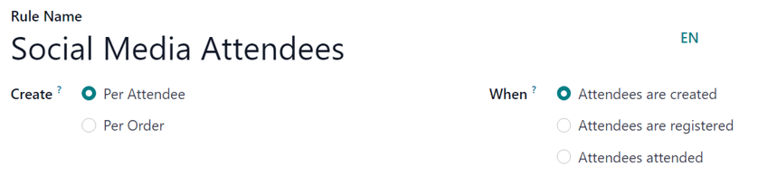
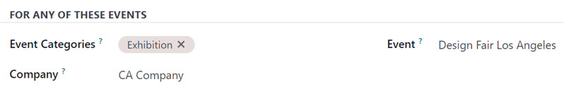
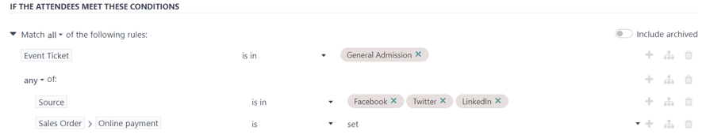
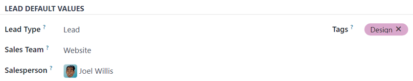

=====================
Lead generation rules
=====================

Odoo *Events* allows users to generate leads from their event attendees, based on a predetermined
criteria, known as *Lead Generation Rules*. These rules can be customized in a number of different
ways, in order to suit unique needs.

Lead generation page
====================

To create lead generation rules for an event, users must first navigate to the *Lead Generation
Rule* page inside of the Odoo *Events* application. To do so, navigate to :menuselection:`Events app
--> Configuration --> Lead Generation`.

On the :guilabel:`Lead Generation Rule` page, Odoo displays all the current lead generation rules
that have been created for the database, in a standard list view.

From the :guilabel:`Lead Generation Rule` page, users can view pertinent information related to each
existing lead generation rule, such as :guilabel:`Rule Name`, :guilabel:`When` the rule is
configured to be triggered, any :guilabel:`Event Categories` it is associated with, the
:guilabel:`Event` it is applied to, and the :guilabel:`Company` related to it (if applicable).

Create lead generation rules
============================

To create a lead generation rule for an event, navigate to the :guilabel:`Lead Generation Rule` page
in the Odoo *Events* application (:menuselection:`Events app --> Configuration --> Lead
Generation`), then click :guilabel:`New`.

Doing so reveals a blank :guilabel:`Lead Generation Rule` form.

.. image:: lead_generation_rules/lead-generation-rule-form.png
   :align: center
   :alt: A standard Lead Generation Rule form in the Odoo Events application.

First, start by entering a :guilabel:`Rule Name`.

Then, designate a lead creation option for the lead generation rule in the :guilabel:`Create` field.
The options are: :guilabel:`Per Attendee` or :guilabel:`Per Order`.

If :guilabel:`Per Attendee` is selected, a lead is created for each attendee (B2C). If
:guilabel:`Per Order` is selected, a single lead is created per ticket batch/sales order (B2B).

Next, designate *when* the lead should be created in the :guilabel:`When` field. The options are:

- :guilabel:`Attendees are created`: leads are created when an attendee record for an event is
  created.
- :guilabel:`Attendees are registered`: leads are created when the attendee officially registers,
  either manually or automatically.
- :guilabel:`Attendees attended`: leads are created when the attendee's attendance is officially
  confirmed, and the registration is set to *Done*.

For Any Of These Events section
-------------------------------

In the :guilabel:`For Any Of These Events` section of the :guilabel:`Lead Generation Rule` form that
follows, there are a few options to configure.

First, users can filter the attendees to include those who have attended specific event categories
in the :guilabel:`Event Categories` drop-down field. Multiple :guilabel:`Event Categories` can be
selected.

If no :guilabel:`Event Categories` are selected, no event category restriction is applied to the
lead generation rule.

Next, in the :guilabel:`Company` field, users can choose to restrict the triggering of this lead
generation rule to events belonging to a specific company (if working in a multi-company
environment). If left blank, no company restriction is applied.

Lastly, in the :guilabel:`Event` field, choose to filter the attendees to include those of a
specific event, via the drop-down menu. If left blank, no event restriction is applied.

If The Attendees Meet These Conditions section
----------------------------------------------

In the :guilabel:`If The Attendees Meet These Conditions` section of the :guilabel:`Lead Generation
Rule` form, users can configure specific criteria for their rule.

By default, this field is set to :guilabel:`Match all records` of attendees in the database.

To add specific criteria, click the :icon:`fa-plus` :guilabel:`Add condition` button. Or, click the
:icon:`fa-caret-right` :guilabel:`(right arrow)` icon to the left of :guilabel:`Match all records`.

Clicking the :icon:`fa-plus` :guilabel:`Add condition` button reveals a preconfigured condition
line, as an example, which can be modified.

Clicking the :icon:`fa-caret-right` :guilabel:`(right arrow)` icon to the left of :guilabel:`Match
all records` reveals a :guilabel:`New Rule` link. When :guilabel:`New Rule` is clicked, the same
preconfigured condition line that appears when the :icon:`fa-plus` :guilabel:`Add condition` button
is clicked is revealed.

The functionality of creating conditions for lead generation rules in this manner is similar to
:ref:`how to filters are defined in the Marketing Automation application
<marketing_automation/defining-filters>`.

Click into the first field of the condition line to reveal a popover menu of alphabetically-ordered
options to choose from. Once a selection (or selections) are made for the first field, click into
the second field of the condition line to reveal a drop-down menu of corresponding modifiers. Then,
in the third field select the final designating modifier to complete the custom condition line.

Toggle the :guilabel:`Include archived` switch to also include archived attendee records in the
condition.

To the right of each condition line are three icons:

- :icon:`fa-plus` :guilabel:`(plus sign) Add New Rule` icon: adds another rule to the condition.
- :icon:`fa-sitemap` :guilabel:`(site map) Add branch` icon: adds a branch of two additional
  condition lines that directly relate to the condition above it.
- :icon:`fa-trash` :guilabel:`(trash can) Delete node` icon: deletes the condition line entirely.

Users can see the number of attendee records that fall into that configured conditional rule(s) by
looking at the :guilabel:`record(s)` located at the bottom of the :guilabel:`If The Attendees Meet
These Conditions` section.

Lead Default Values section
---------------------------

At the bottom of the :guilabel:`Lead Generation Rule` form, there is the :guilabel:`Lead Default
Values` section.

First, designate the :guilabel:`Lead Type` to be generated from this rule, either :guilabel:`Lead`
or :guilabel:`Opportunity`.

Then, if desired, choose to automatically assign the created leads to a specific sales team in the
:guilabel:`Sales Team` field.

Next, decide if the generated leads (or opportunities) should automatically be assigned to a
specific salesperson in the :guilabel:`Salesperson` field.

And, lastly, choose to automatically add specific tags to the created leads (or opportunities)
generated from the rule. Multiple tags can be addeed, if desired.

Sample rule: social media attendees
===================================

The following is a realistic example of how a company may choose to configure a lead generation rule
for an event.

In this sample, the company is looking to generate leads for every attendee who bought a *General
Admission* ticket to a specific event (*Design Fair Los Angeles*), initially clicked a link for
tickets from a social media post, and purchased their ticket online.

First, the user would enter a memorable name related to the purpose of the rule in the
:guilabel:`Rule Name` field, like `Social Media Attendees`. Then, select :guilabel:`Per Attendee` in
the :guilabel:`Create` field, and :guilabel:`Attendees are created` in the :guilabel:`When` field.

Then, in the :guilabel:`For Any Of These Events` section, the user would select a corresponding
event category for the event in the :guilabel:`Event Categories` field, like :guilabel:`Exhibition`.

Next, if desired, the user would select the :guilabel:`Company` the event is associated with. Then,
select the specific :guilabel:`Event` the rule should focus its criteria on.

In the :guilabel:`If The Attendees Meet These Conditions` section, the user would click the
:icon:`fa-plus` :guilabel:`Add condition` button to reveal a new, modifiable condition line.

Next, the user would click in the first field, and select :guilabel:`Event Ticket` from the popover
menu that appears. In the second field, they would select :guilabel:`is in`. Then, in the third
field, the user would select any specific tickets for that event. In this case, the company is only
concerned with :guilabel:`General Admission` tickets.

Then, because the company wants to be even more specific about attendees who purchased a
:guilabel:`General Admission` ticket, the user would click the :icon:`fa-sitemap` :guilabel:`(site
map) Add branch` icon to reveal two new branch condition lines.

In the first of the two branch condition lines, they would select :guilabel:`Source` in the first
field, choose :guilabel:`is in` in the second field, and add the corresponding social media outlet
options in the third field. In this case, it was :guilabel:`Facebook`, :guilabel:`Twitter`, and
:guilabel:`LinkedIn`.

In the second of the two branch condition lines, they would select :guilabel:`Sales Order`
:icon:`fa-angle-right` :guilabel:`Online payment` in the first field. Then, they would select
:guilabel:`is` in the second field. Lastly, they would select :guilabel:`set` in the third field.

Finally, in the :guilabel:`Lead Default Values` section, the user would set the :guilabel:`Lead Type`
to :guilabel:`Lead`. Then, since they have a designated sales team that solely focuses on
:guilabel:`Website` sales, they would select that corresponding team in the :guilabel:`Sales Team`
field.

The user also wants to make sure the leader of that specific sales team is aware of these leads, so
they assign them in the :guilabel:`Salesperson` field. And, for added organizational purposes, they
add a :guilabel:`Design` tag in the :guilabel:`Tags` field to inform their sales team (and
salespeople) exactly what these generated leads are associated with.

.. seealso::
   - :doc:`create_events`
   - :doc:`sell_tickets`
