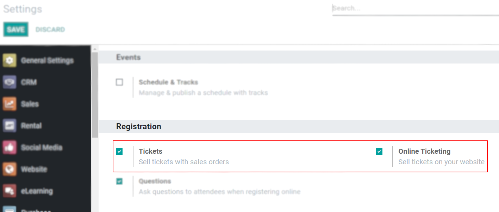
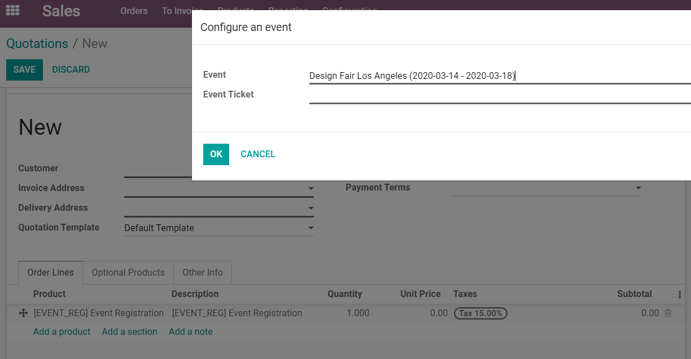
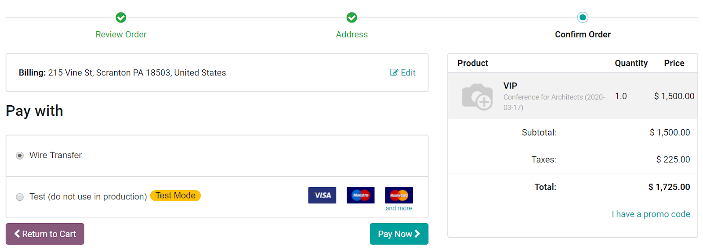

===============
Selling Tickets
===============

If you automate processes, you save time. If you give attendees multiple payment options to choose
from, you allow flexibility and open margins for more registrations to happen.

Configuration
=============

| Go to :menuselection:`Configuration --> Settings` and activate *Tickets* and *Online Ticketing*.
| *Tickets* allow tickets to be sold :ref:`events/create_event/through_sales_orders`. *Online
  Ticketing* allows the sale of tickets to happen :ref:`events/create_event/through_the_website`.

.. _events/create_event/through_sales_orders:

Through Sales Orders
--------------------

On the *Sales* application, choose the event product you created and add it as a product line. A
window pops-up, allowing you to choose the event for which you want to create the sales order.

.. important::
   Remember to create a product form for the event registration, under *Product*, in the *Sales*
   application, and to add that same product under your event’s form.

   .. image:: media/tickets_product.png
      :align: center
      :alt: View of an event form highlighting the column product under the tab tickets in Odoo
            Events

.. _events/create_event/through_the_website:

Through the Website
-------------------

On the website, once tickets are added to the cart, the user can continue the transaction choosing
among the payment methods you chose to have available.

.. seealso::
   - :doc:`/applications/general/payment_acquirers`
