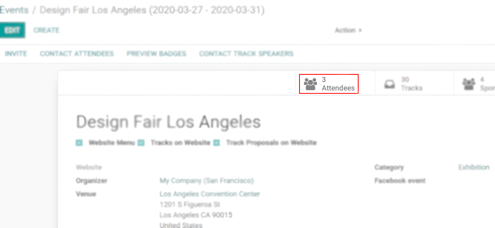
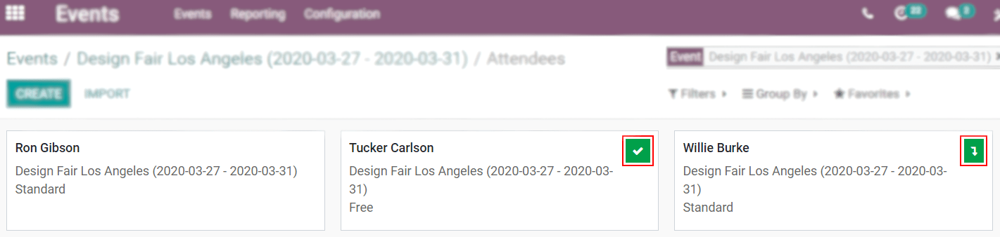
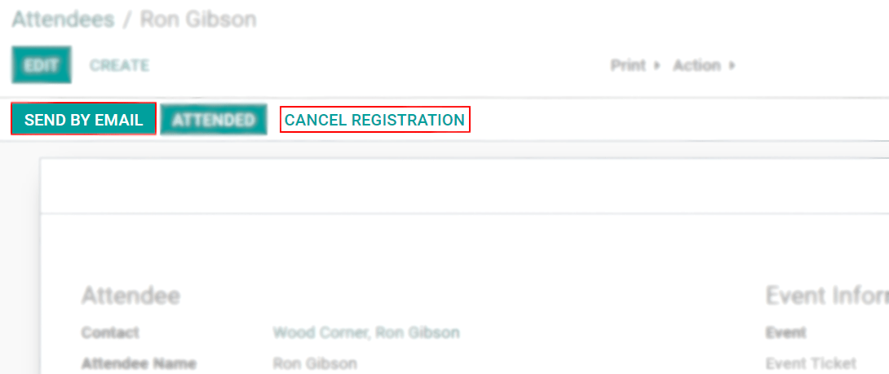
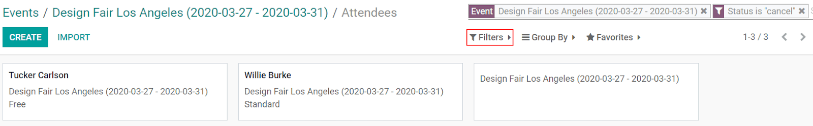

====================
Track your Attendees
====================

Attendees are at the heart of your event. Keeping track of their number and managing their
registration and attendance is necessary for planning and analyzing reasons.

Attendees list and attendance
=============================

| Once attendees have registered or bought their tickets, they are added to the *Attendees* list.
| Tickets sold through sales orders validate attendees as soon as the quotation is confirmed.

The check mark button is used to confirm the registration. Once a registration is confirmed,
attendance can be marked.

Bagdes and cancellations
------------------------

On the attendees form, choose to send badges manually by clicking on *Send By Email*. *Cancel
Registration* to have that attendee being moved to the *Cancelled* stage.

         Events

To see a list of your canceled attendees, under *Filters*, add a *Custom Filter* choosing *Status
> is > Cancelled*.

.. seealso::
   - :doc:`../integrations/integration_sms`
   - :doc:`tickets`
   - :doc:`track_talks`