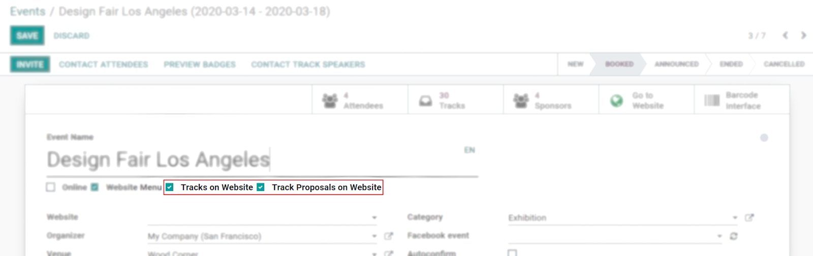
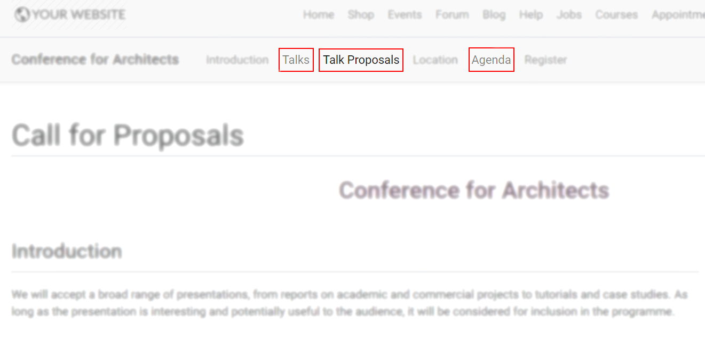
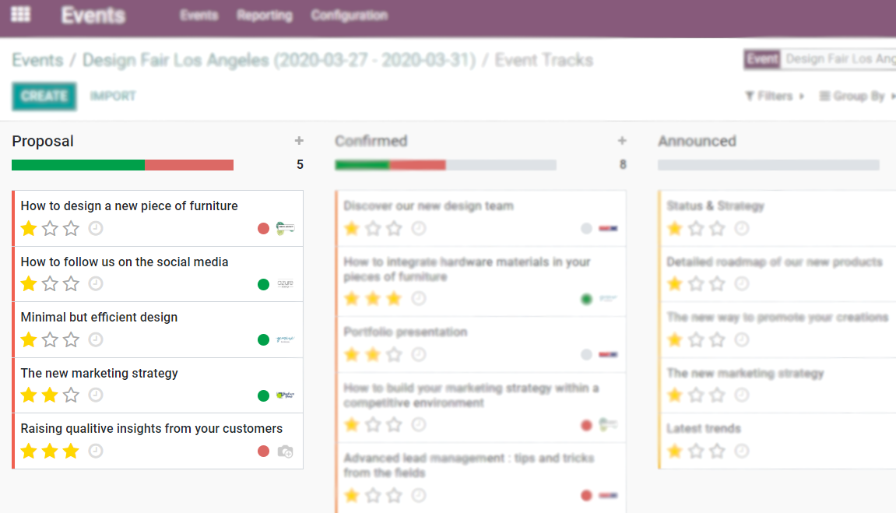
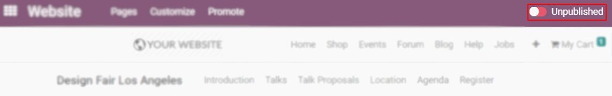

======================
Track and Manage Talks
======================

Allow partners to submit talk proposals so they can share their knowledge and expertise. Good
speakers and talks are what make your event great.

Configuration
=============

| Go to :menuselection:`Events --> Configuration --> Settings` and enable *Schedule & Tracks*.
| Now, in your event's form, once *Website menu* is enabled, the options *Tracks on Website* and
  *Track Proposals on Website* become available. Enabling them adds the menus *Talks*,
  *Talk Proposals*, and *Agenda* to your website.

Besides having the ability to suggest their own talks, the website now allows users to see a list of
the whole agenda and scheduled talks.

.. tip::
   To handle tracks internally and not have the menus *Talks*, *Talk Proposals*, and *Agenda*
   online, use the menu *Tracks* individually.

Publishing speaker proposals
----------------------------

Once partners have filled in the appropriate form and submitted their proposals, a new *Proposal* is
instantly created under the menu *Track*.

If the proposal is accepted and can go online, simply open its form and click on *Go to Website*.
From the website page, turn *Published* on.

.. seealso::
   - :doc:`../integrations/integration_sms`