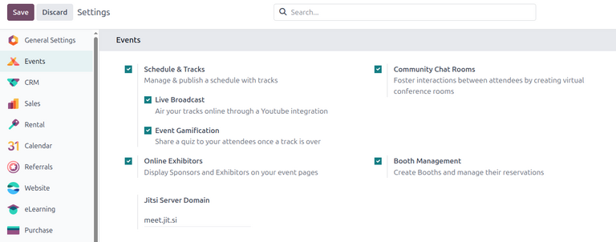
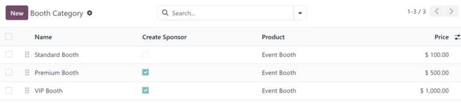
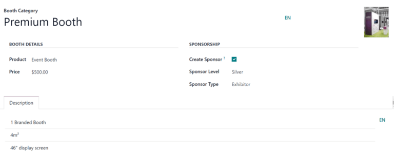
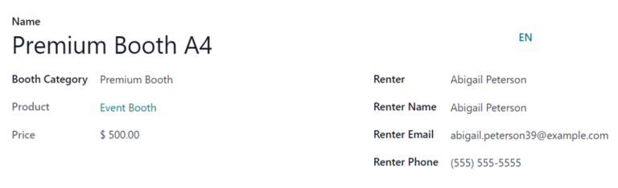
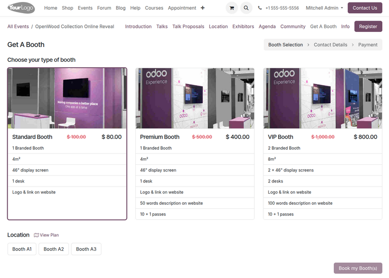

============
Event booths
============

The Odoo **Events** application provides users with the ability to create, sell, and manage event
booth reservations.

Configuration
=============

In order to create, sell, and manage booths for events, the *Booth Management* feature must be
activated.

To do that, navigate to :menuselection:`Events app --> Configuration --> Settings`. Click the
:guilabel:`Booth Management` checkbox, then click :guilabel:`Save` to enable the setting.

When the :guilabel:`Booth Management` setting is activated, Odoo automatically creates a default
*Event Booth* product in the database with its :guilabel:`Product Type` set to :guilabel:`Service`
and its :guilabel:`Create on Order` field set to :guilabel:`Event Booth`.

Users can modify/duplicate this default product or create a new, custom product. In either case,
users **must** verify that an *Event Booth* product exists with this configuration in order to
create booths and booth categories, as shown later in this documentation.

.. _events/booth-categories:

Booth categories
================

Custom *booth categories* can be created by users to assign different price tiers and :doc:`sponsors
<event_sponsors>` for multiple booths at once.

When the *Booth Management* setting is activated, Odoo automatically creates three default booth
categories: *Standard Booth*, *Premium Booth*, and *VIP Booth*. Users can modify/duplicate these
default categories or create new, custom categories. In either case, booth categories **must** exist
in the database before users can create event booths.

Booth categories dashboard
--------------------------

To view and manage booth categories, navigate to :menuselection:`Events app --> Configuration -->
Booth Categories`.

The :guilabel:`Booth Category` dashboard displays a list of all created booth categories along with
the booth category name, associated *Event Booth* product, and price.

.. note::
   If sponsors are enabled in the **Events** app, an additional *Create Sponsor* checkbox appears on
   each record in the list as well as on the booth category form.

To edit an existing booth category, select it from the list and proceed to make any desired
modifications in the resulting booth category form.

.. _events/booth-categories/create:

Create booth category
---------------------

To create a booth category, click the :guilabel:`New` button in the upper-left corner of the page to
reveal a blank booth category form.

Start by entering a name for the booth category in the top :guilabel:`Booth Category` field. This is
a **required** field.

Optionally, upload a corresponding image (e.g., a sample photo of how the booth looks).

In the :guilabel:`Booth Details` section, assign an *Event Booth* product in the :guilabel:`Product`
field. This a **required** field.

Next, set a price for the booth category in the :guilabel:`Price` field.

If event sponsors are configured, a :guilabel:`Sponsorship` section appears with a :guilabel:`Create
Sponsor` checkbox option. When enabled, the user is created as an official *Sponsor* of the event
whenever a booth of this category is booked.

Additionally, the :guilabel:`Sponsor Level` and :guilabel:`Sponsor Type` fields can be configured to
specify the level/tier and the type of sponsorship. See the :doc:`event sponsors <event_sponsors>`
documentation for more information about configuring sponsor levels and types.

Finally, in the :guilabel:`Description` tab, enter any information about the booth category (e.g.,
the square footage, any amenities, size of display screen, etc.).

Add booths to events
====================

After configuring booth categories, booths can be created and added to specific events.

Booths dashboard
----------------

To create and add booths to a specific event, first navigate to its event form and click the
:guilabel:`Booths` smart button at the top to access the :guilabel:`Booths` dashboard.

The dashboard is displayed in a Kanban view, by default, and grouped by two different:
:guilabel:`Available` and :guilabel:`Unavailable`. The booths in the :guilabel:`Available` stage are
still available for exhibitors to reserve. The booths in the :guilabel:`Unavailable` stage have
already been reserved and are no longer available.

.. note::
   The :guilabel:`Booths` dashboard is also viewable in a :icon:`oi-view-list` :guilabel:`(List)`,
   :icon:`fa-area-chart` :guilabel:`(Graph)`, or :icon:`oi-view-pivot` :guilabel:`(Pivot)` views for
   users to track insights about booths for a particular event.

In addition to the default :guilabel:`Available` and :guilabel:`Unavailable` filters, the **Booths**
dashboard can be grouped by the following:

- :guilabel:`Status`: Group by the availability of the booths. This is the default grouping option.
- :guilabel:`Renter`: Group by the individual renters of the booths.
- :guilabel:`Booth Category`: Group by the booth categories of the booths.
- :guilabel:`Is Paid`: Group by booths that have been paid and reserved.
- :guilabel:`Event`: Group by the associated event of the booths.

See the :doc:`reporting <../../../essentials/reporting>` documentation for more information about
views and how to apply filters and grouping options.

Create an event booth
---------------------

To create a new booth, click :guilabel:`New` in either the Kanban or List view. This opens an event
booth form for the user to configure a new booth.

Start by typing in a :guilabel:`Name` for the booth. This is a **required** field.

Then, apply (or :ref:`create <events/booth-categories/create>`) a :guilabel:`Booth Category`. This
is a **required** field.

After selecting an existing :guilabel:`Booth Category`, the corresponding product and price of the
selected booth category appear in the non-modifiable :guilabel:`Product` and :guilabel:`Price`
fields.

Continue by selecting a renter's contact in the :guilabel:`Renter` drop-down to automatically
populate the :guilabel:`Renter Name`, :guilabel:`Renter Email`, and :guilabel:`Renter Phone` fields.
Alternatively, these fields can also be entered manually.

.. note::
   When a renter :ref:`reserves a booth <events/booth-reservation/reserving>` through the event
   website, the renter-related fields on the form automatically populate based on the information
   provided during the online transaction. The booth then automatically changes status from
   *Available* to *Unavailable*.

The status of the booth (:guilabel:`Available` or :guilabel:`Unavailable`) can also be changed
manually, either by clicking the appropriate status from the status bar in the upper-right of the
booth form or by dragging-and-dropping the desired booth into the appropriate stage via the *Booths*
dashboard Kanban view.

Event booth reservation
=======================

With event booths configured, renters can view and reserve them on the event webpage via the *Get A
Booth* event sub-menu link.

This section outlines how to configure the event website to allow renters to reserve booths. It then
provides a view of how renters can reserve the booths through the website.

Enable booth reservations
-------------------------

To access the event booths page for a specific event, navigate to the event form in the **Events**
app and click the :guilabel:`Go to Website` smart button to open the event page.

If the event sub-menu (with the :guilabel:`Get A Booth` option) is *not* showing up, there are two
ways to make it appear: via the website edit mode or through the developer mode.

Website edit mode
~~~~~~~~~~~~~~~~~

While on the event page, enter the edit mode by clicking the :guilabel:`Edit` button in the
upper-right corner. Then, click into the :guilabel:`Customize` tab of the resulting sidebar of web
design tools.

In the :guilabel:`Customize` tab, click the toggle switch for :guilabel:`Sub-menu (Specific)`, then
click :guilabel:`Save`. Doing so reveals the event sub-menu with various options (e.g., Talks,
Agenda, Info, etc.).

Developer mode
~~~~~~~~~~~~~~

Alternatively, enter :doc:`Debug mode <../../../general/developer_mode>` and open the specific event
form in the **Events** application.

With *Debug mode* on, an array of sub-menu options appears at the top of the event form. Click the
checkbox for :guilabel:`Website Submenu` to display the event sub-menu on the event page.

Next, choose which sub-menu options to include on the event page. In this case, make sure the
:guilabel:`Booth Register` checkbox is selected.

.. _events/booth-reservation/reserving:

Reserve a booth
---------------

Once the sub-menu is enabled on the event page either through the website editor or through the
debug mode, renters can then view and reserve available booths.

Renters can access the *Get A Booth* page on the event website by selecting the desired event from
the :guilabel:`Events` homepage then clicking the :guilabel:`Get A Booth` sub-menu option.

From the :guilabel:`Get A Booth` page, the renter can select their desired booth option, then
:guilabel:`Location`. Next, they click the :guilabel:`Book my Booth(s)` button located at the
bottom-right of the page.

Doing so reveals a :guilabel:`Contact Details` page where they fill out either *Contact Details* or
*Sponsor Details* depending on how the booth was configured.

Once the necessary information has been entered, the renter then clicks the :guilabel:`Go to
Payment` at the bottom of the page and proceeds to complete the typical :doc:`checkout process
<../../../websites/ecommerce/checkout>`.

Upon a successful payment confirmation, the renter has successfully reserved a booth.

In the database, that selected booth automatically moves to the *Unavailable* stage on the
event-specific *Booths* page in the **Events** app.

The provided *Sponsor* information (if applicable) and *Sales Order* information are also accessible
from the specific event form via their respective smart buttons that appear at the top of the form.

.. seealso::
   - :doc:`../event_setup/create_events`
   - :doc:`sell_tickets`
