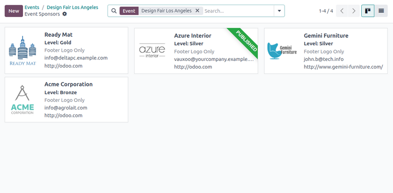
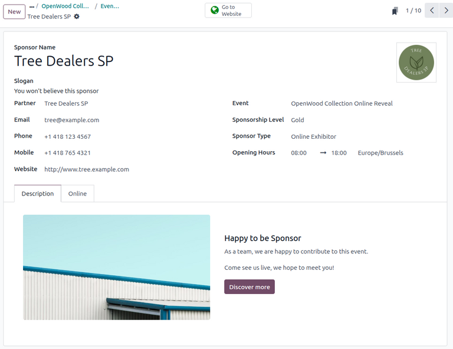
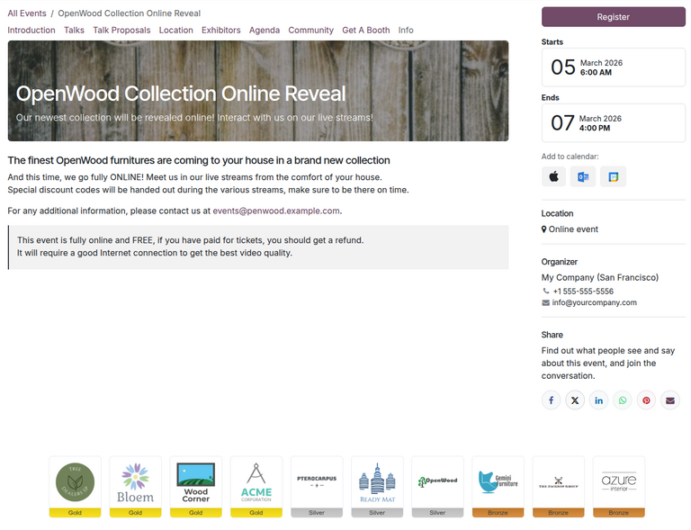
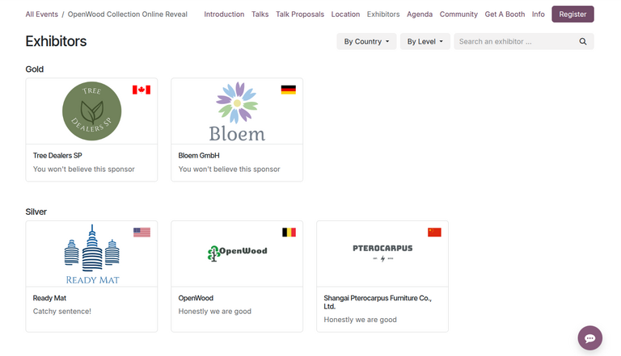

==============
Event sponsors
==============

In the **Events** app, users can add sponsors for the event and feature them online or in person as
exhibitors.

Configuration
=============

To allow users to create and manage event sponsors, the **Events** app must first be configured by
navigating to :menuselection:`Events app --> Configuration --> Settings`.

Next, click on the :guilabel:`Online Exhibitors` checkbox. This setting enables the user to create
and manage event sponsors. Finally, remember to click the :guilabel:`Save` button on the top-left to
enable and load the setting.

View or manage sponsors
=======================

To view and manage sponsors for an event, navigate to :menuselection:`Events app --> Events` then
click the relevant event.

At the top of the event form, click on the :icon:`fa-black-tie` :guilabel:`Sponsors` smart button.
This opens a list of existing sponsors/exhibitors in the :icon:`oi-view-kanban` (:guilabel:`Kanban`)
view. Optionally, to view the sponsors in a list, click the :icon:`oi-view-list` (:guilabel:`List`)
view.

Any newly added sponsors appear on this page as cards with the sponsor logo, name, type of sponsor,
and contact information. Additionally, a green :guilabel:`Published` banner appears in the corner
when the sponsor is published on the webpage.

To delete a sponsor, click on the sponsor card. Next to the sponsor name at the top-left, click the
:icon:`fa-cog` :guilabel:`(gear)` icon and select :guilabel:`Delete`.

Create a new sponsor
====================

On the sponsor dashboard page, click the :guilabel:`New` button at the top-left to open a new event
sponsor form.

On the form are multiple fields to configure the sponsor's contact details and type of sponsorship:

- :guilabel:`Sponsor Name`: Name of the sponsor displayed on the website.
- :guilabel:`Slogan`: Slogan of the sponsor.
- :guilabel:`Partner`: Contact of the sponsorship partner. This field is **required**.
- :guilabel:`Email`: Email of the sponsor.
- :guilabel:`Phone`: Phone number of the sponsor.
- :guilabel:`Mobile`: Mobile phone of the sponsor.
- :guilabel:`Website`: Link to the sponsor's website.
- :guilabel:`Event`: Specific event to be sponsored.
- :guilabel:`Sponsorship Level`: Tier or level of sponsorship.
- :guilabel:`Sponsor Type`: Type of participation of the sponsor during the event.

To start, enter a name for the sponsor under the :guilabel:`Sponsor Name` field.

.. note::
    Alternatively, selecting a contact under the :guilabel:`Partner` drop-down will auto-populate
    the :guilabel:`Sponsor Name` field with the partner name.

Optionally, enter the :guilabel:`Slogan`. This slogan is displayed on the sponsor's page on the
website.

Next, select or create a :guilabel:`Partner` for the sponsorship by selecting a contact from the
drop-down.

.. note::
    Selecting an existing partner contact will auto-populate the remaining :guilabel:`Email`,
    :guilabel:`Phone`, :guilabel:`Mobile`, and :guilabel:`Website` fields **only if** those fields
    are already configured on the partner's contact form. To view this contact form, click the
    :icon:`oi-arrow-right` :guilabel:`(right)` arrow at the right of the :guilabel:`Partner`
    drop-down.

Otherwise, if the fields do not auto-populate, manually enter the contact's details.

The :guilabel:`Event` field is already populated. However, it is possible to change the sponsor's
event by selecting the relevant option under the drop-down.

Then, select or create a sponsorship level/tier. By default Odoo **Events** creates three
sponsorship levels: *Gold*, *Silver*, and *Bronze*. Each of these options displays the sponsor's
logo on the event webpage in gold, silver, and bronze colors, respectively.

In the :guilabel:`Sponsor Type` field, select how the sponsor should be featured during the event.

Odoo **Events** supports three sponsor types:

- :guilabel:`Footer Logo Only`: Displays the sponsor's logo in the footer of the event webpage.
  Selecting this option creates a :guilabel:`Display in footer` toggle button on the form. The
  footer logo is displayed **only if** this button is toggled.
- :guilabel:`Exhibitor`: Features the sponsor as an exhibitor on the event webpage under the
  *Exhibitors* sub-menu.
- :guilabel:`Online Exhibitor`: Features the sponsor as an online exhibitor on the event webpage
  under the *Exhibitors* sub-menu, similar to the :guilabel:`Exhibitor` option. However, this option
  also displays a *Connect* button when hovering over the sponsor's thumbnail. When clicked,
  attendees can connect with the sponsor online through their contact details.

.. note::
    Both the :guilabel:`Exhibitor` and the :guilabel:`Online Exhibitor` options display the sponsor
    logo in the footer of the event webpage.

If the :guilabel:`Exhibitor` or :guilabel:`Online Exhibitor` option is selected, an additional
:guilabel:`Description` tab appears at the bottom of the sponsor form. Enter a description for the
sponsor to be displayed on the sponsor's webpage.

Additionally, for the :guilabel:`Online Exhibitor` option, a :guilabel:`Online` tab appears at the
bottom for the user to configure their *Jitsi* integration.

Publish an event sponsor
========================

To feature the sponsor as an exhibitor, the sponsor **must** be published first on the event
webpage.

If the :guilabel:`Footer Logo Only` sponsor type is selected, toggling the :guilabel:`Display in
footer` button publishes the sponsor and displays the sponsor logo in the footer of the event's
webpage.

For the :guilabel:`Exhibitor` or :guilabel:`Online Exhibitor` options, click on the :icon:`fa-globe`
:guilabel:`Go to Website` on the form. Then, click the :guilabel:`Unpublished` toggle button at the
top-right to publish the sponsor page.

To see the published list of sponsors on the website, navigate to :menuselection:`Website app -->
Events sub-header`. Then, click on the relevant event. In the sub-menu, click on
:guilabel:`Exhibitors` to see the list of published sponsors.

.. note::
    If the sub-header menu is **not** showing up on the event website, click :guilabel:`Edit` at the
    top-right corner. Then, click into the :guilabel:`Customize` tab of the sidebar.

    In the :guilabel:`Customize` tab, click the :guilabel:`Sub-menu (Specific)` toggle button and
    click :guilabel:`Save`.

    The website then displays the event sub-header menu with various options.

.. seealso::
    - :doc:`event_booths`
    - :doc:`../attendee_experience/event_tracks`
