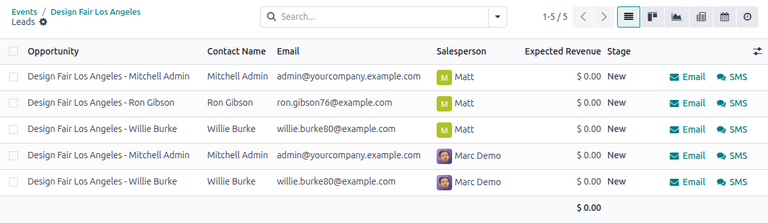
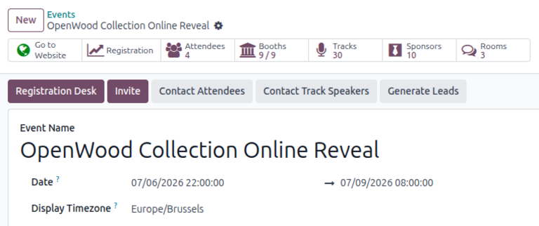

==========================
Generate leads from events
==========================

Odoo **Events** allows users to generate leads from their event attendees based on customizable
criteria. Leads can be generated manually, or automatically by configuring *lead generation rules*.

View lead generation rules
==========================

To view the lead generation rules for an event, navigate to :menuselection:`Events app -->
Configuration --> Lead Generation`.

The *Lead Generation Rule* page displays any previously configured rules in a standard list view
with each rule's :guilabel:`Rule Name`, :guilabel:`Lead Creation Type`, :guilabel:`When` it is
triggered, its associated :guilabel:`Event Templates`, the :guilabel:`Event` it is applied to, and
its related :guilabel:`Company` (if applicable).

Create a lead generation rule
=============================

On the *Lead Generation Rule* dashboard, click :guilabel:`New` to open a new :guilabel:`Lead
Generation Rule` form.

Start by entering a :guilabel:`Rule Name`.

In the :guilabel:`Create` field, select one of the following options to specify the lead creation
type:

- :guilabel:`Per Attendee`: Create a single lead for each attendee.
- :guilabel:`Per Order`: Create a single lead for each :doc:`ticket sale <sell_tickets>`.

In the :guilabel:`When` field, select one of the following options to specify when the rule is
triggered:

- :guilabel:`Attendees are created`: Create a lead when an attendee record for an event is created.
- :guilabel:`Attendees are registered`: Create a lead when an attendee registers for an event.
- :guilabel:`Attendees attended`: Create a lead when an attendee's attendance is confirmed and the
  registration stage is set to *Done*.

Event-specific filters
----------------------

In the :guilabel:`For Any Of These Events` section of the form, configure the following options to
restrict the rule to the following criteria:

- :guilabel:`Event Templates`: Trigger the rule only for events of the specified :doc:`event
  template/category <../event_setup/event_templates>`.
- :guilabel:`Company`: Trigger the rule only for events belonging to the specified company (if
  working in a :doc:`multi-company <../../../general/companies/multi_company>` environment).
- :guilabel:`Event`: Trigger the rule only for the specified event.

Attendee-specific filters
-------------------------

In the :guilabel:`If The Attendees Meet These Conditions` section of the form, restrict the rule to
attendees fulfilling specific criteria.

By default, this field is set to :guilabel:`Match all records` of attendees in the database.

To add specific criteria, click the :icon:`fa-plus` :guilabel:`Add condition` button. Alternatively,
click the :icon:`fa-caret-right` :guilabel:`(right arrow)` icon, then click :guilabel:`New Rule`.

Doing so adds a new custom :ref:`filter rule <search/custom-filters>`. Users can select a *field
name* to filter by and choose a *conditional operator* to compare the *value* to the chosen field.
If needed, users can also add a group of nested conditions that depend on the parent rule by
clicking :icon:`fa-sitemap` :guilabel:`(Add branch)`. For any group of conditions, users can toggle
between matching :guilabel:`all` of the conditions in the group or :guilabel:`any` of the
conditions.

The number of filtered attendee records is displayed at the bottom of the section. Click
:guilabel:`# record(s)` to view the list of attendees that match the filter rule.

.. seealso::
   :doc:`../../../essentials/search`

Lead default values
-------------------

In the :guilabel:`Lead Default Values` section, assign default values to new leads generated from
this rule.

First, in the :guilabel:`Lead Type` field, specify whether this rule creates a :guilabel:`Lead` or
an :guilabel:`Opportunity`.

.. note::
   The :guilabel:`Lead Type` field only appears if the **CRM** app is installed and :doc:`leads
   <../../../sales/crm/acquire_leads/convert>` are enabled. To do so, navigate to
   :menuselection:`CRM app --> Configuration --> Settings`, then enable the :guilabel:`Leads`
   feature.

In the :guilabel:`Sales Team` field, select a specific sales team in the database to which newly
created leads are automatically assigned. Similarly, specify a :guilabel:`Salesperson` to which the
leads are automatically assigned.

Finally, in the :guilabel:`Tags` field, add one or more tags to the created leads generated from the
rule to organize and distinguish leads by specific identifiers/categories.

.. example::
   A company called *Stealthy Wood* wants to generate leads for every attendee who bought a *General
   Admission* ticket to their *Design Fair Los Angeles* event by clicking a link for tickets from a
   social media post on *LinkedIn*, then purchasing the ticket online. Additionally, any new leads
   generated should be automatically assigned to their dedicated *Website Sales* team.

   To generate these leads, they create a rule called `Social Media Attendees`. Then, they select
   :guilabel:`Per Attendee` in the :guilabel:`Create` field and :guilabel:`Attendees are created` in
   the :guilabel:`When` field to trigger the rule every time a new attendee is created.

   In the :guilabel:`For Any Of These Events` section, they select :guilabel:`Exhibition` as the
   event category in the :guilabel:`Event Templates` field. Next, they select *Stealthy Wood* as the
   :guilabel:`Company` the event is associated with. They also select *Design Fair Los Angeles* as
   the specific :guilabel:`Event` the rule should generate leads for.

   In the :guilabel:`If The Attendees Meet These Conditions` section, they click the :icon:`fa-plus`
   :guilabel:`Add condition` button to reveal a new, modifiable condition line.

   Next, they click the first field and select :guilabel:`Ticket Type` from the popover. In the
   second field, they select `=`. In the third field, they select the :guilabel:`General Admission`
   ticket type.

   Because the company wants to be even more specific about attendees who purchased a
   :guilabel:`General Admission` ticket, they add two more condition lines by clicking
   :guilabel:`New Rule` or :icon:`fa-plus` :guilabel:`(Add New Rule)`.

   In the second condition line, they select :guilabel:`Source` in the first field, choose `=` in
   the second field, and add the corresponding :guilabel:`LinkedIn` social media outlet options in
   the third field.

   In the final condition line, they select :guilabel:`Sales Order` :icon:`fa-angle-right`
   :guilabel:`Online payment` in the first field. Then, they select :guilabel:`is` in the second
   field and :guilabel:`set` in the third field.

   Finally, in the :guilabel:`Lead Default Values` section, they assign these leads to their
   *Website Sales* team in the :guilabel:`Sales Team` field. They also add *Matt* as the lead
   :guilabel:`Salesperson` responsible for managing the leads. Finally, for organization purposes,
   they add a *Design* tag in the :guilabel:`Tags` field.

   .. image:: lead_generation/example-lead-generation.png
      :alt: Example lead generation form in Odoo Events.

Generate leads
==============

Leads are automatically generated for applicable events whenever a rule is satisfied. To view
generated leads, open the *Events* app and select the targeted event. A :icon:`fa-star`
:guilabel:`Leads` smart button appears at the top of the chosen event form, displaying the number of
leads generated for this event.

Click the :icon:`fa-star` :guilabel:`Leads` smart button to open a dashboard of generated leads. By
default, the dashboard opens in a :icon:`oi-view-list` :guilabel:`(List)` view displaying each
lead's title, associated attendee's contact details, assigned salesperson, the expected revenue and
stage of the lead, and the option to either :guilabel:`Email` or send an :guilabel:`SMS` to the
lead.

Leads can also be viewed in the :icon:`oi-view-kanban` :guilabel:`(Kanban)`, :icon:`fa-area-chart`
:guilabel:`(Graph)`, :icon:`oi-view-pivot` :guilabel:`(Pivot)`, :icon:`fa-calendar`
:guilabel:`(Calendar)`, and :icon:`fa-clock-o` :guilabel:`(Activity)` views. The search bar's
drop-down menu allows users to :ref:`filter <search/filters>` or :ref:`group <search/group>` records
by specific criteria in each view.

Manually generate leads
-----------------------

Leads can also be manually generated from an event form by clicking the :guilabel:`Generate Leads`
button. This allows users to generate (or re-generate) leads as needed (e.g., after modifying a
rule) without duplicating existing leads.

.. seealso::
   - :doc:`../event_setup/create_events`
   - :doc:`sell_tickets`
