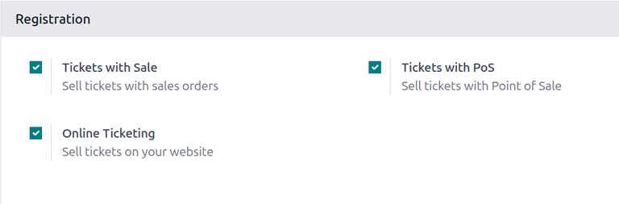
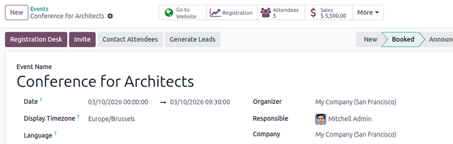
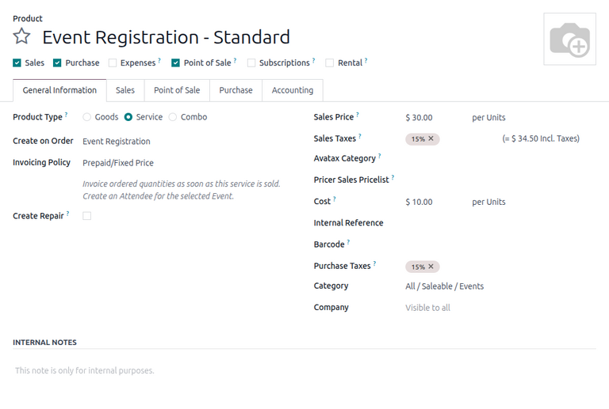
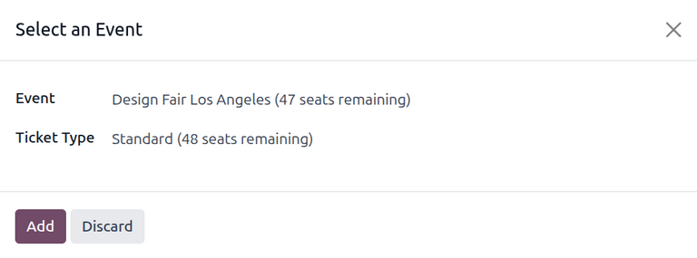
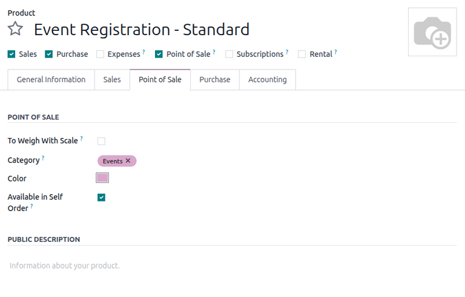
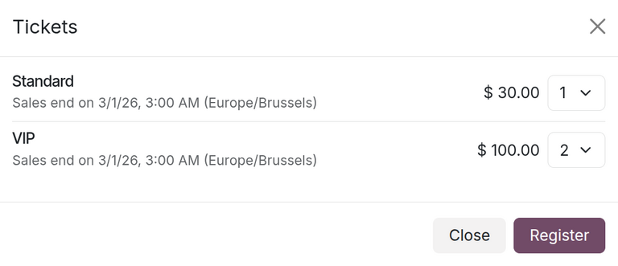
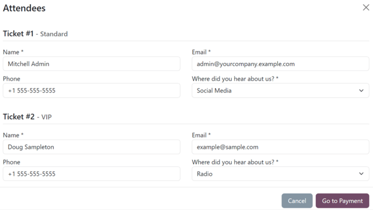

==================
Sell event tickets
==================

Odoo **Events** provides users with the ability to create custom event tickets and ticket tiers with
various price points.

It also allows them to sell event tickets in different ways: via standard sales orders, through
point of sales, and online through an integrated website.

Configuration
=============

In order to sell event tickets in Odoo, some settings must first be enabled.

First, navigate to :menuselection:`Events app --> Configuration --> Settings`. In the
:guilabel:`Registration` section, there are several different settings:

- :guilabel:`Tickets with Sale`: Allows users to sell event tickets with standard sales orders in
  the **Sales** app.
- :guilabel:`Tickets with PoS`: Allows users to sell even tickets with point of sales in the **Point
  of Sale** app.
- :guilabel:`Online Ticketing`: Allows users to sell event tickets online through their integrated
  Odoo website.

To activate a setting, tick the checkbox beside the desired feature's label, and click
:guilabel:`Save` at the upper-left to enable it.

With these settings enabled, any event with paid tickets sold (either through a sales order or
through the website) features a :icon:`fa-dollar` :guilabel:`Sales` smart button at the top of the
event form. Clicking the :icon:`fa-dollar` :guilabel:`Sales` smart button reveals a separate page,
showcasing all the sales orders (standard and/or online) related to tickets that have been sold for
that specific event.

Sell event tickets with the Sales app
=====================================

To sell event tickets with sales orders, start by navigating to the :menuselection:`Sales` app.
Then, click :guilabel:`New` to open a new quotation form.

After filling out the top portion of the form with the appropriate customer information, click
:guilabel:`Add a product` in the :guilabel:`Order Lines` tab. Then, in the :guilabel:`Product`
column, select (or create) an event registration product.

To add an event registration product to a sales order, its :guilabel:`Product Type` field **must**
be set to :guilabel:`Service` and the :guilabel:`Create on Order` field **must** be set to
:guilabel:`Event Registration`. These fields are accessible in the product form of the event
registration product.

Once an event registration product is selected, a :guilabel:`Select an Event` pop-up window appears.

From the :guilabel:`Select an Event` pop-up window, select which event this ticket purchase is
related to in the :guilabel:`Event` field drop-down menu. Then, in the :guilabel:`Ticket Type`
drop-down menu, select which ticket tier the customer wishes to purchase, if there are multiple
tiers configured for that event.

When all the desired configurations are complete, click :guilabel:`Add`. Doing so returns the user
to the sales order, with the event registration ticket product now present in the :guilabel:`Order
Lines` tab. The user can proceed to confirm and close the sale, per the usual process.

.. tip::
   To re-open the *Select an Event* pop-up window, click on the event registration product name in
   the :guilabel:`Order Lines` tab, then click on the :icon:`fa-pencil` :guilabel:`(pencil)` icon.

Sell event tickets through the Point of Sale app
================================================

To sell event tickets through a point of sale, the event registration products must be configured to
appear in the **Point of Sale** app.

First, navigate to the product form for the event registration product by going to
:menuselection:`Sales app --> Products --> Products` and selecting the desired product. Under the
name of the product, select the :guilabel:`Point of Sale` checkbox to enable the product to be
visible in a :abbr:`POS (point of sale)`.

After selecting, a :guilabel:`Point of Sale` tab appears where the user can optionally provide
additional information about the event tickets in a :abbr:`POS (point of sale)`, such as its
category or whether it can be self-ordered.

With the products configured, navigate to :menuselection:`Point of Sale` app and open a :abbr:`POS
(point of sale)` register. The :abbr:`POS (point of sale)` displays any open events with the
corresponding event registration products, as well as the event registration products themselves.

To learn more about configuring and selling products in a :abbr:`POS (point of sale)`, refer to the
:doc:`Point of Sale <../../../sales/point_of_sale>` documentation.

Sell event tickets through the Website app
==========================================

When a visitor arrives on the registration page of the event website, they can click the
:guilabel:`Register` button to purchase a ticket to the event.

.. note::
   If the visitor is **not** already on the registration page of the event website, clicking
   :guilabel:`Register` on the event website's submenu redirects them to the proper
   registration page. From there, they can click the :guilabel:`Register` button to begin the ticket
   purchasing process.

If different ticket tiers are configured for the event, the visitor is presented with a
:guilabel:`Tickets` pop-up window.

From here, visitors select which ticket tier they would like to purchase, along with a quantity,
using the drop-down menu available to the right of their desired ticket. Once the desired selections
have been entered, the visitor then clicks the :guilabel:`Register` button.

Then, an :guilabel:`Attendees` pop-up window appears, containing all the questions that have been
configured in the :guilabel:`Questions` tab of the event form for this particular event.

If multiple tickets are being purchased at once, there are numbered sections for each individual
ticket registrant, each containing the same questions. However, if any question has been configured
with the :guilabel:`Ask once per order` setting, that question is only asked once, **not** for every
attendee making the reservation in the order.

With all necessary information entered, the visitor can then click the :guilabel:`Go to Payment`
button. Doing so first takes the visitor to a :guilabel:`Billing` confirmation page, followed by a
:guilabel:`Payment` confirmation page, where they can utilize any configured payment method set up
in the database to complete the order.

Then, once the purchase is complete on the front-end of the website, the subsequent sales order is
instantly accessible in the back-end of the database.

.. seealso::
   :doc:`../event_setup/create_events`
