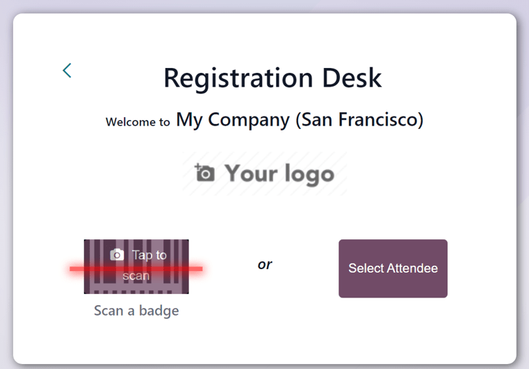
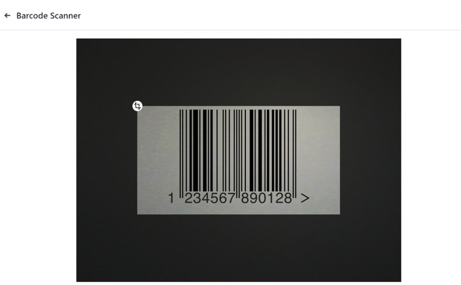
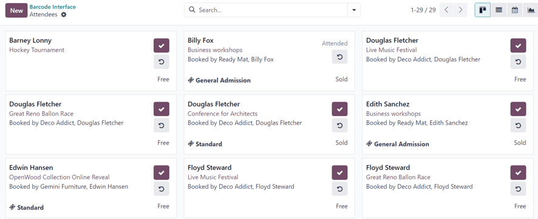

=================
Registration desk
=================

Use the *Registration Desk* feature in Odoo *Events* to grant event access to registered attendees
as they arrive, and store valuable attendee-related data in the reporting metrics for future
analysis.

Registration Desk page
======================

First, the person (or people) in charge of granting access to event attendees, would ideally have a
compatible mobile-device open to their Odoo database.

.. note::
   The *Registration Desk* feature works with laptops that have cameras, but mobile devices are more
   convenient for managing attendee access.

Then, open the :menuselection:`Events app`, and click the :guilabel:`Registration Desk` header menu
option. Doing so, reveals a separate :guilabel:`Registration Desk` page.

There is only a :guilabel:`Registration Desk` square in the center of the page, with a simple
message, reading: :guilabel:`Welcome to (Company Name)`. Beneath that, the company logo that has
been uploaded in the database appears.

Then, at the bottom of the :guilabel:`Registration Desk` box, there are options to either
:guilabel:`Scan a badge` or :guilabel:`Select Attendee`. Those are the two different ways users can
grant access to event attendees.

Scan a badge
============

If users wish to simply scan the codes present on the event attendee badges, they would navigate to
the :guilabel:`Registration Desk` page (:menuselection:`Events app --> Registration Desk`), and
click the :guilabel:`Scan a badge` option.

Upon doing so, Odoo requests permission to access the camera connected to the device currently being
used. Odoo **must** be granted access to the camera, in order for the :guilabel:`Scan a badge`
option to work.

Once Odoo has access to the camera, and :guilabel:`Scan a badge` is clicked, a :guilabel:`Barcode
Scanner` pop-up window, showing the camera's point-of-view. There is also a specified view finder
box present, which can be enlarged or shrunk, accordingly, using the :icon:`fa-crop`
:guilabel:`(crop)` icon.

Once the badge code is in the middle of the view finder window, the code is scanned, the
:guilabel:`Barcode Scanner` pop-up window disappears, and the attendee is granted access to the
event. Once the code is scanned, their attendance is logged in the Odoo *Events* app.

If the barcode being scanned is invalid, an error pop-up message appears in the upper-right corner.

Select attendee
===============

If users wish to manually grant access to event attendees as they show up to the event, they would
navigate to the :guilabel:`Registration Desk` page (:menuselection:`Events app --> Registration
Desk`), and click the :guilabel:`Select Attendee` option.

Upon doing so, Odoo reveals a separate :guilabel:`Attendees` page, showcasing all the attendees for
every event in the database, in a default :icon:`oi-view-kanban` :guilabel:`Kanban` view.

.. note::
   The :guilabel:`Attendees` page can also be viewed as a :icon:`oi-view-list` :guilabel:`List`,
   :icon:`fa-calendar` :guilabel:`Calendar`, or :icon:`fa-area-chart` :guilabel:`Graph`. Each view
   option is accessible, via their respective icons, located in the upper-right corner of the
   :guilabel:`Attendees` page.

On the :guilabel:`Attendees` page, in the default :icon:`oi-view-kanban` :guilabel:`Kanban` view,
each attendee card displays that person's name, which event they are registered to attend, their
associated company (if applicable), what ticket tier they purchased (if applicable), along with two
buttons: a :icon:`fa-check` :guilabel:`(checkmark)` and :icon:`fa-undo`
:guilabel:`(counter-clockwise arrow)`.

To grant access to a person, and officially mark them as attended, click the :icon:`fa-check`
:guilabel:`(checkmark)` button on that specific attendee's card.

If a mistake was made, or if the incorrect attendee was marked as attended, click the
:icon:`fa-undo` :guilabel:`(counter-clockwise arrow)` button on that specific attendee's card.

It is recommended to use an event-specific filter on the :guilabel:`Attendees` page, via the
:guilabel:`Search...` bar, to avoid having to search through a master list of attendees related to
every event in the database.

A simple way to do that is to click the :icon:`fa-sort-desc` :guilabel:`(downward arrow)` beside the
:guilabel:`Search...` bar to reveal a drop-down menu with :guilabel:`Filters`, :guilabel:`Group By`,
and :guilabel:`Favorites` options.

.. seealso::
   :doc:`../../essentials/search`

A quick way to organize the attendees on the :guilabel:`Attendees` page is to click the
:guilabel:`Event` option in the :guilabel:`Group By` column. Then, click away to remove the
drop-down menu of filter options.

Upon doing so, Odoo reveals the :guilabel:`Attendees` page with event-specific columns, allow users
to quickly locate, and check-in, attendees for any specific event, without needing to search through
a disorganized list of attendees.
