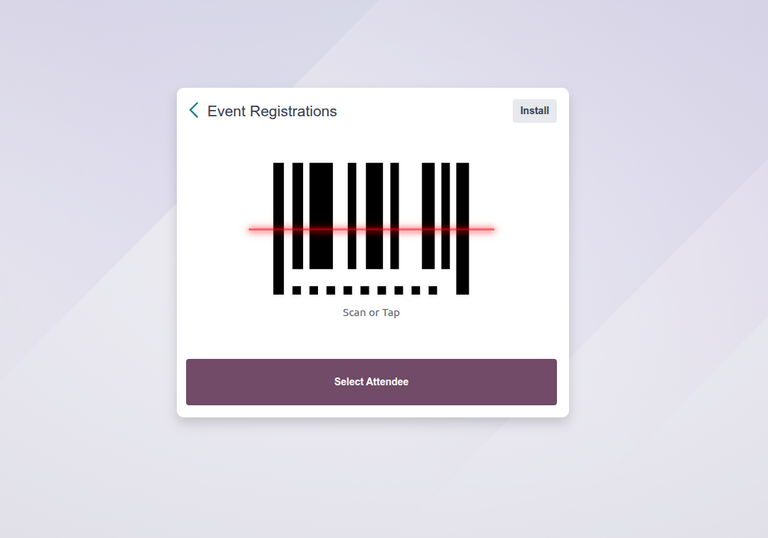
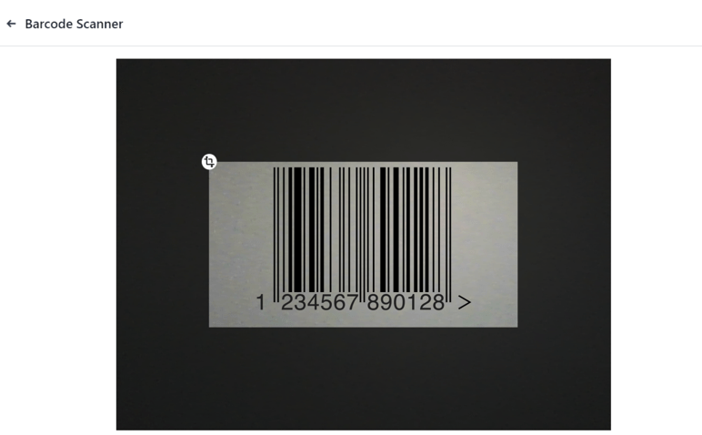
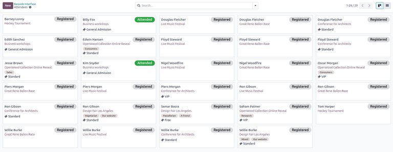

=================
Registration Desk
=================

The *Registration Desk* feature in Odoo **Events** allows users to grant access to registered event
attendees as they arrive and store attendee-related data in the reporting metrics.

Registration Desk page
======================

On a mobile device (on the Odoo app or in a browser), navigate to :menuselection:`Events app -->
Registration Desk` to open the :guilabel:`Registration Desk` page.

In the :guilabel:`Registration Desk` box, the user has the option to either :guilabel:`Scan a badge`
or :guilabel:`Select Attendee`.

Scan a badge
============

To scan the code on event attendees' badges, navigate to :menuselection:`Events app --> Registration
Desk` and tap the :guilabel:`Scan or Tap` option.

.. important::
   Odoo **must** be granted access to the camera being used for the :guilabel:`Scan a badge` option
   to work.

Once Odoo has access to the camera, a :guilabel:`Barcode Scanner` pop-up window appears, showing a
viewfinder box in the camera frame. The size of the box can be manually adjusted by dragging the
:icon:`fa-crop` :guilabel:`(crop)` icon.

When the badge code is in the middle of the view-finder box, the code is scanned and the
:guilabel:`Barcode Scanner` pop-up window disappears. The attendee is then granted access to the
event and their attendance is logged in the Odoo **Events** app.

If the scanned barcode is invalid, an error pop-up message appears in the upper-right corner.

Select Attendee
===============

To manually grant access to event attendees, navigate to :menuselection:`Events app --> Registration
Desk` and tap the :guilabel:`Select Attendee` option.

This opens an :guilabel:`Attendees` page with all registered attendees across events in the
database. By default, this page opens in the :icon:`oi-view-kanban` :guilabel:`(Kanban)` view,
allowing the user to see an overview of all attendees at a glance. Each attendee is displayed as a
card with their name, registered event, associated company (if applicable), ticket type (if
applicable), and registration status.

Alternatively, users can view a detailed list of all attendees using the :icon:`oi-view-list`
:guilabel:`(List)` view. Each attendee is displayed on a line with their name, contact information,
registered event, ticket type, registration status, and an option to :guilabel:`Mark as Attending`.

To grant access to an attendee and mark them as :guilabel:`Attended` in the Kanban view, click on
their card. The resulting pop-up window notifies the user that the attendee has been marked as
registered. Click :guilabel:`Continue` at the bottom-left to mark the attendee as
:guilabel:`Attended`.

Alternatively, in the List view, click on the :guilabel:`Mark as Attending` button on the attendee's
line. The button then disappears and the attendee's registration status changes to
:guilabel:`Attended`.

.. tip::
   Users can apply :doc:`filters and grouping options <../../essentials/search>` on the
   :guilabel:`Attendees` page in both the Kanban and List views to narrow down a large list of
   attendees or reorganize the page by specific categories.

   To do that, click the :icon:`fa-sort-desc` :guilabel:`(down arrow)` beside the search bar to
   reveal a drop-down menu with :guilabel:`Filters`, :guilabel:`Group By`, and :guilabel:`Favorites`
   options.

.. seealso::
   :doc:`../../essentials/search`
